---
presentation:
    transition: "none"
    enableSpeakerNotes: true
    margin: 0
---

@import "../common/css/zhangt-style.css"
@import "../common/css/font-awesome-4.7.0/css/font-awesome.css"

<!-- slide data-notes="" -->

    
    

    <h1 style="width: 50%">
        图神经网络导论  
        机器学习简介
    </h1>
    <h2>张腾</h2>
    <h3>tengzhang@hust.edu.cn</h3>

<!-- slide data-notes="" -->

    
 
        

        <h5 class="title">纲</h5>
    

    

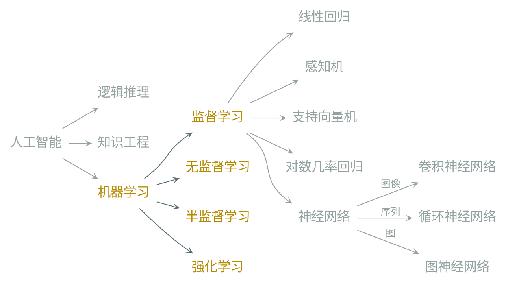

    

    

        <h6 class="bottom_left">图神经网络导论</h6>
        <h6 class="bottom_center">机器学习简介</h6>
        <h6 class="bottom_right">tengzhang@hust.edu.cn</h6>
    

<!-- slide vertical=true data-notes="" -->

    
 
        

        <h5 class="title">监督学习</h5>
    

    

所有样本都有类别标记

<table class="setting" style="width:70%;margin-left:15%">
    <thead>
        <tr>
            <th>原始数据</th>
            <th>样本</th>
            <th>特征 属性</th>
            <th>类别标记</th>
        </tr>
    </thead>
    <tbody>
        <tr>
            <td>$o_1$</td>
            <td>$(\xv_1, y_1)$</td>
            <td >$\xv_1[1:d]$</td>
            <td >$y_1$</td>
        </tr>
        <tr>
            <td>$o_2$</td>
            <td>$(\xv_2, y_2)$</td>
            <td>$\xv_2[1:d]$</td>
            <td>$y_2$</td>
        </tr>
        <tr>
            <td>$\vdots$</td>
            <td>$\vdots$</td>
            <td>$\vdots$</td>
            <td>$\vdots$</td>
        </tr>
        <tr>
            <td>$o_m$</td>
            <td>$(\xv_m, y_m)$</td>
            <td>$\xv_m[1:d]$</td>
            <td>$y_m$</td>
        </tr>
    </tbody>
</table>

 

任务类型：

-   二分类：$y \in \{ 1, -1 \}$
-   多分类：$y \in [C] \triangleq \{ 1, 2, \ldots, C \}$
-   回归：$y \in \Rbb$
-   结构预测：$y$可以是向量、序列、语法树、......

    

    

        <h6 class="bottom_left">图神经网络导论</h6>
        <h6 class="bottom_center">机器学习简介</h6>
        <h6 class="bottom_right">tengzhang@hust.edu.cn</h6>
    

<!-- slide vertical=true data-notes="" -->

    
 
        

        <h5 class="title">无监督学习</h5>
    

    

所有样本都没有类别标记

<table class="setting" style="width:70%;margin-left:15%">
    <thead>
        <tr>
            <th>原始数据</th>
            <th>样本</th>
            <th>特征 属性</th>
            <th>类别标记</th>
        </tr>
    </thead>
    <tbody>
        <tr>
            <td>$o_1$</td>
            <td>$(\xv_1, y_1)$</td>
            <td >$\xv_1[1:d]$</td>
            <td>null</td>
        </tr>
        <tr>
            <td>$o_2$</td>
            <td>$(\xv_2, y_2)$</td>
            <td>$\xv_2[1:d]$</td>
            <td>null</td>
        </tr>
        <tr>
            <td>$\vdots$</td>
            <td>$\vdots$</td>
            <td>$\vdots$</td>
            <td>$\vdots$</td>
        </tr>
        <tr>
            <td>$o_m$</td>
            <td>$(\xv_m, y_m)$</td>
            <td>$\xv_m[1:d]$</td>
            <td>null</td>
        </tr>
    </tbody>
</table>

 

任务类型：

-   聚类：$\xv_i \mapsto c_i \in [K]$，根据一定的准则将样本划分成$K$个簇(cluster)
-   降维：$\xv_i \mapsto \zv_i \in \Rbb^l$，为样本学习新的特征表示，为后续分析作铺垫
-   密度估计：估计样本空间的概率密度$P(\xv)$，寻找数据的生成机制

    

    

        <h6 class="bottom_left">图神经网络导论</h6>
        <h6 class="bottom_center">机器学习简介</h6>
        <h6 class="bottom_right">tengzhang@hust.edu.cn</h6>
    

<!-- slide vertical=true data-notes="" -->

    
 
        

        <h5 class="title">半监督学习</h5>
    

    

只有少数样本有类别标记，如何利用大部分未标记样本？

<table class="setting" style="width:70%;margin-left:15%">
    <thead>
        <tr>
            <th>原始数据</th>
            <th>样本</th>
            <th>特征 属性</th>
            <th>类别标记</th>
        </tr>
    </thead>
    <tbody>
        <tr>
            <td>$o_1$</td>
            <td>$(\xv_1, y_1)$</td>
            <td>$\xv_1[1:d]$</td>
            <td>$y_1$</td>
        </tr>
        <tr>
            <td>$\vdots$</td>
            <td>$\vdots$</td>
            <td>$\vdots$</td>
            <td>$\vdots$</td>
        </tr>
        <tr>
            <td>$o_l$</td>
            <td>$(\xv_l, y_l)$</td>
            <td>$\xv_l[1:d]$</td>
            <td>$y_l$</td>
        </tr>
        <tr>
            <td>$o_{l+1}$</td>
            <td>$(\xv_{l+1}, y_{l+1})$</td>
            <td>$\xv_{l+1}[1:d]$</td>
            <td>null</td>
        </tr>
        <tr>
            <td>$\vdots$</td>
            <td>$\vdots$</td>
            <td>$\vdots$</td>
            <td>$\vdots$</td>
        </tr>
        <tr>
            <td>$o_{l+u}$</td>
            <td>$(\xv_{l+u}, y_{l+u})$</td>
            <td>$\xv_{l+u}[1:d]$</td>
            <td>null</td>
        </tr>
    </tbody>
</table>

 

任务类型：

-   直推式(transductive)学习：预测$y_{l+1}, \ldots, y_{l+u}$，可以没有显式的模型
-   归纳(inductive)学习：能对未知样本进行预测，有显式的模型，包含前者

    

    

        <h6 class="bottom_left">图神经网络导论</h6>
        <h6 class="bottom_center">机器学习简介</h6>
        <h6 class="bottom_right">tengzhang@hust.edu.cn</h6>
    

<!-- slide data-notes="" -->

    
 
        

        <h5 class="title">纲</h5>
    

    

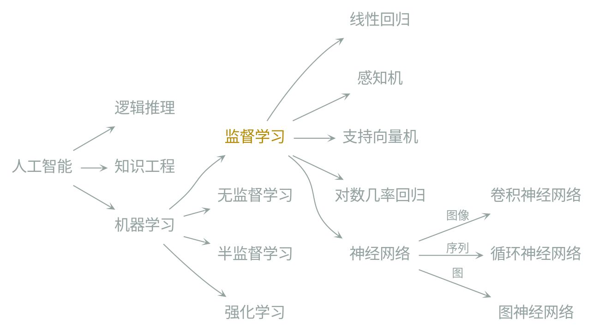

    

    

        <h6 class="bottom_left">图神经网络导论</h6>
        <h6 class="bottom_center">机器学习简介</h6>
        <h6 class="bottom_right">tengzhang@hust.edu.cn</h6>
    

<!-- slide vertical=true data-notes="" -->

    
 
        

        <h5 class="title">形式化</h5>
    

    

输入空间$\Xcal \subseteq \Rbb^d$，$d$称为维度(dimension)

 

输出空间$\Ycal$

-   对于分类问题，$\Ycal = \{ 1, -1 \}$或者$\Ycal = [C]$
-   对于回归问题，$\Ycal = \Rbb$
-   对于结构预测问题，$\Ycal$中元素可以是向量、序列、语法树、......

 

样本空间$\Xcal \times \Ycal$上的潜在概率分布$\Dcal$

 

训练集$\Scal = \{ (\xv_1, y_1), \ldots, (\xv_m, y_m) \} \in (\Xcal \times \Ycal)^m$从$\Dcal$独立同分布采样得到

 

假设空间$\Hcal = \{ h: \Xcal \mapsto \Ycal \}$，从中选择最优假设$h^\star$

    

    

        <h6 class="bottom_left">图神经网络导论</h6>
        <h6 class="bottom_center">机器学习简介</h6>
        <h6 class="bottom_right">tengzhang@hust.edu.cn</h6>
    

<!-- slide vertical=true data-notes="" -->

    
 
        

        <h5 class="title">泛化风险</h5>
    

    

如何评估假设$h$的好坏？

-   在整个分布$\Dcal$上的表现
-   期望风险：$R(h) \triangleq \Ebb_{(\xv, y) \sim \Dcal} [ 1_{h(\xv) \neq y} ]$，亦称为泛化风险

 

欲求最优假设，只需最小化泛化风险：$\min_h \Ebb_{(\xv, y) \sim \Dcal} [ 1_{h(\xv) \neq y} ]$

 

难点：$\Dcal$未知，泛化风险无法计算

 

可以计算的是假设$h$训练集$\Scal$上的经验风险

    $$
        \begin{align*}
            R_\Scal (h) \triangleq \frac{1}{m} \sum_{i \in [m]} 1_{h(\xv_i) \neq y_i}
        \end{align*}
    $$

    

    

        <h6 class="bottom_left">图神经网络导论</h6>
        <h6 class="bottom_center">机器学习简介</h6>
        <h6 class="bottom_right">tengzhang@hust.edu.cn</h6>
    

<!-- slide vertical=true data-notes="" -->

    
 
        

        <h5 class="title">经验风险最小化</h5>
    

    

以经验风险替代泛化风险，经验风险最小化准则：

    $$
        \begin{align*}
            \min_h \frac{1}{m} \sum_{i \in [m]} 1_{h(\xv_i) \neq y_i}
        \end{align*}
    $$

根据大数定律，当数据集大小$m \rightarrow \infty$时，经验风险$\rightarrow$泛化风险

 

但若对假设空间不做任何限制，可能会得到一个强行“记住”每个训练样本类别标记的假设：

    $$
        \begin{align*}
            h(\xv) = \sign \left( -\prod_{i: y_i=1} \| \xv -\xv_i \|^2 \right), ~ \sign(z) \triangleq
            \begin{cases} 1 & z \geq
            0 \\ -1 & z <0 \end{cases}
        \end{align*}
    $$

-   在训练数据集上经验风险为零
-   对未知样本的预测非常糟糕

    

    

        <h6 class="bottom_left">图神经网络导论</h6>
        <h6 class="bottom_center">机器学习简介</h6>
        <h6 class="bottom_right">tengzhang@hust.edu.cn</h6>
    

<!-- slide vertical=true data-notes="" -->

    
 
        

        <h5 class="title">过拟合</h5>
    

    

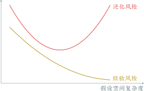

 

启示：在经验风险和假设空间复杂度之间取得平衡

 

问题：假设空间复杂度怎么算？有什么量能够刻画它？

    

    

        <h6 class="bottom_left">图神经网络导论</h6>
        <h6 class="bottom_center">机器学习简介</h6>
        <h6 class="bottom_right">tengzhang@hust.edu.cn</h6>
    

<!-- slide data-notes="" -->

    
 
        

        <h5 class="title">VC维理论</h5>
    

    

基本想法：假设空间复杂度应体现出对数据集的拟合能力

 

假设空间$\Hcal = \{ h: \Xcal \mapsto \{1,-1\} \}$，数据集$\Scal = \{\xv_1, \ldots, \xv_m\}$，定义

    $$
        \begin{align*}
            H_\Scal = \{ (h(\xv_1), \ldots, h(\xv_m)) \mid h \in \Hcal \}
        \end{align*}
    $$

其中$H_\Scal$中每个元素都是对$\Scal$赋予类别标记的可能结果，若$H_\Scal$包含了全部可能的结果，即$|H_\Scal| = 2^m$，则称假设空间$\Hcal$可以打散数据集$\Scal$

 

假设空间$\Hcal$的 VC 维是能被$\Hcal$打散的最大集合的大小，即

    $$
        \begin{align*}
            \VC(\Hcal) = \max \{ m \mid \exists \Scal:~|H_\Scal| = 2^m \}
        \end{align*}
    $$

    

    

        <h6 class="bottom_left">图神经网络导论</h6>
        <h6 class="bottom_center">机器学习简介</h6>
        <h6 class="bottom_right">tengzhang@hust.edu.cn</h6>
    

<!-- slide vertical=true data-notes="" -->

    

        

        <h5 class="title">VC维理论</h5>
    

    

基本想法：假设空间复杂度应体现出对样本的拟合能力

 

二维平面上的线性划分：$\Xcal = \Rbb^2$，$\Hcal$为二维平面上直线集合

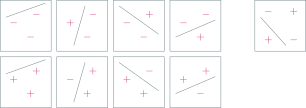

-   存在$3$个样本构成的集合，$8$种可能类别标记赋值均是线性可分的
-   对于任意$4$个样本构成的集合，总有一种类别标记赋值线性不可分
-   二维平面上直线集合的 VC 维是$3$
-   更一般的，可以证明$\Rbb^d$中超平面集合的 VC 维为$d+1$

    

    

        <h6 class="bottom_left">图神经网络导论</h6>
        <h6 class="bottom_center">机器学习简介</h6>
        <h6 class="bottom_right">tengzhang@hust.edu.cn</h6>
    

<!-- slide vertical=true data-notes="" -->

    

        

        <h5 class="title">VC维理论</h5>
    

    

根据集中度不等式有如下泛化界

    $$
        \begin{align*}
            \class{red}{R(h)} \leq \class{yellow}{R_\Scal(h)} + \class{blue}{\tilde{O} \left(\sqrt{\VC维/样本数~~~~~~}~ \right)}
        \end{align*}
    $$

其中第三项称为置信区间

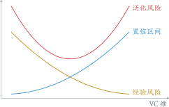

    

    

        <h6 class="bottom_left">图神经网络导论</h6>
        <h6 class="bottom_center">机器学习简介</h6>
        <h6 class="bottom_right">tengzhang@hust.edu.cn</h6>
    

<!-- slide data-notes="" -->

    

        

        <h5 class="title">结构风险最小化</h5>
    

    

    

        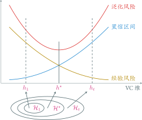
    

    <ul style="width:50%;margin-left:1rem">
        <li class="top_5">
            构造嵌套的假设空间序列$\Hcal_1 \subseteq \cdots \subseteq \Hcal_t \subseteq \cdots$
        </li>
        <li class="top_5">
            在$\Hcal_t$上经验风险最小化得到$h_t$，$R_\Scal(h_1) \geq \cdots \geq R_\Scal(h_t) \geq \cdots$
        </li>
        <li class="top_5">
            VC维序列$\VC(\Hcal_1) \leq \cdots \leq \VC(\Hcal_t) \leq \cdots$
        </li>
        <li class="top_5">
            $h^\star = \min_{h_t} \{ \class{yellow}{经验风险} + \class{blue}{置信区间} \}$
        </li>
    </ul>

 

问题：

-   如何计算$\VC(\Hcal_t)$？
-   若假设空间$\Hcal_t$为超平面集合，当维度趋向于无穷时，VC 维也趋向于无穷

    

    

        <h6 class="bottom_left">图神经网络导论</h6>
        <h6 class="bottom_center">机器学习简介</h6>
        <h6 class="bottom_right">tengzhang@hust.edu.cn</h6>
    

<!-- slide vertical=true data-notes="" -->

    

        

        <h5 class="title">间隔和宽打散维</h5>
    

    

启示：VC 维分布无关、数据独立，导出的泛化界有点“松”

 

方案：引入数据相关的量加强泛化界，在无穷维空间也可以学习

 

> 设$\Hcal = \{ h: \Xcal \mapsto \Rbb \}$是定义在输入空间$\Xcal$上的实值函数集合，对于$\forall h \in \Hcal$，其关于样本$(\xv_i, y_i)$的间隔定义为$\gamma_i = y_i h(\xv_i)$

> 若对$\Scal$的任一类别标记的赋予结果，均存在$h \in \Hcal$和$\gamma > 0$使得$y_i h(\xv_i) \geq \gamma$，则称$\Scal$被$\Hcal$以$\gamma$打散，$\Hcal$的宽打散维$\mathrm{fat}_\Hcal(\gamma)$是能被$\Hcal$以$\gamma$打散的最大集合的大小 
> 特别的，取$\Hcal = \{ \xv \mapsto \wv^\top \xv \mid \|\wv\| = 1 \}$，则能将$\Scal$以$\gamma$打散的超平面称为$\gamma$-间隔超平面，即对$\forall i \in [m]$有$y_i \wv^\top \xv_i \geq \gamma$

    

    

        <h6 class="bottom_left">图神经网络导论</h6>
        <h6 class="bottom_center">机器学习简介</h6>
        <h6 class="bottom_right">tengzhang@hust.edu.cn</h6>
    

<!-- slide vertical=true data-notes="" -->

    

        

        <h5 class="title">$\gamma$-间隔超平面</h5>
    

    

    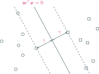
    

        若$\Scal$可包含于一个半径为$r$的球内，则全体$\gamma$-间隔超平面构成的假设空间$\Hcal_\gamma = \{ \xv \mapsto \wv^\top \xv \mid \|\wv\| = 1, ~ \gamma_i \geq \gamma \}$的宽打散维$\mathrm{fat}_\Hcal(\gamma) \leq r^2 / \gamma^2$
    

<table class="vc-dimension" style="width:75%;margin:3% auto">
    <thead>
        <tr>
            <th></th>
            <th>对假设空间的限制</th>
            <th>泛化界大小</th>
        </tr>
    </thead>
    <tbody>
        <tr>
            <td>VC维</td>
            <td>弱</td>
            <td>无穷</td>
        </tr>
        <tr>
            <td>宽打散维</td>
            <td>强</td>
            <td>有限</td>
        </tr>
    </tbody>
</table>

    

    

        <h6 class="bottom_left">图神经网络导论</h6>
        <h6 class="bottom_center">机器学习简介</h6>
        <h6 class="bottom_right">tengzhang@hust.edu.cn</h6>
    

<!-- slide vertical=true data-notes="" -->

    

        

        <h5 class="title">最大间隔准则</h5>
    

    

间隔$\gamma$越大，宽打散维越小，泛化界越紧

 

最大间隔准则：最小化经验风险 $\wedge$ 最大化间隔

    $$
        \begin{align*}
            \max_{\wv} ~ - \lambda \cdot 0 + \color{purple}{\gamma} \qquad & \st ~ y_i \wv^\top \xv_i / \|\wv\| \geq \gamma, ~ \forall i \in [m] \\
            & \Updownarrow \\
            \max_{\wv} ~ \hat{\gamma} / \|\wv\| \qquad & \st ~ y_i \wv^\top \xv_i \geq \hat{\gamma}, ~ \forall i \in [m] \\
            & \Updownarrow \\
            \max_{\hat{\wv}} ~ 1 / \|\hat{\wv}\| \qquad & \st ~ y_i \hat{\wv}^\top \xv_i \geq 1, ~ \forall i \in [m] \\
            & \Updownarrow \\
            \min_{\hat{\wv}} ~ \|\hat{\wv}\| \qquad & \st ~ y_i \hat{\wv}^\top \xv_i \geq 1, ~ \forall i \in [m]
        \end{align*}
    $$

即等价于在$1$-间隔超平面构成的假设空间中寻找最小范数假设

    

    

        <h6 class="bottom_left">图神经网络导论</h6>
        <h6 class="bottom_center">机器学习简介</h6>
        <h6 class="bottom_right">tengzhang@hust.edu.cn</h6>
    

<!-- slide vertical=true data-notes="" -->

    

        

        <h5 class="title">正则化</h5>
    

    

    $$
        \begin{align*}
            \min_\wv ~ R_\Scal (\wv) + \lambda \cdot \Omega(\wv)
        \end{align*}
    $$

 

-   $\ell_2$正则：$\Omega(\wv) = \| \wv \|_2^2 \triangleq \sum_{i \in [d]} w_i^2$，得到稠密的$\wv$
-   $\ell_1$正则：$\Omega(\wv) = \| \wv \|_1 \triangleq \sum_{i \in [d]} |w_i|$，得到稀疏的$\wv$，附带特征选择的作用
-   $\ell_\infty$正则：$\Omega(\wv) = \| \wv \|_\infty \triangleq \max_{i \in [d]} |w_i|$，得到所有分量值相同的$\wv$
-   $\ell_{2,1}$正则：$\Omega(\wv) = \sum_j \| \wv_j \|_2$，特征分组，组内稠密，组间稀疏
-   $\ell_{1,2}$正则：$\Omega(\wv) = (\sum_j \| \wv_j \|_1)^2$，特征分组，组内稀疏，组间稠密
-   弹性网：$\ell_1$正则和$\ell_2$正则的线性组合
-   OSCAR：$\ell_1$正则和成对$\ell_\infty$正则的线性组合

    

    

        <h6 class="bottom_left">图神经网络导论</h6>
        <h6 class="bottom_center">机器学习简介</h6>
        <h6 class="bottom_right">tengzhang@hust.edu.cn</h6>
    

<!-- slide data-notes="" -->

    

        

        <h5 class="title">模型</h5>
    

    

问题：输入空间若不存在$\gamma$-间隔超平面？

 

方案：将数据映射到新的特征空间使其线性可分

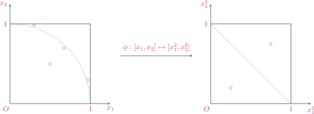

    

    

        <h6 class="bottom_left">图神经网络导论</h6>
        <h6 class="bottom_center">机器学习简介</h6>
        <h6 class="bottom_right">tengzhang@hust.edu.cn</h6>
    

<!-- slide vertical=true data-notes="" -->

    

        

        <h5 class="title">模型</h5>
    

    

问题：输入空间若不存在$\gamma$-间隔超平面？

 

方案：将数据映射到新的特征空间使其线性可分

 

线性模型：$f(\xv; \wv, b) = \wv^\top \xv + b$，其中$\wv$、$b$是待学习的参数

 

非线性模型：$f(\xv; \wv, b) = \wv^\top [\phi_1(\xv); \ldots; \phi_K(\xv)] + b$，其中$\wv$、$b$是待学习的参数

-   $\phi_k(\xv)$为固定的非线性基函数，核感知机、核支持向量机、核对数几率回归
-   $\phi_k(\xv) = h(\wv_k^\top [\psi_1(\xv); \ldots; \psi_L(\xv)] + b_k)$，其中$h(\cdot)$为非线性函数，$\psi_l(\xv)$为另一组基函数，$\wv_k$、$b_k$也是待学习的参数，神经网络

    

    

        <h6 class="bottom_left">图神经网络导论</h6>
        <h6 class="bottom_center">机器学习简介</h6>
        <h6 class="bottom_right">tengzhang@hust.edu.cn</h6>
    

<!-- slide vertical=true data-notes="这里可能要简要介绍下凸函数" -->

    

        

        <h5 class="title">替代损失</h5>
    

    

 

    $$
        \begin{align*}
            \min_\wv ~ \frac{1}{m} \sum_{i \in [m]} 1_{y_i f(\xv_i) < 0} + \lambda \cdot \Omega(\wv)
        \end{align*}
    $$

难点：指示函数$1_{(\cdot)}$非凸非连续，导致问题很难求解

方案：用另一个函数$l(y, f(\xv))$替代，称为替代损失，一般需满足

-   数学性质好，问题容易求解，例如凸连续函数
-   是指示函数$1_{(\cdot)}$的上界，从而利用集中度不等式可得到泛化界：

    $$
        \begin{align*}
            R(\wv) & = \Ebb_{(\xv, y) \sim \Dcal} [ 1_{y_i f(\xv_i) < 0} ] \leq \Ebb_{(\xv, y) \sim \Dcal} [ l(y_i, f(\xv_i)) ] \\
            & \leq \frac{1}{m} \sum_{i \in [m]} l(y_i, f(\xv_i)) + 假设空间复杂度相关的量
        \end{align*}
    $$

    

    

        <h6 class="bottom_left">图神经网络导论</h6>
        <h6 class="bottom_center">机器学习简介</h6>
        <h6 class="bottom_right">tengzhang@hust.edu.cn</h6>
    

<!-- slide vertical=true data-notes="" -->

    

        

        <h5 class="title">替代损失</h5>
    

    

 

    $$
        \begin{align*}
            \min_\wv ~ \frac{1}{m} \sum_{i \in [m]} 1_{y_i f(\xv_i) < 0} + \lambda \cdot \Omega(\wv)
        \end{align*}
    $$

难点：指示函数$1_{(\cdot)}$非凸非连续，导致问题很难求解

方案：用另一个函数$l(y, f(\xv))$替代，称为替代损失，常见的有

-   平方损失：$l(y, f(\xv)) = (y - f(\xv))^2$
-   Hinge 损失：$l(y, f(\xv)) = \max \{ 0, 1 - y f(\xv) \}$
-   平方 Hinge 损失：$l(y, f(\xv)) = [\max \{ 0, 1 - y f(\xv) \}]^2$
-   $\epsilon$-不敏感损失：$l(y, f(\xv)) = \max \{ 0, |y - f(\xv)| - \epsilon \}$
-   指数损失：$l(y, f(\xv)) = \exp (- y f(\xv))$
-   对数几率损失：$l(y, f(\xv)) = \log (1 + \exp (- y f(\xv)))$

    

    

        <h6 class="bottom_left">图神经网络导论</h6>
        <h6 class="bottom_center">机器学习简介</h6>
        <h6 class="bottom_right">tengzhang@hust.edu.cn</h6>
    

<!-- slide data-notes="可以介绍下这个领域的研究现状和大牛" -->

    

        

        <h5 class="title">优化算法</h5>
    

    

 

    $$
        \begin{align*}
            \min_\wv ~ F(\wv) \triangleq \frac{1}{m} \sum_{i \in [m]} l(y_i, f(\xv_i)) + \lambda \cdot \Omega(\wv)
        \end{align*}
    $$

梯度下降(GD)：$\wv_{t+1} \leftarrow \wv_t - \eta_t \cdot \nabla F(\wv_t)$，其中$\eta_t$称为步长

    

    

        <h6 class="bottom_left">图神经网络导论</h6>
        <h6 class="bottom_center">机器学习简介</h6>
        <h6 class="bottom_right">tengzhang@hust.edu.cn</h6>
    

<!-- slide vertical=true data-notes="这里要解释下小批量梯度下降其实也是SGD，SGD的要求是无偏估计" -->

    

        

        <h5 class="title">随机梯度下降</h5>
    

    

梯度下降(GD)：$\wv_{t+1} \leftarrow \wv_t - \eta_t \cdot \nabla F(\wv_t)$，其中

    $$
        \begin{align*}
            \nabla F(\wv_t) = \frac{1}{m} \sum_{i \in [m]} \nabla l(y_i, f(\xv_i)) + \lambda \cdot \nabla \Omega(\wv)
        \end{align*}
    $$

问题：当样本数$m$很大时，梯度$\nabla F(\wv_t)$计算开销很大

 

方案：小批量梯度下降，随机采样一个下标子集$\Bcal_t \subseteq [m]$

    $$
        \begin{align*}
            \wv_{t+1} \leftarrow \wv_t - \eta_t \left( \frac{1}{|\Bcal_t|} \sum_{i \in \Bcal_t} \nabla l(y_i, f(\xv_i)) + \lambda \cdot \nabla \Omega(\wv) \right)
        \end{align*}
    $$

若$|\Bcal_t| = 1$，则为常说的随机梯度下降(SGD)

    

    

        <h6 class="bottom_left">图神经网络导论</h6>
        <h6 class="bottom_center">机器学习简介</h6>
        <h6 class="bottom_right">tengzhang@hust.edu.cn</h6>
    

<!-- slide vertical=true data-notes="" -->

    

        

        <h5 class="title">GD vs. SGD</h5>
    

    

更新公式：

    $$
        \begin{align*}
            \wv_{t+1} \leftarrow \wv_t - \eta_t \left( \frac{1}{m} \sum_{i \in [m]} \nabla l(y_i, f(\xv_i)) + \lambda \cdot \nabla \Omega(\wv) \right) \\
            \wv_{t+1} \leftarrow \wv_t - \eta_t \left( \frac{1}{|\Bcal_t|} \sum_{i \in \Bcal_t} \nabla l(y_i, f(\xv_i)) + \lambda \cdot \nabla \Omega(\wv) \right)
        \end{align*}
    $$

-   当数据集中有冗余样本时，SGD 可以减少重复计算
-   迭代前期，SGD 更新频率快，较 GD 优势明显
-   迭代后期，GD 会停止于最优解处，SGD 则只能在最优解附近震荡
-   越靠近最优解，梯度越接近零，因此 GD 可以用恒定步长
-   最优解处随机梯度不一定为零，因此 SGD 必须用衰减步长，否则算法不会停止
-   SGD 因随机采样带来的噪声若能随着迭代而受到抑制，则可进一步加速，机器学习顶会有大量相关工作，包括 SAG，SAGA，SVRG 等及其它们的衍生变种

    

    

        <h6 class="bottom_left">图神经网络导论</h6>
        <h6 class="bottom_center">机器学习简介</h6>
        <h6 class="bottom_right">tengzhang@hust.edu.cn</h6>
    

<!-- slide vertical=true data-notes="这里可以画画图" -->

    

        

        <h5 class="title">加速梯度下降</h5>
    

    

当目标函数的变量尺度不同时，梯度下降效率很低

    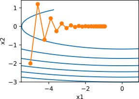
    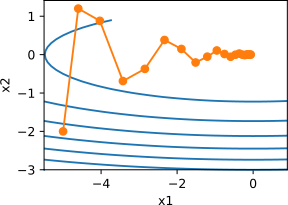

动量法(momentum)：$\wv_{t+1} \leftarrow \wv_t - \eta_t \cdot \nabla F(\wv_t) + \gamma (\wv_t - \wv_{t-1})$

Nesterov 加速梯度：$\uv_t \leftarrow (1+\gamma) \wv_t - \gamma \wv_{t-1}$，$\wv_{t+1} \leftarrow \uv_t - \eta_t \cdot \nabla F(\uv_t)$

    

    

        <h6 class="bottom_left">图神经网络导论</h6>
        <h6 class="bottom_center">机器学习简介</h6>
        <h6 class="bottom_right">tengzhang@hust.edu.cn</h6>
    

<!-- slide vertical=true data-notes="" -->

    

        

        <h5 class="title">Newton法</h5>
    

    

当目标函数的变量尺度不同时，梯度下降效率很低

    
    

        

            Newton法：利用Hessian矩阵做线性变换，将不同维度的尺度变成相同$\wv \leftarrow \wv - \eta [\nabla^2 F(\wv)]^{-1} \nabla F(\wv)$
        

        

            拟Newton法：近似Hessian矩阵的逆矩阵，减小计算开销，代表性方法有秩$1$矫正，DFP，BFGS，l-BFGS
        

    

-   Newton 法在最优解附近可以达到二次收敛，远快于 GD
-   Newton 法对步长敏感，可能不收敛，计算开销很大
-   拟 Newton 法是 Newton 法和 GD 的折中，最适用于二次规划

    

    

        <h6 class="bottom_left">图神经网络导论</h6>
        <h6 class="bottom_center">机器学习简介</h6>
        <h6 class="bottom_right">tengzhang@hust.edu.cn</h6>
    

<!-- slide data-notes="" -->

    
 
        

        <h5 class="title">纲</h5>
    

    

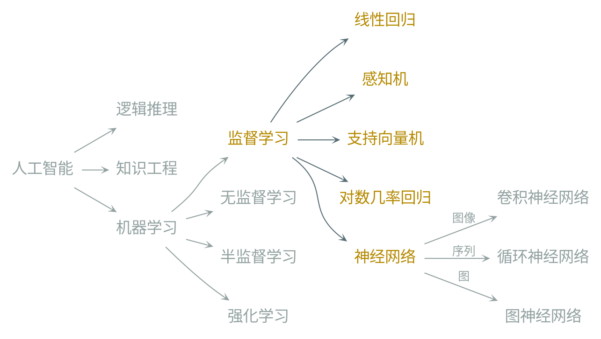

    

    

        <h6 class="bottom_left">图神经网络导论</h6>
        <h6 class="bottom_center">机器学习简介</h6>
        <h6 class="bottom_right">tengzhang@hust.edu.cn</h6>
    

<!-- slide vertical=true data-notes="" -->

    

        

        <h5 class="title">线性回归 最小二乘</h5>
    

    

损失函数 + 正则化项：

    $$
        \begin{align*}
            \min_\wv ~ \frac{1}{m} \sum_{i \in [m]} l(y_i, f(\xv_i)) + \lambda \cdot \Omega(\wv)
        \end{align*}
    $$

-   线性模型：$f(\xv) = \wv^\top \xv + b$
-   平方损失：$l(y, f(\xv)) = (y - f(\xv))^2$
-   正则化项：null，即采用经验风险最小化

 

    $$
        \begin{align*}
            \min_{\wv,b} ~ \frac{1}{2} \sum_{i \in [m]} (\wv^\top \xv_i + b - y_i)^2 = \frac{1}{2} \| \Xv^\top \uv - \yv \|_2^2
        \end{align*}
    $$

其中$\yv = [y_1; \cdots; y_m] \in \Rbb^m$，$\uv \triangleq [\wv^\top, b]^\top \in \Rbb^{d+1}$以及

    $$
        \begin{align*}
            \Xv = \begin{bmatrix}
                \xv_1 & \xv_2 & \cdots & \xv_m \\ 1 & 1 & \cdots & 1
            \end{bmatrix} \in \Rbb^{(d+1) \times m}
        \end{align*}
    $$

    

    

        <h6 class="bottom_left">图神经网络导论</h6>
        <h6 class="bottom_center">机器学习简介</h6>
        <h6 class="bottom_right">tengzhang@hust.edu.cn</h6>
    

<!-- slide vertical=true data-notes="" -->

    

        

        <h5 class="title">岭回归</h5>
    

    

    $$
        \begin{align*}
            \min_{\uv} ~ F(\uv) & \triangleq \frac{1}{2} \| \Xv^\top \uv - \yv \|_2^2 \\
            & = \frac{1}{2} \uv^\top \Xv \Xv^\top \uv - \uv^\top \Xv \yv + \frac{1}{2} \yv^\top \yv
        \end{align*}
    $$

易知$\nabla F(\uv) = \Xv \Xv^\top \uv - \Xv \yv$

-   若$\Xv \Xv^\top$可逆，可得最优解$\uv^\star = (\Xv \Xv^\top)^{-1} \Xv \yv$
-   若$\Xv \Xv^\top$不可逆，可采用梯度下降$\uv_{t+1} \leftarrow \uv_t - \eta_t \Xv (\Xv^\top \uv_t - \yv)$进行求解

当$\Xv \Xv^\top$近似不可逆时，其最小特征值接近零，模型会变得很不稳定：

    $$
        \begin{align*}
            \uv^\star = (\Xv \Xv^\top)^{-1} \Xv \yv \longrightarrow \uv^\star = (\Xv \Xv^\top + \lambda \Iv)^{-1} \Xv \yv
        \end{align*}
    $$

修正后的解对应带$\ell_2$正则的线性回归，亦称为岭回归(ridge regression)：

    $$
        \begin{align*}
            \min_{\uv} ~ \frac{1}{2} \| \Xv^\top \uv - \yv \|_2^2 + \frac{\lambda}{2} \|\uv\|_2^2
        \end{align*}
    $$

    

    

        <h6 class="bottom_left">图神经网络导论</h6>
        <h6 class="bottom_center">机器学习简介</h6>
        <h6 class="bottom_right">tengzhang@hust.edu.cn</h6>
    

<!-- slide vertical=true data-notes="" -->

    

        

        <h5 class="title">LASSO</h5>
    

    

损失函数 + 正则化项：

    $$
        \begin{align*}
            \min_\wv ~ \frac{1}{m} \sum_{i \in [m]} l(y_i, f(\xv_i)) + \lambda \cdot \Omega(\wv)
        \end{align*}
    $$

-   线性模型：$f(\xv) = \wv^\top \xv$
-   平方损失：$l(y, f(\xv)) = (y - f(\xv))^2$
-   正则化项：$\ell_1$正则

 

    $$
        \begin{align*}
            \min_\wv ~ \frac{1}{2} \| \Xv^\top \wv - \yv \|_2^2 + \lambda \| \wv \|_1
        \end{align*}
    $$

LASSO 全称叫最小绝对收缩选择算子(Least Absolute Shrinkage and Selection Operator)，它求得的$\wv$只有极少数非零分量，因此附带特征选择的作用

    

    

        <h6 class="bottom_left">图神经网络导论</h6>
        <h6 class="bottom_center">机器学习简介</h6>
        <h6 class="bottom_right">tengzhang@hust.edu.cn</h6>
    

<!-- slide data-notes="" -->

    

        

        <h5 class="title">感知机</h5>
    

    

损失函数 + 正则化项：

    $$
        \begin{align*}
            \min_\wv ~ \frac{1}{m} \sum_{i \in [m]} l(y_i, f(\xv_i)) + \lambda \cdot \Omega(\wv)
        \end{align*}
    $$

-   线性模型：$f(\xv) = \wv^\top \xv$
-   损失函数：$l(y, f(\xv)) = \max \{ 0, - y \wv^\top \xv \}$，该损失不是指示函数的上界
-   正则化项：null，即采用经验风险最小化

    $$
        \begin{align*}
            \min_\wv ~ F(\wv) \triangleq \frac{1}{m} \sum_{i \in [m]} \max \{ 0, - y_i \wv^\top \xv_i \}
        \end{align*}
    $$

目标函数$F(\wv)$关于样本$(\xv_i, y_i)$的随机次梯度为：

 

    $$
        \begin{align*}
            \frac{\partial F(\wv)}{\partial \wv} = \begin{cases}
                0 & 若 ~ y_i \wv^\top \xv_i \geq 0 \\ - y_i \xv_i & 若 ~ y_i \wv^\top \xv_i < 0
            \end{cases}
        \end{align*}
    $$

    

    

        <h6 class="bottom_left">图神经网络导论</h6>
        <h6 class="bottom_center">机器学习简介</h6>
        <h6 class="bottom_right">tengzhang@hust.edu.cn</h6>
    

<!-- slide vertical=true data-notes="" -->

    

        

        <h5 class="title">感知机</h5>
    

    

算法即为采用随机次梯度下降进行求解的过程

输入：训练集$\{ (\xv_1, y_1), \ldots, (\xv_m, y_m) \}$，迭代次数$T$，$\wv_0 \leftarrow \zerov$，$k \leftarrow 0$

1. for $t = 1, \ldots, T$ do
2. &emsp;&emsp;随机对训练样本进行排序
3. &emsp;&emsp;for $i = 1, \ldots, m$ do
4. &emsp;&emsp;&emsp;&emsp;if $y_i \wv_k^\top \xv_i < 0$ then
5. &emsp;&emsp;&emsp;&emsp;&emsp;&emsp;$\wv_{k+1} \leftarrow \wv_k + y_i \xv_i$
6. &emsp;&emsp;&emsp;&emsp;&emsp;&emsp;$k \leftarrow k + 1$
7. &emsp;&emsp;&emsp;&emsp;end
8. &emsp;&emsp;end
9. end

输出：$\wv_k$

    

    

        <h6 class="bottom_left">图神经网络导论</h6>
        <h6 class="bottom_center">机器学习简介</h6>
        <h6 class="bottom_right">tengzhang@hust.edu.cn</h6>
    

<!-- slide vertical=true data-notes="" -->

    

        

        <h5 class="title">感知机</h5>
    

    

收敛性：

给定训练集$\Scal = \{ (\xv_1, y_1), \ldots, (\xv_m, y_m) \}$，如果训练集$\Scal$线性可分，即存在$\gamma > 0$和$\wv$使得对$\forall i \in [m]$有$y_i \wv^\top \xv_i \geq \gamma$，设$r = \max_i \| \xv_i \|$，则感知机的权重更新次数不超过$r^2 / \gamma^2$

 

该定理表明在线性可分的数据上，感知机必然可以收敛

 

不足之处:

-   感知机虽然可以找到一个超平面把两类数据分开，但并不能保证泛化能力
-   感知机对接收的样本顺序敏感，当顺序发生变化时求得的分类超平面也会随之变化 改进方案：投票感知机，输出迭代过程中的所有$\wv_k$的线性组合，正确分类样本次数越多的$\wv_k$，系数越大
-   如果训练集不是线性可分的，感知机永远不会收敛

    

    

        <h6 class="bottom_left">图神经网络导论</h6>
        <h6 class="bottom_center">机器学习简介</h6>
        <h6 class="bottom_right">tengzhang@hust.edu.cn</h6>
    

<!-- slide data-notes="" -->

    

        

        <h5 class="title">支持向量机</h5>
    

    

损失函数 + 正则化项：

    $$
        \begin{align*}
            \min_\wv ~ \frac{1}{m} \sum_{i \in [m]} l(y_i, f(\xv_i)) + \lambda \cdot \Omega(\wv)
        \end{align*}
    $$

-   线性模型：$f(\xv) = \wv^\top \xv + b$
-   Hinge 损失：$l(y, f(\xv)) = \max \{ 0, 1 - y f(\xv) \}$
-   正则化项：$\ell_2$正则

    $$
        \begin{align*}
            \min_{\wv,b} ~ \frac{\lambda}{m} \sum_{i \in [m]} \max \{ 0, 1 - y_i (\wv^\top \xv_i + b) \} + \frac{1}{2} \| \wv \|_2^2
        \end{align*}
    $$

令$\max \{ 0, 1 - y_i (\wv^\top \xv_i + b) \} = \epsilon_i$，则可得到更常见的约束优化形式：

    $$
        \begin{align*}
            \min_{\wv,b} ~ \frac{\lambda}{m} \sum_{i \in [m]} \epsilon_i + \frac{1}{2} \| \wv \|_2^2 \quad \st ~ y_i (\wv^\top \xv_i + b) \geq 1 - \epsilon_i, ~ \epsilon_i \geq 0
        \end{align*}
    $$

    

    

        <h6 class="bottom_left">图神经网络导论</h6>
        <h6 class="bottom_center">机器学习简介</h6>
        <h6 class="bottom_right">tengzhang@hust.edu.cn</h6>
    

<!-- slide vertical=true data-notes="" -->

    

        

        <h5 class="title">支持向量机</h5>
    

    

当$n \gg m$时，求解支持向量机对偶问题更为方便

    $$
        \begin{align*}
            \min_{\alphav} ~ \frac{1}{2} \alphav^\top \Yv \Xv^\top \Xv \Yv \alphav - \ev^\top \alphav \quad \st ~ \zerov \leq \alphav \leq \frac{\lambda}{m} \ev, ~ \yv^\top \alphav = 0
        \end{align*}
    $$

 

支持向量机的解法比较多

-   原问题：(随机)次梯度下降，割平面法
-   对偶问题：SMO，坐标下降

 

支持向量机 vs. 感知机

-   共同点：解具有“稀疏性”，即$\wv$只与少数样本(支持向量)有关
-   支持向量机的泛化能力有严格的理论保证，感知机没有
-   支持向量机的分类超平面是唯一且确定的，位于两类样本的正中间，对数据采样较为鲁棒，感知机求得的分类超平面不唯一，依赖样本顺序

    

    

        <h6 class="bottom_left">图神经网络导论</h6>
        <h6 class="bottom_center">机器学习简介</h6>
        <h6 class="bottom_right">tengzhang@hust.edu.cn</h6>
    

<!-- slide vertical=true data-notes="" -->

    

        

        <h5 class="title">支持向量回归</h5>
    

    

损失函数 + 正则化项：

    $$
        \begin{align*}
            \min_\wv ~ \frac{1}{m} \sum_{i \in [m]} l(y_i, f(\xv_i)) + \lambda \cdot \Omega(\wv)
        \end{align*}
    $$

-   线性模型：$f(\xv) = \wv^\top \xv + b$
-   $\epsilon$-不敏感损失：$l(y, f(\xv)) = \max \{ 0, |y - f(\xv)| - \epsilon \}$
-   正则化项：$\ell_2$正则

    $$
        \begin{align*}
            \min_{\wv,b} ~ \frac{\lambda}{m} \sum_{i \in [m]} \max \{ 0, |\wv^\top \xv_i + b - y_i| - \epsilon \} + \frac{1}{2} \| \wv \|_2^2
        \end{align*}
    $$

-   Hinge 损失在部分区域可以取零值，这使得支持向量机的解具有稀疏性，只与产生损失的那些样本(支持向量)有关
-   推广到回归问题就是支持向量回归，故$\epsilon$-不敏感损失也要在部分区域取零值

    

    

        <h6 class="bottom_left">图神经网络导论</h6>
        <h6 class="bottom_center">机器学习简介</h6>
        <h6 class="bottom_right">tengzhang@hust.edu.cn</h6>
    

<!-- slide data-notes="" -->

    

        

        <h5 class="title">对数几率回归</h5>
    

    

损失函数 + 正则化项：

    $$
        \begin{align*}
            \min_\wv ~ \frac{1}{m} \sum_{i \in [m]} l(y_i, f(\xv_i)) + \lambda \cdot \Omega(\wv)
        \end{align*}
    $$

-   线性模型：$f(\xv) = \wv^\top \xv + b$
-   对数几率损失：$l(y, f(\xv)) = \log (1 + \exp (- y f(\xv)))$
-   正则化项：$\ell_2$正则

 

    $$
        \begin{align*}
            \min_{\wv,b} ~ \frac{\lambda}{m} \sum_{i \in [m]} \log (1 + \exp (- y_i (\wv^\top \xv_i + b))) + \frac{1}{2} \| \wv \|_2^2
        \end{align*}
    $$

初衷：

-   让分类器的输出结果具有自然的概率意义
-   支持向量机的输出若想具有概率意义，还需进行额外的后处理

    

    

        <h6 class="bottom_left">图神经网络导论</h6>
        <h6 class="bottom_center">机器学习简介</h6>
        <h6 class="bottom_right">tengzhang@hust.edu.cn</h6>
    

<!-- slide vertical=true data-notes="" -->

    

        

        <h5 class="title">对数几率回归</h5>
    

    

引入单调递增的 Sigmoid 函数$\sigma: \Rbb \mapsto [0,1]$

    $$
        \begin{align*}
            \sigma(z) = \frac{1}{1 + \exp (-z)} = \begin{cases}
                1 & 若~z \rightarrow \infty \\
                0 & 若~z \rightarrow -\infty
            \end{cases}
        \end{align*}
    $$

则$P(y = 1 | \xv) \triangleq \sigma(\wv^\top \xv + b)$为预测为正类的概率，此时需度量预测结果分布$\pv = [\sigma(\wv^\top \xv + b); 1 - \sigma(\wv^\top \xv + b)]$与类别标记独热编码$\qv = [\frac{1+y}{2}; \frac{1-y}{2}]$之间的差别，刻画分布间差别最常用的就是交叉熵($\pv = \qv$时取最小)：

    $$
        \begin{align*}
            H & (\qv, \pv) = - \sum_i q_i \log p_i = \sum_i q_i \log (1/p_i) \\
            & = \frac{1+y}{2} \log (1 + \exp (-\wv^\top \xv - b)) + \frac{1-y}{2} \log (1 + \exp (\wv^\top \xv + b)) \\
            & = \begin{cases}
                \log (1 + \exp (-\wv^\top \xv - b)) & 若~ y = 1 \\
                \log (1 + \exp (\wv^\top \xv + b)) & 若~ y = -1
            \end{cases}
        \end{align*}
    $$

    

    

        <h6 class="bottom_left">图神经网络导论</h6>
        <h6 class="bottom_center">机器学习简介</h6>
        <h6 class="bottom_right">tengzhang@hust.edu.cn</h6>
    

<!-- slide vertical=true data-notes="" -->

    

        

        <h5 class="title">对数几率回归</h5>
    

    

    $$
        \begin{align*}
            H (\qv, \pv) & = \begin{cases}
                \log (1 + \exp (-\wv^\top \xv - b)) & 若~ y = 1 \\
                \log (1 + \exp (\wv^\top \xv + b)) & 若~ y = -1
            \end{cases} \\
            & = \log (1 + \exp (- y (\wv^\top \xv + b)))
        \end{align*}
    $$

 

交叉熵损失应用到两类问题上就退化成了对数几率损失

    $$
        \begin{align*}
            P_+ = \frac{1}{1 + \exp (-(\wv^\top \xv + b))} \Longrightarrow \wv^\top \xv + b = \ln \frac{P_+}{1-P_+}
        \end{align*}
    $$

-   $P_+$是预测为正类的概率，$1-P_+$是预测为负类的概率
-   两者的比值反映了预测为正类的相对可能性，称为“几率”
-   用线性模型拟合几率的对数，故称为对数几率回归
-   虽然名为回归，但本质上是一个线性分类模型
-   让预测结果具有概率意义的代价是牺牲了解的稀疏性，预测开销更大

    

    

        <h6 class="bottom_left">图神经网络导论</h6>
        <h6 class="bottom_center">机器学习简介</h6>
        <h6 class="bottom_right">tengzhang@hust.edu.cn</h6>
    

<!-- slide data-notes="" -->

    

        

        <h5 class="title">多分类对数几率回归</h5>
    

    

对数几率回归可很自然地推广到多分类

 

预测函数$f(\xv) = \argmax_{c \in [C]} (\wv_c^\top \xv + b_c)$，第$c$类概率由 Softmax 函数有：

    $$
        \begin{align*}
            P(y = c | \xv) & = \frac{\exp (\wv_c^\top \xv + b_c)}{\sum_{c' \in [C]} \exp (\wv_{c'}^\top \xv + b_{c'})} \\
            & = \frac{\exp ((\wv_c - \wv_C)^\top \xv + b_c - b_C)}{\sum_{c' \in [C-1]} \exp ((\wv_{c'} - \wv_C)^\top \xv + b_{c'} - b_C) + 1}
        \end{align*}
    $$

令$\wv_c \leftarrow \wv_c - \wv_C$，$b_c \leftarrow b_c - b_C$，消去冗余的$\wv_C$、$b_C$可得

    $$
        \begin{align*}
            P(y = c | \xv) = \frac{\exp (\wv_c^\top \xv + b_c)}{\sum_{c' \in [C-1]} \exp (\wv_{c'}^\top \xv + b_{c'}) + 1}
        \end{align*}
    $$

    

    

        <h6 class="bottom_left">图神经网络导论</h6>
        <h6 class="bottom_center">机器学习简介</h6>
        <h6 class="bottom_right">tengzhang@hust.edu.cn</h6>
    

<!-- slide vertical=true data-notes="" -->

    

        

        <h5 class="title">多分类对数几率回归</h5>
    

    

对于样本$(\xv_i, y_i)$

    $$
        \begin{align*}
            & \pv_i = \frac{[ \exp (\wv_1^\top \xv_i + b_1), \ldots, \exp (\wv_{C-1}^\top \xv_i + b_{C-1}), 1 ]}{\sum_{c' \in [C-1]} \exp (\wv_{c'}^\top \xv_i + b_{c'}) + 1} \\
            & \qv_i = [1_{y_i=1}, 1_{y_i=2}, \ldots, 1_{y_i=C}] \\
            & H (\qv_i, \pv_i) = - \sum_{c \in [C]} [\qv_i]_c \log [\pv_i]_c
        \end{align*}
    $$

 

多分类对数几率回归的优化问题为

    $$
        \begin{align*}
            \min_{\wv_c, b_c} & ~ \frac{\lambda}{m} \sum_{i \in [m]} \sum_{c \in [C]} [\qv_i]_c \log \frac{1}{[\pv_i]_c} + \frac{1}{2} \sum_{c \in [C-1]} \| \wv_c \|_2^2
        \end{align*}
    $$

    

    

        <h6 class="bottom_left">图神经网络导论</h6>
        <h6 class="bottom_center">机器学习简介</h6>
        <h6 class="bottom_right">tengzhang@hust.edu.cn</h6>
    

<!-- slide vertical=true data-notes="" -->

    

        

        <h5 class="title">多分类对数几率回归</h5>
    

    

当$C = 2$时

    $$
        \begin{align*}
            & \quad ~ H(\qv, \pv) \\
            & = - 1_{y=1} \log \frac{\exp (\wv_1^\top \xv + b_1)}{ \exp (\wv_1^\top \xv + b_1) + 1} - 1_{y=2} \log \frac{1}{ \exp (\wv_1^\top \xv + b_1) + 1} \\
            & = 1_{y=1} \log (1 + \exp (- \wv_1^\top \xv - b_1)) + 1_{y=2} \log (1 + \exp (\wv_1^\top \xv + b_1))
        \end{align*}
    $$

将第$2$类类别标记记为$-1$，则$H (\qv, \pv) = \log (1 + \exp (- y (\wv_1^\top \xv + b_1)))$

 

神经网络视角：

<table class="lr" style="width:70%;margin-left:15%">
    <thead>
        <tr>
            <th>对数几率回归</th>
            <th>层数</th>
            <th>激活函数</th>
            <th>输出层节点数</th>
        </tr>
    </thead>
    <tbody>
        <tr>
            <td>$y \in \{ 1, -1 \}$</td>
            <td>一层</td>
            <td>Logistic</td>
            <td>$1$</td>
        </tr>
        <tr>
            <td>$y \in [C]$</td>
            <td>一层</td>
            <td>Softmax</td>
            <td>$C$</td>
        </tr>
    </tbody>
</table>

    

    

        <h6 class="bottom_left">图神经网络导论</h6>
        <h6 class="bottom_center">机器学习简介</h6>
        <h6 class="bottom_right">tengzhang@hust.edu.cn</h6>
    

<!-- slide vertical=true data-notes="" -->

    

        

        <h5 class="title">小结</h5>
    

    

损失函数 + 正则化项：

    $$
        \begin{align*}
            \min_\wv ~ \frac{1}{m} \sum_{i \in [m]} l(y_i, f(\xv_i)) + \lambda \cdot \Omega(\wv)
        \end{align*}
    $$

<table class="lr" style="width:80%;margin:1% auto">
    <thead>
        <tr>
            <th>模型</th>
            <th style="width:40%">损失函数</th>
            <th style="width:20%">正则化项</th>
            <th>预测函数</th>
        </tr>
    </thead>
    <tbody>
        <tr>
            <td>线性回归</td>
            <td>$(\wv^\top \xv + b - y)^2$</td>
            <td>-</td>
            <td>$\wv^\top \xv + b$</td>
        </tr>
        <tr>
            <td>岭回归</td>
            <td>$(\wv^\top \xv + b - y)^2$</td>
            <td>$\|\wv\|_2^2$</td>
            <td>$\wv^\top \xv + b$</td>
        </tr>
        <tr>
            <td>LASSO</td>
            <td>$(\wv^\top \xv - y)^2$</td>
            <td>$\|\wv\|_1$</td>
            <td>$\wv^\top \xv$</td>
        </tr>
        <tr>
            <td>感知机</td>
            <td>$\max \{ 0, - y \wv^\top \xv \}$</td>
            <td>-</td>
            <td>$\sign(\wv^\top \xv)$</td>
        </tr>
        <tr>
            <td>支持向量机</td>
            <td>$\max \{ 0, 1 - y (\wv^\top \xv + b) \}$</td>
            <td>$\|\wv\|_2^2$</td>
            <td>$\sign(\wv^\top \xv + b)$</td>
        </tr>
        <tr>
            <td>支持向量回归</td>
            <td>$\max \{ 0, |\wv^\top \xv + b - y| - \epsilon \}$</td>
            <td>$\|\wv\|_2^2$</td>
            <td>$\wv^\top \xv + b$</td>
        </tr>
        <tr>
            <td>对数几率回归</td>
            <td>$\log (1 + \exp (- y (\wv^\top \xv + b)))$</td>
            <td>$\|\wv\|_2^2$</td>
            <td>$\sigma(\wv^\top \xv + b)$</td>
        </tr>
    </tbody>
</table>

    以上线性模型均可通过引入非线性基函数实现非线性预测能力

    

    

        <h6 class="bottom_left">图神经网络导论</h6>
        <h6 class="bottom_center">机器学习简介</h6>
        <h6 class="bottom_right">tengzhang@hust.edu.cn</h6>
    

