---
presentation:
    transition: "none"
    enableSpeakerNotes: true
    margin: 0
---

@import "../common/css/zhangt-style.css"
@import "../common/css/font-awesome-4.7.0/css/font-awesome.css"

<!-- slide data-notes="" -->

    
    

    <h1 style="width: 50%">
        图神经网络导论  
        神经网络简介
    </h1>
    <h2>张腾</h2>
    <h3>tengzhang@hust.edu.cn</h3>

<!-- slide data-notes="" -->

    
 
        

        <h5 class="title">纲</h5>
    

    

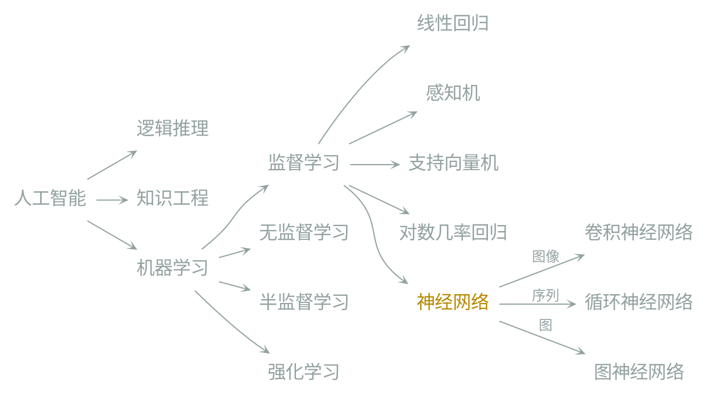

    

    

        <h6 class="bottom_left">图神经网络导论</h6>
        <h6 class="bottom_center">神经网络简介</h6>
        <h6 class="bottom_right">tengzhang@hust.edu.cn</h6>
    

<!-- slide vertical=true data-notes="" -->

    

        

        <h5 class="title">发展史</h5>
    

    

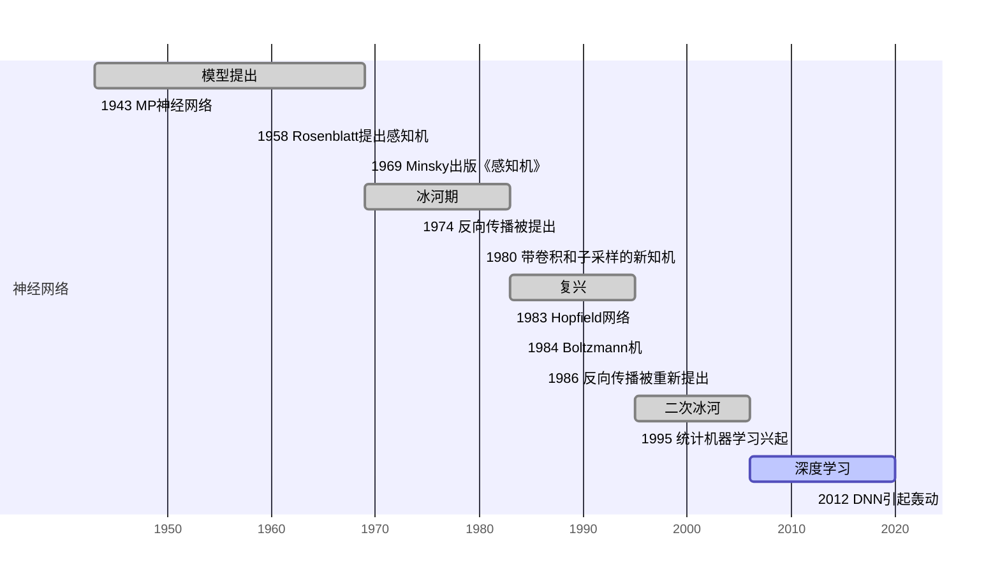

    

    

        <h6 class="bottom_left">图神经网络导论</h6>
        <h6 class="bottom_center">神经网络简介</h6>
        <h6 class="bottom_right">tengzhang@hust.edu.cn</h6>
    

<!-- slide vertical=true data-notes="" -->

    

        

        <h5 class="title">神经元</h5>
    

    

神经网络的基本结构称为神经元

 

单个神经元对应的数学运算是$h(\wv^\top \xv + b)$，其中$h$是非线性激活函数

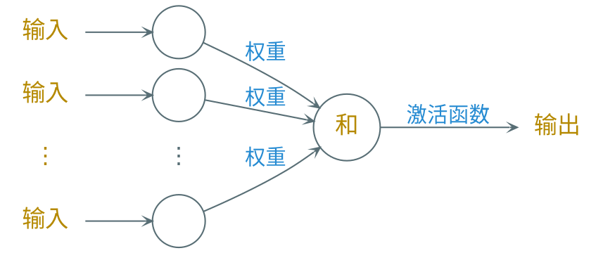

    

    

        <h6 class="bottom_left">图神经网络导论</h6>
        <h6 class="bottom_center">神经网络简介</h6>
        <h6 class="bottom_right">tengzhang@hust.edu.cn</h6>
    

<!-- slide vertical=true data-notes="" -->

    

        

        <h5 class="title">神经网络</h5>
    

    

将神经元广泛并行互连就构成了神经网络

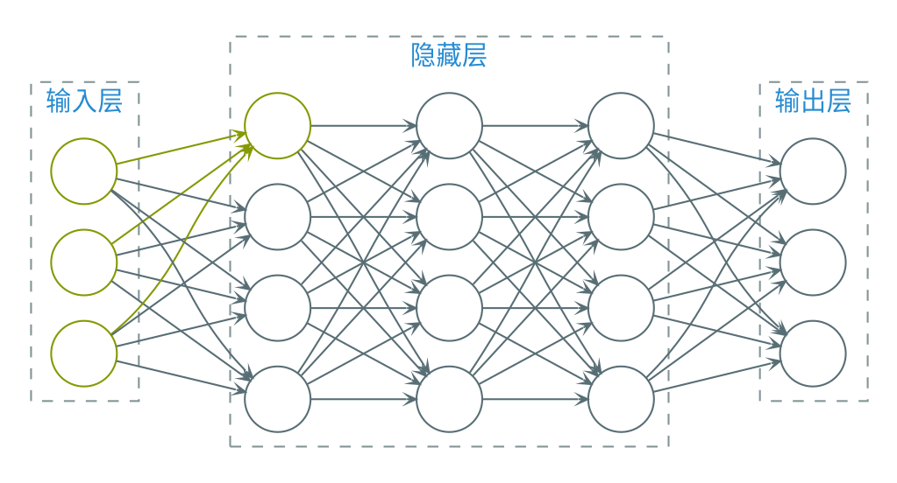

只要存在隐藏层，模型就拥有了非线性预测能力

    

    

        <h6 class="bottom_left">图神经网络导论</h6>
        <h6 class="bottom_center">神经网络简介</h6>
        <h6 class="bottom_right">tengzhang@hust.edu.cn</h6>
    

<!-- slide vertical=true data-notes="" -->

    

        

        <h5 class="title">形式化</h5>
    

    

-   $L$：神经网络的层数
-   $n_l$：第$l$层神经元的个数
-   $h_l(\cdot)$：第$l$层的激活函数
-   $\Wv_l \in \Rbb^{n_l \times n_{l-1}}$：第$l-1$层到第$l$层的权重矩阵
-   $\bv_l \in \Rbb^{n_l}$：第$l$层的截距
-   $\zv_l \in \Rbb^{n_l}$：第$l$层神经元的输入
-   $\av_l \in \Rbb^{n_l}$：第$l$层神经元的输出

 

    $$
        \begin{align*}
            \zv_l & = \Wv_l ~ \av_{l-1} + \bv_l \\
            \av_l & = h_l (\zv_l) \\
            \xv & = \av_0 \xrightarrow{\Wv_1,\bv_1} \zv_1 \xrightarrow{h_1} \av_1 \xrightarrow{\Wv_2,\bv_2} \cdots \xrightarrow{\Wv_L,\bv_L} \zv_L \xrightarrow{h_L} \av_L = \hat{\yv}
        \end{align*}
    $$

    

    

        <h6 class="bottom_left">图神经网络导论</h6>
        <h6 class="bottom_center">神经网络简介</h6>
        <h6 class="bottom_right">tengzhang@hust.edu.cn</h6>
    

<!-- slide data-notes="" -->

    

        

        <h5 class="title">激活函数</h5>
    

    

最早的 MP 模型采用阶跃函数$\sgn(z) = 1_{z \geq 0}$作为激活函数

 

改进：

-   连续并几乎处处可导，可以高效计算
-   导数的值域在合适的范围内，否则影响用梯度下降进行训练

 

常见的有

-   Sigmoid 型：Logistic 函数，Tanh 函数
-   ReLU，带泄漏的 ReLU，带参数的 ReLU，ELU，Softplus
-   Swish 函数
-   Maxout 单元

    

    

        <h6 class="bottom_left">图神经网络导论</h6>
        <h6 class="bottom_center">神经网络简介</h6>
        <h6 class="bottom_right">tengzhang@hust.edu.cn</h6>
    

<!-- slide vertical=true data-notes="" -->

    

        

        <h5 class="title">Sigmoid型</h5>
    

    

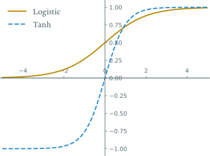

    

    

        <h6 class="bottom_left">图神经网络导论</h6>
        <h6 class="bottom_center">神经网络简介</h6>
        <h6 class="bottom_right">tengzhang@hust.edu.cn</h6>
    

<!-- slide vertical=true data-notes="" -->

    

        

        <h5 class="title">Logistic函数</h5>
    

    

将$\Rbb$“挤压”到$[0,1]$，输出拥有概率意义：

    $$
        \begin{align*}
            \sigma(z) = \frac{1}{1 + \exp (-z)} = \begin{cases} 
                1 & 若~z \rightarrow \infty \\ 
                0 & 若~z \rightarrow -\infty
            \end{cases}
        \end{align*}
    $$

 

Logistic 函数连续可导，在零处导数最大

    $$
        \begin{align*}
            \sigma'(z) & = - \frac{- \exp (-z)}{(1 + \exp (-z))^2} \\
            & = \frac{1}{1 + \exp (-z)} \frac{\exp (-z)}{1 + \exp (-z)} \\
            & = \sigma(z) (1 - \sigma(z)) \\
            & \leq \left( \frac{\sigma(z) + 1 - \sigma(z)}{2} \right)^2 = \frac{1}{4} \quad 在z = 0时取等号
        \end{align*}
    $$

    

    

        <h6 class="bottom_left">图神经网络导论</h6>
        <h6 class="bottom_center">神经网络简介</h6>
        <h6 class="bottom_right">tengzhang@hust.edu.cn</h6>
    

<!-- slide vertical=true data-notes="" -->

    

        

        <h5 class="title">Tanh函数</h5>
    

    

将$\Rbb$“挤压”到$[-1,1]$，输出零中心化，Logistic 函数的放大平移

    $$
        \begin{align*}
            \tanh(z) & = \frac{\exp(z) - \exp(-z)}{\exp(z) + \exp(-z)} \\
            & = \frac{1 - \exp(-2z)}{1 + \exp(-2z)} \\
            & = 2 \sigma(2z) - 1 = \begin{cases} 
                1 & 若~z \rightarrow \infty \\ 
                -1 & 若~z \rightarrow -\infty
            \end{cases}
        \end{align*}
    $$

 

性质：

-   连续可导$\tanh'(z) = 2 (\sigma(2z))' = 4 \sigma(2z) (1 - \sigma(2z))$
-   输出零中心化使得后一层的输入$\wv^\top \av + \bv$也在零附近，而 Logistic 函数在零处导数最大，梯度下降更新效率较高，Logistic 函数输出恒为正，会进一步减慢梯度下降的收敛速度

    

    

        <h6 class="bottom_left">图神经网络导论</h6>
        <h6 class="bottom_center">神经网络简介</h6>
        <h6 class="bottom_right">tengzhang@hust.edu.cn</h6>
    

<!-- slide data-notes="" -->

    

        

        <h5 class="title">ReLU</h5>
    

    

ReLU 全称叫修正线性单元(Rectified Linear Unit)，定义为

    $$
        \begin{align*}
            \relu(z) & = \begin{cases}
                z & 若~z \geq 0 \\ 0 & 若~z < 0
            \end{cases} \\
            & = \max \{ 0, z \} 
        \end{align*}
    $$

 

优点

-   计算只涉及加法、乘法和比较操作，非常高效
-   生物解释：单侧抑制，宽兴奋边界，稀疏兴奋
-   在$z > 0$时导数恒为$1$，缓解了梯度消失问题

 

缺点

-   输出非零中心化
-   死亡 ReLU 问题

    

    

        <h6 class="bottom_left">图神经网络导论</h6>
        <h6 class="bottom_center">神经网络简介</h6>
        <h6 class="bottom_right">tengzhang@hust.edu.cn</h6>
    

<!-- slide vertical=true data-notes="" -->

    

        

        <h5 class="title">死亡ReLU问题</h5>
    

    

由链式法则有

    $$
        \begin{align*}
            \frac{\partial \relu(\wv^\top \xv + b)}{\partial \wv} & = \frac{\partial \relu(\wv^\top \xv + b)}{\partial (\wv^\top \xv + b)} \frac{\partial (\wv^\top \xv + b)}{\partial \wv} \\
            & = \frac{\partial \max \{ 0, \wv^\top \xv + b \}}{\partial (\wv^\top \xv + b)} \xv^\top \\
            & = 1_{\wv^\top \xv + b \geq 0} \xv^\top
        \end{align*}
    $$

如果第一隐藏层中的某个神经元的权重向量$\wv$设置不当，使得对任意$\xv$有$\wv^\top \xv + b < 0$，那么其关于$\wv$的梯度将为零，在以后的训练过程中$\wv$永远不会被更新

 

方案：带泄漏的 ReLU，带参数的 ReLU，ELU，Softplus

    

    

        <h6 class="bottom_left">图神经网络导论</h6>
        <h6 class="bottom_center">神经网络简介</h6>
        <h6 class="bottom_right">tengzhang@hust.edu.cn</h6>
    

<!-- slide vertical=true data-notes="" -->

    

        

        <h5 class="title">ReLU变体</h5>
    

    

带泄漏的 ReLU：当$\wv^\top \xv + b < 0$时也有非零梯度

    $$
        \begin{align*}
            \lrelu(z) & = \begin{cases}
                z & 若~z \geq 0 \\ \gamma z & 若~z < 0
            \end{cases} \\
            & = \max \{ 0, z \} + \gamma \min \{ 0, z \} \overset{\gamma < 1}{=} \max \{ z, \gamma z \}
        \end{align*}
    $$

其中斜率$\gamma$是一个很小的常数，比如$0.01$

 

带参数的 ReLU：斜率$\gamma_i$可学习

    $$
        \begin{align*}
            \prelu(z) & = \begin{cases}
                z & 若~z \geq 0 \\ \gamma_i z & 若~z < 0
            \end{cases} \\
            & = \max \{ 0, z \} + \gamma_i \min \{ 0, z \} 
        \end{align*}
    $$

可以不同神经元具有不同的参数，也可以一组神经元共享一个参数

    

    

        <h6 class="bottom_left">图神经网络导论</h6>
        <h6 class="bottom_center">神经网络简介</h6>
        <h6 class="bottom_right">tengzhang@hust.edu.cn</h6>
    

<!-- slide vertical=true data-notes="" -->

    

        

        <h5 class="title">ReLU变体</h5>
    

    

ELU 全称叫指数线性单元(Exponential Linear Unit)

    $$
        \begin{align*}
            \elu(z) & = \begin{cases}
                z & 若~z \geq 0 \\ \gamma (\exp(z) - 1) & 若~z < 0
            \end{cases} \\
            & = \max \{ 0, z \} + \min \{ 0, \gamma (\exp(z) - 1) \}
        \end{align*}
    $$

 

Softplus 函数可以看作 ReLU 的平滑版本：

    $$
        \begin{align*}
            \softplus(z) = \log (1 + \exp(z))
        \end{align*}
    $$

其导数为 Logistic 函数

    $$
        \begin{align*}
            \softplus'(z) = \frac{\exp(z)}{1 + \exp(z)} = \frac{1}{1 + \exp(-z)}
        \end{align*}
    $$

    

    

        <h6 class="bottom_left">图神经网络导论</h6>
        <h6 class="bottom_center">神经网络简介</h6>
        <h6 class="bottom_right">tengzhang@hust.edu.cn</h6>
    

<!-- slide vertical=true data-notes="" -->

    

        

        <h5 class="title">ReLU族</h5>
    

    

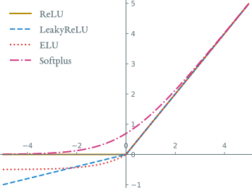

    

    

        <h6 class="bottom_left">图神经网络导论</h6>
        <h6 class="bottom_center">神经网络简介</h6>
        <h6 class="bottom_right">tengzhang@hust.edu.cn</h6>
    

<!-- slide data-notes="" -->

    

        

        <h5 class="title">Swish函数</h5>
    

    

Swish 函数是一种自门控激活函数：

    $$
        \begin{align*}
            \swish(z) = z \cdot \sigma (\beta z) = \frac{z}{1 + \exp(-\beta z)}
        \end{align*}
    $$

其中$\beta$是可学习的参数或一个固定超参数

-   当$\sigma (\beta z)$接近于$1$时，门处于“开”状态，激活函数的输出近似于$z$本身
-   当$\sigma (\beta z)$接近于$0$时，门处于“关”状态，激活函数的输出近似于$0$

    

    

        <h6 class="bottom_left">图神经网络导论</h6>
        <h6 class="bottom_center">神经网络简介</h6>
        <h6 class="bottom_right">tengzhang@hust.edu.cn</h6>
    

<!-- slide vertical=true data-notes="" -->

    

        

        <h5 class="title">Swish函数</h5>
    

    

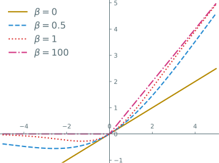

    

    

        <h6 class="bottom_left">图神经网络导论</h6>
        <h6 class="bottom_center">神经网络简介</h6>
        <h6 class="bottom_right">tengzhang@hust.edu.cn</h6>
    

<!-- slide vertical=true data-notes="" -->

    

        

        <h5 class="title">Maxout单元</h5>
    

    

考虑神经网络的第$l$层：

    $$
        \begin{align*}
            \zv_l & = \Wv_l ~ \av_{l-1} + \bv_l \\
            \av_l & = h_l (\zv_l)
        \end{align*}
    $$

前面提到的激活函数都是$\Rbb \mapsto \Rbb$的，即$[\av_l]_i = h_l ([\zv_l]_i), ~ i \in [n_l]$

 

Maxout 单元是$\Rbb^{n_l} \mapsto \Rbb$的，输入就是$\zv_l$，其定义为

    $$
        \begin{align*}
            \maxout (\zv) = \max_{k \in [K]} \{ \wv_k^\top \zv + b_k \}
        \end{align*}
    $$

-   整体学习输入到输出间的非线性关系
-   $\relu(z) = \max \{ 0, z \}$与$\lrelu(z) \overset{\gamma < 1}{=} \max \{ z, \gamma z \}$都是 Maxout 单元的特例

    

    

        <h6 class="bottom_left">图神经网络导论</h6>
        <h6 class="bottom_center">神经网络简介</h6>
        <h6 class="bottom_right">tengzhang@hust.edu.cn</h6>
    

<!-- slide data-notes="" -->

    

        

        <h5 class="title">应用到机器学习</h5>
    

    

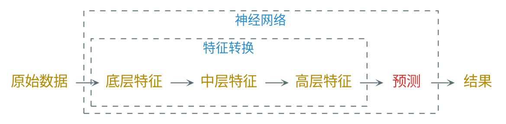

前$L-1$层是一个复合函数$\psi: \Rbb^d \mapsto \Rbb^{n_{L-1}}$，可以看作一种特征转换方法

 

最后一层是一个学习器$\hat{\yv} = g(\psi(\xv); \Wv_L, \bv_L)$，对输入$\psi(\xv)$进行预测

-   若$y \in \{ 1, -1\}$，最后一层只需$1$个神经元，并采用 Logistic 激活函数
-   若$y \in [C]$，最后一层需$C$个神经元，并采用 Softmax 激活函数

 

因此对数几率回归也可看作只有一层(没有隐藏层)的神经网络

    

    

        <h6 class="bottom_left">图神经网络导论</h6>
        <h6 class="bottom_center">神经网络简介</h6>
        <h6 class="bottom_right">tengzhang@hust.edu.cn</h6>
    

<!-- slide vertical=true data-notes="" -->

    

        

        <h5 class="title">深度学习</h5>
    

    

传统机器学习：特征处理和学习两阶段分开进行

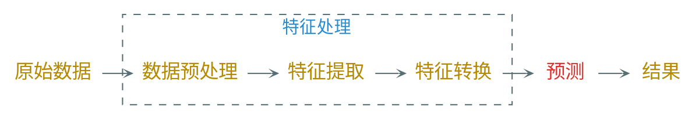

 

深度学习：特征处理和学习一体化，端到端(end-to-end)

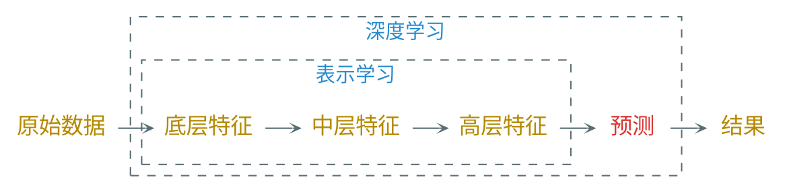

    

    

        <h6 class="bottom_left">图神经网络导论</h6>
        <h6 class="bottom_center">神经网络简介</h6>
        <h6 class="bottom_right">tengzhang@hust.edu.cn</h6>
    

<!-- slide vertical=true data-notes="" -->

    

        

        <h5 class="title">求解参数</h5>
    

    

不妨设采用交叉熵损失函数，对于样本$(\xv, y)$，其损失函数为

    $$
        \begin{align*}
            \Lcal (\yv, \hat{\yv}) = - \yv \log \hat{\yv}
        \end{align*}
    $$

 

优化目标为

    $$
        \begin{align*}
            \min_{\Wv, \bv} ~ \frac{\lambda}{m} \sum_{i \in [m]} \Lcal (\yv_i, \hat{\yv}_i) + \frac{1}{2} \| \Wv \|_F^2
        \end{align*}
    $$

梯度下降

    $$
        \begin{align*}
            \Wv & \leftarrow \Wv - \eta \left( \frac{\lambda}{m} \sum_{i \in [m]} \class{yellow}{\frac{\partial \Lcal (\yv_i, \hat{\yv}_i)}{\partial \Wv}} + \Wv \right) \\
            \bv & \leftarrow \bv - \eta \cdot \frac{\lambda}{m} \sum_{i \in [m]} \class{yellow}{\frac{\partial \Lcal (\yv_i, \hat{\yv}_i)}{\partial \bv}}
        \end{align*}
    $$

    

    

        <h6 class="bottom_left">图神经网络导论</h6>
        <h6 class="bottom_center">神经网络简介</h6>
        <h6 class="bottom_right">tengzhang@hust.edu.cn</h6>
    

<!-- slide data-notes="" -->

    

        

        <h5 class="title">矩阵求导</h5>
    

    

先证明几个对矩阵求导的结论

    $$
        \begin{align*}
            \underbrace{\zv}_{n \times 1} = \underbrace{\Wv}_{n \times m} ~ \underbrace{\av}_{m \times 1} + \underbrace{\bv}_{n \times 1}
        \end{align*}
    $$

记$\Wv = [\wv_1, \ldots, \wv_n]^\top = [\wv_1^\top; \ldots; \wv_n^\top]$，写成方程组的形式

    $$
        \begin{align*}
            z_1 & = \wv_1^\top \av + b_1 = w_{11} a_1 + w_{12} a_2 + \cdots + w_{1m} a_m + b_1 \\
            z_2 & = \wv_2^\top \av + b_2 = w_{21} a_1 + w_{22} a_2 + \cdots + w_{2m} a_m + b_2 \\
            & \quad \vdots \\
            z_n & = \wv_n^\top \av + b_n = w_{n1} a_1 + w_{n2} a_2 + \cdots + w_{nm} a_m + b_n \\
        \end{align*}
    $$

于是

    $$
        \begin{align*}
            \frac{\partial z_j}{\partial b_i} = 1_{j=i} \Longrightarrow \frac{\partial \zv}{\partial b_i} = \ev_i \Longrightarrow \frac{\partial \zv}{\partial \bv} = [\ev_1, \ev_2, \ldots, \ev_n] = \Iv 
        \end{align*}
    $$

    

    

        <h6 class="bottom_left">图神经网络导论</h6>
        <h6 class="bottom_center">神经网络简介</h6>
        <h6 class="bottom_right">tengzhang@hust.edu.cn</h6>
    

<!-- slide vertical=true data-notes="" -->

    

        

        <h5 class="title">矩阵求导</h5>
    

    

先证明几个对矩阵求导的结论

    $$
        \begin{align*}
            \underbrace{\zv}_{n \times 1} = \underbrace{\Wv}_{n \times m} ~ \underbrace{\av}_{m \times 1} + \underbrace{\bv}_{n \times 1}
        \end{align*}
    $$

记$\Wv = [\wv_1, \ldots, \wv_n]^\top = [\wv_1^\top; \ldots; \wv_n^\top]$，写成方程组的形式

    $$
        \begin{align*}
            z_1 & = \wv_1^\top \av + b_1 = w_{11} a_1 + w_{12} a_2 + \cdots + w_{1m} a_m + b_1 \\
            z_2 & = \wv_2^\top \av + b_2 = w_{21} a_1 + w_{22} a_2 + \cdots + w_{2m} a_m + b_2 \\
            & \quad \vdots \\
            z_n & = \wv_n^\top \av + b_n = w_{n1} a_1 + w_{n2} a_2 + \cdots + w_{nm} a_m + b_n \\
        \end{align*}
    $$

于是

    $$
        \begin{align*}
            \frac{\partial z_j}{\partial a_i} = w_{ji} \Longrightarrow \frac{\partial z_j}{\partial \av} = [w_{j1}, \ldots, w_{jm}] = \wv_j^\top \Longrightarrow \frac{\partial \zv}{\partial \av} = \Wv
        \end{align*}
    $$

    

    

        <h6 class="bottom_left">图神经网络导论</h6>
        <h6 class="bottom_center">神经网络简介</h6>
        <h6 class="bottom_right">tengzhang@hust.edu.cn</h6>
    

<!-- slide vertical=true data-notes="" -->

    

        

        <h5 class="title">矩阵求导</h5>
    

    

先证明几个对矩阵求导的结论

    $$
        \begin{align*}
            \underbrace{\zv}_{n \times 1} = \underbrace{\Wv}_{n \times m} ~ \underbrace{\av}_{m \times 1} + \underbrace{\bv}_{n \times 1}
        \end{align*}
    $$

记$\Wv = [\wv_1, \ldots, \wv_n]^\top = [\wv_1^\top; \ldots; \wv_n^\top]$，写成方程组的形式

    $$
        \begin{align*}
            z_1 & = \wv_1^\top \av + b_1 = w_{11} a_1 + w_{12} a_2 + \cdots + w_{1m} a_m + b_1 \\
            z_2 & = \wv_2^\top \av + b_2 = w_{21} a_1 + w_{22} a_2 + \cdots + w_{2m} a_m + b_2 \\
            & \quad \vdots \\
            z_n & = \wv_n^\top \av + b_n = w_{n1} a_1 + w_{n2} a_2 + \cdots + w_{nm} a_m + b_n \\
        \end{align*}
    $$

于是

    $$
        \begin{align*} 
            \frac{\partial z_j}{\partial w_{ik}} = 1_{j=i} a_k & \Longrightarrow \frac{\partial z_j}{\partial \wv_i} = 1_{j=i} \av^\top \Longrightarrow \frac{\partial z_j}{\partial \Wv} = [\underbrace{\zerov, \ldots, \av, \ldots, \zerov}_{~第j列为\av}]
        \end{align*}
    $$

    

    

        <h6 class="bottom_left">图神经网络导论</h6>
        <h6 class="bottom_center">神经网络简介</h6>
        <h6 class="bottom_right">tengzhang@hust.edu.cn</h6>
    

<!-- slide vertical=true data-notes="" -->

    

        

        <h5 class="title">求解梯度</h5>
    

    

对于神经网络第$l$层：$\underbrace{\zv_l}_{n_l \times 1} = \underbrace{\Wv_l}_{n_l \times n_{l-1}} ~ \underbrace{\av_{l-1}}_{n_{l-1} \times 1} + \underbrace{\bv_l}_{n_l \times 1}$

记$\Wv_l = [\wv_1, \ldots, \wv_n]^\top = [\wv_1^\top; \ldots; \wv_n^\top]$，综上有

    $$
        \begin{align*}
            \frac{\partial \zv_l}{\partial \bv_l} = \Iv, \quad \frac{\partial \zv_l}{\partial \av_{l-1}} = \Wv_l, \quad \frac{\partial [\zv_l]_j}{\partial \Wv_l} = [\zerov, \ldots, \av_{l-1}, \ldots, \zerov]
        \end{align*}
    $$

记$\deltav_l^\top = \partial \Lcal (\yv, \hat{\yv}) / \partial \zv_l \in \Rbb^{n_l}$为第$l$层的误差项，由链式法则

    $$
        \begin{align*}
            \frac{\partial \Lcal (\yv, \hat{\yv})}{\partial \bv_l} & = \frac{\partial \Lcal (\yv, \hat{\yv})}{\partial \zv_l} \frac{\partial \zv_l}{\partial \bv_l} = \deltav_l^\top \Iv = \deltav_l^\top \\
            \frac{\partial \Lcal (\yv, \hat{\yv})}{\partial \av_{l-1}} & = \frac{\partial \Lcal (\yv, \hat{\yv})}{\partial \zv_l} \frac{\partial \zv_l}{\partial \av_{l-1}} = \deltav_l^\top \Wv_l
        \end{align*}
    $$

这里对$\av_{l-1}$也要求导是因为$\av_{l-1}$与前一层的变量$\Wv_{l-1}$是相关的

    

    

        <h6 class="bottom_left">图神经网络导论</h6>
        <h6 class="bottom_center">神经网络简介</h6>
        <h6 class="bottom_right">tengzhang@hust.edu.cn</h6>
    

<!-- slide data-notes="" -->

    

        

        <h5 class="title">求解梯度</h5>
    

    

对于神经网络第$l$层：$\underbrace{\zv_l}_{n_l \times 1} = \underbrace{\Wv_l}_{n_l \times n_{l-1}} ~ \underbrace{\av_{l-1}}_{n_{l-1} \times 1} + \underbrace{\bv_l}_{n_l \times 1}$

记$\Wv_l = [\wv_1, \ldots, \wv_n]^\top = [\wv_1^\top; \ldots; \wv_n^\top]$，综上有

    $$
        \begin{align*}
            \frac{\partial \zv_l}{\partial \bv_l} = \Iv, \quad \frac{\partial \zv_l}{\partial \av_{l-1}} = \Wv_l, \quad \frac{\partial [\zv_l]_j}{\partial \Wv_l} = [\zerov, \ldots, \av_{l-1}, \ldots, \zerov]
        \end{align*}
    $$

记$\deltav_l^\top = \partial \Lcal (\yv, \hat{\yv}) / \partial \zv_l \in \Rbb^{n_l}$为第$l$层的误差项，由链式法则

    $$
        \begin{align*}
            \frac{\partial \Lcal (\yv, \hat{\yv})}{\partial \Wv_l} & = \sum_{j \in [n_l]} \frac{\partial \Lcal (\yv, \hat{\yv})}{\partial [\zv_l]_j} \frac{\partial [\zv_l]_j}{\partial \Wv_l} = \sum_{j \in [n_l]} [\deltav_l]_j [\zerov, \ldots, \av_{l-1}, \ldots, \zerov] \\
            & = [\av_{l-1} [\deltav_l]_1, \zerov, \ldots, \zerov] + \cdots + [\zerov, \ldots, \zerov, \av_{l-1} [\deltav_l]_{n_l}] \\
            & = [\av_{l-1} [\deltav_l]_1, \ldots, \av_{l-1} [\deltav_l]_{n_l}] \\
            & = \av_{l-1} \deltav_l^\top
        \end{align*}
    $$

    

    

        <h6 class="bottom_left">图神经网络导论</h6>
        <h6 class="bottom_center">神经网络简介</h6>
        <h6 class="bottom_right">tengzhang@hust.edu.cn</h6>
    

<!-- slide vertical=true data-notes="" -->

    

        

        <h5 class="title">求解梯度</h5>
    

    

第$l$层：

    $$
        \begin{align*}
            \frac{\partial \Lcal (\yv, \hat{\yv})}{\partial \Wv_l} = \av_{l-1} \deltav_l^\top, \quad \frac{\partial \Lcal (\yv, \hat{\yv})}{\partial \bv_l} = \deltav_l^\top, \quad \frac{\partial \zv_l}{\partial \av_{l-1}} = \Wv_l
        \end{align*}
    $$

第$l+1$层：$\zv_{l+1} = \Wv_{l+1} ~ \av_l + \bv_{l+1}$，其中$\av_l = h_l (\zv_l)$，由链式法则

    $$
        \begin{align*}
            \deltav_l^\top = \frac{\partial \Lcal (\yv, \hat{\yv})}{\partial \zv_l} = \frac{\partial \Lcal (\yv, \hat{\yv})}{\partial \zv_{l+1}} \frac{\partial \zv_{l+1}}{\partial \av_l} \frac{\partial \av_l}{\partial \zv_l} = \deltav_{l+1}^\top \Wv_{l+1} \diag (h_l'(\zv_l))
        \end{align*}
    $$

其中$h_l'(\zv_l)$是激活函数的导数

 

误差反向传播：第$l$层的误差项可以通过第$l+1$层的误差项计算得到

剩下只需求最后一层的误差项

    $$
        \begin{align*}
            \deltav_L^\top = \frac{\partial \Lcal (\yv, \hat{\yv})}{\partial \zv_L} = \frac{\partial (-\yv \log \hat{\yv})}{\partial \zv_L} = - \frac{\partial \yv \log h_L(\zv_L)}{\partial \zv_L}
        \end{align*}
    $$

    

    

        <h6 class="bottom_left">图神经网络导论</h6>
        <h6 class="bottom_center">神经网络简介</h6>
        <h6 class="bottom_right">tengzhang@hust.edu.cn</h6>
    

<!-- slide vertical=true data-notes="" -->

    

        

        <h5 class="title">反向传播算法</h5>
    

    

输入：训练集$\Scal$，验证集$\Vcal$，以及相关超参数

1. 随机初始化$\Wv$、$\bv$
2. repeat
3. &emsp;&emsp;对训练集$\Scal$中的样本随机重排序
4. &emsp;&emsp;for $i = 1, \ldots, m$ do
5. &emsp;&emsp;&emsp;&emsp;获取样本$(\xv_i, y_i)$
6. &emsp;&emsp;&emsp;&emsp;前向计算每一层的$\zv_l$、$\av_l$，直到最后一层
7. &emsp;&emsp;&emsp;&emsp;反向传播计算每一层的误差项$\deltav_l$
8. &emsp;&emsp;&emsp;&emsp;采用梯度下降更新$\Wv$、$\bv$
9. &emsp;&emsp;end
10. until 神经网络模型在验证集$\Vcal$上的错误率不再下降

输出：$\Wv$、$\bv$

    

    

        <h6 class="bottom_left">图神经网络导论</h6>
        <h6 class="bottom_center">神经网络简介</h6>
        <h6 class="bottom_right">tengzhang@hust.edu.cn</h6>
    

<!-- slide data-notes="" -->

    

        

        <h5 class="title">梯度消失</h5>
    

    

神经网络中误差反向传播的迭代公式为

    $$
        \begin{align*}
            \deltav_l^\top = \frac{\partial \Lcal (\yv, \hat{\yv})}{\partial \zv_l} = \frac{\partial \Lcal (\yv, \hat{\yv})}{\partial \zv_{l+1}} \frac{\partial \zv_{l+1}}{\partial \av_l} \frac{\partial \av_l}{\partial \zv_l} = \deltav_{l+1}^\top \Wv_{l+1} \diag (h_l'(\zv_l))
        \end{align*}
    $$

 

对于 Sigmoid 型激活函数

-   $\sigma'(z) = \sigma(z) (1 - \sigma(z)) \leq \frac{1}{4}$
-   $\tanh'(z) = 4 \sigma(2z) (1 - \sigma(2z)) \leq 4 \cdot \frac{1}{4} = 1$

误差每传播一层都会乘以一个小于等于$1$的系数，当网络层数很深时，梯度会不断衰减甚至消失，使得整个网络很难训练

 

方案：使用导数比较大的激活函数，比如 ReLU

    

    

        <h6 class="bottom_left">图神经网络导论</h6>
        <h6 class="bottom_center">神经网络简介</h6>
        <h6 class="bottom_right">tengzhang@hust.edu.cn</h6>
    

<!-- slide vertical=truedata-notes="" -->

    

        

        <h5 class="title">残差网络</h5>
    

    

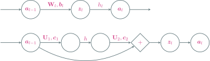

残差模块：$\zv_l = \av_{l-1} + \class{yellow}{\Uv_2 \cdot h_1(\Uv_1 \cdot \av_{l-1} + \cv_1) + \cv_2)} = \av_{l-1} + \class{yellow}{f(\av_{l-1})}$

假设$\av_l = \zv_l$，即残差模块输出不使用激活函数，对$\forall t \in [l]$有

    $$
        \begin{align*}
            \av_l & = \av_{l-1} + f(\av_{l-1}) = \av_{l-2} + f(\av_{l-2}) + f(\av_{l-1}) \\ 
            & = \cdots = \av_{l-t} + \sum_{i=l-t}^{l-1} f(\av_i)
        \end{align*}
    $$

低层输入可以恒等传播到任意高层

    

    

        <h6 class="bottom_left">图神经网络导论</h6>
        <h6 class="bottom_center">神经网络简介</h6>
        <h6 class="bottom_right">tengzhang@hust.edu.cn</h6>
    

<!-- slide vertical=truedata-notes="" -->

    

        

        <h5 class="title">残差网络</h5>
    

    

    $$
        \begin{align*}
            \av_l = \av_{l-t} + \sum_{i=l-t}^{l-1} f(\av_i)
        \end{align*}
    $$

由链式法则有

    $$
        \begin{align*}
            \frac{\partial \Lcal}{\partial \av_{l-t}} & = \frac{\partial \Lcal}{\partial \av_l} \frac{\partial \av_l}{\partial \av_{l-t}} = \frac{\partial \Lcal}{\partial \av_l} \left( \frac{\partial \av_{l-t}}{\partial \av_{l-t}} + \frac{\partial }{\partial \av_{l-t}} \sum_{i=l-t}^{l-1} f(\av_i) \right) \\
            & = \frac{\partial \Lcal}{\partial \av_l} \left( \Iv + \frac{\partial }{\partial \av_{l-t}} \sum_{i=l-t}^{l-1} f(\av_i) \right) \\
            & = \frac{\partial \Lcal}{\partial \av_l} + \frac{\partial \Lcal}{\partial \av_l} \left( \frac{\partial }{\partial \av_{l-t}} \sum_{i=l-t}^{l-1} f(\av_i) \right) 
        \end{align*}
    $$

高层误差可以恒等传播到任意低层，梯度消失得以缓解

    

    

        <h6 class="bottom_left">图神经网络导论</h6>
        <h6 class="bottom_center">神经网络简介</h6>
        <h6 class="bottom_right">tengzhang@hust.edu.cn</h6>
    

<!-- slide data-notes="" -->

    

        

        <h5 class="title">优化算法</h5>
    

    

神经网络通常采用小批量梯度下降$\Wv_{t+1} \leftarrow \Wv_t - \eta_t \gv_t$，其中

$$
    \begin{align*}
        \gv_t = \frac{1}{|\Bcal_t|} \sum_{i \in \Bcal_t} \frac{\partial \Lcal (\yv_i, \hat{\yv}_i)}{\partial \Wv}
    \end{align*}
$$

 

批量大小$|\Bcal_t|$不影响随机梯度的期望，但会影响方差

-   $|\Bcal_t|$越大，方差越小，训练越稳定，可以采用较大的步长加快收敛
-   $|\Bcal_t|$越小，方差越大，需采用较小的步长，否则可能不收敛

 

线性缩放规则：$|\Bcal_t|$增加$k$倍，步长也增加$k$倍，但当$|\Bcal_t|$特别大时，线性缩放也还是会出现训练不稳定

-   步长调整
-   更新方向调整

    

    

        <h6 class="bottom_left">图神经网络导论</h6>
        <h6 class="bottom_center">神经网络简介</h6>
        <h6 class="bottom_right">tengzhang@hust.edu.cn</h6>
    

<!-- slide vertical=true data-notes="" -->

    

        

        <h5 class="title">步长调整</h5>
    

    

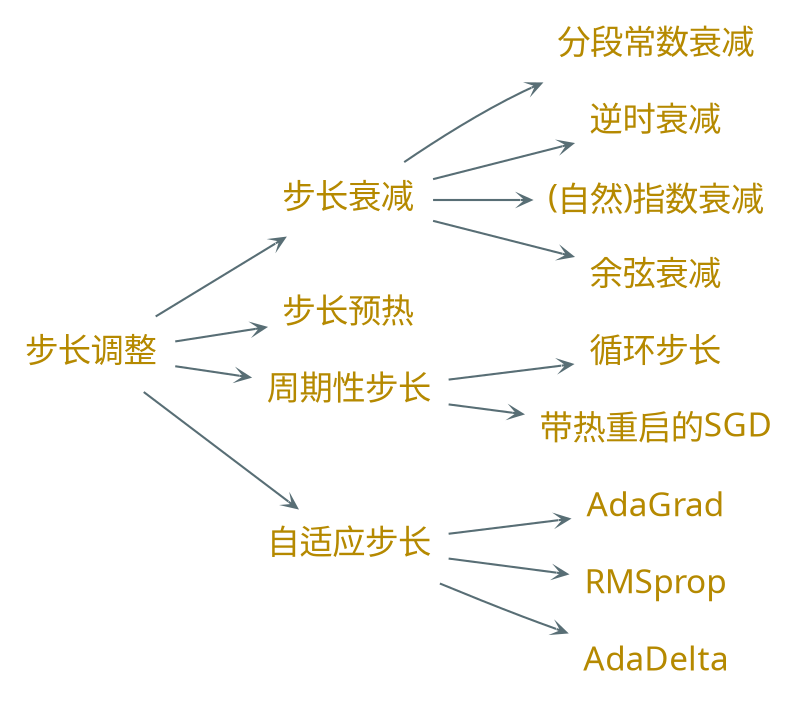

    

    

        <h6 class="bottom_left">图神经网络导论</h6>
        <h6 class="bottom_center">神经网络简介</h6>
        <h6 class="bottom_right">tengzhang@hust.edu.cn</h6>
    

<!-- slide vertical=true data-notes="" -->

    

        

        <h5 class="title">步长衰减</h5>
    

    

基本想法：在一开始要使用大步长来保证收敛速度，在接近最优解时要用小步长避免来回震荡，也称为步长退火

设初始步长为$\eta_0$，第$t$次迭代时的步长为$\eta_t$，常见的衰减方式为根据迭代次数进行衰减

-   分段常数衰减：每经过$T_1, T_2, \ldots, T_n$次迭代步长衰减为原来的$\beta_1, \beta_2, \ldots, \beta_n$倍，其中$T_n$、$\beta_n < 1$为超参数
-   逆时衰减：$\eta_t = \eta_0 / (1 + \beta * t)$，其中$\beta$为衰减率
-   指数衰减：$\eta_t = \eta_0 \beta^t$，其中$\beta < 1$为衰减率
-   自然指数衰减：$\eta_t = \eta_0 \exp(-\beta * t)$
-   余弦衰减：$\eta_t = \eta_0 (1 + \cos (t \pi /T) )$，其中$T$为总的迭代次数

    

    

        <h6 class="bottom_left">图神经网络导论</h6>
        <h6 class="bottom_center">神经网络简介</h6>
        <h6 class="bottom_right">tengzhang@hust.edu.cn</h6>
    

<!-- slide vertical=true data-notes="" -->

    

        

        <h5 class="title">步长预热</h5>
    

    

步长预热：

-   在最初几轮迭代时，采用较小的步长
-   等梯度下降到一定程度后再恢复为初始步长

 

动机：在训练初始阶段，由于参数是随机初始化的，梯度往往也比较大，如果初始步长也很大，会使得训练不稳定

 

假设预热迭代次数为$T'$，初始步长为$\eta_0$，则

    $$
        \begin{align*}
            \eta'_t = \frac{t}{T'} \eta_0, \quad t \in [T']
        \end{align*}
    $$

当预热过程结束，再选择一种步长衰减方法来逐渐降低步长

    

    

        <h6 class="bottom_left">图神经网络导论</h6>
        <h6 class="bottom_center">神经网络简介</h6>
        <h6 class="bottom_right">tengzhang@hust.edu.cn</h6>
    

<!-- slide vertical=true data-notes="" -->

    

        

        <h5 class="title">周期性步长</h5>
    

    

在训练过程中周期性地增大步长

 

目的：在训练过程中有助于逃离尖锐的局部最小值点和鞍点

-   平坦的局部最小值点：鲁棒性好，微小的参数变动不会对模型有剧烈影响
-   尖锐的局部最小值点：鲁棒性差，微小的参数变动也会导致模型剧烈变化

 

周期性地增大步长虽然会短期内会损害优化过程，但通常最终会收敛到更加理想的局部极小值点

-   循环步长：每个循环周期的长度都为$2 \Delta T$，前$\Delta T$轮步长线性增大，后$\Delta T$轮步长线性缩小，第$n$个周期中步长的上界和下界随着$m$的增大而逐渐减小
-   带热重启的 SGD：步长每隔一定周期后重新初始化为某个预先设定的值，然后逐渐衰减；每次重启后模型参数不是从头开始优化，而是在重启前的参数基础上继续优化

    

    

        <h6 class="bottom_left">图神经网络导论</h6>
        <h6 class="bottom_center">神经网络简介</h6>
        <h6 class="bottom_right">tengzhang@hust.edu.cn</h6>
    

<!-- slide vertical=true data-notes="" -->

    

        

        <h5 class="title">自适应步长</h5>
    

    

AdaGrad：第$t$轮迭代先计算每个参数梯度平方的累积值：

    $$
        \begin{align*}
            \Gv_t = \sum_{\tau \in [t]} \gv_\tau \odot \gv_\tau
        \end{align*}
    $$

其中$\odot$为按元素乘积，$\gv_\tau \in \Rbb^{|\Wv|}$是第$\tau$次迭代时的梯度

 

再利用累积梯度平方做衰减：

    $$
        \begin{align*}
            \Wv_{t+1} \leftarrow \Wv_t - \frac{\alpha}{\sqrt{\Gv_t + \epsilon}} \odot \gv_\tau
        \end{align*}
    $$

其中$\alpha$是初始步长，$\epsilon$是为了保持数值稳定而设置的非常小的常数

 

缺点：经过一定轮数的迭代仍未找到最优点时，由于此时步长已经非常小，很难再继续找到最优点

    

    

        <h6 class="bottom_left">图神经网络导论</h6>
        <h6 class="bottom_center">神经网络简介</h6>
        <h6 class="bottom_right">tengzhang@hust.edu.cn</h6>
    

<!-- slide vertical=true data-notes="" -->

    

        

        <h5 class="title">自适应步长</h5>
    

    

RMSprop：第$t$轮迭代先计算梯度平方的指数衰减移动平均：

    $$
        \begin{align*}
            \Gv_t = \beta \Gv_{t-1} + (1 - \beta) \gv_\tau \odot \gv_\tau = (1 - \beta) \sum_{\tau \in [t]} \beta^{t - \tau} \gv_\tau \odot \gv_\tau
        \end{align*}
    $$

其中$\beta$为衰减率，一般取值$0.9$

 

RMSprop 的更新公式为

$$
    \begin{align*}
        \Wv_{t+1} \leftarrow \Wv_t - \frac{\alpha}{\sqrt{\Gv_t + \epsilon}} \odot \gv_\tau
    \end{align*}
$$

其中$\alpha$通常设为$0.001$

 

较 AdaGrad 的优点：$\Gv_t$并非单调增加，故步长不是单调衰减，既可以变小也可以变大

    

    

        <h6 class="bottom_left">图神经网络导论</h6>
        <h6 class="bottom_center">神经网络简介</h6>
        <h6 class="bottom_right">tengzhang@hust.edu.cn</h6>
    

<!-- slide vertical=true data-notes="" -->

    

        

        <h5 class="title">自适应步长</h5>
    

    

AdaDelta：进一步引入参数更新差平方的指数衰减移动平均：

    $$
        \begin{align*}
            \Delta \Uv_{t-1}^2 = \beta \Delta \Uv_{t-2}^2 + (1 - \beta) \Delta \Wv_{t-1} \odot \Delta \Wv_{t-1}
        \end{align*}
    $$

其中$\beta$为衰减率，$\Delta \Wv_{t-1} = \Wv_t - \Wv_{t-1}$为参数更新差

 

AdaDelta 的更新公式为

    $$
        \begin{align*}
            \Wv_{t+1} \leftarrow \Wv_t - \frac{\sqrt{\Delta \Uv_{t-1}^2 + \epsilon}}{\sqrt{\Gv_t + \epsilon}} \odot \gv_\tau
        \end{align*}
    $$

 

优点：将 RMSprop 中的初始步长$\alpha$改为动态计算的$\Delta \Uv_{t-1}$，在一定程度上抑制了步长的波动

    

    

        <h6 class="bottom_left">图神经网络导论</h6>
        <h6 class="bottom_center">神经网络简介</h6>
        <h6 class="bottom_right">tengzhang@hust.edu.cn</h6>
    

<!-- slide data-notes="" -->

    

        

        <h5 class="title">更新方向调整</h5>
    

    

动量法：计算负梯度的“加权移动平均”作为参数的更新方向

    $$
        \begin{align*}
            \Wv_{t+1} - \Wv_t = \Delta \Wv_t = \rho \Delta \Wv_{t-1} - \alpha \gv_t = - \alpha \sum_{\tau \in [t]} \rho^{t - \tau} \gv_\tau
        \end{align*}
    $$

-   当某个参数在最近一段时间内的梯度方向不一致时，其真实的更新幅度变小
-   当某个参数在最近一段时间内的梯度方向一致时，其真实的更新幅度变大，起到加速作用
-   迭代初期梯度方向比较一致，动量法会起到加速作用；迭代后期梯度方向会趋于不一致，在最优值附近震荡，动量法会起到减速作用，增加稳定性

 

Nesterov 加速梯度：改进动量法的第二步

    $$
        \begin{align*}
            \begin{cases} \widetilde{\Wv} = \Wv_t + \rho \Delta \Wv_{t-1} \\ \Wv_{t+1} = \widetilde{\Wv} - \alpha \class{yellow}{\gv_t (\Wv_t)} \end{cases} \Longrightarrow \begin{cases} \widetilde{\Wv} = \Wv_t + \rho \Delta \Wv_{t-1} \\ \Wv_{t+1} = \widetilde{\Wv} - \alpha \class{yellow}{\gv_t (\widetilde{\Wv})} \end{cases}
        \end{align*}
    $$

    

    

        <h6 class="bottom_left">图神经网络导论</h6>
        <h6 class="bottom_center">神经网络简介</h6>
        <h6 class="bottom_right">tengzhang@hust.edu.cn</h6>
    

<!-- slide vertical=true data-notes="" -->

    

        

        <h5 class="title">更新方向调整</h5>
    

    

动量法 vs. Nesterov 加速梯度

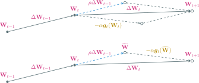

    

    

        <h6 class="bottom_left">图神经网络导论</h6>
        <h6 class="bottom_center">神经网络简介</h6>
        <h6 class="bottom_right">tengzhang@hust.edu.cn</h6>
    

<!-- slide vertical=true data-notes="" -->

    

        

        <h5 class="title">更新方向调整</h5>
    

    

Adam(<u>Ada</u>ptive <u>M</u>oment Estimation)：动量法和 RMSprop 的结合

    $$
        \begin{align*}
            \Mv_t & = \beta_1 \Mv_{t-1} + (1 - \beta_1) \gv_t = (1 - \beta_1) \sum_{\tau \in [t]} \beta_1^{t - \tau} \gv_\tau \\
            \Gv_t & = \beta_2 \Gv_{t-1} + (1 - \beta_2) \gv_t \odot \gv_t = (1 - \beta_2) \sum_{\tau \in [t]} \beta_2^{t - \tau} \gv_\tau \odot \gv_\tau
        \end{align*}
    $$

其中$\beta_1$、$\beta_2$为衰减率，一般取值$\beta_1 = 0.9$、$\beta_2 = 0.99$

 

    $$
        \begin{align*}
            \Ebb [\Mv_t] & = (1 - \beta_1) \sum_{\tau \in [t]} \beta_1^{t - \tau} \Ebb [\gv_\tau] = (1 - \beta_1^t) \Ebb [\gv_\tau] \\
            \Ebb [\Gv_t] & = (1 - \beta_2) \sum_{\tau \in [t]} \beta_2^{t - \tau} \Ebb [\gv_\tau \odot \gv_\tau] = (1 - \beta_2^t) \Ebb [\gv_\tau \odot \gv_\tau]
        \end{align*}
    $$

因此$\widetilde{\Mv}_t = \Mv_t / (1 - \beta_1^t)$可以看作一阶矩，$\widetilde{\Gv}_t = \Gv_t / (1 - \beta_2^t)$为二阶矩

    

    

        <h6 class="bottom_left">图神经网络导论</h6>
        <h6 class="bottom_center">神经网络简介</h6>
        <h6 class="bottom_right">tengzhang@hust.edu.cn</h6>
    

<!-- slide vertical=true data-notes="" -->

    

        

        <h5 class="title">更新方向调整</h5>
    

    

Adam 的更新公式为

    $$
        \begin{align*}
            \Wv_{t+1} \leftarrow \Wv_t - \frac{\alpha}{\sqrt{\widetilde{\Gv}_t + \epsilon}} \odot \widetilde{\Mv}_t
        \end{align*}
    $$

其中$\alpha$通常设为$0.001$，也可以进行衰减，例如$\alpha_t = \alpha / \sqrt{t}$

 

如果将 NAG 和 RMSprop 的结合，则得到 Nadam

 

对于深层网络，在基于梯度下降的训练过程中，除了梯度消失，也会出现梯度爆炸，此时可进行梯度截断

-   按值截断：$\gv_t = \max \{ \min \{ \gv_t, b \}, a \}$
-   按模截断：$\gv_t = b ~ \gv_t / \| \gv_t \|$

    

    

        <h6 class="bottom_left">图神经网络导论</h6>
        <h6 class="bottom_center">神经网络简介</h6>
        <h6 class="bottom_right">tengzhang@hust.edu.cn</h6>
    

<!-- slide data-notes="" -->

    

        

        <h5 class="title">训练技巧</h5>
    

    

训练神经网络有很多奇技淫巧

-   参数初始化
-   数据预处理
-   逐层归一化
-   超参数选择
-   权重衰减
-   提前停止
-   随机丢弃
-   数据增强
-   Mixup

    

    

        <h6 class="bottom_left">图神经网络导论</h6>
        <h6 class="bottom_center">神经网络简介</h6>
        <h6 class="bottom_right">tengzhang@hust.edu.cn</h6>
    

<!-- slide vertical=true data-notes="" -->

    

        

        <h5 class="title">参数初始化</h5>
    

    

感知机、支持向量机、对数几率回归的$\wv$通常初始化为零

 

神经网络的$\Wv$如果全部初始化为零，在第一遍前向计算时，所有的隐层神经元的激活值都相同，这样会导致深层神经元没有区分性

 

方案：随机初始化

 

策略：保持每个神经元输入和输出的方差一致

 

考虑第$l$层的隐藏神经元$z$，其接受前一层$n_{l-1}$个神经元输出$a_1, \ldots, a_{n_{l-1}}$作为输入

    $$
        \begin{align*}
            z = \sum_{i \in [n_{l-1}]} w_i a_i
        \end{align*}
    $$

    

    

        <h6 class="bottom_left">图神经网络导论</h6>
        <h6 class="bottom_center">神经网络简介</h6>
        <h6 class="bottom_right">tengzhang@hust.edu.cn</h6>
    

<!-- slide vertical=true data-notes="" -->

    

        

        <h5 class="title">参数初始化</h5>
    

    

假设$w_i$和$a_i$的均值都为$0$，并且互相独立，则$z$的方差为

$$
    \begin{align*}
        \var[z] = \sum_{i \in [n_{l-1}]} \var[w_i] \var[a_i] = n_{l-1} \var[w_i] \var[a_i]
    \end{align*}
$$

 

若想保持每个神经元的输入和输出的方差一致，则有$\var[w_i] = 1 / n_{l-1}$

 

同理在反向传播中，若想误差信号也不被放大或缩小，需将$w_i$的方差保持为$\var[w_i] = 1 / n_l$

 

两相折中，可以设置$\var[w_i] = 2 / (n_l + n_{l-1})$

-   正态分布初始化，$\Ncal (0, \sqrt{2 / (n_l + n_{l-1})})$
-   均匀分布初始化，若分布区间为$[-r,r]$，则$r = \sqrt{6 / (n_l + n_{l-1})}$

    

    

        <h6 class="bottom_left">图神经网络导论</h6>
        <h6 class="bottom_center">神经网络简介</h6>
        <h6 class="bottom_right">tengzhang@hust.edu.cn</h6>
    

<!-- slide vertical=true data-notes="" -->

    

        

        <h5 class="title">数据预处理</h5>
    

    

原始每一维特征由于来源、度量不同，取值范围可能差异很大

 

缩放归一化：将每一维特征的取值范围归一化到$[0, 1]$或$[−1, 1]$之间

    $$
        \begin{align*}
            \hat{x}_j = \frac{x_j - \min_i x_i}{\max_i x_i - \min_i x_i}
        \end{align*}
    $$

 

标准归一化：将每一维特征处理成符合标准正态分布

    $$
        \begin{align*}
            \hat{x}_j = \frac{x_j - \mu}{\sigma}
        \end{align*}
    $$

其中$\mu$、$\sigma$分别为该维的均值、标准差

 

白化：利用 PCA 使数据的不同维度去相关，且每个维度的方差为$1$

    

    

        <h6 class="bottom_left">图神经网络导论</h6>
        <h6 class="bottom_center">神经网络简介</h6>
        <h6 class="bottom_right">tengzhang@hust.edu.cn</h6>
    

<!-- slide vertical=true data-notes="其中因为BN本身具有平移变换，因此仿射变换$\Wv \av_l$不再需要偏置$\bv_l$" -->

    

        

        <h5 class="title">逐层归一化</h5>
    

    

在使用随机梯度下降来训练网络时

-   每次参数更新都会导致网络中间每一层的输入的分布发生改变
-   越深的层的输入分布会改变得越明显

 

如果某个神经层的输入分布发生了改变，那么其参数需要重新学习

 

批量归一化(Batch Normalization, BN)：逐层将各个神经元$z$归一化到标准正态分布

    $$
        \begin{align*}
            \hat{z} = \frac{z - \Ebb[z]}{\sqrt{\var [z] + \epsilon}}
        \end{align*}
    $$

$z$的期望和方差通常用当前小批量样本集的均值和方差近似估计

 

批量归一化操作可以看作一个特殊的层，加在每一层非线性激活函数前：$\av_{l+1} = h(\mathrm{BN} (\Wv \av_l))$

    

    

        <h6 class="bottom_left">图神经网络导论</h6>
        <h6 class="bottom_center">神经网络简介</h6>
        <h6 class="bottom_right">tengzhang@hust.edu.cn</h6>
    

<!-- slide vertical=true data-notes="" -->

    

        

        <h5 class="title">逐层归一化</h5>
    

    

批量归一化：针对单个神经元

-   要求小批量样本数不能太小，否则难以得到单个神经元较准确的统计信息

层归一化：针对一层的所有神经元

 

设小批量样本数为$k$，该层神经元数为$n$

    $$
        \begin{align*}
            \begin{bmatrix}
                z_{11} & z_{12} & \cdots & z_{1n} \\
                z_{21} & z_{22} & \cdots & z_{2n} \\
                \vdots & \vdots & \ddots & \vdots \\
                z_{k1} & z_{k2} & \cdots & z_{kn} \\
            \end{bmatrix}
        \end{align*}
    $$

 

-   批量归一化：对列做归一化
-   层归一化：对行做归一化，用于小批量样本数较小的时候

    

    

        <h6 class="bottom_left">图神经网络导论</h6>
        <h6 class="bottom_center">神经网络简介</h6>
        <h6 class="bottom_right">tengzhang@hust.edu.cn</h6>
    

<!-- slide data-notes="" -->

    

        

        <h5 class="title">超参数选择</h5>
    

    

超参数对神经网络的性能影响很大，常见的超参数有

-   网络结构：神经元之间的连接关系、层数、每层的神经元数量、激活函数类型
-   优化参数：优化方法、步长、小批量样本数
-   正则化系数

 

超参数优化很难

-   组合优化问题，无法像一般参数那样通过梯度下降方法来优化，也没有一种通用有效的优化方法
-   评估一组超参数配置的时间代价非常高，从而导致一些黑盒优化方法，如演化算法难以应用

    

    

        <h6 class="bottom_left">图神经网络导论</h6>
        <h6 class="bottom_center">神经网络简介</h6>
        <h6 class="bottom_right">tengzhang@hust.edu.cn</h6>
    

<!-- slide vertical=true data-notes="" -->

    

        

        <h5 class="title">网格搜索</h5>
    

    

尝试所有的超参数组合来寻找一组合适的超参数配置

 

设共有$K$个超参数，第$k$个超参数可以取$n_k$个值，那么组合总数为

    $$
        \begin{align*}
            n_1 \times n_2 \times \cdots \times n_K
        \end{align*}
    $$

 

如果超参数是连续的，可以将超参数离散化，选择几个“经验”值，比如正则化系数$\lambda$，可以设置

    $$
        \begin{align*}
            \lambda \in \{ 0.01, 0.1, 1, 10, 100 \}
        \end{align*}
    $$

 

对于连续的超参数，不能简单地按等间隔的方式离散化，需要根据超参数自身的特点进行离散化

    

    

        <h6 class="bottom_left">图神经网络导论</h6>
        <h6 class="bottom_center">神经网络简介</h6>
        <h6 class="bottom_right">tengzhang@hust.edu.cn</h6>
    

<!-- slide vertical=true data-notes="" -->

    

        

        <h5 class="title">随机搜索</h5>
    

    

不同超参数对模型性能的影响有很大差异

 

有些超参数对模型性能的影响有限，例如正则化系数；而有些超参数对模型性能影响比较大，例如步长

 

采用网格搜索会在不重要的超参数上进行不必要的尝试

 

随机搜索：对超参数进行随机组合，然后选取一个性能最好的配置

 

优点：在实践中更容易实现，一般会比网格搜索更加有效

 

缺点：与网格搜索一样，没有利用不同超参数组合之间的相关性，即如果超参数组合比较类似，模型性能也会比较接近，因此这两种搜索方式一般都比较低效

    

    

        <h6 class="bottom_left">图神经网络导论</h6>
        <h6 class="bottom_center">神经网络简介</h6>
        <h6 class="bottom_right">tengzhang@hust.edu.cn</h6>
    

<!-- slide data-notes="" -->

    

        

        <h5 class="title">Bayes优化</h5>
    

    

根据已试验的超参数组合，猜测可能带来更大收益的组合

-   如何根据已有超参数组合对应的模型性能，得到未知组合的模型性能
-   如何确定收益

 

第一个问题通常采用Gauss 过程回归，此时$P(y|x)$为一个正态分布

    $$
        \begin{align*}
            \Hcal = \{ \xv_i, y_i \}_{i \in [m]} \Longrightarrow P(y | \xv, \Hcal)
        \end{align*}
    $$

 

第二个问题需引入一个收益函数，常见的是期望改善

    $$
        \begin{align*}
            \int \max \{ y^\star - y, 0 \} P(y | \xv, \Hcal) \diff y
        \end{align*}
    $$

其中$y^\star = \min \{ y_i, i \in [m] \}$是当前已有超参数组合中的最优值

    

    

        <h6 class="bottom_left">图神经网络导论</h6>
        <h6 class="bottom_center">神经网络简介</h6>
        <h6 class="bottom_right">tengzhang@hust.edu.cn</h6>
    

<!-- slide vertical=true data-notes="" -->

    

        

        <h5 class="title">动态资源分配</h5>
    

    

在超参数优化中，如果可以在较早的阶段就估计出一个组合的效果会比较差，那么可以提早停止对其的评估，将更多的计算资源留给其它组合

 

逐次减半法：

1. 将所有计算资源平均分给所有的超参数组合
2. 同时训练每个超参数组合对应的网络一段时间
3. 保留前一半好的组合，转第 1 步

 

利用-探索两难问题：

-   如果超参数组合数越多，得到最佳组合的可能性也越大，但每个组合分到的计算资源就越少，早期的评估结果可能不准
-   如果超参数组合数越少，每个超参数组合的评估会越准确，但有可能无法得到最优组合

    

    

        <h6 class="bottom_left">图神经网络导论</h6>
        <h6 class="bottom_center">神经网络简介</h6>
        <h6 class="bottom_right">tengzhang@hust.edu.cn</h6>
    

<!-- slide vertical=true data-notes="" -->

    

        

        <h5 class="title">神经架构搜索</h5>
    

    

深度学习：“特征工程”问题 $\longrightarrow$ “网络架构工程”问题

 

神经架构搜索(Neural Architecture Search, NAS)：用神经网络来自动实现网络架构的设计，目前最火(nei)热(juan)的研究方向

-   神经网络的架构可以用一个变长的字符串来描述
-   用另一个循环神经网络来不断生成新的架构描述
-   循环神经网络的训练采用强化学习来完成，奖励信号可以为生成的网络在验证集上的性能

    

    

        <h6 class="bottom_left">图神经网络导论</h6>
        <h6 class="bottom_center">神经网络简介</h6>
        <h6 class="bottom_right">tengzhang@hust.edu.cn</h6>
    

<!-- slide data-notes="" -->

    

        

        <h5 class="title">网络正则化</h5>
    

    

权重衰减：每次更新时引入一个衰减系数

    $$
        \begin{align*}
            \Wv_{t+1} & \leftarrow (1 - \beta) \Wv_t - \eta \gv_t = \Wv_t - \eta \left( \gv_t + \frac{\beta}{\eta} \Wv_t \right)
        \end{align*}
    $$

-   在标准的随机梯度下降中，权重衰减等价于$\ell_2$正则
-   在较为复杂的优化方法，例如 Adam 中，两者并不等价

 

提前停止：

-   引入一个和训练集独立的样本集合，称为验证集(Validation Set)，验证集上的错误可视为期望错误
-   当验证集上的错误率不再下降，就停止训练

    

    

        <h6 class="bottom_left">图神经网络导论</h6>
        <h6 class="bottom_center">神经网络简介</h6>
        <h6 class="bottom_right">tengzhang@hust.edu.cn</h6>
    

<!-- slide vertical=true data-notes="" -->

    

        

        <h5 class="title">随机丢弃</h5>
    

    

对每一个神经元都以固定的概率$p$来判定要不要保留

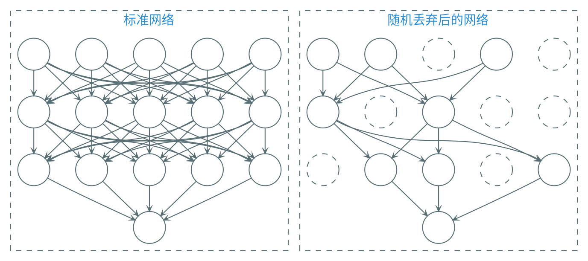

    

    

        <h6 class="bottom_left">图神经网络导论</h6>
        <h6 class="bottom_center">神经网络简介</h6>
        <h6 class="bottom_right">tengzhang@hust.edu.cn</h6>
    

<!-- slide vertical=true data-notes="" -->

    

        

        <h5 class="title">数据增强</h5>
    

    

深层神经网络需要大量的训练数据才能获得比较理想的效果

 

数据量有限的情况下，可以通过数据增强来增加数据量，避免过拟合

 

目前数据增强主要用于图像数据，文本等其它类型的数据还没有太好的方法

 

常见的增强方法：

-   旋转：将图像按顺时针或逆时针方向随机旋转一定角度
-   翻转：将图像沿水平或垂直方法随机翻转一定角度
-   缩放：将图像放大或缩小一定比例
-   平移：将图像沿水平或垂直方法平移一定步长
-   加噪声：加入随机噪声

    

    

        <h6 class="bottom_left">图神经网络导论</h6>
        <h6 class="bottom_center">神经网络简介</h6>
        <h6 class="bottom_right">tengzhang@hust.edu.cn</h6>
    

<!-- slide vertical=true data-notes="" -->

    

        

        <h5 class="title">Mixup</h5>
    

    

利用任意两个样本$(\xv_a, y_a)$、$(\xv_b, y_b)$生成新样本

    $$
        \begin{align*}
            (\beta \xv_a + (1 - \beta) \xv_b, \beta y_a + (1 - \beta) y_b)
        \end{align*}
    $$

 

假设模型已经有能力预测$y_a = f(\xv_a)$、$y_b = f(\xv_b)$，那么此时还需满足

    $$
        \begin{align*}
            f(\beta \xv_a + (1 - \beta) \xv_b) & = \beta y_a + (1 - \beta) y_b \\
            & = \beta f(\xv_a) + (1 - \beta) f(\xv_b)
        \end{align*}
    $$

 

这个函数方程的解是线性函数，即 mixup 希望学到的$f$是一个线性函数

披着数据增强外衣的正则化方法

    

    

        <h6 class="bottom_left">图神经网络导论</h6>
        <h6 class="bottom_center">神经网络简介</h6>
        <h6 class="bottom_right">tengzhang@hust.edu.cn</h6>
    

