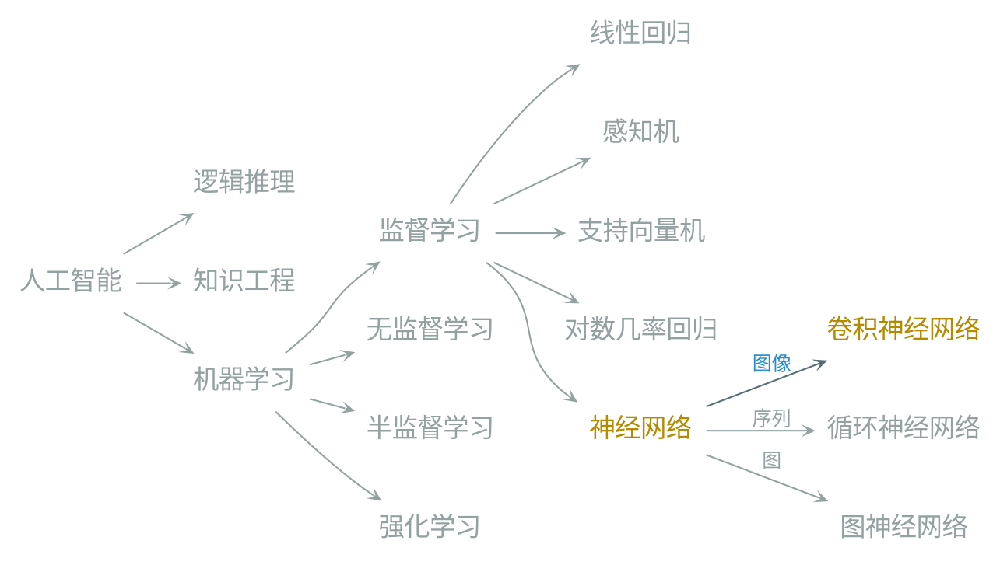
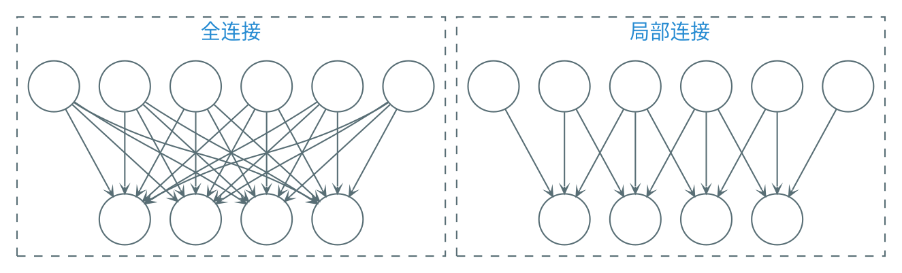
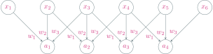
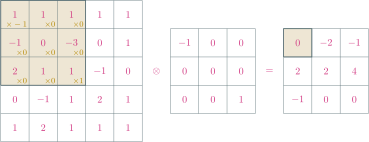
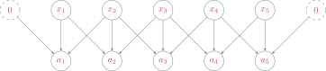
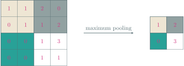
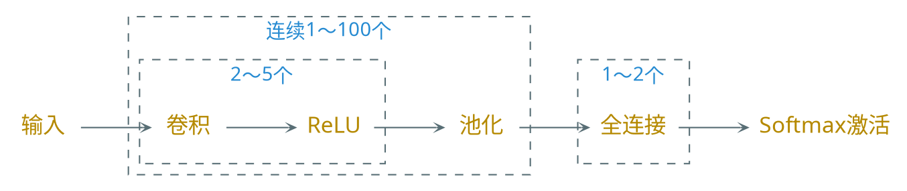
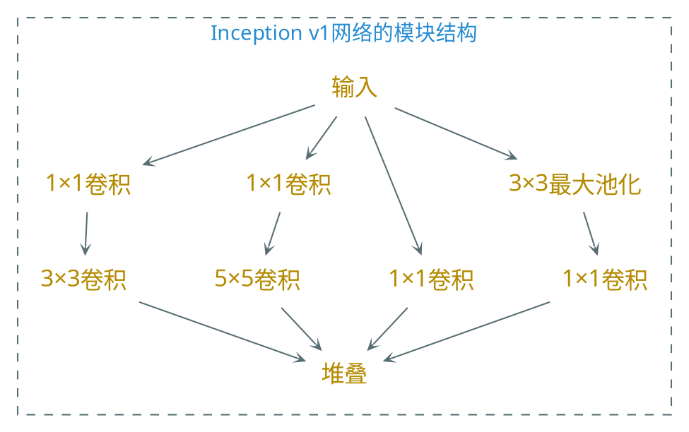
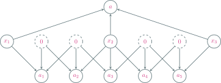
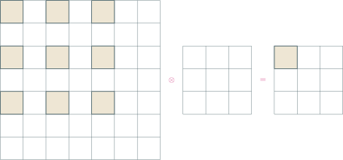

---
presentation:
    transition: "none"
    enableSpeakerNotes: true
    margin: 0
---

@import "../common/css/zhangt-style.css"
@import "../common/css/font-awesome-4.7.0/css/font-awesome.css"

<!-- slide data-notes="" -->

    
    

    <h1 style="width: 50%">
        图神经网络导论  
        卷积神经网络
    </h1>
    <h2>张腾</h2>
    <h3>tengzhang@hust.edu.cn</h3>

<!-- slide vertical=true data-notes="" -->

    
 
        

        <h5 class="title">纲</h5>
    

    

    

    

        <h6 class="bottom_left">图神经网络导论</h6>
        <h6 class="bottom_center">卷积神经网络</h6>
        <h6 class="bottom_right">tengzhang@hust.edu.cn</h6>
    

<!-- slide data-notes="" -->

    
 
        

        <h5 class="title">卷积神经网络</h5>
    

    

初衷：

-   卷积神经网络是用来处理图像信息的
-   全连接网络处理图像存在一些问题

 

特征：局部连接，权重共享，池化

    

    

        <h6 class="bottom_left">图神经网络导论</h6>
        <h6 class="bottom_center">卷积神经网络</h6>
        <h6 class="bottom_right">tengzhang@hust.edu.cn</h6>
    

<!-- slide vertical=true data-notes="" -->

    
 
        

        <h5 class="title">局部连接</h5>
    

    

动机：减少网络参数，降低模型复杂度

 

设输入图像大小为$100 \times 100$，则第一个隐藏层每个神经元都对应$10000$个权重参数，随着隐藏层神经元数量的增多，参数规模急剧增加，这会导致整个神经网络的训练效率非常低，也很容易出现过拟合

    

    

        <h6 class="bottom_left">图神经网络导论</h6>
        <h6 class="bottom_center">卷积神经网络</h6>
        <h6 class="bottom_right">tengzhang@hust.edu.cn</h6>
    

<!-- slide data-notes="" -->

    
 
        

        <h5 class="title">权重共享</h5>
    

    

进一步减少网络参数，降低模型复杂度

    $$
        \begin{align*}
            a_1 & = x_1 \times w_1 + x_2 \times w_2 + x_3 \times w_3 \\
            a_2 & = x_2 \times w_1 + x_3 \times w_2 + x_4 \times w_3 \\
            a_3 & = x_3 \times w_1 + x_4 \times w_2 + x_5 \times w_3 \\
            a_4 & = x_4 \times w_1 + x_5 \times w_2 + x_6 \times w_3
        \end{align*}
    $$

    

    

        <h6 class="bottom_left">图神经网络导论</h6>
        <h6 class="bottom_center">卷积神经网络</h6>
        <h6 class="bottom_right">tengzhang@hust.edu.cn</h6>
    

<!-- slide vertical=true data-notes="" -->

    
 
        

        <h5 class="title">一维卷积</h5>
    

    

    $$
        \begin{align*}
            (f \otimes g) [n] = \sum_{m = -\infty}^\infty f[m] \cdot g[n-m] 
        \end{align*}
    $$

取$f[i] = x_i$，$g[-2] = w_3$，$g[-1] = w_2$，$g[0] = w_1$，其余为零，则有

    $$
        \begin{align*}
            a_n = x_n w_1 + x_{n+1} w_2 + x_{n+2} w_3 = \sum_{m=n}^{n+2} f[m] \cdot g[n-m] = (f \otimes g) [n]
        \end{align*}
    $$

    

    

        <h6 class="bottom_left">图神经网络导论</h6>
        <h6 class="bottom_center">卷积神经网络</h6>
        <h6 class="bottom_right">tengzhang@hust.edu.cn</h6>
    

<!-- slide vertical=true data-notes="" -->

    
 
        

        <h5 class="title">二维卷积</h5>
    

    

针对输入是矩阵的情形

参与卷积的深色区域称为对应输出神经元的感受野(receptive field)

    

    

        <h6 class="bottom_left">图神经网络导论</h6>
        <h6 class="bottom_center">卷积神经网络</h6>
        <h6 class="bottom_right">tengzhang@hust.edu.cn</h6>
    

<!-- slide data-notes="" -->

    
 
        

        <h5 class="title">图像滤波</h5>
    

    

平滑去噪

    
    

        

            $\otimes ~ \begin{bmatrix}
                \frac{1}{9} & \frac{1}{9} & \frac{1}{9} \\ \frac{1}{9} & \frac{1}{9} & \frac{1}{9} \\ \frac{1}{9} & \frac{1}{9} & \frac{1}{9}
            \end{bmatrix} ~ =$ 
        

    

    

    

    

        <h6 class="bottom_left">图神经网络导论</h6>
        <h6 class="bottom_center">卷积神经网络</h6>
        <h6 class="bottom_right">tengzhang@hust.edu.cn</h6>
    

<!-- slide vertical=true data-notes="" -->

    
 
        

        <h5 class="title">图像卷积</h5>
    

    

边缘提取

    
    

        

            $\otimes ~ \begin{bmatrix}
                0 & 1 & 1 \\ -1 & 0 & 1 \\ -1 & -1 & 0
            \end{bmatrix} ~ = $ 
        

    

    

    

    

        <h6 class="bottom_left">图神经网络导论</h6>
        <h6 class="bottom_center">卷积神经网络</h6>
        <h6 class="bottom_right">tengzhang@hust.edu.cn</h6>
    

<!-- slide vertical=true data-notes="" -->

    
 
        

        <h5 class="title">图像卷积</h5>
    

    

边缘提取

    
    

        

            $\otimes ~ \begin{bmatrix}
                0 & 1 & 0 \\ 1 & -4 & 1 \\ 0 & 1 & 0
            \end{bmatrix} ~ = $
        

    

    

    

    

        <h6 class="bottom_left">图神经网络导论</h6>
        <h6 class="bottom_center">卷积神经网络</h6>
        <h6 class="bottom_right">tengzhang@hust.edu.cn</h6>
    

<!-- slide vertical=true data-notes="" -->

    
 
        

        <h5 class="title">Laplace算子</h5>
    

    

偏导数

    $$
        \begin{align*}
            \frac{\partial f}{\partial x} = \lim_{u \rightarrow 0} \frac{f(x+u, y) - f(x-u, y)}{2 u} \approx f(x+\frac{1}{2}, y) - f(x-\frac{1}{2}, y)
        \end{align*}
    $$

 

于是

    $$
        \begin{align*}
            \Delta & f = \div (\grad f) = \left[ \frac{\partial}{\partial x}, \frac{\partial}{\partial y} \right] \cdot \left[ \frac{\partial f}{\partial x}; \frac{\partial f}{\partial y} \right] = \frac{\partial^2 f}{\partial x^2} + \frac{\partial^2 f}{\partial y^2} \\
            & = \frac{\partial f(x+\frac{1}{2}, y)}{\partial x} - \frac{\partial f(x-\frac{1}{2}, y)}{\partial x} + \frac{\partial f(x, y+\frac{1}{2})}{\partial y} - \frac{\partial f(x, y-\frac{1}{2})}{\partial y} \\
            & = (f(x+1, y) - f(x, y)) - (f(x, y) - f(x-1, y)) \\
            & \qquad \qquad \qquad + (f(x, y+1) - f(x, y)) - (f(x, y) - f(x, y-1)) \\
            & = f(x+1, y) + f(x-1, y) + f(x, y-1) + f(x, y+1) - 4 f(x, y)
        \end{align*}
    $$

    

    

        <h6 class="bottom_left">图神经网络导论</h6>
        <h6 class="bottom_center">卷积神经网络</h6>
        <h6 class="bottom_right">tengzhang@hust.edu.cn</h6>
    

<!-- slide data-notes="" -->

    
 
        

        <h5 class="title">卷积超参数</h5>
    

    

引入参数可以更灵活地进行特征抽取

-   大小$c$：滤波器的长度
-   步长$s$：滤波器滑动的间隔
-   补零$p$：输入神经元两端各补零的个数

 

$s=2$：

若输入神经元个数为$n$，则卷积层神经元个数为$(n - c) / s + 1$

    

    

        <h6 class="bottom_left">图神经网络导论</h6>
        <h6 class="bottom_center">卷积神经网络</h6>
        <h6 class="bottom_right">tengzhang@hust.edu.cn</h6>
    

<!-- slide vertical=true data-notes="" -->

    
 
        

        <h5 class="title">卷积超参数</h5>
    

    

引入参数可以更灵活地进行特征抽取

-   大小$c$：滤波器的长度
-   步长$s$：滤波器滑动的间隔
-   补零$p$：输入神经元两端各补零的个数

 

$p=1$：

若输入神经元个数为$n$，则卷积层神经元个数为$(n - c + 2p) / s + 1$

    

    

        <h6 class="bottom_left">图神经网络导论</h6>
        <h6 class="bottom_center">卷积神经网络</h6>
        <h6 class="bottom_right">tengzhang@hust.edu.cn</h6>
    

<!-- slide vertical=true data-notes="" -->

    
 
        

        <h5 class="title">卷积超参数</h5>
    

    

引入参数可以更灵活地进行特征抽取

-   大小$c$：滤波器的长度
-   步长$s$：滤波器滑动的间隔
-   补零$p$：输入神经元两端各补零的个数

 

若输入神经元个数为$n$，则卷积层神经元个数为$(n - c + 2p) / s + 1$

 

常用的卷积有如下三类：

-   窄卷积：步长$s = 1$，两端不补零$p = 0$，卷积后输出长度为$n − c + 1$
-   宽卷积：步长$s = 1$，两端补零$p = c - 1$，卷积后输出长度为$n + c - 1$
-   等宽卷积：步长$s = 1$，两端补零$p = (c − 1) / 2$，卷积后输出长度$n$

    

    

        <h6 class="bottom_left">图神经网络导论</h6>
        <h6 class="bottom_center">卷积神经网络</h6>
        <h6 class="bottom_right">tengzhang@hust.edu.cn</h6>
    

<!-- slide data-notes="" -->

    
 
        

        <h5 class="title">参数求导</h5>
    

    

设$\Zv = \Av \otimes \Wv + b$，$\Av \in \Rbb^{U \times V}$，$\Wv \in \Rbb^{u \times v}$，$\Zv \in \Rbb^{(U-u+1) \times (V-v+1)}$

    $$
        \begin{align*}
            z_{ij} = \sum_{u,v} w_{uv} a_{i+u-1, j+v-1} + b
        \end{align*}
    $$

记$\deltav^\top = \partial \Lcal(\yv, \hat{\yv}) / \partial \Zv$为误差项，由链式法则有

    $$
        \begin{align*}
            \frac{\partial \Lcal (\yv, \hat{\yv})}{\partial b} & = \sum_{i,j} \frac{\partial \Lcal (\yv, \hat{\yv})}{\partial z_{ij}} \frac{\partial z_{ij}}{\partial b} = \sum_{i,j} [\deltav]_{ij} \\
            \frac{\partial \Lcal (\yv, \hat{\yv})}{\partial w_{uv}} & = \sum_{i,j} \frac{\partial \Lcal (\yv, \hat{\yv})}{\partial z_{ij}} \frac{\partial z_{ij}}{\partial w_{uv}} = \sum_{i,j} a_{i+u-1, j+v-1} [\deltav]_{ij} \\
            & \Longrightarrow \frac{\partial \Lcal (\yv, \hat{\yv})}{\partial \Wv} = \Av \otimes \deltav
        \end{align*}
    $$

    

    

        <h6 class="bottom_left">图神经网络导论</h6>
        <h6 class="bottom_center">卷积神经网络</h6>
        <h6 class="bottom_right">tengzhang@hust.edu.cn</h6>
    

<!-- slide vertical=true data-notes="" -->

    
 
        

        <h5 class="title">参数求导</h5>
    

    

设$\Zv = \Av \otimes \Wv + b$，$\Av \in \Rbb^{U \times V}$，$\Wv \in \Rbb^{u \times v}$，$\Zv \in \Rbb^{(U-u+1) \times (V-v+1)}$

    $$
        \begin{align*}
            z_{ij} = \sum_{u,v} w_{uv} a_{i+u-1, j+v-1} + b
        \end{align*}
    $$

记$\deltav^\top = \partial \Lcal(\yv, \hat{\yv}) / \partial \Zv$为误差项，由链式法则有

    $$
        \begin{align*}
            \frac{\partial \Lcal (\yv, \hat{\yv})}{\partial a_{st}} = \sum_{i,j} \frac{\partial \Lcal (\yv, \hat{\yv})}{\partial z_{ij}} \frac{\partial z_{ij}}{\partial a_{st}} = \sum_{i,j} w_{s-i+1,t-j+1} [\deltav]_{ij}
        \end{align*}
    $$

当$s-i+1 \not \in [u]$或者$t-j+1 \not \in [v]$时，令$w_{s-i+1,t-j+1} = 0$，相当于对$\Wv$进行了$p = (U - u, V - v)$的零填充，记$\widetilde{\otimes}$为宽卷积

    $$
        \begin{align*}
            \frac{\partial \Lcal (\yv, \hat{\yv})}{\partial \Av} = \rot(\Wv) \widetilde{\otimes} \deltav
        \end{align*}
    $$

    

    

        <h6 class="bottom_left">图神经网络导论</h6>
        <h6 class="bottom_center">卷积神经网络</h6>
        <h6 class="bottom_right">tengzhang@hust.edu.cn</h6>
    

<!-- slide data-notes="" -->

    
 
        

        <h5 class="title">池化</h5>
    

    

池化(pooling)层也叫子采样(subsampling)层

 

-   最大池化(maximum pooling)：取一个区域内所有神经元的最大值，拥有一定的平移不变性

-   平均池化(mean pooling)：取一个区域内所有神经元的平均值

 

作用：将区域下采样为一个值实现特征选择，进一步减少网络参数，降低模型复杂度

    

    

        <h6 class="bottom_left">图神经网络导论</h6>
        <h6 class="bottom_center">卷积神经网络</h6>
        <h6 class="bottom_right">tengzhang@hust.edu.cn</h6>
    

<!-- slide data-notes="" -->

    
 
        

        <h5 class="title">卷积神经网络</h5>
    

    

卷积神经网络由卷积层、池化层、全连接层交叉堆叠而成

趋势

-   更小的卷积核，比如$3 \times 3$
-   更深的结构，比如层数大于$50$
-   池化层的作用可由卷积步长代替，使用比例逐渐降低，趋向于全卷积网络

    

    

        <h6 class="bottom_left">图神经网络导论</h6>
        <h6 class="bottom_center">卷积神经网络</h6>
        <h6 class="bottom_right">tengzhang@hust.edu.cn</h6>
    

<!-- slide vertical=true data-notes="" -->

    
 
        

        <h5 class="title">反向传播</h5>
    

    

卷积神经网络也是通过误差反向传播算法进行参数学习

 

卷积神经网络的参数为卷积核和偏置

 

设第$l$层为卷积层：$\Zv_l = \Av_{l-1} \otimes \Wv_l + b_l$，$\partial \Lcal(\yv, \hat{\yv}) / \partial \Zv_l = \deltav_l^\top$为误差项

    $$
        \begin{align*}
            \frac{\partial \Lcal (\yv, \hat{\yv})}{\partial \Wv_l} & = \Av_{l-1} \otimes \deltav_l \\
            \frac{\partial \Lcal (\yv, \hat{\yv})}{\partial b_l} & = \sum_{i,j} [\deltav_l]_{ij} \\
            \frac{\partial \Lcal (\yv, \hat{\yv})}{\partial \Av_{l-1}} & = \rot(\Wv_l) \widetilde{\otimes} \deltav_l
        \end{align*}
    $$

剩下需计算$\deltav_l$

    

    

        <h6 class="bottom_left">图神经网络导论</h6>
        <h6 class="bottom_center">卷积神经网络</h6>
        <h6 class="bottom_right">tengzhang@hust.edu.cn</h6>
    

<!-- slide vertical=true data-notes="" -->

    
 
        

        <h5 class="title">反向传播</h5>
    

    

若第$l+1$层为池化层：该层的神经元是第$l$层的某个区域下采样得到的

    $$
        \begin{align*}
            \Zv_l \xrightarrow{~~激活\quad} \Av_l \xrightarrow{~~池化\quad} \Zv_{l+1}
        \end{align*}
    $$

 

反向传播时，需对第$l+1$层的误差项上采样到和第$l$层一样大

$$
    \begin{align*}
        \deltav_l = \frac{\partial \Lcal(\yv, \hat{\yv})}{\partial \Zv_l} & = \class{red}{\frac{\partial \Lcal(\yv, \hat{\yv})}{\partial \Zv_{l+1}}} \class{green}{\frac{\partial \Zv_{l+1}}{\partial \Av_l}} \class{blue}{\frac{\partial \Av_l}{\partial \Zv_l}} \\
        & = \class{green}{\up}(\class{red}{\deltav_{l+1}}) \odot \class{blue}{h'_l (\Zv_l)}
    \end{align*}
$$

-   最大池化：误差项$\deltav_{l+1}$中的每个值会直接传递到第$l$层对应区域中的最大值所对应的神经元，该区域中其它神经元的误差项的都设为$0$
-   平均池化：误差项$\deltav_{l+1}$中每个值会被平均分配到第$l$层对应区域中的所有神经元上

    

    

        <h6 class="bottom_left">图神经网络导论</h6>
        <h6 class="bottom_center">卷积神经网络</h6>
        <h6 class="bottom_right">tengzhang@hust.edu.cn</h6>
    

<!-- slide vertical=true data-notes="" -->

    
 
        

        <h5 class="title">反向传播</h5>
    

    

若第$l+1$层为卷积层：该层的神经元是第$l$层神经元经过卷积得到的

    $$
        \begin{align*}
            \Zv_l \xrightarrow{~~激活\quad} \Av_l \xrightarrow{~~卷积\quad} \Zv_{l+1}
        \end{align*}
    $$

 

反向传播

    $$
        \begin{align*}
            \deltav_l = \frac{\partial \Lcal(\yv, \hat{\yv})}{\partial \Zv_l} & = \frac{\partial \Av_l}{\partial \Zv_l} \frac{\partial \Lcal(\yv, \hat{\yv})}{\partial \Av_l} \\
            & = h'_l (\Zv_l) \odot (\rot(\Wv_{l+1}) \widetilde{\otimes} \deltav_{l+1})
        \end{align*}
    $$

其中$\widetilde{\otimes}$为宽卷积

    

    

        <h6 class="bottom_left">图神经网络导论</h6>
        <h6 class="bottom_center">卷积神经网络</h6>
        <h6 class="bottom_right">tengzhang@hust.edu.cn</h6>
    

<!-- slide data-notes="" -->

    
 
        

        <h5 class="title">典型的卷积神经网络</h5>
    

    

LeNet-5：90 年代被美国很多银行用来识别支票上面的手写数字

 

不计输入层，LeNet-5 共有$7$层：

1. 输入层，输入图像大小为$32 \times 32 = 1024$
2. 卷积层，使用$6$个$5 \times 5$的卷积核
3. 池化层，采样窗口为$2 \times 2$，使用平均池化
4. 卷积层，共使用$60$个$5 \times 5$的卷积核
5. 池化层，采样窗口为$2 \times 2$
6. 卷积层，共使用$1920$个$5 \times 5$的卷积核
7. 全连接层
8. 输出层，由$10$个欧氏径向基函数函数组成

    

    

        <h6 class="bottom_left">图神经网络导论</h6>
        <h6 class="bottom_center">卷积神经网络</h6>
        <h6 class="bottom_right">tengzhang@hust.edu.cn</h6>
    

<!-- slide vertical=true data-notes="" -->

    
 
        

        <h5 class="title">典型的卷积神经网络</h5>
    

    

AlexNet：第一个现代卷积网络模型，2012 年 ImageNet 图像分类竞赛冠军

1. 输入层，输入图像大小为$224 \times 224 \times 3$
2. 卷积层，使用两个$11 \times 11 \times 3 \times 48$的卷积核，步长$s=4$，零填充$p=3$
3. 池化层，采样窗口为$3 \times 3$，使用最大池化，步长$s=2$
4. 卷积层，共使用两个$5 \times 5 \times 48 \times 128$的卷积核，步长$s=1$，零填充$p=2$
5. 池化层，采样窗口为$3 \times 3$，使用最大池化，步长$s=2$
6. 卷积层，使用一个$3 \times 3 \times 256 \times 384$的卷积核，步长$s=1$，零填充$p=1$
7. 卷积层，使用两个$3 \times 3 \times 192 \times 192$的卷积核，步长$s=1$，零填充$p=1$
8. 卷积层，使用两个$3 \times 3 \times 192 \times 128$的卷积核，步长$s=1$，零填充$p=1$
9. 池化层，采样窗口为$3 \times 3$，使用最大池化，步长$s=2$
10. 三个全连接层
11. 输出层

    

    

        <h6 class="bottom_left">图神经网络导论</h6>
        <h6 class="bottom_center">卷积神经网络</h6>
        <h6 class="bottom_right">tengzhang@hust.edu.cn</h6>
    

<!-- slide vertical=true data-notes="" -->

    
 
        

        <h5 class="title">典型的卷积神经网络</h5>
    

    

Inception 网络：一个卷积层包含多个不同大小的卷积操作

    

    

        <h6 class="bottom_left">图神经网络导论</h6>
        <h6 class="bottom_center">卷积神经网络</h6>
        <h6 class="bottom_right">tengzhang@hust.edu.cn</h6>
    

<!-- slide vertical=true data-notes="" -->

    
 
        

        <h5 class="title">典型的卷积神经网络</h5>
    

    

GoogLeNet，2014 年 ImageNet 图像分类竞赛的冠军

 

由 9 个 Inception v1 模块和 5 个池化层以及其它一些卷积层和全连接层构成，总共为 22 层网络

 

Inception 网络有多个改进版本

-   v3 网络用多层的小卷积核来替换大的卷积核，以减少计算量和参数量
-   v4 网络结合了残差网络的设计，带有直连边

    

    

        <h6 class="bottom_left">图神经网络导论</h6>
        <h6 class="bottom_center">卷积神经网络</h6>
        <h6 class="bottom_right">tengzhang@hust.edu.cn</h6>
    

<!-- slide data-notes="" -->

    
 
        

        <h5 class="title">花式卷积</h5>
    

    

(窄)卷积可视为高维特征到低维特征的降维变换

 

设一维卷积核$\wv$的大小为$c$，则$\wv: \Rbb^d \mapsto \Rbb^{d-c}$

取$c = 3$，$d = 5$

    $$
        \begin{align*}
            \begin{bmatrix}
                z_1 \\ z_2 \\ z_3
            \end{bmatrix} = \zv = \av \otimes \wv = \begin{bmatrix}
                w_1 & w_2 & w_3 & 0 & 0 \\ 0 & w_1 & w_2 & w_3 & 0 \\ 0 & 0 & w_1 & w_2 & w_3
            \end{bmatrix} \begin{bmatrix}
                a_1 \\ a_2 \\ a_3 \\ a_4 \\ a_5
            \end{bmatrix} = \Wv \av
        \end{align*}
    $$

如果想升维怎么办？

-   转置
-   微步

    

    

        <h6 class="bottom_left">图神经网络导论</h6>
        <h6 class="bottom_center">卷积神经网络</h6>
        <h6 class="bottom_right">tengzhang@hust.edu.cn</h6>
    

<!-- slide vertical=true data-notes="" -->

    
 
        

        <h5 class="title">转置卷积</h5>
    

    

    $$
        \begin{align*}
            \begin{bmatrix}
                a_1 \\ a_2 \\ a_3 \\ a_4 \\ a_5
            \end{bmatrix} = \av = \Wv^\top \zv
            & = \begin{bmatrix}
                w_1 & 0 & 0 \\ w_2 & w_1 & 0 \\ w_3 & w_2 & w_1 \\ 0 & w_3 & w_2 \\ 0 & 0 & w_3
            \end{bmatrix} \begin{bmatrix}
                z_1 \\ z_2 \\ z_3
            \end{bmatrix} \\
            & = \begin{bmatrix}
                w_3 & w_2 & w_1 & 0 & 0 & 0 & 0 \\ 0 & w_3 & w_2 & w_1 & 0 & 0 & 0 \\ 0 & 0 & w_3 & w_2 & w_1 & 0 & 0 \\ 0 & 0 & 0 & w_3 & w_2 & w_1 & 0 \\ 0 & 0 & 0 & 0 & w_3 & w_2 & w_1
            \end{bmatrix} \begin{bmatrix}
                0 \\ 0 \\ z_1 \\ z_2 \\ z_3 \\ 0 \\ 0
            \end{bmatrix} \\
            & = \zv \widetilde{\otimes} \rot(\wv)
        \end{align*}
    $$

    

    

        <h6 class="bottom_left">图神经网络导论</h6>
        <h6 class="bottom_center">卷积神经网络</h6>
        <h6 class="bottom_right">tengzhang@hust.edu.cn</h6>
    

<!-- slide vertical=true data-notes="" -->

    
 
        

        <h5 class="title">微步卷积</h5>
    

    

令卷积核的步长$s < 1$也可以实现升维

 

实现：在输入特征之间插入$0$间接使得步长变小

    

    

        <h6 class="bottom_left">图神经网络导论</h6>
        <h6 class="bottom_center">卷积神经网络</h6>
        <h6 class="bottom_right">tengzhang@hust.edu.cn</h6>
    

<!-- slide vertical=true data-notes="" -->

    
 
        

        <h5 class="title">空洞卷积</h5>
    

    

对于一个卷积层，如果想增加输出单元的感受野

-   增加卷积核的大小，增加参数数量
-   增加层数，增加参数数量
-   在卷积之前进行池化操作，丢失信息

 

给卷积核插入“空洞”变相地增加其大小，也称为膨胀卷积

    

    

        <h6 class="bottom_left">图神经网络导论</h6>
        <h6 class="bottom_center">卷积神经网络</h6>
        <h6 class="bottom_right">tengzhang@hust.edu.cn</h6>
    

