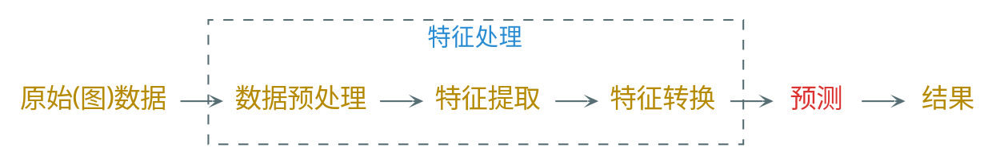
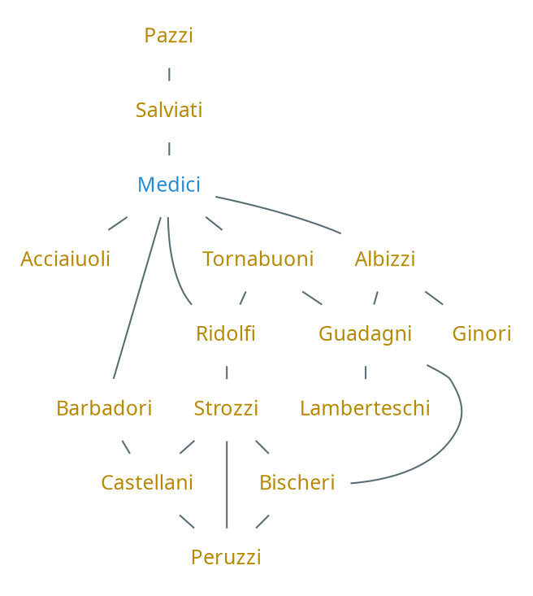
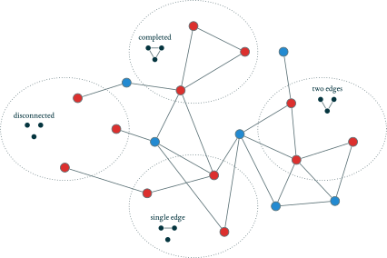
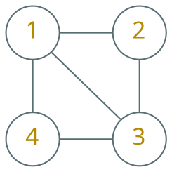

---
presentation:
    transition: "none"
    enableSpeakerNotes: true
    margin: 0
---

@import "../common/css/zhangt-style.css"
@import "../common/css/font-awesome-4.7.0/css/font-awesome.css"

<!-- slide data-notes="" -->

    
    

    <h1 style="width: 50%">
        图神经网络导论  
        图机器学习
    </h1>
    <h2>张腾</h2>
    <h3>tengzhang@hust.edu.cn</h3>

<!-- slide data-notes="" -->

    
 
        

        <h5 class="title">图</h5>
    

    

图是一种常见的数据结构，由一组点集和一组边集构成

-   相比于单纯的点集，图中的边可以描述物体间的复杂关系

 

图是一种描述复杂系统的通用语言

-   社交网络
-   论文引用
-   交通路网
-   知识图谱
-   通信网络
-   分子结构

    

    

        <h6 class="bottom_left">图神经网络导论</h6>
        <h6 class="bottom_center">图机器学习</h6>
        <h6 class="bottom_right">tengzhang@hust.edu.cn</h6>
    

<!-- slide vertical=true data-notes="" -->

    
 
        

        <h5 class="title">符号表示</h5>
    

    

给定点集$\Vcal$和这些点间的边集$\Ecal$就构成了图$\Gcal = (\Vcal, \Ecal)$

 

对于点$u, v \in \Vcal$

-   若其存在连边(关系)，则记$(u,v) \in \Ecal$
-   若边没有方向，则$(u,v) \in \Ecal \Longleftrightarrow (v,u) \in \Ecal$

 

邻接矩阵$\Av \in \Rbb^{|\Vcal| \times |\Vcal|}$

-   若边没有权重，$[\Av]_{uv} = 1_{(u,v) \in \Ecal}$；若边上有权重，$[\Av]_{uv}$就等于$(u,v)$的权重
-   若边没有方向，则$\Av$是对称矩阵

    

    

        <h6 class="bottom_left">图神经网络导论</h6>
        <h6 class="bottom_center">图机器学习</h6>
        <h6 class="bottom_right">tengzhang@hust.edu.cn</h6>
    

<!-- slide vertical=true data-notes="" -->

    
 
        

        <h5 class="title">多重关系图</h5>
    

    

关系分种类，引入关系集合$\Rcal$

-   边的表示：$(u, \tau, v) \in \Ecal$，点$u$、$v$间有关系$\tau$
-   邻接张量$\Av \in \Rbb^{|\Vcal| \times |\Rcal| \times |\Vcal|}$

 

异质图：点也分种类，即点集$\Vcal$可以划分成$k$个子集$\Vcal = \Vcal_1 \cup \Vcal_2 \cup \cdots \cup \Vcal_k$

-   三类点：蛋白质、药物、疾病，前两类点间：有药效，后两类点间：治愈
-   多部图(multipartite graphs)是异质图的经典例子

 

多重图：图分多层，每层同点异边，同一层的边表示同一种关系

-   点代表城市，层代表某种交通方式，如汽车、高铁、飞机、轮船等
-   不同层的同一个点也可以连边，表示可以从一种交通方式切换到另一种交通方式

    

    

        <h6 class="bottom_left">图神经网络导论</h6>
        <h6 class="bottom_center">图机器学习</h6>
        <h6 class="bottom_right">tengzhang@hust.edu.cn</h6>
    

<!-- slide vertical=true data-notes="" -->

    
 
        

        <h5 class="title">属性信息</h5>
    

    

点可以有特征信息

-   社交网络中点的特征是每个用户的个人信息
-   交通路网中点的特征是每个路口的流量信息

 

边除了可以有离散的种类，也可以有特征

 

甚至整图也可以有

    

    

        <h6 class="bottom_left">图神经网络导论</h6>
        <h6 class="bottom_center">图机器学习</h6>
        <h6 class="bottom_right">tengzhang@hust.edu.cn</h6>
    

<!-- slide vertical=true data-notes="" -->

    
 
        

        <h5 class="title">图 vs. 网络</h5>
    

    

两者大多数时候是一个意思，更多的区别在于文化圈子

-   图多用于机器学习圈子
-   网络多用于数据挖掘、网络分析等下游圈子

 

在本课程中

-   用图表示抽象的数据结构
-   用网络表示具体的现实数据，例如社交网络

    

    

        <h6 class="bottom_left">图神经网络导论</h6>
        <h6 class="bottom_center">图机器学习</h6>
        <h6 class="bottom_right">tengzhang@hust.edu.cn</h6>
    

<!-- slide data-notes="" -->

    
 
        

        <h5 class="title">图上的学习任务</h5>
    

    

点分类

-   输入：点集的一个小子集有类别标记的图
-   目标：预测其他未标记点的类别

 

例子

-   社交网络中机器人用户检测
-   分子结构中预测节点蛋白质的功能
-   论文引用网络中的文档主题分类

 

特点

-   与传统的机器学习不同，样本不是独立同分布的
-   利用同质性，相邻点拥有比较接近的特征
-   利用结构等价性，拥有相似邻居结构的点往往有相似的类别标记

    

    

        <h6 class="bottom_left">图神经网络导论</h6>
        <h6 class="bottom_center">图机器学习</h6>
        <h6 class="bottom_right">tengzhang@hust.edu.cn</h6>
    

<!-- slide vertical=true data-notes="" -->

    
 
        

        <h5 class="title">图上的学习任务</h5>
    

    

关系预测，也叫链接预测、图补全、关系推理

-   输入：$\Vcal$，$\Ecal_{train}$
-   目标：预测$\Ecal \setminus \Ecal_{train}$

 

例子

-   社交平台上的推荐
-   生物医学中预测药效

 

任务的难度取决于图的类型

-   社交网络中只有“朋友”一种关系就很简单，比如只看这两个点有多少共同好友
-   生物医学中有几百种关系，预测就很难

    

    

        <h6 class="bottom_left">图神经网络导论</h6>
        <h6 class="bottom_center">图机器学习</h6>
        <h6 class="bottom_right">tengzhang@hust.edu.cn</h6>
    

<!-- slide vertical=true data-notes="" -->

    
 
        

        <h5 class="title">图上的学习任务</h5>
    

    

社区发现

-   点分类和边预测类似于机器学习中的监督学习
-   社区发现类似于机器学习中的无监督学习：聚类

例如用谷歌学术的信息建立一个论文合作网络，两个点有边相邻代表这两位作者合作过，对此图聚类可以发现研究兴趣相近的学术小圈子

  

整图层面的分类、回归、聚类

-   对于一段计算机程序，通过对语法树进行分类判断是否有 bug
-   通过对分子结构回归，预测分子的毒性、溶解性等
-   最接近机器学习中分类和回归的设定，每张图可以看作独立同分布的有标记点
-   聚类也同机器学习中的聚类，难点在于设计能表征结构信息的特征

    

    

        <h6 class="bottom_left">图神经网络导论</h6>
        <h6 class="bottom_center">图机器学习</h6>
        <h6 class="bottom_right">tengzhang@hust.edu.cn</h6>
    

<!-- slide data-notes="" -->

    
 
        

        <h5 class="title">图的特征</h5>
    

    

传统机器学习：

 

图的哪些统计量可用来设计特征？

-   点层面
-   图层面

    

    

        <h6 class="bottom_left">图神经网络导论</h6>
        <h6 class="bottom_center">图机器学习</h6>
        <h6 class="bottom_right">tengzhang@hust.edu.cn</h6>
    

<!-- slide vertical=true data-notes="" -->

    
 
        

        <h5 class="title">家族通婚图</h5>
    

    

哪些统计量能体现出Medici家族的崛起？

    

    

        <h6 class="bottom_left">图神经网络导论</h6>
        <h6 class="bottom_center">图机器学习</h6>
        <h6 class="bottom_right">tengzhang@hust.edu.cn</h6>
    

<!-- slide data-notes="" -->

    
 
        

        <h5 class="title">度</h5>
    

    

度(degree)：与点相连的边的数目

    $$
        \begin{align*}
            d_u = \sum_{v \in \Vcal} [\Av]_{uv}
        \end{align*}
    $$

 

度与边的关系

    $$
        \begin{align*}
            \sum_{u \in \Vcal} d_u = 2 |\Ecal|
        \end{align*}
    $$

 

对于家族通婚图

-   Medici 的度数是$5$，最大的家族
-   Guadagn 和 Strozzi 的度数是$4$
-   区分度不太明显，需要更强的特征

    

    

        <h6 class="bottom_left">图神经网络导论</h6>
        <h6 class="bottom_center">图机器学习</h6>
        <h6 class="bottom_right">tengzhang@hust.edu.cn</h6>
    

<!-- slide vertical=true data-notes="" -->

    
 
        

        <h5 class="title">中心</h5>
    

    

记邻接矩阵$\Av$的最大特征值/向量为$(\lambda_1, \vv_1)$，则点$u$的特征向量中心为$[\vv_1]_u$

    $$
        \begin{align*}
            \lambda_1 \vv_1 = \Av \vv_1 \Longrightarrow [\vv_1]_u = \frac{1}{\lambda_1} \sum_{v \in \Vcal} [\Av]_{uv} [\vv_1]_v
        \end{align*}
    $$

每个点的特征向量中心由其邻居决定：你朋友都是大牛那你肯定也牛

 

另一个视角：由Power Method(参见下一页)知

    $$
        \begin{align*}
            \lim_{t \rightarrow \infty} \Av^t \ev \class{yellow}{\propto \vv_1}
        \end{align*}
    $$

又$[\Av^t]_{uv}$表示点$u$到点$v$的长度为$t$的路径数，故特征向量中心正比于可被其他点通过无限长的路径访问的总次数

    

    

        <h6 class="bottom_left">图神经网络导论</h6>
        <h6 class="bottom_center">图机器学习</h6>
        <h6 class="bottom_right">tengzhang@hust.edu.cn</h6>
    

<!-- slide data-notes="" -->

    
 
        

        <h5 class="title">Power Method</h5>
    

    

设$\Av$为实对称矩阵，即$\Av$可对角化且特征值$\lambda_1, \ldots, \lambda_n$均为实数，设$\lambda_1$是绝对值最大的特征值且重数为$1$，即$|\lambda_1| > \{ |\lambda_i| \}_{i \neq 1}$，$\lambda_1$对应的特征向量为$\vv_1$，初始取$\xv_0$为任意向量，并依

    $$
        \begin{align*}
            \xv_k = \frac{\Av \xv_{k-1}}{\|\Av \xv_{k-1}\|}
        \end{align*}
    $$

迭代，则有$\lim_{k \rightarrow \infty} \xv_k = \vv_1$

 

证明：易知

    $$
    \begin{align*}
        \xv_k = \frac{\Av \xv_{k-1}}{\|\Av \xv_{k-1}\|} = \frac{\Av \frac{\Av \xv_{k-2}}{\|\Av \xv_{k-2}\|}}{\|\Av \frac{\Av \xv_{k-2}}{\|\Av \xv_{k-2}\|}\|} = \frac{\Av^2 \xv_{k-2}}{\|\Av^2 \xv_{k-2}\|} = \cdots = \frac{\Av^k \xv_0}{\|\Av^k \xv_0\|}
    \end{align*}
    $$

设$\xv_0 = c_1 \vv_1 + \cdots + c_n \vv_n$，则

    

    

        <h6 class="bottom_left">图神经网络导论</h6>
        <h6 class="bottom_center">图机器学习</h6>
        <h6 class="bottom_right">tengzhang@hust.edu.cn</h6>
    

<!-- slide vertical=true data-notes="" -->

    
 
        

        <h5 class="title">Power Method</h5>
    

    

    $$
    \begin{align*}
        \Av^k \xv_0 & = \Av^{k-1} \Av (c_1 \vv_1 + \cdots + c_n \vv_n) = \Av^{k-1} (c_1 \lambda_1 \vv_1 + \cdots + c_n \lambda_n \vv_n) \\
        & = \Av^{k-2} (c_1 \lambda_1^2 \vv_1 + \cdots + c_n \lambda_n^2 \vv_n) = c_1 \lambda_1^k \vv_1 + \cdots + c_n \lambda_n^k \vv_n
    \end{align*}
    $$

从而

    $$
        \begin{align*}
            \xv_k & = \frac{\Av^k \xv_0}{\|\Av^k \xv_0\|} = \frac{c_1 \lambda_1^k \vv_1 + \cdots + c_n \lambda_n^k \vv_n}{\|c_1 \lambda_1^k \vv_1 + \cdots + c_n \lambda_n^k \vv_n\|} \\
            & = \frac{c_1}{|c_1|} \left( \frac{\lambda_1}{|\lambda_1|} \right)^k \frac{\vv_1 + \frac{c_2}{c_1} (\frac{\lambda_2}{\lambda_1})^k \vv_2 + \cdots + \frac{c_n}{c_1} (\frac{\lambda_n}{\lambda_1})^k \vv_n}{\| \vv_1 + \frac{c_2}{c_1} (\frac{\lambda_2}{\lambda_1})^k \vv_2 + \cdots + \frac{c_n}{c_1} (\frac{\lambda_n}{\lambda_1})^k \vv_n \|} \\
            & = \sign(c_1)~(\sign(\lambda_1))^k~\frac{\vv_1 + \frac{c_2}{c_1} (\frac{\lambda_2}{\lambda_1})^k \vv_2 + \cdots + \frac{c_n}{c_1} (\frac{\lambda_n}{\lambda_1})^k \vv_n}{\| \vv_1 + \frac{c_2}{c_1} (\frac{\lambda_2}{\lambda_1})^k \vv_2 + \cdots + \frac{c_n}{c_1} (\frac{\lambda_n}{\lambda_1})^k \vv_n \|} \\
            & \rightarrow \sign(c_1)~(\sign(\lambda_1))^k \vv_1, \qquad \lim_{k \rightarrow \infty} \left( \frac{\lambda_i}{\lambda_1} \right)^k = 0
        \end{align*}
    $$

    

    

        <h6 class="bottom_left">图神经网络导论</h6>
        <h6 class="bottom_center">图机器学习</h6>
        <h6 class="bottom_right">tengzhang@hust.edu.cn</h6>
    

<!-- slide vertical=true data-notes="" -->

    
 
        

        <h5 class="title">Power Method</h5>
    

    

已证 $\xv_k \rightarrow \sign(c_1)~(\sign(\lambda_1))^k \vv_1$，分两种情况：

1. $\lambda_1 > 0$，则$\sign(\lambda_1) = 1$，$\xv_{k-1} \approx \sign(c_1) \vv_1$，$\xv_k \approx \sign(c_1) \vv_1$，于是

    $$
        \begin{align*}
            \sign(c_1) \vv_1 \approx \xv_k & = \frac{\Av \xv_{k-1}}{\|\Av \xv_{k-1}\|} \approx \frac{\Av \sign(c_1) \vv_1}{\|\Av \xv_{k-1}\|} = \frac{\sign(c_1) \lambda_1 \vv_1}{\|\Av \xv_{k-1}\|} \\
            & \Rightarrow \lambda_1 \approx \|\Av \xv_{k-1}\|
        \end{align*}
    $$

2. $\lambda_1 < 0$，$\xv_k$交替趋向$\pm \sign(c_1) \vv_1$，不妨设$\xv_{k-1} \approx \sign(c_1) \vv_1$，$\xv_k \approx -\sign(c_1) \vv_1$

    $$
        \begin{align*}
            -\sign(c_1) \vv_1 \approx \xv_k & = \frac{\Av \xv_{k-1}}{\|\Av \xv_{k-1}\|} \approx \frac{\Av \sign(c_1) \vv_1}{\|\Av \xv_{k-1}\|} = \frac{\sign(c_1) \lambda_1 \vv_1}{\|\Av \xv_{k-1}\|} \\
            & \Rightarrow \lambda_1 \approx -\|\Av \xv_{k-1}\|
        \end{align*}
    $$

-   Power Method 的条件中$\Av$对称不是必需的，虽然非对称矩阵不一定能对角化，但通过转换成 Jordan 标准型的形式依然可以证明前面的结论
-   对于有向图，邻接矩阵$\Av$非对称，但依然可以使用 Power Method

    

    

        <h6 class="bottom_left">图神经网络导论</h6>
        <h6 class="bottom_center">图机器学习</h6>
        <h6 class="bottom_right">tengzhang@hust.edu.cn</h6>
    

<!-- slide data-notes="" -->

    
 
        

        <h5 class="title">中心</h5>
    

    

对于家族通婚图，Medici 的特征向量中心值为$0.43$，第二大的为$0.36$

 

除了特征向量中心外还有

-   介(betweeness)中心：一个点在其它两个最短路径上的频率
-   闭(closeness)中心：一个点到其它点的平均最短路径

    

    

        <h6 class="bottom_left">图神经网络导论</h6>
        <h6 class="bottom_center">图机器学习</h6>
        <h6 class="bottom_right">tengzhang@hust.edu.cn</h6>
    

<!-- slide vertical=true data-notes="" -->

    
 
        

        <h5 class="title">聚类系数</h5>
    

    

度和中心能区分出最强的 Medici 家族，但对于 Peruzzi 家族和 Guadagn 家族区分度不强：

-   度分别是$3$、$4$
-   特征向量中心分别是$0.28$、$0.29$

 

聚类系数(clustering coefficient)：邻居间的紧密程度

    $$
        \begin{align*}
            c_u = \frac{|(v_1, v_2) \in \Ecal : v_1, v_2 \in \Ncal(u)|}{d_u (d_u - 1) / 2}
        \end{align*}
    $$

分子是$u$的所有邻居间的边数，聚类系数为$1$代表所有邻居都互为邻居

 

对于家族通婚图

-   Peruzzi 的聚类系数是$0.66$
-   Guadagn 的聚类系数是$0$

    

    

        <h6 class="bottom_left">图神经网络导论</h6>
        <h6 class="bottom_center">图机器学习</h6>
        <h6 class="bottom_right">tengzhang@hust.edu.cn</h6>
    

<!-- slide vertical=true data-notes="" -->

    
 
        

        <h5 class="title">自我图</h5>
    

    

自我图(ego graph)是一个点的邻域子图

-   包含该点及其所有邻居
-   包含上述所有点的内部连边

 

聚类系数 = 自我图中的三角形的个数 / 三角形的最大可能数

 

推广：考虑更复杂的图形结构，比如四边形

    

    

        <h6 class="bottom_left">图神经网络导论</h6>
        <h6 class="bottom_center">图机器学习</h6>
        <h6 class="bottom_right">tengzhang@hust.edu.cn</h6>
    

<!-- slide data-notes="" -->

    
 
        

        <h5 class="title">图的统计量</h5>
    

    

点层面的统计量可应用于点层面的任务

-   度
-   中心
-   聚类系数
-   自我图导出的广义聚类系数

 

类似的，图层面的统计量可应用于图层面的任务

-   隐式：图核(graph kernel)
-   显式：汇集点层面的统计量，计算子结构出现的次数

    

    

        <h6 class="bottom_left">图神经网络导论</h6>
        <h6 class="bottom_center">图机器学习</h6>
        <h6 class="bottom_right">tengzhang@hust.edu.cn</h6>
    

<!-- slide vertical=true data-notes="" -->

    
 
        

        <h5 class="title">图核</h5>
    

    

给定两个图$\Gcal_1 = (\Vcal_1, \Ecal_1)$和$\Gcal_2 = (\Vcal_2, \Ecal_2)$和图分解方式$\Fcal$

    $$
        \begin{align*}
            & \Fcal (\Gcal_1) = \{ \Scal_{1,1}, \ldots, \Scal_{1,m_1} \}, \quad \Fcal (\Gcal_2) = \{ \Scal_{2,1}, \ldots, \Scal_{2,m_2} \} \\
            & \kappa (\Gcal_1, \Gcal_2) = \sum_{i \in [m_1]} \sum_{j \in [m_2]} \delta (\Scal_{1,i}, \Scal_{2,j})
        \end{align*}
    $$

其中$\delta (\cdot, \cdot)$可以为在两个输入同构时为$1$，不同构时为$0$

 

    $$
        \begin{align*}
            \mbox{SVM:} \quad \min_{\alpha_i,\alpha_j} & ~ \frac{1}{2} \sum_{i,j \in [m]} \alpha_i \alpha_j y_i y_j \class{yellow}{\kappa(\xv_i, \xv_j)} - \sum_{i \in [m]} \alpha_i \quad \st ~ 0 \leq \alpha_i \leq C \\
            & \qquad \qquad \qquad \qquad \Downarrow \\
            \min_{\alpha_i,\alpha_j} & ~ \frac{1}{2} \sum_{i,j \in [m]} \alpha_i \alpha_j y_i y_j \class{yellow}{\kappa (\Gcal_1, \Gcal_2)} - \sum_{i \in [m]} \alpha_i \quad \st ~ 0 \leq \alpha_i \leq C
        \end{align*}
    $$

    

    

        <h6 class="bottom_left">图神经网络导论</h6>
        <h6 class="bottom_center">图机器学习</h6>
        <h6 class="bottom_right">tengzhang@hust.edu.cn</h6>
    

<!-- slide vertical=true data-notes="" -->

    
 
        

        <h5 class="title">汇集</h5>
    

    

汇集点层面的统计量可能丢失图的全局信息

 

改进方案：Weisfeiler-Lehman 算法

1. 赋予所有点初始标记$l^{(0)} (v) = d_v$
2. 通过哈希函数不断更新标记$l^{(i)} (v) = h(\{ l^{(i-1)} (u), ~ \forall u \in \Ncal(v)  \})$
3. 重复上一步$K$次后得到$l^{(K)} (v)$，该值编码了每个点的$K$阶邻居的结构信息
4. 根据所有的$l^{(K)} (v)$计算图的全局统计量

 

Weisfeiler-Lehman 算法有很深的理论背景，可以解决一大类的图同构问题

    

    

        <h6 class="bottom_left">图神经网络导论</h6>
        <h6 class="bottom_center">图机器学习</h6>
        <h6 class="bottom_right">tengzhang@hust.edu.cn</h6>
    

<!-- slide vertical=true data-notes="" -->

    
 
        

        <h5 class="title">子结构</h5>
    

    

统计子结构出现的次数，常见的子结构：

-   路径(path)
-   小图(graphlet)

 

对于路径，可以考虑任两点间的

-   不同长度的路径数
-   最短长度路径

 

通过路径或者随机游走来计算图的全局信息，可以避免组合爆炸的问题

    

    

        <h6 class="bottom_left">图神经网络导论</h6>
        <h6 class="bottom_center">图机器学习</h6>
        <h6 class="bottom_right">tengzhang@hust.edu.cn</h6>
    

<!-- slide vertical=true data-notes="" -->

    
 
        

        <h5 class="title">小图</h5>
    

    

    

    

        <h6 class="bottom_left">图神经网络导论</h6>
        <h6 class="bottom_center">图机器学习</h6>
        <h6 class="bottom_right">tengzhang@hust.edu.cn</h6>
    

<!-- slide data-notes="注意这里没有机器学习" -->

    
 
        

        <h5 class="title">局部重合度量</h5>
    

    

之前总结的图上的统计量适用于点、图层面的任务

 

边层面的任务，如预测两点间是否有边，则共同邻居的信息更为重要

    $$
        \begin{align*}
            [\Sv]_{uv} & = |\Ncal(u) \cap \Ncal(v)|
        \end{align*}
    $$

 

归一化：否则会偏向预测度数高的点

    $$
        \begin{align*}
            [\Sv_{\text{Sorenson}}]_{uv} & = \frac{2|\Ncal(u) \cap \Ncal(v)|}{d_u + d_v} \\
            [\Sv_{\text{Salton}}]_{uv} & = \frac{2|\Ncal(u) \cap \Ncal(v)|}{\sqrt{d_u d_v}} \\
            [\Sv_{\text{Jaccard}}]_{uv} & = \frac{|\Ncal(u) \cap \Ncal(v)|}{|\Ncal(u) \cup \Ncal(v)|}
        \end{align*}
    $$

    

    

        <h6 class="bottom_left">图神经网络导论</h6>
        <h6 class="bottom_center">图机器学习</h6>
        <h6 class="bottom_right">tengzhang@hust.edu.cn</h6>
    

<!-- slide vertical=true data-notes="" -->

    
 
        

        <h5 class="title">局部重合度量</h5>
    

    

将共同邻居的重要性也考虑进来

 

度数越低的共同邻居越有价值

 

资源定位(Resource Allocation)指数

    $$
        \begin{align*}
            [\Sv_{\text{RA}}]_{uv} & = \sum_{u \in \Ncal(v_1) \cap \Ncal(v_2)} \frac{1}{d_u}
        \end{align*}
    $$

 

AA(Adamic-Adar)指数

    $$
        \begin{align*}
            [\Sv_{\text{AA}}]_{uv} & = \sum_{u \in \Ncal(v_1) \cap \Ncal(v_2)} \frac{1}{\log(d_u)}
        \end{align*}
    $$

    

    

        <h6 class="bottom_left">图神经网络导论</h6>
        <h6 class="bottom_center">图机器学习</h6>
        <h6 class="bottom_right">tengzhang@hust.edu.cn</h6>
    

<!-- slide data-notes="" -->

    
 
        

        <h5 class="title">全局重合度量</h5>
    

    

对于链接预测任务来说

-   局部重合度量就已经很强了，往往不逊于精心设计的深度学习算法
-   但一旦两个点没有共同邻居就歇菜了，肯定预测不出来

 

改进方案：考虑两个点之间的路径

 

Katz 指数

    $$
        \begin{align*}
            [\Sv_{\text{Katz}}]_{uv} & = \sum_{i=1}^\infty \beta^i [\Av^i]_{uv}
        \end{align*}
    $$

其中参数$\beta < 1$用来适当降低长路径的权重

 

问题：如何计算？

    

    

        <h6 class="bottom_left">图神经网络导论</h6>
        <h6 class="bottom_center">图机器学习</h6>
        <h6 class="bottom_right">tengzhang@hust.edu.cn</h6>
    

<!-- slide vertical=true data-notes="" -->

    
 
        

        <h5 class="title">Katz指数</h5>
    

    

当$|q| < 1$时

    $$
        \begin{align*}
            \frac{1}{1-q} = 1 + q + q^2 + \cdots = \sum_{i=0}^\infty q^i
        \end{align*}
    $$

类似的，若$\lambda_1 (\Av) < 1$，则

    $$
        \begin{align*}
            (\Iv - \Av)^{-1} = \Iv + \Av + \Av^2 + \cdots = \sum_{i=0}^\infty \Av^i
        \end{align*}
    $$

于是

    $$
        \begin{align*}
            \Sv_{\text{Katz}} = \sum_{i=1}^\infty \beta^i \Av^i = \sum_{i=0}^\infty (\beta \Av)^i - \Iv = (\Iv - \beta \Av)^{-1} - \Iv
        \end{align*}
    $$

    

    

        <h6 class="bottom_left">图神经网络导论</h6>
        <h6 class="bottom_center">图机器学习</h6>
        <h6 class="bottom_right">tengzhang@hust.edu.cn</h6>
    

<!-- slide vertical=true data-notes="" -->

    
 
        

        <h5 class="title">LNH指数</h5>
    

    

Katz 指数会偏向于度数较高的点

归一化：$\Av^i / \Ebb [\Av^i]$，其中$\Ebb [\cdot]$对拥有相同点、相同度数的随机图求期望

从点$u$出发的边，以$d_v / \sum_i d_i$的概率连接点$v$

    $$
        \begin{align*}
            \Ebb [[\Av]_{uv}] & = d_u \frac{d_v}{\sum_i d_i} = \frac{d_u d_v}{2 |\Ecal|} \\
            \Ebb [[\Av]_{uv}^2] & = \sum_{w \in \Vcal} \frac{d_u d_w}{2 |\Ecal|} \frac{(d_w - 1) d_v}{2 |\Ecal|} = \frac{d_u d_v}{(2 |\Ecal|)^2} \sum_{w \in \Vcal} d_w (d_w - 1)
        \end{align*}
    $$

但$i > 2$时就不能如法炮制了，借由 Power Method 的结论对充分大的$i$有

    $$
        \begin{align*}
            \lambda_1 \pv_i = \Av \pv_i = \Av \Av^i \ev = \pv_{i+1}
        \end{align*}
    $$

其中$p_i = \Av^i \ev$表示每个点可被其他点通过长度为$i$的路径访问的总次数

    

    

        <h6 class="bottom_left">图神经网络导论</h6>
        <h6 class="bottom_center">图机器学习</h6>
        <h6 class="bottom_right">tengzhang@hust.edu.cn</h6>
    

<!-- slide vertical=true data-notes="" -->

    
 
        

        <h5 class="title">LNH指数</h5>
    

    

对充分大的$i$有$\lambda_1 \pv_i = \pv_{i+1}$：路径长度加$1$，路径数乘以$\lambda_1$

    $$
        \begin{align*}
            \Ebb [[\Av]^i_{uv}] = \frac{d_u d_v \lambda_1^{i-1}}{2 |\Ecal|}
        \end{align*}
    $$

 

LNH 指数

    $$
        \begin{align*}
            [\Sv_{\text{LNH}}]_{uv} & = [\Iv]_{uv} + \sum_{i=1}^\infty \frac{\Av^i}{\Ebb [\Av^i]} = [\Iv]_{uv} + \frac{2 |\Ecal| \lambda_1}{d_u d_v} \sum_{i=1}^\infty \beta^i \lambda_1^{-i} [\Av^i]_{uv} \\
            & = \left( 1 - \frac{2 |\Ecal| \lambda_1}{d_u d_v} \right) [\Iv]_{uv} + \frac{2 |\Ecal| \lambda_1}{d_u d_v} \sum_{i=0}^\infty \beta^i \lambda_1^{-i} [\Av^i]_{uv}
        \end{align*}
    $$

第一项是对角阵，不体现两个点之间的关系，可以省略

    $$
        \begin{align*}
            \Sv_{\text{LNH}} = 2 |\Ecal| \lambda_1 \Dv^{-1} ( \Iv - \beta \Av / \lambda_1 )^{-1} \Dv^{-1}, \quad \Dv = \diag \{ d_1, \ldots, d_{|\Vcal|} \}
        \end{align*}
    $$

    

    

        <h6 class="bottom_left">图神经网络导论</h6>
        <h6 class="bottom_center">图机器学习</h6>
        <h6 class="bottom_right">tengzhang@hust.edu.cn</h6>
    

<!-- slide data-notes="" -->

    
 
        

        <h5 class="title">随机游走</h5>
    

    

利用随机游走生成的 Markov 链的平稳状态设计相似度

 

定义状态转移矩阵

    $$
        \begin{align*}
            \Pv = \Av \Dv^{-1} = \begin{bmatrix}
                0                               & 1_{(2,1) \in \Ecal} / d_2               & \cdots & 1_{(|\Vcal|,1) \in \Ecal} / d_{|\Vcal|} \\
                1_{(1,2) \in \Ecal} / d_1       & 0                                       & \cdots & 1_{(|\Vcal|,2) \in \Ecal} / d_{|\Vcal|} \\
                \vdots                          & \vdots                                  & \ddots & \vdots                          \\
                1_{(1,|\Vcal|) \in \Ecal} / d_1 & 1_{(2,|\Vcal|) \in \Ecal} / d_2 & \cdots & 0
            \end{bmatrix}
        \end{align*}
    $$

即对于任意点，以均等的概率游走到某一邻居

 

-   $\Pv$列和为$1$，称为列随机矩阵
-   $\ev^\top \Pv = \ev^\top$，即$1$是其特征值，对应的左特征向量是$\ev^\top$

    

    

        <h6 class="bottom_left">图神经网络导论</h6>
        <h6 class="bottom_center">图机器学习</h6>
        <h6 class="bottom_right">tengzhang@hust.edu.cn</h6>
    

<!-- slide vertical=true data-notes="" -->

    
 
        

        <h5 class="title">随机游走</h5>
    

    

若$\Pv$存在特征值$\lambda \geq 1$且$\vv^\top \Pv = \lambda \vv^\top$，设$[\vv]_j = \max_i [\vv]_i$，则

    $$
        \begin{align*}
            [\vv]_j \leq \lambda [\vv]_j = \sum_i [\vv]_i [\Pv]_{ij} \leq \sum_i [\vv]_j [\Pv]_{ij} = [\vv]_j \sum_i [\Pv]_{ij} = [\vv]_j
        \end{align*}
    $$

即若$\lambda \geq 1$，必然有$\lambda = 1$且$\vv$的所有元素相等，故$1$是唯一的最大特征值

 

取$\qv_0$为任意初始概率分布，序列$\{ \qv_i \}_{i=1}^\infty$构成 Markov 链，设$\qv$是其平稳状态，由细致平稳条件$[\Pv]_{ji} [\qv]_i = [\Pv]_{ij} [\qv]_j$知

    $$
        \begin{align*}
            [\qv]_i = [\qv]_i \overbrace{\sum_j [\Pv]_{ji}}^{=1} = \overbrace{\sum_j [\Pv]_{ji} [\qv]_i = \sum_j [\Pv]_{ij} [\qv]_j}^{\text{detailed balance condition}}
        \end{align*}
    $$

写成矩阵的形式$\qv = \Pv \qv$，即平稳状态就是最大特征值$1$对应的特征向量

    

    

        <h6 class="bottom_left">图神经网络导论</h6>
        <h6 class="bottom_center">图机器学习</h6>
        <h6 class="bottom_right">tengzhang@hust.edu.cn</h6>
    

<!-- slide vertical=true data-notes="" -->

    
 
        

        <h5 class="title">随机游走</h5>
    

    

$$
    \begin{align*}
        & \Av = \begin{bmatrix} 
            0 & 1 & 1 & 1 \\
            1 & 0 & 1 & 0 \\
            1 & 1 & 0 & 1 \\
            1 & 0 & 1 & 0 \\
        \end{bmatrix}, ~ \Dv = \begin{bmatrix} 
            3 \\
            & 2 \\
            & & 3 \\
            & & & 2 \\
        \end{bmatrix}
        \\
        & \begin{bmatrix} 
            0.3 \\ 0.2 \\ 0.3 \\ 0.2 \\
        \end{bmatrix} = \begin{bmatrix} 
            0 & 1/2 & 1/3 & 1/2 \\
            1/3 & 0 & 1/3 & 0 \\
            1/3 & 1/2 & 0 & 1/2 \\
            1/3 & 0 & 1/3 & 0 \\
        \end{bmatrix} \begin{bmatrix} 
            0.3 \\ 0.2 \\ 0.3 \\ 0.2 \\
        \end{bmatrix}
    \end{align*}
$$

从点$u$开始随机游走，每轮以$1-c$的概率重启：$\qv_u = c \Pv \qv_u + (1 - c) \ev_u$

随机游走相似度：$[\Sv_{\text{RW}}]_{uv} = [\qv_u]_v + [\qv_v]_u$，即对于一对点，通过随机游走从一个点到另一个点的概率和

    

    

        <h6 class="bottom_left">图神经网络导论</h6>
        <h6 class="bottom_center">图机器学习</h6>
        <h6 class="bottom_right">tengzhang@hust.edu.cn</h6>
    

