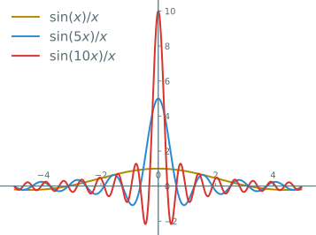

---
presentation:
    transition: "none"
    enableSpeakerNotes: true
    margin: 0
---

@import "../common/css/zhangt-style.css"
@import "../common/css/font-awesome-4.7.0/css/font-awesome.css"

<!-- slide data-notes="" -->

    
    

    <h1 style="width: 50%">
        图神经网络导论  
        图神经网络进阶
    </h1>
    <h2>张腾</h2>
    <h3>tengzhang@hust.edu.cn</h3>

<!-- slide data-notes="" -->

    
 
        

        <h5 class="title">核心问题</h5>
    

    

    如何将卷积的概念推广到图数据？

    

    

        <h6 class="bottom_left">图神经网络导论</h6>
        <h6 class="bottom_center">图神经网络进阶</h6>
        <h6 class="bottom_right">tengzhang@hust.edu.cn</h6>
    

<!-- slide vertical=true data-notes="" -->

    
 
        

        <h5 class="title">Fourier变换</h5>
    

    

函数$f$的 Fourier 变换为

    $$
        \begin{align*}
            \Ffrak[f] = \fhat(w) = \int_{\Rbb} f(x) e^{-i w x} \diff x
        \end{align*}
    $$

于是

    $$
        \begin{align*}
            & \lim_{N \rightarrow \infty} \int_{-N}^N \fhat(w) e^{i w y} \diff w = \lim_{N \rightarrow \infty} \int_{-N}^N \left[ \int_{\Rbb} f(x) e^{-i w x} \diff x \right]e^{i w y} \diff w \\
            & = \int_{\Rbb} f(x) \left[ \lim_{N \rightarrow \infty} \left. \frac{e^{i w (y - x)}}{i(y-x)} \right|_{-N}^N \right] \diff x = \int_{\Rbb} f(x) \left[ \lim_{N \rightarrow \infty} \frac{ 2 i \sin (N (y - x))}{i(y-x)} \right] \diff x \\
            & = 2 \pi \int_{\Rbb} f(y+z) \left[ \lim_{N \rightarrow \infty} \frac{\sin (N z)}{\pi z} \right] \diff z \\
            & = 2 \pi \int_{\Rbb} f(y+z) \delta(z) \diff z = 2 \pi f(y)
        \end{align*}
    $$

    

    

        <h6 class="bottom_left">图神经网络导论</h6>
        <h6 class="bottom_center">图神经网络进阶</h6>
        <h6 class="bottom_right">tengzhang@hust.edu.cn</h6>
    

<!-- slide vertical=true data-notes="" -->

    
 
        

        <h5 class="title">sinc函数</h5>
    

    

    $$
        \begin{align*}
            \int_\Rbb \frac{\sin z}{z} \diff z & = 2 \int_0^\infty \sin z \frac{1}{z} \diff z = 2 \int_0^\infty \sin z \left( \int_0^\infty e^{-zy} \diff y \right) \diff z
        \end{align*}
    $$

其中

    $$
        \begin{align*}
            \int_0^\infty & e^{-yz} \sin z \diff z = \int_0^\infty e^{-yz} \frac{e^{iz} - e^{-iz}}{2 i } \diff z \\
            & = \frac{1}{2 i} \int_0^\infty (e^{-(y - i)z} - e^{-(y+i)z}) \diff z = \frac{1}{2i} \left. \left( -\frac{e^{-(y - i)z}}{y - i} + \frac{e^{-(y + i)z}}{y + i} \right) \right|_0^\infty \\
            & = \frac{1}{2i} \left( \frac{1}{y - i} - \frac{1}{y + i} \right) = \frac{1}{y^2 + 1} 
        \end{align*}
    $$

于是

    $$
        \begin{align*}
            \int_\Rbb \frac{\sin z}{z} \diff z & = 2 \int_0^\infty \frac{1}{y^2 + 1} \diff y = 2 \arctan y |_0^\infty = \pi
        \end{align*}
    $$

    

    

        <h6 class="bottom_left">图神经网络导论</h6>
        <h6 class="bottom_center">图神经网络进阶</h6>
        <h6 class="bottom_right">tengzhang@hust.edu.cn</h6>
    

<!-- slide vertical=true data-notes="" -->

    
 
        

        <h5 class="title">sinc函数</h5>
    

    

    $$
        \begin{align*}
            \int_\Rbb \frac{\sin z}{\pi z} \diff z = 1 \Longrightarrow \int_\Rbb \frac{\sin N z}{\pi N z} \diff (N z) = 1 \Longrightarrow \int_\Rbb \frac{\sin N z}{\pi z} \diff z = 1
        \end{align*}
    $$

    

    

        <h6 class="bottom_left">图神经网络导论</h6>
        <h6 class="bottom_center">图神经网络进阶</h6>
        <h6 class="bottom_right">tengzhang@hust.edu.cn</h6>
    

<!-- slide vertical=true data-notes="" -->

    
 
        

        <h5 class="title">Fourier变换</h5>
    

    

函数$f$的 Fourier 变换为

    $$
        \begin{align*}
            \Ffrak[f] = \fhat(w) = \int_{\Rbb} f(x) e^{-i w x} \diff x
        \end{align*}
    $$

于是

    $$
        \begin{align*}
            \lim_{N \rightarrow \infty} \int_{-N}^N \fhat(w) e^{i w y} \diff w & = 2 \pi \int_{\Rbb} f(y+z) \left[ \lim_{N \rightarrow \infty} \frac{\sin (N z)}{\pi z} \right] \diff z \\
            & = 2 \pi \int_{\Rbb} f(y+z) \delta(z) \diff z = 2 \pi f(y)
        \end{align*}
    $$

故对应的 Fourier 逆变换为

    $$
        \begin{align*}
            \Ffrak^{-1}[\fhat] = f(y) = \frac{1}{2\pi} \int_\Rbb \fhat(w) e^{i w y} \diff w
        \end{align*}
    $$

    

    

        <h6 class="bottom_left">图神经网络导论</h6>
        <h6 class="bottom_center">图神经网络进阶</h6>
        <h6 class="bottom_right">tengzhang@hust.edu.cn</h6>
    

<!-- slide data-notes="" -->

    
 
        

        <h5 class="title">卷积定理</h5>
    

    

函数$f$、$g$的卷积

    $$
        \begin{align*}
            (f*g) (x) = \int_{\Rbb} f(y) g(x - y) \diff y
        \end{align*}
    $$

的 Fourier 变换等于其各自 Fourier 变换的乘积

    $$
        \begin{align*}
            \Ffrak & [f * g] (w) = \int_\Rbb \left[ (f*g)(x) \right] \exp(-i w x) \diff x                                                                           \\
            & = \int_\Rbb \left[ \int_\Rbb f(y) g(x-y) \diff y \right] \exp(-i w x) \diff x                                                                           \\
            & = \int_\Rbb \underbrace{\left[ \int_\Rbb g(x - y) \exp (- i w (x - y) \diff x \right]}_{\Ffrak[g](w)} f(y) \exp (-i w y) \diff y \\
            & = \Ffrak[f](w) \cdot \Ffrak[g](w) \qquad \Longrightarrow f * g = \Ffrak^{-1}(\Ffrak[f]\cdot \Ffrak[g])
        \end{align*}
    $$

    

    

        <h6 class="bottom_left">图神经网络导论</h6>
        <h6 class="bottom_center">图神经网络进阶</h6>
        <h6 class="bottom_right">tengzhang@hust.edu.cn</h6>
    

<!-- slide vertical=true data-notes="" -->

    
 
        

        <h5 class="title">卷积的性质</h5>
    

    

卷积的平移不变性：

    $$
        \begin{align*}
            (f*g) (t + a) & = \int_{\Rbb} f(y) g(t + a - y) \diff y = f(t) * g(t+a) \\
            & = \int_{\Rbb} f(x+a) g(t - x) \diff x = f(t+a) * g(t)
        \end{align*}
    $$

 

卷积的差分不变性：

    $$
        \begin{align*}
            \Delta(f*g) (t) & = (f*g) (t+1) - (f*g) (t) = \\
            & = \int_{\Rbb} f(y) g(t + 1 - y) \diff y - \int_{\Rbb} f(y) g(t - y) \diff y \\
            & = \int_{\Rbb} f(y) \Delta g(t - y) \diff y = f(t) * \Delta g(t)
        \end{align*}
    $$

 

同理可证$\Delta(f*g) (t) = \Delta f(t) * g(t)$

    

    

        <h6 class="bottom_left">图神经网络导论</h6>
        <h6 class="bottom_center">图神经网络进阶</h6>
        <h6 class="bottom_right">tengzhang@hust.edu.cn</h6>
    

<!-- slide vertical=true data-notes="" -->

    
 
        

        <h5 class="title">离散卷积</h5>
    

    

若只有$f(x)$在有限点上的值：$f(1), f(2), \ldots, f(N)$，可以考虑离散卷积

    $$
        \begin{align*}
            (f *_N g)(t) = \sum_{\tau \in [N]} f(\tau) g( (t - \tau)_{\modd N})
        \end{align*}
    $$

 

从信号处理的角度看，离散卷积是对时序信号$f(1), f(2), \ldots, f(N)$的滤波操作，卷积函数$g$称为滤波器(filter)，例如高通、低通、带通

 
    
滤波和平移不变性是数字信号处理领域(digital signal processing, DSP)的核心，也启发了后来的卷积神经网络

    

    

        <h6 class="bottom_left">图神经网络导论</h6>
        <h6 class="bottom_center">图神经网络进阶</h6>
        <h6 class="bottom_right">tengzhang@hust.edu.cn</h6>
    

<!-- slide data-notes="" -->

    
 
        

        <h5 class="title">时序信号$\longrightarrow$图信号</h5>
    

    

时序信号$f(1), f(2), \ldots, f(N)$可以看作$N$个点的有向圆环(图)：

-   时间$t$对应第$t$个点，$f(t)$就是$t$时刻的信号，记作$\fv = [f(1); f(2); \ldots; f(N)]$
-   第$1$个点指向第$2$个点，第$2$个点指向第$3$个点，……，第$N$个点指向第$1$个点

 

$N$个点的有向圆环的邻接矩阵和 Laplace 矩阵分别为：

    $$
        \begin{align*}
            \Av_c = \begin{bmatrix} 0 & 1 \\ & 0 & 1 \\ & & 0 \\ & & & \ddots \\ & & & & 0 & 1 \\ 1 & & & & & 0 \end{bmatrix}, \quad \Lv_c = \begin{bmatrix} 1 & -1 \\ & 1 & -1 \\ & & 1 \\ & & & \ddots \\ & & & & 1 & -1 \\ -1 & & & & & 1 \end{bmatrix}
        \end{align*}
    $$

    

    

        <h6 class="bottom_left">图神经网络导论</h6>
        <h6 class="bottom_center">图神经网络进阶</h6>
        <h6 class="bottom_right">tengzhang@hust.edu.cn</h6>
    

<!-- slide vertical=true data-notes="" -->

    
 
        

        <h5 class="title">时序信号$\longrightarrow$图信号</h5>
    

    

对于信号：$\fv = [f_1; f_2; \ldots; f_N]$，有

    $$
        \begin{align*}
            \Av_c \fv = \begin{bmatrix} f_2 \\ f_3 \\ \vdots \\ f_1 \end{bmatrix}, \quad \Lv_c \fv = \begin{bmatrix} f_1 - f_2 \\ f_2 - f_3 \\ \vdots \\ f_N - f_1 \end{bmatrix}
        \end{align*}
    $$

即$[\Av_c \fv]_t = [\fv]_{t_{\modd N} + 1}$，$[\Lv_c \fv]_t = [\fv]_t - [\fv]_{t_{\modd N} + 1}$

 
    
将信号看作有向圆环后，信号的平移操作和差分操作可以分别通过左乘邻接矩阵和Laplace矩阵得到

 

时序信号 $\longleftrightarrow$ 卷积函数
图上信号 $\longleftrightarrow$ 图的矩阵

    

    

        <h6 class="bottom_left">图神经网络导论</h6>
        <h6 class="bottom_center">图神经网络进阶</h6>
        <h6 class="bottom_right">tengzhang@hust.edu.cn</h6>
    

<!-- slide vertical=true data-notes="" -->

    
 
        

        <h5 class="title">一般情形</h5>
    

    

对于一般的卷积操作，可以期望$f * g = \Qv_g \fv$，其中矩阵$\Qv_g \in \Rbb^{N \times N}$是卷积函数$g$对应的矩阵表示

 

$\Qv_g$需满足的条件

-   卷积的平移不变性：$\Av_c \Qv_g = \Qv_g \Av_c$
-   卷积的差分不变性：$\Lv_c \Qv_g = \Qv_g \Lv_c$

 

由矩阵乘法的结合律可取下述多项式形式

    $$
        \begin{align*}
            \Qv_g = p_N(\Av) = \alpha_0 \Iv + \alpha_1 \Av_c + \cdots + \alpha_{N-1} \Av_c^{N-1}
        \end{align*}
    $$

 

进一步，一般图上的卷积滤波器对应的矩阵表示为

    $$
        \begin{align*}
            \Qv_g = \alpha_0 \Iv + \alpha_1 \Av + \cdots + \alpha_{N-1} \Av^{N-1}
        \end{align*}
    $$

    

    

        <h6 class="bottom_left">图神经网络导论</h6>
        <h6 class="bottom_center">图神经网络进阶</h6>
        <h6 class="bottom_right">tengzhang@hust.edu.cn</h6>
    

<!-- slide vertical=true data-notes="" -->

    
 
        

        <h5 class="title">一般情形</h5>
    

    

一般图上的卷积滤波器对应的矩阵表示为

    $$
        \begin{align*}
            \Qv_g = \alpha_0 \Iv + \alpha_1 \Av + \cdots + \alpha_{N-1} \Av^{N-1}
        \end{align*}
    $$

 

设每个点有$1$维的特征，构成向量$\xv \in \Rbb^{|\Vcal|}$，于是

    $$
        \begin{align*}
            [\Qv_g \xv]_u = \alpha_0 [\Iv \xv]_u + \alpha_1 [\Av \xv]_u + \cdots + \alpha_{N-1} [\Av^{N-1} \xv]_u
        \end{align*}
    $$

即卷积一次后，点$u$的信息变为自身、$1$阶邻居、……、$N-1$阶邻居的信息的线性组合

 

若每个点有$d$维特征，构成矩阵$\Xv \in \Rbb^{|\Vcal| \times d}$，于是

    $$
        \begin{align*}
            \Qv_g \Xv = \alpha_0 \Iv \Xv + \alpha_1 \Av \Xv + \cdots + \alpha_{N-1} \Av^{N-1} \Xv
        \end{align*}
    $$

 

从信号处理的角度看，不同维度的特征也称为“通道”(channel)

    

    

        <h6 class="bottom_left">图神经网络导论</h6>
        <h6 class="bottom_center">图神经网络进阶</h6>
        <h6 class="bottom_right">tengzhang@hust.edu.cn</h6>
    

<!-- slide vertical=true data-notes="" -->

    
 
        

        <h5 class="title">一般情形</h5>
    

    

一般图上的卷积滤波器对应的矩阵表示为

    $$
        \begin{align*}
            \Qv_g = \alpha_0 \Iv + \alpha_1 \Av + \cdots + \alpha_{N-1} \Av^{N-1}
        \end{align*}
    $$

 

对于消息传递框架

-   每层采用的是简单卷积核$\Qv_g = \Iv + \Av$，即只考虑$1$阶邻居的信息
-   通过堆叠多层，隐式地引入了高阶的邻接矩阵

 

对于有向圆环，度矩阵$\Dv = \Iv$，因此 Laplace 矩阵$\Lv = \Iv - \Av$，从而$p_N(\Av)$可以保证差分不变性，即$\Lv \cdot p_N(\Av) = p_N(\Av) \cdot \Lv$，但该结论对一般图不成立

 

对于一般图，通常考虑$\Lv_\sym = \Dv^{-1/2} \Lv \Dv^{-1/2}$、$\Av_\sym = \Dv^{-1/2} \Av \Dv^{-1/2}$的多项式，好处是$\Lv_\sym = \Dv^{-1/2} (\Dv - \Av) \Dv^{-1/2} = \Iv - \Av_\sym$，从而两个不变形依然可以同时满足

    

    

        <h6 class="bottom_left">图神经网络导论</h6>
        <h6 class="bottom_center">图神经网络进阶</h6>
        <h6 class="bottom_right">tengzhang@hust.edu.cn</h6>
    

<!-- slide data-notes="" -->

    
 
        

        <h5 class="title">谱图卷积</h5>
    

    

至此我们已将信号和卷积的概念推广到图上，还差一个 Fourier 变换

Laplace 算子

    $$
        \begin{align*}
            \Delta f = \div (\grad f) = \nabla \cdot (\nabla f) = \sum_{i \in [d]} \frac{\partial^2 f}{\partial x_i^2}
        \end{align*}
    $$

于是$\Delta (e^{-iwx}) = (i w)^2 e^{-iwx} = -w^2 e^{-iwx}$，即 Laplace 算子的特征函数是$e^{-iwx}$，对应特征值是$-w^2$，而$e^{-iwx}$恰好是 Fourier 变换用到的基函数

 

类比过来，Laplace 矩阵的特征向量就是图上的 Fourier 变换的基向量，设$\Lv$的特征值分解为$\Lv = \Uv \Lambdav \Uv^\top$，于是图上的 Fourier 变换和逆变换分别为

    $$
        \begin{align*}
            \sv = \Uv^\top \fv, \quad \fv = \Uv \sv
        \end{align*}
    $$

 

卷积定理：$\fv *_\Gcal \gv = \Uv (\Uv^\top \fv \odot \Uv^\top \gv)$

    

    

        <h6 class="bottom_left">图神经网络导论</h6>
        <h6 class="bottom_center">图神经网络进阶</h6>
        <h6 class="bottom_right">tengzhang@hust.edu.cn</h6>
    

<!-- slide vertical=true data-notes="" -->

    
 
        

        <h5 class="title">谱图卷积</h5>
    

    

卷积定理：$\fv *_\Gcal \gv = \Uv (\Uv^\top \fv \odot \Uv^\top \gv)$

 

引入 Fourier 系数$\thetav_g = \Uv^\top \gv$，我们直接有

    $$
        \begin{align*}
            \fv *_\Gcal \gv = \Uv (\Uv^\top \fv \odot \thetav_g) = (\Uv \diag(\thetav_g) \Uv^\top) \fv
        \end{align*}
    $$

 

如果对对角阵$\diag(\thetav_g)$的选择不加限制可能会不满足卷积应有的良好性质，通常可取$\diag(\thetav_g) = p_N(\Lambdav)$，于是

    $$
        \begin{align*}
            \fv *_\Gcal \gv = (\Uv p_N(\Lambdav) \Uv^\top) \fv = p_N(\Lv) \fv
        \end{align*}
    $$

 

这称为频域视角的 GCN，而前面不采用 Fourier 变换导出的是空域视角的 GCN

    

    

        <h6 class="bottom_left">图神经网络导论</h6>
        <h6 class="bottom_center">图神经网络进阶</h6>
        <h6 class="bottom_right">tengzhang@hust.edu.cn</h6>
    

