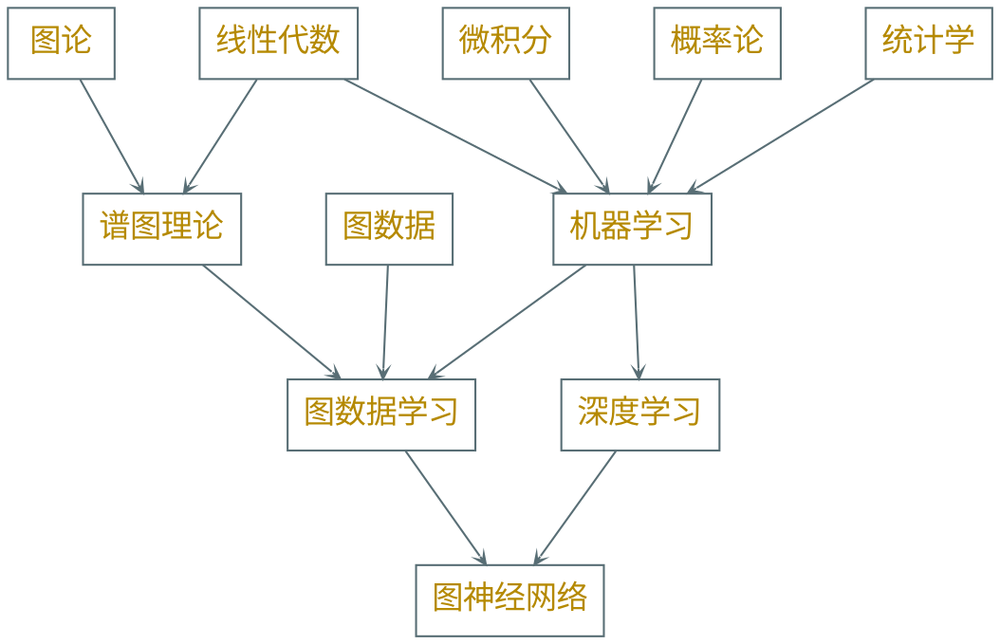
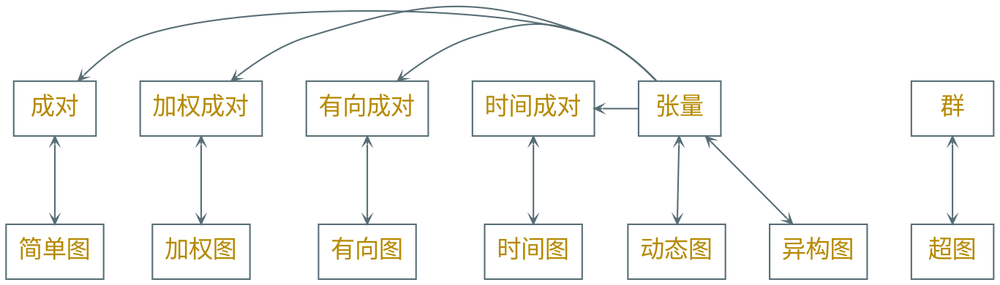
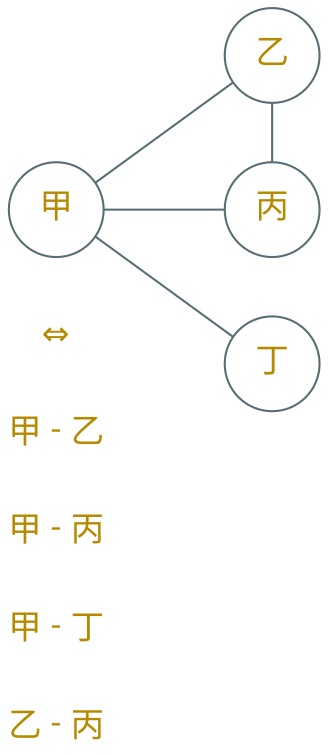

---
presentation:
  transition: "none"
  enableSpeakerNotes: true
  margin: 0
---

@import "../common/css/font-awesome-4.7.0/css/font-awesome.css"
@import "../common/css/zhangt-solarized.css"
@import "css/GNN.css"

<!-- slide data-notes="" -->

# 图神经网络导论

## 绪论

### 计算机科学与技术学院 &nbsp;&nbsp; 张腾

 

#### tengzhang@hust.edu.cn

<!-- slide vertical=true data-notes=""-->

<h5>课程群</h5>

<h6 class="bottom_left">图神经网络导论</h6><h6 class="bottom_center">绪论</h6><h6 class="bottom_right">tengzhang@hust.edu.cn</h6>

<!-- slide vertical=true data-notes=""-->

<h5>前导知识</h5>

<h6 class="bottom_left">图神经网络导论</h6><h6 class="bottom_center">绪论</h6><h6 class="bottom_right">tengzhang@hust.edu.cn</h6>

<!-- slide vertical=true data-notes=""-->

<h5>课程安排</h5>

授课：张腾

 

时间：32 学时

- 前 24 学时理论知识，周三上午 3-4、周五上午 3-4
- 后 8 学时动手实践，周三下午 5-8

 

考核：一份课堂报告、一份实验报告

  

经验不足，多给反馈

<h6 class="bottom_left">图神经网络导论</h6><h6 class="bottom_center">绪论</h6><h6 class="bottom_right">tengzhang@hust.edu.cn</h6>

<!-- slide vertical=true data-notes=""-->

<h5>难点</h5>

- 多门课程的交叉，需大量前导课程的配合
   
- 相关文献汗牛充栋，且持续井喷式增长
   
- 过于接近前沿，很多结论尚未经历时间的充分验证
   
- 多为启发式方法，无甚道理可言，玄学
   
- 软件包众多，上手门槛低，容易变成不求甚解的炼丹师
   
- 网上跳大神的很多，坑很多

 

    
    
    
    

<h6 class="bottom_left">图神经网络导论</h6><h6 class="bottom_center">绪论</h6><h6 class="bottom_right">tengzhang@hust.edu.cn</h6>

<!-- slide vertical=true data-notes=""-->

<h5>期望</h5>

### 人工智能$\Longleftrightarrow$金庸武学

### 机器学习$\Longleftrightarrow$九阴真经

### 图神经网络$\Longleftrightarrow$九阴白骨爪

> &emsp;&emsp;张无忌回过头去，只见那黄衫女子和周芷若斗得正紧。黄衫女子一双空手，周芷若右手鞭，左手刀，却兀自落于下风。黄衫女子的武功似乎与周芷若乃是一路，飘忽灵动，变幻无方，但举手抬足之间却是正而不邪，如说周芷若形似鬼魅，那黄衫女子便是态拟神仙。   —— 《倚天屠龙记》 第 38 章 君子可欺之以方 

 

### 扎好根基、勿求速成，态拟神仙般地使用图神经网络

<h6 class="bottom_left">图神经网络导论</h6><h6 class="bottom_center">绪论</h6><h6 class="bottom_right">tengzhang@hust.edu.cn</h6>

<!-- slide data-notes=""-->

<h5>动机</h5>

### 为什么将数据表示为图？

### 为什么将神经网络与图结合起来？

### 图神经网络面临哪些挑战？

<h6 class="bottom_left">图神经网络导论</h6><h6 class="bottom_center">绪论</h6><h6 class="bottom_right">tengzhang@hust.edu.cn</h6>

<!-- slide vertical=true data-notes=""-->

<h5>图数据</h5>

图提供了数据的通用表示形式

许多其他类型的数据都可以无损转化成图来表示

<h6 class="bottom_left">图神经网络导论</h6><h6 class="bottom_center">绪论</h6><h6 class="bottom_right">tengzhang@hust.edu.cn</h6>

<!-- slide vertical=true data-notes=""-->

<h5>成对 简单图</h5>

成对数据是一系列两者关系的集合$D = \set\{ (E_i, E_j) \}$

- 每个$E_i$属于一个实体集合
- $E_i$和$E_j$可交换

 

例：微博中的好友关系，城市间的航线连接，蛋白质间的相互作用

<h6 class="bottom_left">图神经网络导论</h6><h6 class="bottom_center">绪论</h6><h6 class="bottom_right">tengzhang@hust.edu.cn</h6>

