---
presentation:
  transition: "none"
  enableSpeakerNotes: true
  margin: 0
---

@import "../common/css/font-awesome-4.7.0/css/font-awesome.css"
@import "../common/css/zhangt-solarized.css"
@import "css/GNN.css"

<!-- slide data-notes="自我介绍  日期不好 间隔太久 第一节课讲些概况 不涉及太多具体的细节 后面的课再展开讲" -->

# 图神经网络导论

## 绪论

### 计算机科学与技术学院 &nbsp;&nbsp; 张腾

 

#### tengzhang@hust.edu.cn

<!-- slide vertical=true data-notes="请大家入群 发布课程的相关通知 也可以讨论问题 课程网站稍后也会在群里发布" -->

GNN-HEADER 课程群

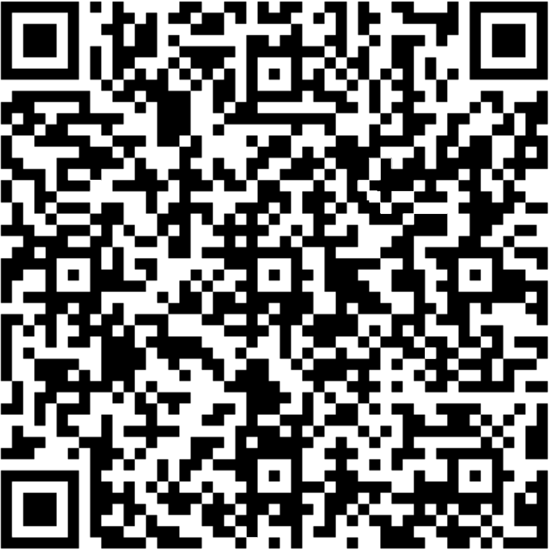

GNN-FOOTER 图神经网络导论 绪论 tengzhang@hust.edu.cn

<!-- slide vertical=true data-notes="从GNN开始捋一下课程间的关系  互动问下大家是否学过ML等前导课程  如果没有吐槽下选课系统不完善 鼓励大家课后补些相关课程" -->

GNN-HEADER 前导知识

@import "../dot/preliminary.dot" {class="top5 center"}

GNN-FOOTER 图神经网络导论 绪论 tengzhang@hust.edu.cn

<!-- slide vertical=true data-notes="5-10周理论课 11-12周实践课 说下分别讲啥  再说下考核情况 我很nice 大家不用担心  我毕业没多久 经验不足 讲课不好 不会点名强迫大家来听课  请大家多给反馈 不断完善讲课技巧和授课内容 造福学弟学妹" -->

GNN-HEADER 课程安排

授课：张腾

时间：32 学时

- 前 24 学时理论知识，周三、周五上午 1-2 节课
- 后 8 学时动手实践，周五下午 5-8 节课

考核：一份课堂报告、一份实验报告

经验不足，多给反馈

GNN-FOOTER 图神经网络导论 绪论 tengzhang@hust.edu.cn

<!-- slide vertical=true data-notes="这门课不好讲 几个点挨个讲讲" -->

GNN-HEADER 难点

<ul class="sparse">

- 多门课程的交叉，需大量前导课程的配合
- 相关文献汗牛充栋，且持续井喷式增长
- 过于接近前沿，很多结论尚未经历时间的充分验证
- 多为启发式方法，无甚道理可言，玄学
- 软件包众多，上手门槛低，容易变成不求甚解的炼丹师
- 网上跳大神的很多，坑很多

</ul>

    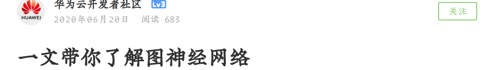
    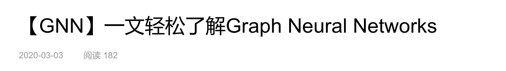
    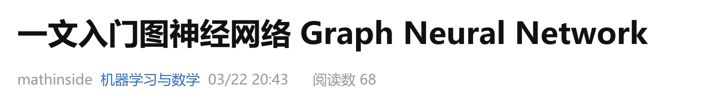
    

GNN-FOOTER 图神经网络导论 绪论 tengzhang@hust.edu.cn

<!-- slide vertical=true data-notes="人工智能博大精深 如果把其比作金庸武学的话 机器学习作为其最主流的分支 就是九阴真经 而GNN作为其中最为人所熟知的深度学习的代表 就是九阴白骨爪  九阴白骨爪作为一门犀利的功夫，本无好坏之说，关键在于人，周芷若  我希望大家" -->

GNN-HEADER 期望

### 人工智能$\Longleftrightarrow$金庸武学

### 机器学习$\Longleftrightarrow$九阴真经

### 图神经网络$\Longleftrightarrow$九阴白骨爪

> &emsp;&emsp;张无忌回过头去，只见那黄衫女子和周芷若斗得正紧。黄衫女子一双空手，周芷若右手鞭，左手刀，却兀自落于下风。黄衫女子的武功似乎与周芷若乃是一路，飘忽灵动，变幻无方，但举手抬足之间却是正而不邪，如说周芷若形似鬼魅，那黄衫女子便是态拟神仙。   —— 《倚天屠龙记》 第 38 章 君子可欺之以方 

 

### 扎好根基、勿求速成，态拟神仙般地使用图神经网络

GNN-FOOTER 图神经网络导论 绪论 tengzhang@hust.edu.cn

<!-- slide data-notes="扯远了 下面我们言归正传 开始第一节课的内容 这节课我们大概会讲讲下面的内容" -->

GNN-HEADER 大纲

如何将数据表示为图？

图数据上有哪些学习任务？

为何用神经网络来学习图数据？

图神经网络有哪些值得研究的地方？

GNN-FOOTER 图神经网络导论 绪论 tengzhang@hust.edu.cn

<!-- slide vertical=true data-notes="" -->

GNN-HEADER 图数据

图$\Gcal$由一个点集$\Vcal$和一个边集$\Ecal$组成，$\Gcal = (\Vcal, \Ecal)$

- 每个点对应一个实体，边描述实体间的关系
- 关系的引入，是相对于常见的独立同分布 (IID) 数据的最大不同

图提供了灵活的数据表示方式，许多数据都可无损转化成图来表示

@import "../dot/data-graph.dot" {class="top2"}

GNN-FOOTER 图神经网络导论 绪论 tengzhang@hust.edu.cn

<!-- slide data-notes="首先是最简单的情况" -->

GNN-HEADER 成对数据 简单图

成对数据$D = \set\{ (E_i, E_j) \}$是一系列实体对的集合

- 集合中的每个实体对对应某种关系，未在集合中的实体对则不具有该关系
- 关系是相互的，$E_i$和$E_j$可交换
- 可无损表示成简单图 (simple graph)

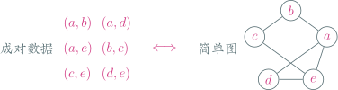

例子

- 社交网络中的好友关系
- 交通网络中两个城市间有交通工具可达
- 化学分子中各原子的相互作用

GNN-FOOTER 图神经网络导论 绪论 tengzhang@hust.edu.cn

<!-- slide vertical=true data-notes="在成对数据的基础上 关系是单向的就成了有向成对数据 我们用<>来表示" -->

GNN-HEADER 有向成对数据 有向图

有向成对数据$D = \set\{ \langle E_i, E_j \rangle \}$

- 每个实体对$\langle E_i, E_j \rangle$间的关系是单向的，$E_i$和$E_j$不可交换
- 可无损表示成有向图 (directed graph)

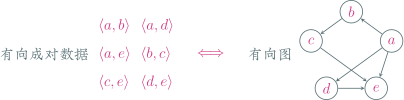

例子

- 微博上的关注，你关注了大 V，大 V 不一定回关你
- 贸易网络中的供货关系，甲给乙供货，但乙不一定也给甲供货
- 网页 A 有超链接指向网页 B，但网页 B 不一定有超链接指回网页 A
- 论文 A 引用了论文 B，但论文肯定不会也引用论文 A (类似于反对称)

GNN-FOOTER 图神经网络导论 绪论 tengzhang@hust.edu.cn

<!-- slide vertical=true data-notes="在成对数据的基础上 如果每个实体对有对应的权重" -->

GNN-HEADER 加权成对数据 加权图

加权成对数据$D = \set\{ (E_i, E_j): W_{ij} \}$

- 每个实体对$(E_i, E_j)$有一个对应的权重$W_{ij}$
- 可无损表示成加权图 (weighted graph)

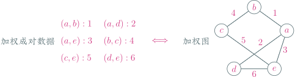

例子

- 社交网络中好友间的留言次数
- 交通网络中城市间的飞机客流量、航线距离等
- 化学分子中，各化学键的强度、断裂时释放的能量等

GNN-FOOTER 图神经网络导论 绪论 tengzhang@hust.edu.cn

<!-- slide vertical=true data-notes="在成对数据的基础上 每个实体对有其关系被激活的时间 可以得到时间图，举完例子后说下时间有什么用 追踪一些信息、病毒、新冠病毒的扩散" -->

GNN-HEADER 时间成对数据 时间图

时间成对数据：每个实体对有其关系被激活的时间

- 离散时间戳$D = \set\{ (E_i, E_j), t_1, t_2, \ldots \}$
- 连续时间段$D = \set\{ (E_i, E_j), \Delta t_1, \Delta t_2, \ldots \}$
- 可无损表示成有向图 (directed graph)

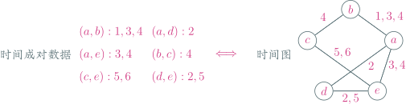

例子

- 微博上点赞、转发、评论
- 通信网络中两人打电话
- 无线网络中用户连上路由器
- 交通网络中人们搭乘交通工具

GNN-FOOTER 图神经网络导论 绪论 tengzhang@hust.edu.cn

<!-- slide data-notes="前面提到的成对、有向成对、加权成对、时间成对数据均可通过邻接矩阵表示" -->

GNN-HEADER 矩阵型数据

|     | $a$ | $b$ | $c$ | $d$ | $e$ |
| :-: | :-: | :-: | :-: | :-: | :-: |
| $a$ | $0$ | $1$ | $0$ | $2$ | $3$ |
| $b$ | $1$ | $0$ | $4$ | $0$ | $0$ |
| $c$ | $0$ | $4$ | $0$ | $0$ | $5$ |
| $d$ | $2$ | $0$ | $0$ | $0$ | $6$ |
| $e$ | $3$ | $0$ | $5$ | $6$ | $0$ |

成对、有向成对、加权成对、时间成对数据均可通过矩阵表示

- 对于成对数据，矩阵是二值对称的
- 对于有向成对数据，矩阵不再有对称性
- 对于加权成对数据，矩阵不再是二值的
- 对于时间成对数据，矩阵 (更准确的说是表格) 每个元素不再是单纯的数值

GNN-FOOTER 图神经网络导论 绪论 tengzhang@hust.edu.cn

<!-- slide vertical=true data-notes="将二维矩阵向高维扩展，就得到可以贮存更多信息的张量，张量英文叫tensor，说一下tensorflow    若第三维是时间" -->

GNN-HEADER 张量型数据 动态图

张量 (tensor) 是二维矩阵的高维扩展，若三维张量的第三维是时间，可将其无损表示成随时间演化的动态图 (dynamic graph)

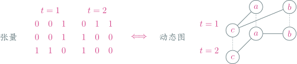

- 社交网络中的好友关系会随时间关系变化，因一些事件取关
- 交通网络中，城市间飞机、高铁的客流量会随旅游旺季淡季而变化
- 网页间的超链接关系也会随着网站的更新而变化

动态图的一个扩展是多层图 (multilayer graph)：不同层之间也有边相连

- 点代表城市，层代表某种交通方式，如飞机、高铁、汽车等
- 不同层的同一点连边表示在该城市可从一种交通方式切换到另一种交通方式

GNN-FOOTER 图神经网络导论 绪论 tengzhang@hust.edu.cn

<!-- slide vertical=true data-notes="若第三维的值表示边的类型" -->

GNN-HEADER 张量数据 异构图

张量 (tensor) 是二维矩阵的高维扩展，若三维张量的第三维是边的类型，可将其无损表示成异构图 (heterogeneous graph)

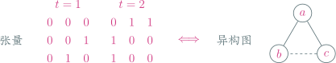

更高维的张量还可以引入点的类型，甚至整图的类型

- 航空网络中，点可以是军用、民用机场，边可以是客运量、货运量
- 微博上，点可以是用户、状态，边可以是关注、点赞、评论、转、发
- 淘宝上，点可以是用户、商品，边可以是浏览、购买、评论、分享
- 医疗知识图谱中，点可以是蛋白质、药物、疾病，边可以是有药效、治愈
- 论文网络中，点可以是作者、论文、会议、期刊，边可以是撰写、引用、合作、发表

GNN-FOOTER 图神经网络导论 绪论 tengzhang@hust.edu.cn

<!-- slide vertical=true data-notes="" -->

GNN-HEADER 群 超图

群 (group) 是一系列实体集合的集合$D = \set\{ (E_i, E_j, \ldots) \}$

- 群中每个元素可以有任意多的实体，不仅仅是 2 个
- 可无损表示成超图 (hypergraph)

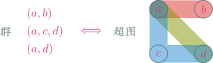

例子

- 微博、豆瓣每个话题会有很多用户关注，一个用户可以关注多个话题
- 学校里，每个社团会有多个学生，一个学生可以参加多个社团
- 超市的购物记录中，每笔订单会有多种商品，每种商品可以属于多个订单
   

还可以引入权重：话题的热度、社团搞活动的次数、每笔订单的总价

GNN-FOOTER 图神经网络导论 绪论 tengzhang@hust.edu.cn

<!-- slide vertical=true data-notes="再回头看一下这张图 它列出了目前全部能无损转化成各类图的数据  还有些更复杂的数据，目前尚不能无损转化成图，  注意，无损转化固然重要，但转化后是否有好工具进行方便地处理也是需要考虑的，转化越保真，转化后的图越难处理，这里有个权衡，更多的超出本课程范围，就不展开了" -->

GNN-HEADER 图数据

无损转化成图：

@import "../dot/data-graph.dot"

目前尚不能无损转化成图：

- 序列 (sequential) 数据：呈链状，如人的移动轨迹
- 扩散 (diffusion) 数据：呈树状，如社交平台上谣言的传播
- 时序 (time series) 数据：如股票、天气

GNN-FOOTER 图神经网络导论 绪论 tengzhang@hust.edu.cn

<!-- slide data-notes="扯远了 下面我们言归正传 开始第一节课的内容 这节课我们大概会讲讲下面的内容" -->

GNN-HEADER 大纲

如何将数据表示为图？

图数据上有哪些学习任务？

为何用神经网络来学习图数据？

图神经网络有哪些值得研究的地方？

GNN-FOOTER 图神经网络导论 绪论 tengzhang@hust.edu.cn

<!-- slide vertical=true data-notes="到这里我们介绍了将各种数据转化成图的方式 下面我们讲有了图数据后 可以从中学习到什么  首先我们作一下澄清图和网络两个概念" -->

GNN-HEADER 图数据学习 前提假设

图 vs. 网络：

- 现实中的网络，如社交网络、交通网络天生可以表示成图，但也有些非网络数据，如张量数据，也可以表示成图
- 机器学习里说的神经网络是一个有向加权图形式的模型，但它不是直接用来表示数据的，不过某种程度上也是在“表示”数据
- 如果将神经网络看作有向加权图，在其上学习一个图神经网络，对任意输入的神经网络，预测其泛化性能，从而实现最优神经网络结构的搜索 (ICLR'19)

 

点除了有离散的种类，还可以有额外的特征信息

- 社交网络中点的特征可以是用户的教育水平、工作情况、兴趣爱好等
- 航空网络中点的特征可以是城市的人口数、地理位置、经济水平等

 

边也可以有特征，甚至整图也可以有

 

四类任务：点层面、边层面、子图层面、整图层面

GNN-FOOTER 图神经网络导论 绪论 tengzhang@hust.edu.cn

<!-- slide vertical=true data-notes="" -->

GNN-HEADER 点层面的任务

点分类

- 输入：单张图，其点集只有部分点有类别标记
- 输出：其他未标记点的类别标记

 

例子

- 社交网络中机器人用户检测
- 论文网络中的文档主题分类
- 分子结构中预测节点蛋白质的功能

 

特点

- 与传统的机器学习不同，样本不是独立同分布的
- 拥有相似属性特征、邻居结构的点有相似的类别标记

GNN-FOOTER 图神经网络导论 绪论 tengzhang@hust.edu.cn

<!-- slide vertical=true data-notes="" -->

GNN-HEADER 边层面的任务

链接预测，也称图补全、关系推理

- 输入：单张非全连接图
- 输出：图中非相连点对间存在边的概率

 

例子

- 社交平台上的好友推荐 (点就是用户)，话题推荐 (点是用户和主题)
- 电商平台上的商品推荐 (点是用户和商品)
- 生物医学中的药效预测 (点是药和疾病)
- 犯罪情报网络中的分析 (点是嫌疑人和犯罪类型)

 

任务的难度取决于图的类型

- 社交网络中只有“朋友”一种关系就很简单，比如只看这两个点有多少共同好友
- 生物医学中有几百种关系，预测就很难

GNN-FOOTER 图神经网络导论 绪论 tengzhang@hust.edu.cn

<!-- slide vertical=true data-notes="" -->

GNN-HEADER 子图层面的任务

社区发现：通过论文网络发现研究兴趣相近的学术小圈子

- 点代表作者
- 边代表曾经合作过
- 边上特征为合作的频率、论文主题等

点分类和边预测类似于机器学习中的监督学习，社区发现类似于机器学习中的无监督学习：聚类

交通预测：从华科到天河机场的耗时

- 点为武汉市中的所有交岔路口
- 边为路 (汽车) 或者轨道 (地铁)
- 边上特征为路段的流量、畅通程度等

在这个动态图上预测每个路段的耗时，从而给出最优路线的推荐

GNN-FOOTER 图神经网络导论 绪论 tengzhang@hust.edu.cn

<!-- slide vertical=true data-notes="最后我们来看看整图层面的任务" -->

GNN-HEADER 整图层面的任务

整图层面的任务输入都是多张图，一张图为一个样本

 

图分类

- 对于一段计算机程序，将其语法树视作一张图，判断是否有 bug
- 对于一个化学分子，将其结构视作一张图，预测分子的毒性、溶解性等
- 对于一段拍摄人的视频，将每帧图片中人的头、四肢等关键部位作为点，并将每帧分割为一张图，通过该动态图预测视频中人的动作

新药发现

- 利用生成对抗网络来生成符合目标约束的药物分子

组合优化

- 求解旅行商问题：给定一系列城市和城市间的距离，求解访问每一座城市一次并回到起始城市的最短回路
- 布尔可满足性问题：用文字和子句构造二部图，求解可满足性

GNN-FOOTER 图神经网络导论 绪论 tengzhang@hust.edu.cn

<!-- slide data-notes="扯远了 下面我们言归正传 开始第一节课的内容 这节课我们大概会讲讲下面的内容" -->

GNN-HEADER 大纲

如何将数据表示为图？

图数据上有哪些学习任务？

为何用神经网络来学习图数据？

图神经网络有哪些值得研究的地方？

GNN-FOOTER 图神经网络导论 绪论 tengzhang@hust.edu.cn

<!-- slide vertical=true data-notes="到这里我们就把图数据上的四类任务介绍完了 下面我们简要科普下机器学习 这是周志华老师西瓜书上的一个经典例子" -->

GNN-HEADER 机器学习

给定数据集：

| 特征 &nbsp;&nbsp;&nbsp; → | 编号 | 色泽 | 根蒂 | 敲声 |              好瓜              |
| --------------------------------------------------: | :--: | :--: | :--: | :--: | :----------------------------: |
| 样本 &nbsp;&nbsp;&nbsp; → |  1   | 青绿 | 蜷缩 | 浊响 |               是               |
|                                                     |  2   | 乌黑 | 蜷缩 | 浊响 |               是               |
|                                                     |  3   | 青绿 | 硬挺 | 清脆 |               否               |
|                                                     |  4   | 乌黑 | 蜷缩 | 沉闷 |               否               |
|                                                     |      |      |      |      |               ↑                |
|                                                     |      |      |      |      | 类别 |

预测：色泽 = 浅白 $\wedge$ 根蒂 = 蜷缩 $\wedge$ 敲声 = 浊响 $\wedge$ 好瓜 = ?

 

能解决上述问题的机器学习方法有很多，详见西瓜书

GNN-FOOTER 图神经网络导论 绪论 tengzhang@hust.edu.cn

<!-- slide vertical=true data-notes="结合西瓜的例子展开来讲 预处理就是处理有属性缺失的样本 特征转换将非数值属性转化成数值属性  最后说一下深度学习的这个优势只是一个guess 并没有严格的理论保证" -->

GNN-HEADER 传统 vs. 现代

传统机器学习流程

@import "../dot/ml-old.dot"

弊端：特征提取处理变换与模型学习是分开的，前者未必对后者有用

 

现代机器学习流程

@import "../dot/ml-modern.dot"

优势：特征提取处理变换、模型学习两步合二为一，有的放矢

GNN-FOOTER 图神经网络导论 绪论 tengzhang@hust.edu.cn

<!-- slide vertical=true data-notes="神经网络在结构化数据上取得很好的效果 所以我们也希望把它用到图数据上 但是" -->

GNN-HEADER 神经网络

神经网络在结构化数据上已取得很好的效果

@import "../dot/grid-sequence.dot" {class="left10 top2 bottom1"}

- 网格型数据，如图片，卷积神经网络
- 序列型数据，如文本，循环神经网络

神经网络在无标记数据上能提取复杂的特征

- (变分) 自编码器
- 对抗生成网络

GNN-FOOTER 图神经网络导论 绪论 tengzhang@hust.edu.cn

<!-- slide data-notes="扯远了 下面我们言归正传 开始第一节课的内容 这节课我们大概会讲讲下面的内容" -->

GNN-HEADER 大纲

如何将数据表示为图？

图数据上有哪些学习任务？

为何用神经网络来学习图数据？

图神经网络有哪些值得研究的地方？

GNN-FOOTER 图神经网络导论 绪论 tengzhang@hust.edu.cn

<!-- slide vertical=true data-notes="最后我们讲一下这个领域的当前的研究热点 所有点挨个讲一遍" -->

GNN-HEADER 研究现状

提出新的图神经网络模型捕捉图的拓扑结构信息

- 空间域：图数据非结构化，点和点之间没有上、下、左、右、前、后的关系
- 频率域：如何对拉普拉斯矩阵 (Laplacian matrix) 的特征值进行变换

整图问题的整图特征往往是缺失的，如何聚合点特征生成整图特征？

可扩展性，规模很大的图，点和边都很多，降采样？

处理复杂的图：异构图、多层图、动态图、超图

增强模型的稳健型，对抗攻击？对抗防御？

GNN-FOOTER 图神经网络导论 绪论 tengzhang@hust.edu.cn
