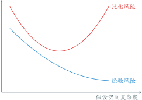
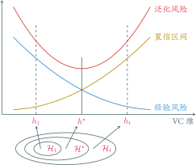

---
presentation:
  transition: "none"
  enableSpeakerNotes: true
  margin: 0
---

@import "../common/css/font-awesome-4.7.0/css/font-awesome.css"
@import "../common/css/zhangt-solarized.css"
@import "css/GNN.css"

<!-- slide data-notes="因为有超过一半的同学没学过机器学习，所以我打算花两次课的时间做个机器学习的扫盲，顺便把一些基本概念，如损失函数、正则化什么的讲一下，这些概念即便到了图神经网络里也是通用的" -->

# 图神经网络导论

## 机器学习

### 计算机科学与技术学院 &nbsp; &nbsp; 张腾

 

#### tengzhang@hust.edu.cn

<!-- slide vertical=true data-notes="这张图算是人工智能的常见黑话大集合，大家如果稍微关注些人工智能的话，应该会经常听到这些词，我这里给大家捋一下它们之间的关系，最大的概念叫人工智能 监督信息和模型假设并不是并列关系的，只是看待机器学习的不同视角，因此有半监督支持向量机这种东西" -->

GNN-HEADER 大纲

@import "../dot/outline.dot"

GNN-FOOTER 图神经网络导论 机器学习 tengzhang@hust.edu.cn

<!-- slide data-notes="就先从最大的人工智能说起吧" -->

GNN-HEADER 大纲

@import "../dot/outline-ai.dot"

GNN-FOOTER 图神经网络导论 机器学习 tengzhang@hust.edu.cn

<!-- slide vertical=true data-notes="控制论之父维纳在他的大作《控制论》  讲完后提一下，现在我们国家也高度重视人工智能的发展，因为1760年第一次工业革命，1870年第二次工业革命我国都完全没赶上，互联网和移动互联网引发第三次工业革命我们国家也只赶上个末班车，而西方国家确立对非西方的绝对优势就是这三次工业革命，所以对于人工智能技术为核心推动的第四次工业革命是绝对重视，所以这里打个广告，大家现在上车还来得及  扯远了" -->

GNN-HEADER 背景

 

维纳 (Wiener) &emsp; 《控制论》：

 

> 第一次工业革命：用某种机器来减轻甚至代替体力劳动 
> 上世纪中叶：用某种新型机器来减轻甚至代替某些脑力劳动

 

关键：让机器具有人类的智能

 

问题：什么是“智能”？

GNN-FOOTER 图神经网络导论 机器学习 tengzhang@hust.edu.cn

<!-- slide vertical=true data-notes="智能这一说法最早是图灵在他1950年的论文里提出的，后来被人们称为图灵测试  学习指学习新东西、探索未知的能力，感知处理看和听，认知是思考和推理" -->

GNN-HEADER 起源

    

        
“智能”一词难以直接定义
 
        
图灵 (Turing) 1950 年的论文 《Computing Machinery and Intelligence》
 
        
图灵测试：一个人在不接触对方的情况下，通过一种特殊的方式，和对方进行一系列的问答，如果在相当长时间内，他无法根据这些问题判断对方是人还是计算机，那么就可以认为这个计算机是智能的

    

    

        
    

要想通过图灵测试，机器得具备多种能力

- 学习：机器学习
- 感知：计算机视觉，语音识别
- 认知：自然语言处理，知识表示

GNN-FOOTER 图神经网络导论 机器学习 tengzhang@hust.edu.cn

<!-- slide vertical=true data-notes="图中的5位是06年会议50周年时还建在的5位，左一是摩尔，右二赛弗里奇，右一是所罗门诺夫  香农是被麦卡锡拉过去站台的，除香农都得过图灵奖，C罗奖给梅西，梅西也不会要  1971年麦卡锡获得图灵奖，发明了第一个函数式程序语言Lisp，函数式编程更加强调程序执行的结果而非执行的过程，倡导利用若干简单的执行单元让计算结果不断渐进，逐层推导复杂的运算，而不是设计一个复杂的执行过程  明斯基写过一本书，叫感知机  西蒙是中科院外籍院士，9个博士学位，中文名司马贺  纽厄尔一直是西蒙的合作者，曾在美国智库兰德公司供职" -->

GNN-HEADER 元年

达特茅斯 (Dartmouth) 会议

- 时间：1956 年
- 地点：达特茅斯学院
- 人物：香农 (Shannon)、麦卡锡 (McCarthy)、明斯基 (Minsky)、西蒙 (Simon)、纽厄尔 (Newell) 等十人
- 事件：讨论用机器模拟人的智能

 

    
    

GNN-FOOTER 图神经网络导论 机器学习 tengzhang@hust.edu.cn

<!-- slide vertical=true data-notes="人工智能的发展大致可以分成三个阶段，" -->

GNN-HEADER 发展

@import "../mermaid/ai.mermaid"

秽土转生

- 推理：反绎学习，图神经网络
- 知识：知识图谱，图神经网络

GNN-FOOTER 图神经网络导论 机器学习 tengzhang@hust.edu.cn

<!-- slide data-notes="我个人猜测原因是数学原理讲的是公理集合论 当然是罗素的 不是zfc 天生符号化" -->

GNN-HEADER 推理期

机器擅长固定套路的计算 vs. 人类擅长妙手偶得的推理

符号主义：智能 = 逻辑推理

西蒙和纽厄尔设计了“逻辑理论家”程序

- 1952 年，逻辑理论家证明了 《数学原理》 中的 38 条定理
- 1963 年，证明了全部 52 条定理，其中定理 2.85 的证明比原书作者更巧妙
- 西蒙和纽厄尔获得了 1975 年的图灵奖

GNN-FOOTER 图神经网络导论 机器学习 tengzhang@hust.edu.cn

<!-- slide vertical=true data-notes="" -->

GNN-HEADER 符号主义

根据以下事实判别谁说了实话

- $A$：$B$和$C$都是说谎者
- $B$：$A$和$C$都是说谎者
- $C$：$A$和$B$中至少有一个说谎者

|   公式   |          $p \rightarrow q$           | $\Longleftrightarrow$ |                   $\neg p \vee q$                    |
| :------: | :----------------------------------: | :-------------------: | :--------------------------------------------------: |
| **条件** | $A \rightarrow \neg B \wedge \neg C$ | $\Longleftrightarrow$ | $1.~\neg A \vee \neg B, \quad 2.~\neg A \vee \neg C$ |
|          |    $\neg A \rightarrow B \vee C$     | $\Longleftrightarrow$ |                 $3.~A \vee B \vee C$                 |
|          | $B \rightarrow \neg A \wedge \neg C$ | $\Longleftrightarrow$ |               $4.~\neg B \vee \neg C$                |
|          |    $\neg B \rightarrow A \vee C$     | $\Longleftrightarrow$ |                 $3.~A \vee B \vee C$                 |
|          |  $C \rightarrow \neg A \vee \neg B$  | $\Longleftrightarrow$ |         $5.~\neg A \vee \neg B \vee \neg C$          |
|          |   $\neg C \rightarrow A \wedge B$    | $\Longleftrightarrow$ |           $6.~A \vee C, \quad 7.~B \vee C$           |
| **归结** | $1 + 7 \rightarrow 8.~\neg A \vee C$ | $\Longleftrightarrow$ |                     $C$说了实话                      |

GNN-FOOTER 图神经网络导论 机器学习 tengzhang@hust.edu.cn

<!-- slide vertical=true data-notes="符号主义不能包治百病 面对更难的定理就无能为力了 十万步无法证明两个连续函数之和还是连续函数" -->

GNN-HEADER 推理期

机器擅长固定套路的计算 vs. 人类擅长妙手偶得的推理

符号主义：智能 = 逻辑推理

西蒙和纽厄尔设计了“逻辑理论家”程序

- 1952 年，“逻辑理论家”证明了《数学原理》中的 38 条定理
- 1963 年，证明了全部 52 条定理，其中定理 2.85 的证明比原书作者更巧妙
- 西蒙和纽厄尔获得了 1975 年的图灵奖

衰退：十万步无法证明“两个连续函数之和还是连续函数”

GNN-FOOTER 图神经网络导论 机器学习 tengzhang@hust.edu.cn

<!-- slide data-notes="从推理期得到的教训是" -->

GNN-HEADER 知识期

教训：光有逻辑推理远远不够，机器得拥有知识

信仰：“知识就是力量”，智能 = 知识 + 逻辑推理

专家系统 = 知识库 + 推理机

- 在特定领域内具有专家水平解决问题能力的程序系统
- 第一个成功的专家系统 DENDRAL 于 1968 年问世
- 知识工程之父费根鲍姆 (Feigenbaum) 获得了 1994 年的图灵奖

GNN-FOOTER 图神经网络导论 机器学习 tengzhang@hust.edu.cn

<!-- slide vertical=true data-notes="" -->

GNN-HEADER 动物识别专家系统

@import "../dot/reasoning.dot"

GNN-FOOTER 图神经网络导论 机器学习 tengzhang@hust.edu.cn

<!-- slide vertical=true data-notes="" -->

GNN-HEADER 知识期

教训：光有逻辑推理远远不够，机器得拥有知识

信仰：“知识就是力量”，智能 = 知识 + 逻辑推理

专家系统 = 知识库 + 推理机

- 在特定领域内具有专家水平解决问题能力的程序系统
- 第一个成功的专家系统 DENDRAL 于 1968 年问世
- 知识工程之父费根鲍姆 (Feigenbaum) 获得了 1994 年的图灵奖

 

衰退：人工构建知识库成本太高，知识获取困难

GNN-FOOTER 图神经网络导论 机器学习 tengzhang@hust.edu.cn

<!-- slide data-notes="对于人类的很多智能行为(比如语言理解、图像理解等) 我们很难知道其中的原理 也无法描述出这些智能行为背后的“知识”    因此 我们也很难通过知识和推理的方式来实现这些行为的智能系统。为了解决这类问题,研究者开始将研究重点转向让计算机从数据中自己学习" -->

GNN-HEADER 学习期

基本想法：让机器从数据中自动学习得到某种知识 (规律)

 

基本流程：

@import "../dot/ml-old.dot"

- 原始数据：图片、视频、文本、语音、……
- 特征提取：选取有用特征，如西瓜选取色泽、根蒂、敲声、纹理、触感
- 特征处理：分类特征转换为数值特征，处理缺失特征，特征标准化
- 特征变换：对提取的特征作变换生成新的更有效的特征
- 模型学习：机器学习最核心的部分，学习一个特征到类别的函数映射

GNN-FOOTER 图神经网络导论 机器学习 tengzhang@hust.edu.cn

<!-- slide vertical=true data-notes="" -->

GNN-HEADER 特征提取

文本分类：

- 预测文本 (样本) 的主题 (类别)
- 文本的主题由组成文本的单词决定，特征来源于单词

 

设词汇表共有$d$个单词，则每个文本提取$d$个特征

- 第$i$个特征为 1 当且仅当词汇表第$i$个词在文本中出现过，否则为零
- 第$i$个特征为词汇表第$i$个词在文本中出现的次数，即频率

 

词频 - 逆文本频率 (tf - idf) 特征：单词对当前文本的重要性体现在

- 词频 (term frequency) 高：单词在当前文本中出现的频率高 tf = 单词在当前文本中出现的次数 / 当前文本的总词汇数
- 逆文本频率 (inverse document frequency) 高：单词在其他文本中出现的频率低 idf = log (全部文本数 / 包含该词的文本总数 + 1)

GNN-FOOTER 图神经网络导论 机器学习 tengzhang@hust.edu.cn

<!-- slide vertical=true data-notes="" -->

GNN-HEADER 分类特征 → 数值特征

| 编号 | 色泽 | 根蒂 | 敲声 | 好瓜 |
| :--: | :--: | :--: | :--: | :--: |
|  1   | 青绿 | 蜷缩 | 浊响 |  是  |
|  2   | 乌黑 | 蜷缩 | 浊响 |  是  |
|  3   | 青绿 | 硬挺 | 清脆 |  否  |
|  4   | 乌黑 | 蜷缩 | 沉闷 |  否  |
|  5   | 浅白 | 蜷缩 | 浊响 |  ?   |

序数编码 (ordinal encoding)：清绿 - 0、乌黑 - 1、浅白 - 2

独热编码 (one-hot encoding)：清绿 - 001、乌黑 - 010、浅白 - 100

- 序数编码会人为引入序，独热编码可以一碗水端平，但丢失了物理意义

散列编码 (hash encoding)：用哈希函数将任意输入映射到有限整数范围

- 独热编码在特征取值很多时会非常长，且不能适应可增长的类别

GNN-FOOTER 图神经网络导论 机器学习 tengzhang@hust.edu.cn

<!-- slide vertical=true data-notes="有时会因为特殊原因，特征不是完整的，比如医院的病人数据，病人不可能把你的所有检查都来一遍，都是能省则省" -->

GNN-HEADER 特征缺失处理

| 编号 |  >  |  >  | 色泽 |  >  | 根蒂 |  >  |  >  | 敲声 | 好瓜 |
| :--: | :-: | :-: | :--: | :-: | :--: | :-: | :-: | :--: | :--: |
|  1   |  0  |  0  |  1   |  0  |  1   |  0  |  0  |  1   |  1   |
|  2   |  0  |  1  |  -   |  0  |  -   |  0  |  0  |  1   |  1   |
|  3   |  0  |  0  |  1   |  1  |  0   |  -  |  1  |  0   |  0   |
|  4   |  0  |  1  |  0   |  0  |  1   |  1  |  0  |  0   |  0   |

删除：直接删除有特征缺失的样本，简单粗暴，信息损失

补全：

- 用平均数、中位数、众数、最大值、最小值、固定值填充，人为引入了噪声
- 预测缺失的数据，K 近邻、矩阵补全，如果其他特征和缺失特征无关？
- 将“缺失”本身作为一种特征

忽略：采用缺失特征不敏感的学习模型，如决策树

GNN-FOOTER 图神经网络导论 机器学习 tengzhang@hust.edu.cn

<!-- slide vertical=true data-notes="" -->

GNN-HEADER 特征标准化

也称归一化，旨在消除特征之间的量纲影响

 

min - max 放缩：也称为离差标准化，将原始特征线性变换到 [0, 1] 区间

$$
\begin{align*}
    x \leftarrow \frac{x - x_\min}{x_\max - x_\min} \quad \wedge \quad 0 \leftarrow x_\min \quad \wedge \quad 1 \leftarrow x_\max
\end{align*}
$$

最大值标准化：除以该特征的绝对值最大值

$$
\begin{align*}
    x \leftarrow \frac{x}{\max_{i \in [m]} |x_i|} \in [-1,1] \quad \wedge \quad (-1 \leftarrow x_\min \quad \vee \quad 1 \leftarrow x_\max)
\end{align*}
$$

标准差标准化：经过处理的特征近似符合标准正态分布$\Ncal(0,1)$

$$
\begin{align*}
    x \leftarrow \frac{x - \mu}{\sigma}, \quad x \leftarrow \frac{x - x_{\text{median}}}{\sum_{i \in [m]} |x_i - x_{\text{median}}| / m}
\end{align*}
$$

GNN-FOOTER 图神经网络导论 机器学习 tengzhang@hust.edu.cn

<!-- slide vertical=true data-notes="并非所有的特征都对后面的模型学习有用" -->

GNN-HEADER 特征变换

该步是模型学习前的最后一步，亦有将该步与模型学习融合的做法

 

当特征冗余时，挑选出有用的特征子集，降维

- 过滤掉与学习目标无关的特征，例如西瓜数据集中的编号，其与瓜的好坏无关
- 过滤掉低方差特征，特别是那些在所有样本上取值均不变的特征
- 计算特征与类别标记的线性相关性、互信息等，再划定阈值遴选特征
- 利用$\ell_1$范数最小化等正则化技术，遴选特征与模型学习合二为一

 

当特征稀缺时，利用现有特征构造新的特征，升维

- 凭经验显式构造：$\xv = [x_1; x_2] \xrightarrow{\Rbb^2 \mapsto \Rbb^6} \xvt = [x_1^2; x_2^2; x_1 x_2; x_1; x_2; 1]$
- 利用核函数$\kappa(\xv, \zv) = \langle \phi(\xv), \phi(\zv) \rangle$隐式构造，其中$\phi: \Rbb^d \mapsto \Hbb$是核映射，$\langle \cdot, \cdot \rangle$是空间$\Hbb$中的内积，决策函数为$f(\phi(\zv))$，代表性方法为核方法
- 利用非线性函数复合，决策函数为$f_n ( f_{n-1} ( \cdots f_2 (f_1 (\xv))))$，代表性方法为深度神经网络

GNN-FOOTER 图神经网络导论 机器学习 tengzhang@hust.edu.cn

<!-- slide data-notes="" -->

GNN-HEADER 大纲

@import "../dot/outline-supervised.dot"

GNN-FOOTER 图神经网络导论 机器学习 tengzhang@hust.edu.cn

<!-- slide vertical=true data-notes="" -->

GNN-HEADER 监督学习

所有样本都有类别标记

| 原始数据 |      样本      |   属性特征   | 类别标记 |
| :------: | :------------: | :----------: | :------: |
|  $o_1$   | $(\xv_1, y_1)$ | $\xv_1[1:d]$ |  $y_1$   |
|  $o_2$   | $(\xv_2, y_2)$ | $\xv_2[1:d]$ |  $y_2$   |
| $\vdots$ |    $\vdots$    |   $\vdots$   | $\vdots$ |
|  $o_m$   | $(\xv_m, y_m)$ | $\xv_m[1:d]$ |  $y_m$   |

任务类型：

- 二分类：$y \in \{ 1, -1 \}$或者$y \in \{ 0,1 \}$
- 多分类：$y \in [C] \triangleq \{ 1, 2, \ldots, C \}$
- 回归：$y \in \Rbb$
- 结构预测：$y$可以是向量、序列、语法树、……

GNN-FOOTER 图神经网络导论 机器学习 tengzhang@hust.edu.cn

<!-- slide vertical=true data-notes="现实中很多任务，获取类别标记代价很大，比如病人的X光图片，需要高水平的专家医生来看才能给出标记，所以不能指望所有样本都有类别标记" -->

GNN-HEADER 半监督学习

只有部分样本有类别标记，如何利用其它未标记样本？

| 原始数据  |         样本         |     属性特征     | 类别标记 |
| :-------: | :------------------: | :--------------: | :------: |
|   $o_1$   |    $(\xv_1, y_1)$    |   $\xv_1[1:d]$   |  $y_1$   |
| $\vdots$  |       $\vdots$       |     $\vdots$     | $\vdots$ |
|   $o_l$   |    $(\xv_l, y_l)$    |   $\xv_m[1:d]$   |  $y_l$   |
| $o_{l+1}$ | $(\xv_{l+1}, \NULL)$ | $\xv_{l+1}[1:d]$ | $\NULL$  |
| $\vdots$  |       $\vdots$       |     $\vdots$     | $\vdots$ |
| $o_{l+u}$ | $(\xv_{l+u}, \NULL)$ | $\xv_{l+u}[1:d]$ | $\NULL$  |

任务类型：

- 直推式 (transductive) 学习：预测$\xv_{l+1}, \ldots, \xv_{l+u}$的类别标记，可以没有显式模型
- 归纳 (inductive) 学习：必须有显式模型，能对未知样本进行预测，包含前者

GNN-FOOTER 图神经网络导论 机器学习 tengzhang@hust.edu.cn

<!-- slide vertical=true data-notes="" -->

GNN-HEADER 无监督学习

所有样本都没有类别标记

| 原始数据 |      样本      |   属性特征   | 类别标记 |
| :------: | :------------: | :----------: | :------: |
|  $o_1$   | $(\xv_1, y_1)$ | $\xv_1[1:d]$ | $\NULL$  |
|  $o_2$   | $(\xv_2, y_2)$ | $\xv_2[1:d]$ | $\NULL$  |
| $\vdots$ |    $\vdots$    |   $\vdots$   | $\vdots$ |
|  $o_m$   | $(\xv_m, y_m)$ | $\xv_m[1:d]$ | $\NULL$  |

任务类型：

- 聚类：$\xv_i \mapsto c_i \in [K]$，根据一定的准则将样本划分成$K$个簇 (cluster)
- 降维 嵌入：$\xv_i \mapsto \zv_i \in \Rbb^l$，为样本学习新的特征表示，自编码 (autoencoder)
- 密度估计：估计样本空间的概率密度$P(\xv)$，寻找数据的生成机制

GNN-FOOTER 图神经网络导论 机器学习 tengzhang@hust.edu.cn

<!-- slide data-notes="给定数据后，就可以开始学习了，我们把这个过程用数学符号进行严格表示    X是特征空间    Y是类别标记集合    D是定义在X乘Y上的未知分布    数据集S独立同分布地采样于分布D    判别一个瓜是不是好瓜的函数称作分类器，H是所有候选分类器构成的集合，也称作假设空间，比如线性函数集合就是最常见的假设空间，可以提一下最小二乘    我们的目标是，寻找一个分类器，它在未知分布D上的错误率的期望尽可能的小，也叫泛化风险    问题难点在于D未知，泛化风险无法计算，我们目前已有的信息就是训练数据，可以计算的是分类器h在训练数据S上的错误率，也叫经验风险" -->

GNN-HEADER 形式化

常用概念及其符号：

- $\Xcal \subseteq \Rbb^d$为输入空间，$d$称为维度 (dimension)
- $\Ycal$为输出空间，对于分类问题$\Ycal = [C]$，对于回归问题$\Ycal = \Rbb$
- $\Dcal$为定义在$\Xcal \times \Ycal$上的未知分布
- $\Scal = \{(\xv_1, y_1), \ldots, (\xv_m, y_m)\}$为 IID 采样于$\Dcal$的训练数据集
- $\Hcal = \{ h: \Xcal \mapsto \Ycal \}$是候选分类器构成的假设空间，从中选择最优假设$h^\star$

 

如何评估假设$h$的好坏？$h$在整个分布$\Dcal$上的表现

 

目标：最小化期望风险，也称为泛化风险

$$
\begin{align*}
    \min_{h \in \Hcal} ~ \color{red}{R(h)} = \Ebb_{(\xv, y) \sim \Dcal}[1_{h(\xv) \neq y}]
\end{align*}
$$

 

难点：$\Dcal$未知，泛化风险无法计算，可以计算$h$在$\Scal$上的经验风险

GNN-FOOTER 图神经网络导论 机器学习 tengzhang@hust.edu.cn

<!-- slide vertical=true data-notes="考虑到训练集是D的一个缩影，因此以经验风险代替泛化风险似乎是合情合理的，这就是经验风险最小化原则    然而事与愿违的是如果对假设空间不做任何限制，可能会得到一个强行“记住”每个训练样本类别标记的分类器    显然它在训练数据集上经验风险为零，比任何一个分类器都要好，但是它对未知样本的预测可能非常糟糕，因为它把全部注意力都集中在训练数据集上了，忽略了对真实世界的认知，这种现象称为“过拟合”" -->

GNN-HEADER 经验风险最小化

以训练数据上的经验风险替代泛化风险

$$
\begin{align*}
    \class{red}{R(h)} = \Ebb_{(\xv, y) \sim \Dcal}[1_{h(\xv) \neq y}] \longleftarrow \class{blue}{R_\Scal (h)} = \frac{1}{m} \sum_{i \in [m]} 1_{h(\xv_i) \neq y_i}
\end{align*}
$$

根据大数定律，当样本数趋向于无穷时，经验风险趋向于泛化风险

 

如果对假设空间不做任何限制，可能会得到一个强行**记住**每个训练样本类别标记的分类器：

$$
\begin{align*}
    h(\xv) = \sgn \left( - \| \xv -\xv_1 \|^2 \cdot \| \xv -\xv_2 \|^2 \cdots \| \xv -\xv_m \|^2 \right)
\end{align*}
$$

问题：

- 在训练数据集上经验风险为零
- 对未知样本的预测非常糟糕

GNN-FOOTER 图神经网络导论 机器学习 tengzhang@hust.edu.cn

<!-- slide vertical=true data-notes="过拟合可以通过这张图来表述，随着假设空间复杂度地不断增大，对训练数据拟合地越来越好，经验风险单调下降；但泛化风险却是先降后升    这启示我们应该在经验风险和假设空间复杂度之间取得平衡，那么问题来了，经验风险是好计算的，假设空间复杂度怎么算？有什么量是可以刻画假设空间复杂度的吗？" -->

GNN-HEADER 过拟合

 

启示：在经验风险和假设空间复杂度之间取得平衡

 

问题：假设空间复杂度怎么算？有什么量能够刻画它？

GNN-FOOTER 图神经网络导论 机器学习 tengzhang@hust.edu.cn

<!-- slide data-notes="迄今已经有很多刻画假设空间复杂度的量了，这里我们举其中一个叫VC维的量，而且只考虑二分类这个最简单的情形，多分类也有对应的VC维    VC是两个人的名字，V是Vapnik，支持向量机的发明人，直观上来说，这个量应该和假设空间对样本的拟合能力正相关    定义集合H_S，其中每个元素都是对S赋予类别标记的一个可能结果    如果H_S包含了全部可能的结果，则称假设空间H可以“打散”数据集，就是不管它的类别标记赋值是啥，假设空间都能拟合出来，都有个候选分类器与之对应    假设空间的VC维就定义成能被它打散的最大样本集合的大小" -->

GNN-HEADER VC 维

基本思想：假设空间复杂度应体现出对数据集的拟合能力

 

假设空间$\Hcal = \{ h: \Xcal \mapsto \{1,-1\} \}$，数据集$S = \{\xv_1, \ldots, \xv_m\}$，定义

$$
\begin{align*}
    H_\Scal = \{ (h(\xv_1), \ldots, h(\xv_m)) \mid h \in \Hcal \}
\end{align*}
$$

其中$H_\Scal$中每个元素都是对$S$赋予类别标记的可能结果，若$H_\Scal$包含了全部可能的结果，即$|H_\Scal| = 2^m$，则称假设空间$\Hcal$可以打散数据集$\Scal$

 

假设空间$\Hcal$的 VC 维是能被$\Hcal$打散的最大集合的大小，即

$$
\begin{align*}
    \VC(\Hcal) = \max \{ m \mid \exists S:~|H_\Scal| = 2^m \}
\end{align*}
$$

GNN-FOOTER 图神经网络导论 机器学习 tengzhang@hust.edu.cn

<!-- slide vertical=true data-notes="举个简单的例子，设特征空间为二维欧氏平面，假设空间为二维平面上的直线构成的集合    从图中可以看出，存在3个样本构成的集合，无论类别标记是什么样的，都有个直线将两类样本分开    对于任意4个样本构成的集合，总有一种类似异或的赋值线性不可分    因此，在二维欧氏平面上，直线集合的VC维是3    可以证明更一般性的结论：n维欧式空间超平面集合的VC维是n+1" -->

GNN-HEADER VC 维

基本思想：假设空间复杂度应体现出对数据集的拟合能力

 

二维平面上的线性划分：$\Xcal = \Rbb^2$，$\Hcal$为二维平面上直线集合

- 存在 3 个样本构成的集合，8 种可能类别标记赋值均是线性可分的
- 对于任意 4 个样本构成的集合，总有一种类别标记赋值线性不可分
- $\Hcal$的 VC 维为 3
- $\Rbb^n$中超平面集合的 VC 维为$n+1$

GNN-FOOTER 图神经网络导论 机器学习 tengzhang@hust.edu.cn

<!-- slide vertical=true data-notes="有了VC维的定义，根据集中度不等式可以证明这样一个泛化界，这是VC维理论中最经典的结论，可以扯一下集中度不等式    右端第二项称为置信区间，它与VC维和样本数的比值有关，当样本数很大时，这个比值较小，此时第一项经验风险起主导作用，这也是经验风险最小化原则在大数据集上表现不错的原因    但反过来，当这个比值较大时，则必须考虑置信区间的影响，因为此时最小化经验风险并不能保证泛化风险也小" -->

GNN-HEADER VC 维

根据集中度不等式有如下泛化界

$$
\begin{align*}
    \class{red}{\underbrace{R(h)}_{泛化风险}} \leq \class{blue}{\underbrace{R_\Scal(h)}_{经验风险}} + \class{yellow}{\underbrace{\tilde{O} \left(\sqrt{\VC维/样本数~~~~~~~~~~}~ \right)}_{置信区间}}
\end{align*}
$$

GNN-FOOTER 图神经网络导论 机器学习 tengzhang@hust.edu.cn

<!-- slide vertical=true data-notes="由此产生了结构风险最小化原则，考虑直接最小化这两项的和    一个初步的办法如图所示，给定训练数据，构造一个嵌套的假设空间序列，然后对于每个假设空间，求一个使得经验风险最小的分类器h_t，同时相应的计算一个置信区间的值，最后取使得经验风险与置信区间的和最小的下标t，并以h_t作为最终学习算法输出的分类器    注意到，经验风险和置信区间关于VC维的增加都是单调变化的，因此可以直接最小化两项的加权和    那么问题来了，如何计算一个假设空间的VC维？前面说了，超平面集合的VC维是n+1，如果空间是无穷维，比如高斯核诱导出的特征空间，那么VC维也是无穷，泛化界已经松到没有意义了，这时怎么办？" -->

GNN-HEADER 结构风险最小化

    

        
    

    <ul class="width18 left2 top4">
        <li class="top2">
        构造嵌套的假设空间序列 $\Hcal_1 \subseteq \cdots \subseteq \Hcal_t \subseteq \cdots$
        </li>
        <li class="top2">
        在$\Hcal_t$上经验风险最小化得到$h_t$，$R_\Scal (h_1) \geq \cdots \geq R_\Scal (h_t) \geq \cdots$
        </li>
        <li class="top2">
        VC维序列 $\VC(\Hcal_1) \leq \cdots \leq \VC(\Hcal_t) \leq \cdots$
        </li>
        <li class="top2">
        $h^\star = \min_{h_t} \{ \class{blue}{经验风险} + \class{yellow}{置信区间} \}$
        </li>
    </ul>

问题：

- 如何计算$\VC(h_t)$？$\Xcal$无穷维，$\Hcal_t$超平面集合，$\VC$维无穷？
- 若假设空间$\Hcal_t$为超平面集合，当维度趋向于无穷时，VC 维也趋向于无穷

GNN-FOOTER 图神经网络导论 机器学习 tengzhang@hust.edu.cn

<!-- slide data-notes="因为VC维分布无关、数据独立，导出的泛化界松是不可避免的，因此需要引入数据相关的量加强泛化界，在无穷维空间也可以学习    这个量就是间隔，对于任意分类器f，它在样本上的间隔定义为 预测函数值 与 类别标记 的乘积    如果存在分类器不仅能将两类样本分开，还存在正数γ，使得分类器在正类样本上的预测值都大于等于γ，在负类样本上的预测值都小于等于-γ，换言之，两类之间有一个宽度为2γ的gap，就说数据集S被F以γ打散，F的尺度为γ的宽打散维fatF(γ)是能被F以γ打散的最大集合的大小    特别的，如果假设空间为超平面集合，且能将数据集以γ打散，就称作γ间隔超平面" -->

GNN-HEADER 间隔和宽打散维

启示：VC 维分布无关、数据独立，导出的泛化界有点“松”

方案：引入数据相关的量加强泛化界，在无穷维空间也可以学习

 

设$\Hcal = \{ h: \Xcal \mapsto \Rbb \}$是定义在特征空间$\Xcal$上的实值函数集合，对于$\forall h \in \Hcal$，其关于样本$(\xv_i, y_i)$的间隔定义为$\gamma_i = y_i f(\xv_i)$

 

若对数据集$\Scal$的任一类别标记赋值，均存在假设$h \in \Hcal$和$\gamma > 0$使得$y_i h(\xv_i) \ge \gamma$，则称$\Scal$被$\Hcal$以$\gamma$打散，$\Hcal$的宽打散维$\mathrm{fat}_\Fcal(\gamma)$是能被$\Hcal$以$\gamma$打散的最大集合的大小  特别的，取$\Hcal = \{ \xv \mapsto \wv^\top \xv \mid \|\wv\| = 1 \}$，则能将$\Scal$以$\gamma$打散的超平面称为$\gamma$-间隔超平面，即对$\forall i \in [m]$有$y_i \wv^\top \xv_i \ge \gamma$

GNN-FOOTER 图神经网络导论 机器学习 tengzhang@hust.edu.cn

<!-- slide vertical=true data-notes="从这张图不难看出，γ是所有间隔的最小值，也称为最小间隔    可以证明，如果数据集包含在半径为R的球里，γ间隔超平面的宽打散维有一个上界，分母上的γ是个正数，所以这个上界是个有限值    所以宽打散维是VC维的加强版，对假设空间的限制力度更强，对于前面所说的VC维无穷的情况，宽打散维也是有限的。而宽打散维与间隔有关，间隔越大，宽打散维越小，对假设空间限制越大" -->

GNN-HEADER $\gamma$-间隔超平面

    

        
    

    

        

        若数据集包含于一个半径为$R$的球，则$\gamma$-间隔超平面构成的假设空间$\Hcal = \{ \xv \mapsto \wv^\top \xv \mid \|\wv\| = 1 \}$的宽打散维$\mathrm{fat}_\Hcal(\gamma) \leq R^2 / \gamma^2$
        

    

|  物理量  | 对假设空间的限制 | 泛化界的大小 |
| :------: | :--------------: | :----------: |
|  VC 维   |        弱        |     无穷     |
| 宽打散维 |        强        |     有限     |

GNN-FOOTER 图神经网络导论 机器学习 tengzhang@hust.edu.cn

<!-- slide vertical=true data-notes="因此结构风险最小化就转化成了最大间隔准则：就是 最小化经验风险 同时最大化间隔，这样就得到了大间隔方法的雏形，就是第一个式子，通过一些的代数变换，约束两边同乘以w的范数，可以得到第二个式子，由于γhat的取值不影响优化问题，因此可以简单地设为1，这样就得到了第三个式子，最后最大化1/w等价于最小化w，就是常见的第四个式子" -->

GNN-HEADER 最大间隔准则

间隔$\gamma$越大，宽打散维越小，泛化界越紧

最大间隔准则：最小化经验风险 $\wedge$ 最大化间隔

$$
\begin{align*}
    \max_{\wv} \quad - \lambda \cdot \class{blue}{0} + \class{green}{\gamma} \qquad & \st \quad y_i
    \wv^\top \xv_i /
    \|\wv\| \geq
    \gamma,~ \forall i
    \in [m] \\
    & \Updownarrow \notag \\
    \max_{\wv} \quad \hat{\gamma} / \|\wv\| \qquad & \st \quad y_i \wv^\top \xv_i \geq \hat{\gamma},~ \forall i
    \in [m] \\
    & \Updownarrow \notag \\
    \max_{\wv} \quad 1 / \|\wv\| \qquad & \st \quad y_i \wv^\top \xv_i \geq 1,~ \forall i
    \in [m] \\
    & \Updownarrow \notag \\
    \min_{\wv} \quad \|\wv\| \qquad & \st \quad y_i \wv^\top \xv_i \geq 1,~ \forall i
    \in [m]
\end{align*}
$$

即等价于在$1$-间隔超平面构成的假设空间中寻找最小范数假设

GNN-FOOTER 图神经网络导论 机器学习 tengzhang@hust.edu.cn

<!-- slide vertical=true data-notes="简单总结一下，为了避免过拟合，我们从限制假设空间开始，先引入VC维，然后加强成宽打散维，从而得到最大间隔准则，要最小化经验风险 同时 最大化间隔 最后转换成在$1$-间隔超平面构成的假设空间中寻找最小范数假设     范数有很多种，最小化不同的范数略有不同，例如最小化2范数 ... 可以得到很多经典的模型    接下来的问题就是假设不成立，特征空间不存在γ间隔超平面怎么办？此时约束根本无法全部满足，可行域为空，问题无解" -->

GNN-HEADER 正则化

@import "../dot/vc2margin.dot"

$$
\begin{align*}
    \min_\wv ~ \lambda \cdot \underbrace{\Omega(\wv)}_{正则化项} + \underbrace{R_\Scal (\wv)}_{经验风险}
\end{align*}
$$

- $\ell_2$正则：$\Omega(\wv) = \| \wv \|_2^2$，得到稠密的$\wv$
- $\ell_1$正则：$\Omega(\wv) = \| \wv \|_1$，得到稀疏的$\wv$，附带特征选择的作用
- $\ell_\infty$正则：$\Omega(\wv) = \| \wv \|_\infty$，得到所有分量值相同的$\wv$
- $\ell_{2,1}$正则：$\Omega(\wv) = \sum_j \| \wv_j \|_2$，特征分组，组内稠密，组间稀疏
- $\ell_{1,2}$正则：$\Omega(\wv) = (\sum_j \| \wv_j \|_1)^2$，特征分组，组内稀疏，组间稠密
- 弹性网：$\ell_1$正则和$\ell_2$正则的线性组合
- OSCAR：$\ell_1$正则和成对$\ell_\infty$正则的线性组合

 

假设不成立？特征空间不存在$\gamma$-间隔超平面

GNN-FOOTER 图神经网络导论 机器学习 tengzhang@hust.edu.cn

<!-- slide data-notes="既然无法确保样本以某个间隔分开，只好退而求其次，允许约束对少数样本不成立，其中第二项为破坏约束的样本个数，参数lambda用来调节两项的重要性    第二项指示函数非凸非连续，不太好优化，一个常用的办法是用数学性质较好的函数来替代示性函数，通常为凸连续函数且为指示函数的上界，这样问题就转化为一个凸优化问题并且有下面的泛化界 第一步放缩是因为是上界 第二步放缩就是应用集中度不等式 可以有vc维 rademacher covering number等等" -->

GNN-HEADER 替代损失

基本思想：允许约束$y_i \wv^{\top} \xv_i \geq 1$对少数样本不成立

$$
\begin{align*}
    \min_{\wv} ~ \lambda \cdot \underbrace{\Omega(\wv)}_{正则化项} + \frac{1}{m} \underbrace{\sum_{i \in [m]} 1_{y_i \wv^\top \xv_i < 1} }_{破坏约束的样本数}
\end{align*}
$$

难点：指示函数$1_{(\cdot)}$非凸非连续，导致问题很难求解

方案：用另一个函数$l(y, f(\xv))$替代，称为替代损失，一般需满足

- 数学性质好，问题容易求解，例如凸连续函数
- 是指示函数$1_{y \cdot h(\xv) < 0}$的上界，从而利用集中度不等式可得到泛化界：

$$
\begin{align*}
    & \class{red}{R (h)} = \Ebb_{(\xv, y) \sim \Dcal} [ 1_{y \cdot h(\xv) < 0} ] \leq \Ebb_{(\xv, y) \sim \Dcal} [ l(y, h(\xv)) ] \\
    & ~~ \leq \class{blue}{\frac{1}{m} \sum_{i \in [m]} l(y_i, f(\xv_i))} + [ ~ \class{yellow}{\text{VC}} \mid \class{yellow}{\text{Rademacher}} \mid \class{yellow}{\text{covering number}} \mid \ldots ~ ]
\end{align*}
$$

GNN-FOOTER 图神经网络导论 机器学习 tengzhang@hust.edu.cn

<!-- slide vertical=true data-notes="如果用平方损失，就得到了岭回归，如果用hinge损失，就是软间隔支持向量机 …… 这样就得到了一大类大间隔方法" -->

GNN-HEADER 替代损失

基本思想：允许约束$y_i \wv^{\top} \xv_i \geq 1$对少数样本不成立

$$
\begin{align*}
    \min_{\wv} ~ \lambda \cdot \underbrace{\Omega(\wv)}_{正则化项} + \frac{1}{m} \underbrace{\sum_{i \in [m]} 1_{y_i \wv^\top \xv_i < 1} }_{破坏约束的样本数}
\end{align*}
$$

方案：用另一个函数$l(y, f(\xv))$替代，称为替代损失，常见的有

- 平方损失：$l(y, f(\xv)) = (y - f(\xv))^2$，岭回归
- Hinge 损失：$l(y, f(\xv)) = \max \{ 0, 1 - y f(\xv) \}$，软间隔支持向量机
- 平方 Hinge 损失：$l(y, f(\xv)) = [\max \{ 0, 1 - y f(\xv) \}]^2$
- $\epsilon$-不敏感损失：$l(y, f(\xv)) = \max \{ 0, |y - f(\xv)| - \epsilon \}$，支持向量回归
- 指数损失：$l(y, f(\xv)) = \exp (- y f(\xv))$
- 对数几率损失：$l(y, f(\xv)) = \log (1 + \exp (- y f(\xv)))$，对数几率回归

GNN-FOOTER 图神经网络导论 机器学习 tengzhang@hust.edu.cn

<!-- slide data-notes="" -->

GNN-HEADER 大纲

@import "../dot/outline-model.dot"

GNN-FOOTER 图神经网络导论 机器学习 tengzhang@hust.edu.cn

<!-- slide vertical=true data-notes="" -->

GNN-HEADER 线性回归

正则化项 + 损失函数：

$$
\begin{align*}
    \min_\wv ~ \lambda \cdot \Omega(\wv) + \frac{1}{m} \sum_{i \in [m]} l(y_i, f(\xv_i))
\end{align*}
$$

- 线性模型：$f(\xv) = \wv^\top \xv + b$
- 平方损失：$l(y, f(\xv)) = (y - f(\xv))^2$
- 正则化项：无，即采用经验风险最小化

$$
\begin{align*}
    \min_{\wv,b} ~ \frac{1}{2} \sum_{i \in [m]} (\wv^\top \xv_i + b - y_i)^2 = \frac{1}{2} \| \Xv^\top \uv - \yv \|_2^2
\end{align*}
$$

其中$\yv = [y_1; \cdots; y_m]$，$\uv \triangleq [\wv; b]$，$\Xv = \begin{bmatrix} \xv_1 & \xv_2 & \cdots & \xv_m \\ 1 & 1 & \cdots & 1 \end{bmatrix}$

GNN-FOOTER 图神经网络导论 机器学习 tengzhang@hust.edu.cn

<!-- slide vertical=true data-notes="" -->

GNN-HEADER 岭回归

$$
\begin{align*}
    \min_{\uv} ~ F(\uv) \triangleq \frac{1}{2} \| \Xv^\top \uv - \yv \|_2^2 = \frac{1}{2} \uv^\top \Xv \Xv^\top \uv - \uv^\top \Xv \yv + \frac{1}{2} \yv^\top \yv
\end{align*}
$$

易知$\nabla F(\uv) = \Xv \Xv^\top \uv - \Xv \yv$

- 若$\Xv \Xv^\top$可逆，可得最优解$\uv^\star = (\Xv \Xv^\top)^{-1} \Xv \yv$
- 若$\Xv \Xv^\top$不可逆，可采用梯度下降$\uv_{t+1} \leftarrow \uv_t - \eta_t \Xv (\Xv^\top \uv_t - \yv)$进行求解

当$\Xv \Xv^\top$近似不可逆时，其最小特征值接近零，模型会变得不稳定：

$$
\begin{align*}
    \uv^\star = (\Xv \Xv^\top)^{-1} \Xv \yv \longrightarrow \uv^\star = (\Xv \Xv^\top + \lambda \Iv)^{-1} \Xv \yv
\end{align*}
$$

修正后的解对应带$\ell_2$正则的线性回归，亦称为岭 (ridge) 回归：

$$
\begin{align*}
    \min_{\uv} ~ \frac{1}{2} \| \Xv^\top \uv - \yv \|_2^2 + \frac{\lambda}{2} \|\uv\|_2^2
\end{align*}
$$

GNN-FOOTER 图神经网络导论 机器学习 tengzhang@hust.edu.cn

<!-- slide vertical=true data-notes="" -->

GNN-HEADER LASSO

正则化项 + 损失函数：

$$
\begin{align*}
    \min_\wv ~ \lambda \cdot \Omega(\wv) + \frac{1}{m} \sum_{i \in [m]} l(y_i, f(\xv_i))
\end{align*}
$$

- 线性模型：$f(\xv) = \wv^\top \xv$
- 平方损失：$l(y, f(\xv)) = (y - f(\xv))^2$
- 正则化项：$\ell_1$正则

 

$$
\begin{align*}
    \min_\wv ~ \lambda \| \wv \|_1 + \frac{1}{2} \| \Xv^\top \wv - \yv \|_2^2
\end{align*}
$$

- 全称叫最小绝对收缩选择算子 (Least Absolute Shrinkage and Selection Operator)
- 它求得的$\wv$只有极少数非零分量，因此附带特征选择的作用

GNN-FOOTER 图神经网络导论 机器学习 tengzhang@hust.edu.cn

<!-- slide data-notes="" -->

GNN-HEADER 感知机

正则化项 + 损失函数：

$$
\begin{align*}
    \min_\wv ~ \lambda \cdot \Omega(\wv) + \frac{1}{m} \sum_{i \in [m]} l(y_i, f(\xv_i))
\end{align*}
$$

- 线性模型：$f(\xv) = \wv^\top \xv$
- 损失函数：$l(y, f(\xv)) = \max \{ 0, - y \wv^\top \xv \}$，该损失不是指示函数的上界
- 正则化项：无，即采用经验风险最小化

$$
\begin{align*}
    \min_\wv ~ F(\wv) \triangleq \frac{1}{m} \sum_{i \in [m]} \max \{ 0, - y_i \wv^\top \xv_i \}
\end{align*}
$$

目标函数$F(\wv)$关于$(\xv_i, y_i)$的随机次梯度为$\frac{\partial F(\wv)}{\partial \wv} = - y_i \xv_i 1_{y_i \wv^\top \xv_i < 0}$

GNN-FOOTER 图神经网络导论 机器学习 tengzhang@hust.edu.cn

<!-- slide vertical=true data-notes="" -->

GNN-HEADER 感知机

算法即为采用随机次梯度下降进行求解的过程

输入：训练集$\{ (\xv_1, y_1), \ldots, (\xv_m, y_m) \}$，迭代次数$T$，$\wv_0 \leftarrow \zerov$，$k \leftarrow 0$

1. for $t = 1, \ldots, T$ do
2. &emsp;&emsp;随机对训练样本进行排序
3. &emsp;&emsp;for $i = 1, \ldots, m$ do
4. &emsp;&emsp;&emsp;&emsp;if $y_i \wv_k^\top \xv_i < 0$ then
5. &emsp;&emsp;&emsp;&emsp;&emsp;&emsp;$\wv_{k+1} \leftarrow \wv_k + y_i \xv_i$
6. &emsp;&emsp;&emsp;&emsp;&emsp;&emsp;$k \leftarrow k + 1$
7. &emsp;&emsp;&emsp;&emsp;end
8. &emsp;&emsp;end
9. end

输出：$\wv_k$

GNN-FOOTER 图神经网络导论 机器学习 tengzhang@hust.edu.cn

<!-- slide vertical=true data-notes="" -->

GNN-HEADER 感知机

在线性可分的数据上，感知机必然可以收敛：

给定训练集$\Scal = \{ (\xv_i, y_i) \}_{i \in [m]}$，如果$\Scal$线性可分，即存在$\gamma > 0$和$\wv$使得对$\forall i \in [m]$有$y_i \wv^\top \xv_i \geq \gamma$，设$r = \max_i \| \xv_i \|$，则感知机的权重更新次数不超过$r^2 / \gamma^2$

 

不足之处:

- 感知机虽然可以找到一个超平面把两类数据分开，但并不能保证泛化能力
- 感知机对接收的样本顺序敏感，当顺序发生变化时求得的分类超平面也会随之变化 改进方案：投票感知机，输出迭代过程中的所有$\wv_k$的线性组合，正确分类样本次数越多的$\wv_k$，系数越大
- 如果训练集不是线性可分的，感知机永远不会收敛

GNN-FOOTER 图神经网络导论 机器学习 tengzhang@hust.edu.cn

<!-- slide data-notes="" -->

GNN-HEADER 核映射

问题：输入空间若不存在$\gamma$-间隔超平面？

 

方案：将数据映射到新的特征空间使其线性可分

GNN-FOOTER 图神经网络导论 机器学习 tengzhang@hust.edu.cn

<!-- slide vertical=true data-notes="" -->

GNN-HEADER 核映射

问题：输入空间若不存在$\gamma$-间隔超平面？

 

方案：将数据映射到新的特征空间使其线性可分

 

线性模型：$f(\xv; \wv, b) = \wv^\top \xv + b$，其中$\wv$、$b$是待学习的参数

 

非线性模型：$f(\xv; \wv, b) = \wv^\top [\phi_1(\xv); \ldots; \phi_K(\xv)] + b$，其中$\wv$、$b$是待学习的参数

- $\phi_k(\xv)$为固定的非线性基函数，核感知机、核支持向量机、核对数几率回归
- $\phi_k(\xv) = h(\wv_k^\top [\psi_1(\xv); \ldots; \psi_L(\xv)] + b_k)$，其中$h(\cdot)$为非线性函数，$\psi_l(\xv)$为另一组基函数，$\wv_k$、$b_k$也是待学习的参数，神经网络

GNN-FOOTER 图神经网络导论 机器学习 tengzhang@hust.edu.cn
