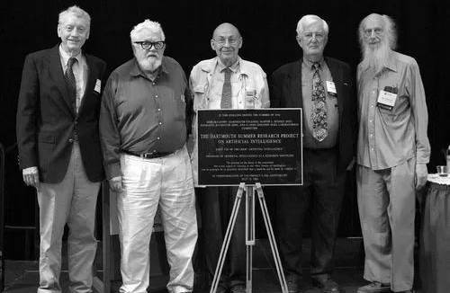

---
presentation:
  transition: "none"
  enableSpeakerNotes: true
  margin: 0
---

@import "../common/css/font-awesome-4.7.0/css/font-awesome.css"
@import "../common/css/zhangt-solarized.css"
@import "css/GNN.css"

<!-- slide data-notes="因为有超过一半的同学没学过机器学习，所以我打算花两次课的时间做个机器学习的扫盲，顺便把一些基本概念，如损失函数、正则化什么的讲一下，这些概念即便到了图神经网络里也是通用的" -->
<div class="header"></div>

<div class="bottom15"></div>

# 图神经网络导论

<hr class="width18">

## 机器学习 上

<div class="bottom5"></div>

### 计算机科学与技术学院 &nbsp; &nbsp; 张腾

<br>

#### tengzhang@hust.edu.cn

<!-- slide vertical=true data-notes="这张图算是人工智能的常见黑话大集合，大家如果稍微关注些人工智能的话，应该会经常听到这些词，我这里给大家捋一下它们之间的关系，最大的概念叫人工智能<br>监督信息和模型假设并不是并列关系的，只是看待机器学习的不同视角，因此有半监督支持向量机这种东西" -->

GNN-HEADER 大纲

@import "../dot/outline.dot"

GNN-FOOTER 图神经网络导论 机器学习 tengzhang@hust.edu.cn

<!-- slide data-notes="就先从最大的人工智能说起吧" -->

GNN-HEADER 大纲

@import "../dot/outline-ai.dot"

GNN-FOOTER 图神经网络导论 机器学习 tengzhang@hust.edu.cn

<!-- slide vertical=true data-notes="控制论之父维纳在他的大作《控制论》<br><br>讲完后提一下，现在我们国家也高度重视人工智能的发展，因为1760年第一次工业革命，1870年第二次工业革命我国都完全没赶上，互联网和移动互联网引发第三次工业革命我们国家也只赶上个末班车，而西方国家确立对非西方的绝对优势就是这三次工业革命，所以对于人工智能技术为核心推动的第四次工业革命是绝对重视，所以这里打个广告，大家现在上车还来得及<br><br>扯远了" -->

GNN-HEADER 背景

<br>

维纳 《控制论》：

<br>

> 第一次工业革命：用某种机器来减轻甚至代替<span class="blue">体力</span>劳动

> 上世纪中叶：用某种新型机器来减轻甚至代替某些<span class="blue">脑力</span>劳动

</br>

关键：让机器具有人类的智能

</br>

问题：什么是智能？

GNN-FOOTER 图神经网络导论 机器学习 tengzhang@hust.edu.cn

<!-- slide vertical=true data-notes="智能这一说法最早是图灵在他1950年的论文里提出的，后来被人们称为图灵测试<br><br>学习指学习新东西、探索未知的能力，感知处理看和听，认知是思考和推理" -->

GNN-HEADER 起源

<div class="multi_column bottom-12">
    <div class="width22 left0 right0">
        <p>《Computing Machinery and Intelligence》</p><br>
        <p>图灵在他 1950 年的这篇论文中提出了<span class="blue">图灵测试</span>：一个人在不接触对方的情况下，通过一种特殊的方式，和对方进行一系列的问答，如果在相当长时间内，他无法根据这些问题判断对方是人还是计算机，那么就可以认为这个计算机是智能的</p>
    </div>
    <div class="width10 left0 right2 top4">
        
    </div>
</div>

要想通过图灵测试，机器得具备多种能力

- 学习：机器学习
- 感知：计算机视觉，语音识别
- 认知：自然语言处理，知识表示

GNN-FOOTER 图神经网络导论 机器学习 tengzhang@hust.edu.cn

<!-- slide vertical=true data-notes="图中的5位是06年会议50周年时还建在的5位，左一是摩尔，右二赛弗里奇，右一是所罗门诺夫<br><br>香农是被麦卡锡拉过去站台的，除香农都得过图灵奖，C罗奖给梅西，梅西也不会要<br><br>1971年麦卡锡获得图灵奖，发明了第一个函数式程序语言Lisp，函数式编程更加强调程序执行的结果而非执行的过程，倡导利用若干简单的执行单元让计算结果不断渐进，逐层推导复杂的运算，而不是设计一个复杂的执行过程<br><br>明斯基写过一本书，叫感知机<br><br>西蒙是中科院外籍院士，9个博士学位，中文名司马贺<br><br>纽厄尔一直是西蒙的合作者，曾在美国智库兰德公司供职" -->

GNN-HEADER 元年

达特茅斯会议

- 时间：1956 年
- 地点：达特茅斯学院
- 人物：香农、麦卡锡、明斯基、西蒙、纽厄尔等十人
- 事件：讨论用机器模拟人的智能

<br>

<div class="multi_column top_2">
    
    
</div>

GNN-FOOTER 图神经网络导论 机器学习 tengzhang@hust.edu.cn

<!-- slide vertical=true data-notes="人工智能的发展大致可以分成三个阶段，" -->

GNN-HEADER 发展

@import "../mermaid/ai.mermaid"

秽土转生

- 推理：反绎学习，图神经网络
- 知识：知识图谱，图神经网络

GNN-FOOTER 图神经网络导论 机器学习 tengzhang@hust.edu.cn

<!-- slide data-notes="我个人猜测原因是数学原理讲的是公理集合论 当然是罗素的 不是zfc 天生符号化" -->

GNN-HEADER 推理期

机器擅长固定套路的计算 vs. 人类擅长妙手偶得的推理

<div class="bottom4"></div>

符号主义：<span class="blue">智能 = 逻辑推理</span>

<div class="bottom4"></div>

西蒙和纽厄尔设计了<span class="blue">逻辑理论家</span>程序

- 1952 年，逻辑理论家证明了 《数学原理》 中的 38 条定理
- 1963 年，证明了全部 52 条定理，其中定理 2.85 的证明比原书作者更巧妙
- 西蒙和纽厄尔获得了 1975 年的图灵奖

<div class="bottom4"></div>

衰退：

- 并非所有定理都可以方便地符号化，也并非所有问题都可以转换成推理问题
- 十万步内无法证明<span class="blue">两个连续函数之和还是连续函数</span>

GNN-FOOTER 图神经网络导论 机器学习 tengzhang@hust.edu.cn

<!-- slide vertical=true data-notes="" -->

GNN-HEADER 符号主义

根据以下事实判别谁说了实话

- $A$：$B$和$C$都是说谎者
- $B$：$A$和$C$都是说谎者
- $C$：$A$和$B$中至少有一个说谎者

<div class="threelines row7-border-top-solid column1-border-right-solid">

|   公式   |          $p \rightarrow q$           | $\Longleftrightarrow$ |                   $\neg p \vee q$                    |
| :------: | :----------------------------------: | :-------------------: | :--------------------------------------------------: |
| **条件** | $A \rightarrow \neg B \wedge \neg C$ | $\Longleftrightarrow$ | $1.~\neg A \vee \neg B, \quad 2.~\neg A \vee \neg C$ |
|          |    $\neg A \rightarrow B \vee C$     | $\Longleftrightarrow$ |                 $3.~A \vee B \vee C$                 |
|          | $B \rightarrow \neg A \wedge \neg C$ | $\Longleftrightarrow$ |               $4.~\neg B \vee \neg C$                |
|          |    $\neg B \rightarrow A \vee C$     | $\Longleftrightarrow$ |                 $3.~A \vee B \vee C$                 |
|          |  $C \rightarrow \neg A \vee \neg B$  | $\Longleftrightarrow$ |         $5.~\neg A \vee \neg B \vee \neg C$          |
|          |   $\neg C \rightarrow A \wedge B$    | $\Longleftrightarrow$ |           $6.~A \vee C, \quad 7.~B \vee C$           |
| **归结** | $1 + 7 \rightarrow 8.~\neg A \vee C$ | $\Longleftrightarrow$ |                     $C$说了实话                      |

</div>

GNN-FOOTER 图神经网络导论 机器学习 tengzhang@hust.edu.cn

<!-- slide vertical=true data-notes="从推理期得到的教训是" -->

GNN-HEADER 知识期

教训：光有逻辑推理远远不够，机器得拥有知识

<div class="bottom4"></div>

信仰：知识就是力量，<span class="blue">智能 = 知识 + 逻辑推理</span>

<div class="bottom4"></div>

专家系统 = 知识库 + 推理机

- 在特定领域内具有专家水平解决问题能力的程序系统
- 第一个成功的专家系统 DENDRAL 于 1968 年问世
- 知识工程之父费根鲍姆获得了 1994 年的图灵奖

<div class="bottom4"></div>

衰退：

- 人工构建知识库成本太高
- 很多知识获取困难，甚至无法被清晰地表示出来

GNN-FOOTER 图神经网络导论 机器学习 tengzhang@hust.edu.cn

<!-- slide vertical=true data-notes="" -->

GNN-HEADER 动物识别专家系统

@import "../dot/reasoning.dot"

GNN-FOOTER 图神经网络导论 机器学习 tengzhang@hust.edu.cn

<!-- slide data-notes="对于人类的很多智能行为(比如语言理解、图像理解等) 我们很难知道其中的原理 也无法描述出这些智能行为背后的“知识” <br><br> 因此 我们也很难通过知识和推理的方式来实现这些行为的智能系统。为了解决这类问题,研究者开始将研究重点转向让计算机从数据中自己学习" -->

GNN-HEADER 学习期

基本想法：让<span class="blue">机器</span>从数据中自动<span class="blue">学习</span>得到某种知识 (规律)

基本流程：

@import "../dot/ml-old.dot"

<div class="bottom0"></div>

原始数据：图片、视频、文本、语音、……

特征工程：

- 提取：选取对目标任务有用的潜在特征，如对西瓜提取色泽、根蒂、敲声等
- 处理：无序的离散类别特征 → 数值特征，特征缺失处理，特征标准化
- 变换：对特征进行挑选或映射得到对目标任务更有效的特征

模型学习：机器学习最核心的部分，学习一个特征到类别标记的映射

GNN-FOOTER 图神经网络导论 机器学习 tengzhang@hust.edu.cn

<!-- slide vertical=true data-notes="" -->

GNN-HEADER 特征提取 以文本为例

<span class="blue">词袋模型</span> (bag-of-words)：文本是单词的集合，单词间独立、无序

所有文本全部$d$个不同的单词构成词典，每个文本提取$d$个特征

若词典第$i$个词在当前文本中出现过，则其第$i$个特征为$1$，否则为$0$

```python {.line-numbers}
from sklearn.feature_extraction.text import CountVectorizer
import pandas as pd

document1 = "I have a pen, I have an apple, apple pen."
document2 = "I have a pen, I have pineapple, pineapple pen."
cv = CountVectorizer(lowercase=False, token_pattern='\w+', binary=True)
model = cv.fit_transform([document1, document2])
pd.DataFrame(model.toarray(), columns=cv.get_feature_names_out())
```

<div class="threelines column1-border-right-solid column1-bold head-highlight-1 tr-hover top-4">

|  词典  |  I  |  a  | an  | apple | have | pen | pineapple |
| :----: | :-: | :-: | :-: | :---: | :--: | :-: | :-------: |
| 文本 1 |  1  |  1  |  1  |   1   |  1   |  1  |     0     |
| 文本 2 |  1  |  1  |  0  |   0   |  1   |  1  |     1     |

</div>

GNN-FOOTER 图神经网络导论 机器学习 tengzhang@hust.edu.cn

<!-- slide vertical=true data-notes="" -->

GNN-HEADER 特征提取 以文本为例

<span class="blue">词袋模型</span> (bag-of-words)：文本是单词的集合，单词间独立、无序

所有文本全部$d$个不同的单词构成词典，每个文本提取$d$个特征

若词典第$i$个词在当前文本中出现了$k$次，则其第$i$个特征为$k$

```python {.line-numbers}
from sklearn.feature_extraction.text import CountVectorizer
import pandas as pd

document1 = "I have a pen, I have an apple, apple pen."
document2 = "I have a pen, I have pineapple, pineapple pen."
cv = CountVectorizer(lowercase=False, token_pattern='\w+')
model = cv.fit_transform([document1, document2])
pd.DataFrame(model.toarray(), columns=cv.get_feature_names_out())
```

<div class="threelines column1-border-right-solid column1-bold head-highlight-1 tr-hover top-4">

|  词典  |  I  |  a  | an  | apple | have | pen | pineapple |
| :----: | :-: | :-: | :-: | :---: | :--: | :-: | :-------: |
| 文本 1 |  2  |  1  |  1  |   2   |  2   |  2  |     0     |
| 文本 2 |  2  |  1  |  0  |   0   |  2   |  2  |     2     |

</div>

GNN-FOOTER 图神经网络导论 机器学习 tengzhang@hust.edu.cn

<!-- slide vertical=true data-notes="这里要说一下啥是 l1 l2" -->

GNN-HEADER 特征提取 以文本为例

<span class="blue">词袋模型</span> (bag-of-words)：文本是单词的集合，单词间独立、无序

所有文本全部$d$个不同的单词构成词典，每个文本提取$d$个特征

<span class="blue">词频 - 逆文本频率</span>特征：对当前文本重要的单词必然

- 在当前文本中出现的频率高，即词频 (term frequency, tf) 高
- 在其他文本中出现的频率低，即逆文本频率 (inverse document frequency, idf) 高

tf = 单词在当前文本中出现的次数 / 当前文本的总词数

idf = ln ((全部文本数 + C) / (包含该词的总文本数 + C)) + 1

- C = 0，若词典包含从未在任何文本中出现的词，会有分母为零的问题
- C = 1，sklearn 中默认采用的平滑版本，相当于额外有一个包含所有词的文本

tf - idf 特征 = normalize (tf × idf)，即将 tf 和 idf 相乘后再标准化

- $\ell_1$标准化，tf × idf / sum (tf × idf)，即线性变换成概率分布
- $\ell_2$标准化，tf × idf / sqrt(sum ([tf × idf]^2))，即线性变换成模为 1 的向量

GNN-FOOTER 图神经网络导论 机器学习 tengzhang@hust.edu.cn

<!-- slide vertical=true data-notes="" -->

GNN-HEADER 特征提取 以文本为例

```python {.line-numbers}
from sklearn.feature_extraction.text import TfidfVectorizer
import pandas as pd

document1 = "I have a pen, I have an apple, apple pen."
document2 = "I have a pen, I have pineapple, pineapple pen."
tv = TfidfVectorizer(lowercase=False, token_pattern='\w+',
                     norm='l1', smooth_idf=False) # l1归一化 idf不平滑
model = tv.fit_transform([document1, document2])
pd.DataFrame(model.toarray(), columns=cv.get_feature_names_out())
```

<div class="threelines row3-border-top-dashed row3-border-bottom-dashed column1-border1-right-dashed-head row1-column1-border1-right-dashed row3-column1-border1-right-dashed row4-column1-border1-right-dashed head-highlight-1 tr-hover top-4">

|   词典   |     I      |     a      |     an     |   apple    |    have    |    pen     | pineapple  |
| :------: | :--------: | :--------: | :--------: | :--------: | :--------: | :--------: | :--------: |
|    tf    |   2 / 10   |   1 / 10   |   1 / 10   |   2 / 10   |   2 / 10   |   2 / 10   |     0      |
|    ^     |   2 / 9    |   1 / 9    |     0      |     0      |   2 / 9    |   2 / 9    |   2 / 9    |
|   idf    | ln (1) + 1 | ln (1) + 1 | ln (2) + 1 | ln (2) + 1 | ln (1) + 1 | ln (1) + 1 | ln (2) + 1 |
| tf - idf |  0.165571  |  0.082785  |  0.140168  |  0.280335  |  0.165571  |  0.165571  |  0.000000  |
|    ^     |  0.192561  |  0.096281  |  0.000000  |  0.000000  |  0.192561  |  0.192561  |  0.326035  |

</div>

GNN-FOOTER 图神经网络导论 机器学习 tengzhang@hust.edu.cn

<!-- slide data-notes="" -->

GNN-HEADER 特征 离散类别 → 数值

<div class="threelines column9-border-right-solid head-highlight-1 tr-hover">

| 编号 | 色泽 | 根蒂 | 敲声 | 纹理 | 脐部 | 触感 | 密度  | 含糖率 | 好瓜 |
| :--: | :--: | :--: | :--: | :--: | :--: | :--: | :---: | :----: | :--: |
|  1   | 青绿 | 蜷缩 | 浊响 | 清晰 | 凹陷 | 硬滑 | 0.697 | 0.460  |  是  |
|  2   | 乌黑 | 蜷缩 | 沉闷 | 清晰 | 凹陷 | 硬滑 | 0.774 | 0.376  |  是  |
|  3   | 乌黑 | 稍蜷 | 沉闷 | 稍糊 | 稍凹 | 硬滑 | 0.666 | 0.091  |  否  |
|  4   | 浅白 | 硬挺 | 清脆 | 模糊 | 平坦 | 硬滑 | 0.245 | 0.057  |  否  |

</div>

三种重编码方式：

- 序数编码 (ordinal encoding)：清晰 - 0、稍糊 - 1、模糊 - 2，<span class="blue">需类别特征本身有序</span>，否则若青绿 - 0、乌黑 - 1、浅白 - 2，为何 | 青绿 - 浅白 | > | 乌黑 - 浅白 | ？
- 独热编码 (one-hot encoding)：青绿 - 001、乌黑 - 010、浅白 - 100，一碗水端平，所有取值距离相等，但若取值很多码会很长，且不适应动态出现的新取值
- 哈希编码 (hash encoding)：用哈希函数将任意输入映射到有限整数范围，码长固定，也能适应动态出现的新取值，但可能存在信息丢失

GNN-FOOTER 图神经网络导论 机器学习 tengzhang@hust.edu.cn

<!-- slide vertical=true data-notes="" -->

GNN-HEADER 特征独热编码

```python {.line-numbers}
import numpy as np
from sklearn.preprocessing import LabelBinarizer, OneHotEncoder

X = np.array([
    [1, '青绿', '蜷缩', '浊响', '清晰', '凹陷', '硬滑', 0.697, 0.460],
    [2, '乌黑', '蜷缩', '沉闷', '清晰', '凹陷', '硬滑', 0.774, 0.376],
    [3, '乌黑', '稍蜷', '沉闷', '稍糊', '稍凹', '硬滑', 0.666, 0.091],
    [4, '浅白', '硬挺', '清脆', '模糊', '平坦', '硬滑', 0.245, 0.057],])
y = np.array(['是', '是', '否', '否']) # 类别标记只有两种取值
LabelBinarizer().fit_transform(y).squeeze()
[1 1 0 0]

enc = OneHotEncoder()
enc.fit_transform(X[:, 1:7]).toarray() # 对6个类别特征采用独热编码
[[0. 0. 1. 0. 0. 1. 0. 1. 0. 0. 1. 0. 1. 0. 0. 1.]
 [1. 0. 0. 0. 0. 1. 1. 0. 0. 0. 1. 0. 1. 0. 0. 1.]
 [1. 0. 0. 0. 1. 0. 1. 0. 0. 0. 0. 1. 0. 0. 1. 1.]
 [0. 1. 0. 1. 0. 0. 0. 0. 1. 1. 0. 0. 0. 1. 0. 1.]]

enc.get_feature_names_out() # 独热编码对应的原始特征
['x0_乌黑' 'x0_浅白' 'x0_青绿' 'x1_硬挺' 'x1_稍蜷' 'x1_蜷缩' 'x2_沉闷' 'x2_浊响'
 'x2_清脆' 'x3_模糊' 'x3_清晰' 'x3_稍糊' 'x4_凹陷' 'x4_平坦' 'x4_稍凹' 'x5_硬滑']
```

GNN-FOOTER 图神经网络导论 机器学习 tengzhang@hust.edu.cn

<!-- slide data-notes="有时会因为特殊原因，特征不是完整的，比如医院的病人数据，病人不可能把你的所有检查都来一遍，都是能省则省 <br><br> 本来机器学习的目的是要找到特征到类别标记的映射，对于缺失特征，可以将其先看作要预测的类别标记，先学一个无缺失特征到有缺失特征的映射，利用这个映射先将缺失的特征都补上，然后再学习类别标记 <br><br> 比如图里这个例子，含糖率有缺失，我就先用除含糖率外的特征学习一个到含糖率的映射，这是一个回归问题" -->

GNN-HEADER 特征缺失处理

<div class="threelines column9-border-right-solid head-highlight-1 tr-hover">

| 编号 | 色泽 | 根蒂 | 敲声 | 纹理 | 脐部 | 触感 | 密度  | 含糖率 | 好瓜 |
| :--: | :--: | :--: | :--: | :--: | :--: | :--: | :---: | :----: | :--: |
|  1   | 青绿 | 蜷缩 | 浊响 | 清晰 | 凹陷 | 硬滑 | 0.697 |   -    |  是  |
|  2   | 乌黑 | 蜷缩 | 沉闷 | 清晰 | 凹陷 | 硬滑 | 0.774 | 0.376  |  是  |
|  3   | 乌黑 | 稍蜷 | 沉闷 |  -   | 稍凹 | 硬滑 | 0.666 | 0.091  |  否  |
|  4   | 浅白 | 硬挺 | 清脆 | 模糊 | 平坦 | 硬滑 | 0.245 | 0.057  |  否  |

</div>

删除：直接删除有特征缺失的样本，简单粗暴，信息损失

补全：

- 用其他未缺失该特征的样本计算平均数、中位数、众数填充，人为引入噪声
- 用不存在缺失的其它特征<span class="blue">学习并预测</span>缺失特征的取值，若两者之间无关？
- 将“缺失”本身作为一种特征取值

忽略：采用对缺失特征不敏感的学习模型，如决策树

GNN-FOOTER 图神经网络导论 机器学习 tengzhang@hust.edu.cn

<!-- slide vertical=true data-notes="" -->

GNN-HEADER 特征缺失处理

```python {.line-numbers}
import numpy as np
from sklearn.impute import SimpleImputer

X = np.array([
    [1, '青绿', '蜷缩', '浊响', '清晰', '凹陷', '硬滑', 0.697, np.nan],
    [2, '乌黑', '蜷缩', '沉闷', '清晰', '凹陷', '硬滑', 0.774, 0.376],
    [3, '乌黑', '稍蜷', '沉闷', '-', '稍凹', '硬滑', 0.666, 0.091],
    [4, '浅白', '硬挺', '清脆', '模糊', '平坦', '硬滑', 0.245, 0.057],
])

imp_mean = SimpleImputer(strategy='mean')
imp_mean.fit_transform(X[:, 7:9]) # 用均值填充
[[0.697    0.17466667],
 [0.774    0.376     ],
 [0.666    0.091     ],
 [0.245    0.057     ]]

imp_median = SimpleImputer(strategy='median')
imp_median.fit_transform(X[:, 7:9]) # 用中位数填充
[[0.697    0.091],
 [0.774    0.376],
 [0.666    0.091],
 [0.245    0.057]]

imp_frequent = SimpleImputer(missing_values='-', strategy='most_frequent')
imp_frequent.fit_transform(X[:, 1:7].astype('object')) # 用众数填充
[['青绿', '蜷缩', '浊响', '清晰', '凹陷', '硬滑'],
 ['乌黑', '蜷缩', '沉闷', '清晰', '凹陷', '硬滑'],
 ['乌黑', '稍蜷', '沉闷', '清晰', '稍凹', '硬滑'],
 ['浅白', '硬挺', '清脆', '模糊', '平坦', '硬滑']]

# 回归器默认采用BayesianRidge
# 可选DecisionTreeRegressor ExtraTreesRegressor KNeighborsRegressor
imp_iter = IterativeImputer()
imp_iter.fit_transform(X[:, 7:9])
[[0.697    0.20908713],
 [0.774    0.376     ],
 [0.666    0.091     ],
 [0.245    0.057     ]]
```

GNN-FOOTER 图神经网络导论 机器学习 tengzhang@hust.edu.cn

<!-- slide data-notes="" -->

GNN-HEADER 特征标准化

也称归一化，旨在<span class="blue">消除不同特征间的量纲影响</span>

<br>

离差标准化：将原始特征线性变换到 [0, 1] 区间

$$
\begin{align*}
    x \leftarrow \frac{x - x_\min}{x_\max - x_\min} \in [0,1]
\end{align*}
$$

最大值标准化：除以该特征的绝对值最大值

$$
\begin{align*}
    x \leftarrow \frac{x}{\max_{i \in [m]} |x_i|} \in [-1,1]
\end{align*}
$$

标准差标准化：经过处理的特征近似符合标准正态分布$\Ncal(0,1)$

$$
\begin{align*}
    x \leftarrow \frac{x - \mu}{\sigma}, \quad x \leftarrow \frac{x - x_{\text{median}}}{\sum_{i \in [m]} |x_i - x_{\text{median}}| / m}
\end{align*}
$$

GNN-FOOTER 图神经网络导论 机器学习 tengzhang@hust.edu.cn

<!-- slide vertical=true data-notes="" -->

GNN-HEADER 离差与最大值标准化

```python {.line-numbers}
import numpy as np
from sklearn.preprocessing import MinMaxScaler, MaxAbsScaler

X = np.array([
    [1, '青绿', '蜷缩', '浊响', '清晰', '凹陷', '硬滑', 0.697, 0.460],
    [2, '乌黑', '蜷缩', '沉闷', '清晰', '凹陷', '硬滑', 0.774, 0.376],
    [3, '乌黑', '稍蜷', '沉闷', '稍糊', '稍凹', '硬滑', 0.666, 0.091],
    [4, '浅白', '硬挺', '清脆', '模糊', '平坦', '硬滑', 0.245, 0.057],
])

MinMaxScaler().fit_transform(X[:, 7:9]) # 最大值变成1 同时 最小值变成0
[[0.85444234    1.        ],
 [1.            0.79156328],
 [0.79584121    0.08436725],
 [0.            0.        ]]

MaxAbsScaler().fit_transform(X[:, 7:9]) # 最大值变成1
[[0.9005168     1.        ],
 [1.            0.8173913 ],
 [0.86046512    0.19782609],
 [0.31653747    0.12391304]]
```

GNN-FOOTER 图神经网络导论 机器学习 tengzhang@hust.edu.cn

<!-- slide vertical=true data-notes="" -->

GNN-HEADER 标准差标准化

```python {.line-numbers}
import numpy as np
from sklearn.preprocessing import scale

X = np.array([
    [1, '青绿', '蜷缩', '浊响', '清晰', '凹陷', '硬滑', 0.697, 0.460],
    [2, '乌黑', '蜷缩', '沉闷', '清晰', '凹陷', '硬滑', 0.774, 0.376],
    [3, '乌黑', '稍蜷', '沉闷', '稍糊', '稍凹', '硬滑', 0.666, 0.091],
    [4, '浅白', '硬挺', '清脆', '模糊', '平坦', '硬滑', 0.245, 0.057],
])

x = scale(X[:, 7:9])
x
[[ 0.49236904     1.22314674]
 [ 0.86589038     0.74303307]
 [ 0.34199032    -0.88592404]
 [-1.70024974    -1.08025576]]

x.mean(axis=0) # 均值接近0
[-1.11022302e-16    -1.66533454e-16]

x.std(axis=0) # 标准差为1
[1.    1.]
```

GNN-FOOTER 图神经网络导论 机器学习 tengzhang@hust.edu.cn

<!-- slide data-notes="经过特征提取和标准化等预处理，就剩模型学习前的最后一步了，亦有将该步与模型学习融合的做法 <br><br> 分两种，当部分特征冗余甚至有害时，挑选出对目标任务有用的特征子集，去冗余可以降低计算开销，去有害可以提高模型学习成功率，最基本的就是过滤掉低方差特征" -->

GNN-HEADER 特征变换

该步是模型学习前的最后一步，亦有将该步与模型学习融合的做法

<br>

当部分特征冗余甚至有害时，挑选或生成有用的特征子集

- 去除低方差特征，特别是那些在所有样本上取值均不变的特征
- 先计算 F 检验值、卡方检验值、互信息、线性相关性等统计量，然后据此设立阈值选择特征
- 引入$\ell_1$等稀疏范数作为约束，将选择特征与模型学习合二为一
- 通过 PCA、随机投影等降维技术浓缩现有特征

<br>

当特征稀缺时，利用现有特征构造新的特征

- 凭经验显式构造：$\xv = [x_1; x_2] \xrightarrow{\Rbb^2 \mapsto \Rbb^6} \xvt = [x_1^2; x_2^2; \sqrt{2} x_1 x_2; \sqrt{2} x_1; \sqrt{2} x_2; 1]$
- 利用核函数$\kappa(\xv, \zv) = \phi(\xv)^\top \phi(\zv)$隐式构造，其中$\phi: \Rbb^d \mapsto \Hbb$是核映射，代表性方法为核方法
- 利用非线性函数复合$f_n ( f_{n-1} ( \cdots f_2 (f_1 (\xv))))$，代表性方法为神经网络

GNN-FOOTER 图神经网络导论 机器学习 tengzhang@hust.edu.cn

<!-- slide vertical=true data-notes="" -->

GNN-HEADER 特征变换

该步是模型学习前的最后一步，亦有将该步与模型学习融合的做法

<br>

当部分特征冗余甚至有害时，挑选或生成有用的特征子集

- 去除低方差特征，特别是那些在所有样本上取值均不变的特征
- 先计算 F 检验值、卡方检验值、互信息、线性相关性等统计量，然后据此设立阈值选择特征
- 引入$\ell_1$等稀疏范数作为约束，将选择特征与模型学习合二为一
- 通过 PCA、随机投影等降维技术浓缩现有特征

<br>

<div class="invis" markdown=1>

当特征稀缺时，利用现有特征构造新的特征

- 凭经验显式构造：$\xv = [x_1; x_2] \xrightarrow{\Rbb^2 \mapsto \Rbb^6} \xvt = [x_1^2; x_2^2; \sqrt{2} x_1 x_2; \sqrt{2} x_1; \sqrt{2} x_2; 1]$
- 利用核函数$\kappa(\xv, \zv) = \phi(\xv)^\top \phi(\zv)$隐式构造，其中$\phi: \Rbb^d \mapsto \Hbb$是核映射，代表性方法为核方法
- 利用非线性函数复合$f_n ( f_{n-1} ( \cdots f_2 (f_1 (\xv))))$，代表性方法为神经网络

</div>

GNN-FOOTER 图神经网络导论 机器学习 tengzhang@hust.edu.cn

<!-- slide vertical=true data-notes="" -->

GNN-HEADER 特征选择 低方差过滤

<span class="blue">过滤低方差特征</span>，尤其是那些在所有样本上取值均相同的特征

```python {.line-numbers}
import numpy as np
from sklearn.feature_selection import VarianceThreshold

X = np.array([ # 对西瓜数据集的6个离散类别特征采用了独热编码
    [1, 0, 0, 1, 0, 0, 1, 0, 1, 0, 0, 1, 0, 1, 0, 0, 1, 0.697, 0.460],
    [2, 1, 0, 0, 0, 0, 1, 1, 0, 0, 0, 1, 0, 1, 0, 0, 1, 0.774, 0.376],
    [3, 1, 0, 0, 0, 1, 0, 1, 0, 0, 0, 0, 1, 0, 0, 1, 1, 0.666, 0.091],
    [4, 0, 1, 0, 1, 0, 0, 0, 0, 1, 1, 0, 0, 0, 1, 0, 1, 0.245, 0.057],])
X.shape
(4, 19)

# 倒数第三列由特征“触感”而来 四个样本都取值“硬滑” 独热编码后都是1 方差为0
XX = VarianceThreshold(threshold=0.01).fit_transform(X)
[[1, 0, 0, 1, 0, 0, 1, 0, 1, 0, 0, 1, 0, 1, 0, 0, 0.697, 0.46 ],
 [2, 1, 0, 0, 0, 0, 1, 1, 0, 0, 0, 1, 0, 1, 0, 0, 0.774, 0.376],
 [3, 1, 0, 0, 0, 1, 0, 1, 0, 0, 0, 0, 1, 0, 0, 1, 0.666, 0.091],
 [4, 0, 1, 0, 1, 0, 0, 0, 0, 1, 1, 0, 0, 0, 1, 0, 0.245, 0.057]]

XX.shape
(4, 18)
```

GNN-FOOTER 图神经网络导论 机器学习 tengzhang@hust.edu.cn

<!-- slide data-notes="并非所有的特征都对后面的模型学习有用" -->

GNN-HEADER 特征选择 方差分析

设共有$k$个类别，总样本数为$m = \sum_{i \in [k]} m_i$，总体均值为$\xbar$

设第$i$类第$j$个样本为$x_{ij}$，第$i$类的均值为$\xbar_i$，则总体偏差

$$
\begin{align*}
    \sum_{i \in [k]} & \sum_{j \in [m_i]} (x_{ij} - \xbar)^2 = \sum_{i \in [k]} \sum_{j \in [m_i]} (x_{ij} - \xbar_i + \xbar_i - \xbar)^2 \\
    & = \sum_{i \in [k]} \sum_{j \in [m_i]} [ (x_{ij} - \xbar_i)^2 + (\xbar_i - \xbar)^2 ] + \sum_{i \in [k]} 2 \underbrace{\sum_{j \in [m_i]} (x_{ij} - \xbar_i)}_{=0} (\xbar_i - \xbar) \\
    & = \sum_{i \in [k]} \sum_{j \in [m_i]} (x_{ij} - \xbar_i)^2 + \sum_{i \in [k]} m_i (\xbar_i - \xbar)^2 = SSE + SSB
\end{align*}
$$

- $SSE$为各类样本与各类均值的偏差之和，越小说明每个类别各自聚集越紧密
- $SSB$为各类均值与总体的偏差之和，越小说明不同类别的均值差异越小
- $F = \frac{SSB/(k-1)}{SSE/(m-k)}$越小，说明类别间差异越小

GNN-FOOTER 图神经网络导论 机器学习 tengzhang@hust.edu.cn

<!-- slide vertical=true data-notes="" -->

GNN-HEADER 特征选择 方差分析

对任意特征，根据类别标记一分为二计算$F$值，判断差异是否显著

<div class="threelines column9-border-right-solid head-highlight-1 tr-hover">

| 编号 | 色泽 | 根蒂 | 敲声 | 纹理 | 脐部 | 触感 | 密度  | 含糖率 | 好瓜 |
| :--: | :--: | :--: | :--: | :--: | :--: | :--: | :---: | :----: | :--: |
|  1   | 青绿 | 蜷缩 | 浊响 | 清晰 | 凹陷 | 硬滑 | 0.697 | 0.460  |  是  |
|  2   | 乌黑 | 蜷缩 | 沉闷 | 清晰 | 凹陷 | 硬滑 | 0.774 | 0.376  |  是  |
|  3   | 乌黑 | 稍蜷 | 沉闷 | 稍糊 | 稍凹 | 硬滑 | 0.666 | 0.091  |  否  |
|  4   | 浅白 | 硬挺 | 清脆 | 模糊 | 平坦 | 硬滑 | 0.245 | 0.057  |  否  |

</div>

经独热编码后，特征“色泽”变成三个特征，其中一个为色泽是否乌黑

对乌黑

- 好瓜的特征$x_{11} = 0$、$x_{12} = 1$，均值$\xbar_1 = 0.5$、偏差$0.5$
- 坏瓜的特征$x_{21} = 1$、$x_{22} = 0$，均值$\xbar_2 = 0.5$、偏差$0.5$，$SSE = 1$
- 总体均值$\xbar = 0.5$，$SSB = 4 (0.5 - 0.5)^2 = 0$，$F = \frac{0/(2-1)}{1/(4-2)} = 0$

GNN-FOOTER 图神经网络导论 机器学习 tengzhang@hust.edu.cn

<!-- slide vertical=true data-notes="" -->

GNN-HEADER 特征选择 方差分析

对编号

- 好瓜的特征$x_{11} = 1$、$x_{12} = 2$，均值$\xbar_1 = 1.5$、偏差$0.5$
- 坏瓜的特征$x_{21} = 3$、$x_{22} = 4$，均值$\xbar_2 = 3.5$、偏差$0.5$，$SSE = 1$
- 总体均值$\xbar = 2.5$，$SSB = 2(1.5-2.5)^2 + 2(3.5-2.5)^2 = 4$，$F = \frac{4/(2-1)}{1/(4-2)} = 8$

```python {.line-numbers}
import numpy as np
from sklearn.feature_selection import SelectKBest, f_classif
X = np.array([ # 已去掉 与y完全相同的特征 和 方差为零的特征
    [1, 0, 0, 1, 0, 0, 0, 1, 0, 0, 0, 0, 0, 0.697, 0.460],
    [2, 1, 0, 0, 0, 0, 1, 0, 0, 0, 0, 0, 0, 0.774, 0.376],
    [3, 1, 0, 0, 0, 1, 1, 0, 0, 0, 1, 0, 1, 0.666, 0.091],
    [4, 0, 1, 0, 1, 0, 0, 0, 1, 1, 0, 1, 0, 0.245, 0.057],])
y = [1, 1, 0, 0]
sk = SelectKBest(f_classif)
sk.fit_transform(X, y)
sk.scores_
[ 8.        ,  0.        ,  1.        ,  1.        ,  1.        ,
  1.        ,  0.        ,  1.        ,  1.        ,  1.        ,
  1.        ,  1.        ,  1.        ,  1.71207075, 57.64052606]
```

GNN-FOOTER 图神经网络导论 机器学习 tengzhang@hust.edu.cn

<!-- slide data-notes="并非所有的特征都对后面的模型学习有用" -->

GNN-HEADER 特征选择 卡方检验

- 若随机变量$X$和$Y$独立，则$p(X,Y) = p(X) p(Y)$
- $|p(X,Y) - p(X) p(Y)|$可衡量$X$和$Y$的独立程度

<div class="threelines row4-border-top-solid column1-border-right-solid column3-border-right-solid column1-bold">

|          |                  好瓜                   |                 坏瓜                  | 边际概率 |
| :------: | :-------------------------------------: | :-----------------------------------: | :------: |
|   青绿   | $1, ~ (0.5 = 4 \times 0.25 \times 0.5)$ | $0, (0.5 = 4 \times 0.25 \times 0.5)$ |  $0.25$  |
|   乌黑   |  $1, ~ (1 = 4 \times 0.5 \times 0.5)$   |  $1, (1 = 4 \times 0.5 \times 0.5)$   |  $0.5$   |
|   浅白   | $0, ~ (0.5 = 4 \times 0.25 \times 0.5)$ | $1, (0.5 = 4 \times 0.25 \times 0.5)$ |  $0.25$  |
| 边际概率 |                  $0.5$                  |                 $0.5$                 |   $1$    |

</div>

- $X$是色泽，$Y$是瓜的好坏，总样本数为$4$
- 括号前的<span class="blue">观测频数</span>$o = 4 \times p(X,Y)$，括号中的<span class="blue">期望频数</span>$e = 4 \times p(X) p(Y)$

$$
\begin{align*}
    \chi^2 = \sum_{ij} \frac{(o_{ij}-e_{ij})^2}{e_{ij}} = 4 \times \frac{(1 - 0.5)^2}{0.5} = 2
\end{align*}
$$

GNN-FOOTER 图神经网络导论 机器学习 tengzhang@hust.edu.cn

<!-- slide vertical=true data-notes="并非所有的特征都对后面的模型学习有用" -->

GNN-HEADER 特征选择 卡方检验

```python {.line-numbers}
import numpy as np
from sklearn.feature_selection import SelectKBest, chi2
X = np.array([
    [1, 0, 0, 1, 0, 0, 0, 1, 0, 0, 0, 0, 0, 0.697, 0.460],
    [2, 1, 0, 0, 0, 0, 1, 0, 0, 0, 0, 0, 0, 0.774, 0.376],
    [3, 1, 0, 0, 0, 1, 1, 0, 0, 0, 1, 0, 1, 0.666, 0.091],
    [4, 0, 1, 0, 1, 0, 0, 0, 1, 1, 0, 1, 0, 0.245, 0.057],
])
y = [1, 1, 0, 0]

sk = SelectKBest(chi2, k=1)
sk.fit_transform(X, y)
sk.scores_
[1.6       , 0.        , 1.        , 1.        , 1.        ,
 1.        , 2.        , 0.        , 1.        , 1.        ,
 1.        , 2.        , 1.        , 2.        , 1.        ,
 1.        , 0.        , 0.13165407, 0.48104065]
```

独热编码将色泽分成了三个特征，其卡方检验值为 0 + 1 + 1 = 2

GNN-FOOTER 图神经网络导论 机器学习 tengzhang@hust.edu.cn

<!-- slide data-notes="并非所有的特征都对后面的模型学习有用" -->

GNN-HEADER 特征选择 互信息

熵 (entropy) 可以度量<span class="blue">随机变量的不确定性</span>

$$
\begin{align*}
    H(X) = - \sum_{i \in [m]} p(x_i) \log p(x_i) = - \Ebb [\log p(X)], \quad 0 \log 0 \triangleq 0
\end{align*}
$$

当$p(x_1) = \cdots = p(x_m) = \frac{1}{m}$时，熵达到最大值$\log m$

拉格朗日函数$L = - \sum_{i \in [m]} p(x_i) \log p(x_i) - \alpha (\sum_{i \in [m]} p(x_i) - 1)$，令

$$
\begin{align*}
    \frac{\partial L}{\partial p(x_i)} = - \log p(x_i) - 1 - \alpha = 0 ~ \Longrightarrow ~ p(x_i) = \exp(-1-\alpha) = \frac{1}{m}
\end{align*}
$$

当某个$p(x_i) = 1$、其余为零时，熵达到最小值$0$，此时无不确定性

$$
\begin{align*}
    H(X) = \sum_{i \in [m]} p(x_i) \log \frac{1}{p(x_i)} \ge \sum_{i \in [m]} p(x_i) \log 1 = 0
\end{align*}
$$

GNN-FOOTER 图神经网络导论 机器学习 tengzhang@hust.edu.cn

<!-- slide vertical=true data-notes="并非所有的特征都对后面的模型学习有用" -->

GNN-HEADER 特征选择 互信息

联合熵：两个随机变量的联合不确定性

$$
\begin{align*}
    H(X,Y) = - \sum_{i \in [m]} \sum_{j \in [n]} p(x_i,y_j) \log p(x_i,y_j) = - \Ebb [\log p(X,Y)]
\end{align*}
$$

条件熵：给定一个随机变量的取值后，另一个随机变量的不确定性

$$
\begin{align*}
    H(X|Y) & = H(X,Y) - H(Y) \\
    & = - \sum_{i \in [m]} \sum_{j \in [n]} p(x_i,y_j) \log p(x_i,y_j) + \sum_{j \in [n]} \class{blue}{p(y_j)} \log p(y_j) \\
    & = - \sum_{i \in [m]} \sum_{j \in [n]} p(x_i,y_j) \log p(x_i,y_j) + \sum_{j \in [n]} \class{blue}{\sum_{i \in [m]} p(x_i,y_j)} \log p(y_j) \\
    & = - \sum_{i \in [m]} \sum_{j \in [n]} p(x_i,y_j) \log p(x_i|y_j) \\
    & = - \Ebb [\log p(X|Y)]
\end{align*}
$$

GNN-FOOTER 图神经网络导论 机器学习 tengzhang@hust.edu.cn

<!-- slide vertical=true data-notes="随机变量独立 互信息为零 交集为空" -->

GNN-HEADER 特征选择 互信息

互信息：两个随机变量之间的相关程度

$$
\begin{align*}
    I(X;Y) & = H(X) - H(X|Y) \\
    & = - \sum_{i \in [m]} \class{blue}{p(x_i)} \log p(x_i) + \sum_{i \in [m]} \sum_{j \in [n]} p(x_i,y_j) \log p(x_i|y_j) \\
    & = - \sum_{i \in [m]} \class{blue}{\sum_{j \in [n]} p(x_i,y_j)} \log p(x_i) + \sum_{i \in [m]} \sum_{j \in [n]} p(x_i,y_j) \log \frac{p(x_i,y_j)}{p(y_j)} \\
    & = - \sum_{i \in [m]} \sum_{j \in [n]} p(x_i,y_j) \log \frac{p(x_i)p(y_j)}{p(x_i,y_j)} = \Ebb \left[ \log \frac{p(X,Y)}{p(X)p(Y)} \right]
\end{align*}
$$

互信息 (交集) 与熵、联合熵 (并集)、条件熵 (差集) 的关系为

$$
\begin{align*}
    I(X;Y) & = H(X) - H(X|Y) = H(Y) - H(Y|X) \\
    & = H(X) + H(Y) - H(X,Y) \\
    & = H(X,Y) - H(X|Y) - H(Y|X)
\end{align*}
$$

GNN-FOOTER 图神经网络导论 机器学习 tengzhang@hust.edu.cn

<!-- slide vertical=true data-notes="随机变量独立 互信息为零 交集为空" -->

GNN-HEADER 特征选择 互信息

利用每个特征和类别标记之间的互信息进行挑选

```python {.line-numbers}
import numpy as np
from sklearn.feature_selection import SelectKBest, mutual_info_classif

X = np.array([
    [1, 0, 0, 1, 0, 0, 1, 0, 1, 0, 0, 1, 0, 1, 0, 0, 1, 0.697, 0.460],
    [2, 1, 0, 0, 0, 0, 1, 1, 0, 0, 0, 1, 0, 1, 0, 0, 1, 0.774, 0.376],
    [3, 1, 0, 0, 0, 1, 0, 1, 0, 0, 0, 0, 1, 0, 0, 1, 1, 0.666, 0.091],
    [4, 0, 1, 0, 1, 0, 0, 0, 0, 1, 1, 0, 0, 0, 1, 0, 1, 0.245, 0.057],
])
y = [1, 1, 0, 0]

sk = SelectKBest(mutual_info_classif)
sk.fit_transform(X, y)
sk.scores_
[0.58333333, 0.        , 0.        , 0.20833333, 0.        ,
 0.        , 0.83333333, 0.        , 0.        , 0.20833333,
 0.        , 0.83333333, 0.20833333, 0.83333333, 0.08333333,
 0.        , 0.        , 0.        , 0.83333333]
```

GNN-FOOTER 图神经网络导论 机器学习 tengzhang@hust.edu.cn

<!-- slide data-notes="并非所有的特征都对后面的模型学习有用" -->

GNN-HEADER 特征选择 线性相关性

$$
\begin{align*}
    \rho_{xy} = \frac{\cov(x,y)}{\sigma_x \sigma_y} = \frac{\sum_{i \in [m]} (x_i - \xbar)(y_i - \ybar)}{\sqrt{\sum_{i \in [m]} (x_i - \xbar)^2} \sqrt{\sum_{i \in [m]} (y_i - \ybar)^2}}
\end{align*}
$$

```python {.line-numbers}
import numpy as np

X = np.array([ # 最后一列为y
    [1, 0, 0, 1, 0, 0, 1, 0, 1, 0, 0, 1, 0, 1, 0, 0, 0.697, 0.460, 1],
    [2, 1, 0, 0, 0, 0, 1, 1, 0, 0, 0, 1, 0, 1, 0, 0, 0.774, 0.376, 1],
    [3, 1, 0, 0, 0, 1, 0, 1, 0, 0, 0, 0, 1, 0, 0, 1, 0.666, 0.091, 0],
    [4, 0, 1, 0, 1, 0, 0, 0, 0, 1, 1, 0, 0, 0, 1, 0, 0.245, 0.057, 0],
])

corr = np.corrcoef(X, rowvar=False)
corr[-1,:]
[-0.89442719,  0.        , -0.57735027,  0.57735027, -0.57735027,
 -0.57735027,  1.        ,  0.        ,  0.57735027, -0.57735027,
 -0.57735027,  1.        , -0.57735027,  1.        , -0.57735027,
 -0.57735027,  0.67912971,  0.9830899 ,  1.        ]
```

GNN-FOOTER 图神经网络导论 机器学习 tengzhang@hust.edu.cn

<!-- slide data-notes="绝对值就是实数上的最简单的范数" -->

GNN-HEADER 特征选择 稀疏范数

范数$\|\cdot\|$：长度概念的推广，对任意标量$\alpha$和向量空间中的$\uv, \vv$

- (半)正定性：$\| \uv \| \ge 0$，且$\| \uv \| = 0$当且仅当$\uv = \zerov$
- 齐次性：$\| \alpha \uv \| = |\alpha| \cdot \| \uv \|$
- 三角不等式：$\| \uv + \vv \| \le \| \uv \| + \| \vv \|$

<br>

机器学习中常用的是向量的$\ell_p$范数：$\| \wv \|_p \triangleq (\sum_{i \in d} |w_i|^p)^{1/p}$

- $\ell_1$范数：$\| \wv \|_1 = \sum_{i \in d} |w_i|$，各元素绝对值之和
- $\ell_2$范数：$\| \wv \|_2 = \sqrt{\sum_{i \in d} w_i^2}$，各元素平方和的正平方根
- $\ell_\infty$范数：$\| \wv \|_\infty = \max_{i \in d} |w_i|$，各元素绝对值的最大值

<br>

当$0 \le p < 1$时，$\| \cdot \|_p$不再是合法的范数，不满足三角不等式

- $\ell_0$范数：$\| \wv \|_0 = |\{ i \in d \mid w_i \ne 0 \}|$，非零元素的个数

GNN-FOOTER 图神经网络导论 机器学习 tengzhang@hust.edu.cn

<!-- slide vertical=true data-notes="" -->

GNN-HEADER 特征选择 稀疏范数

$\Rbb^2$上的 5 个$\ell_p$范数球$\{ \wv \mid \| \wv \|_p \le t \}$


- 将$\ell_p~(0 \le p \le 1)$范数球作为学习模型的可行域，可导出稀疏的解
- 所有$\ell_p~(p \ge 1)$范数球都是凸集，数学性质好

$\ell_1$唯一既凸且稀疏，将其范数球作为$\Rbb^2$上最小二乘的可行域

$$
\begin{align*}
    \min_{w_1, w_2} ~ \left \| \begin{bmatrix}
        -2.0011 & -0.8994 \\
        -1.0311 &  0.3146 \\
         0.6900 &  1.7222 \\
         2.3422 & -1.1373 \\
    \end{bmatrix} \begin{bmatrix}
        w_1 \\
        w_2 \\
    \end{bmatrix} - \begin{bmatrix}
        1 \\
        1 \\
        0 \\
        0 \\
    \end{bmatrix} \right\|^2 \quad \st ~ |w_1| + |w_2| \le t
\end{align*}
$$

GNN-FOOTER 图神经网络导论 机器学习 tengzhang@hust.edu.cn

<!-- slide vertical=true data-notes="" -->

GNN-HEADER 特征选择 稀疏范数

- 左图中以原点为中心的同心正方形是$\ell_1$范数球的等高线
- 右图中以原点为中心的同心圆是$\ell_2$范数球的等高线
- 两图中左边的一系列同心椭圆是$\| \Xv \wv - \yv \|^2$的等高线


椭圆与正方形必然交在正方形的顶点处，这意味着最优的$w_2 = 0$

GNN-FOOTER 图神经网络导论 机器学习 tengzhang@hust.edu.cn

<!-- slide data-notes="要说一下矩阵的F范数" -->

GNN-HEADER 特征变换 主成分分析

构造$\Rbb^D$中的$d$个标准正交基$\wv_1, \ldots, \wv_d$，将样本投到该$d$维子空间

$$
\begin{align*}
    \Xv \in \Rbb^{m \times D} \xrightarrow[降维]{\Wv = [\wv_1, \ldots, \wv_d] \in \Rbb^{D \times d}} \Xv \Wv \in \Rbb^{m \times d} \xrightarrow[重构]{\Wv^\top \in \Rbb^{d \times D}} \Xv \Wv \Wv^\top
\end{align*}
$$

投影到$d ~ (<D)$维子空间存在信息损失，$\Wv$应使得<span class="blue">重构误差尽可能小</span>

$$
\begin{align*}
    \| \Xv & - \Xv \Wv \Wv^\top \|_F^2 = \tr [(\Xv - \Xv \Wv \Wv^\top) (\Xv - \Xv \Wv \Wv^\top)^\top] \\
    & = \tr [\Xv \Xv^\top - 2 \Xv \Wv \Wv^\top \Xv^\top + \Xv \Wv \class{blue}{\mathtip{\Wv^\top \Wv}{等于单位阵\Iv}} \Wv^\top \Xv^\top] \\
    & = \tr [\Xv \Xv^\top - \Xv \Wv \Wv^\top \Xv^\top] \\
    & = \const - \tr [\Wv^\top \Xv^\top \Xv \Wv] \quad \longleftarrow ~ \tr [\Av \Bv] = \tr [\Bv \Av] \\
    & = \const - \wv_1^\top \Xv^\top \Xv \wv_1 - \cdots - \wv_d^\top \Xv^\top \Xv \wv_d
\end{align*}
$$

$$
\begin{align*}
    \Longrightarrow \quad \mathop{\mathrm{argmin}}_{\Wv^\top \Wv = \Iv} \| \Xv & - \Xv \Wv \Wv^\top \|_F^2 = \mathop{\mathrm{argmax}}_{\Wv^\top \Wv = \Iv} \sum_{i \in [d]} \wv_i^\top \Xv^\top \Xv \wv_i
\end{align*}
$$

GNN-FOOTER 图神经网络导论 机器学习 tengzhang@hust.edu.cn

<!-- slide vertical=true data-notes="" -->

GNN-HEADER 特征变换 主成分分析

$$
\begin{align*}
    \mathop{\mathrm{argmin}}_{\Wv^\top \Wv = \Iv} \| \Xv & - \Xv \Wv \Wv^\top \|_F^2 = \mathop{\mathrm{argmax}}_{\Wv^\top \Wv = \Iv} \sum_{i \in [d]} \wv_i^\top \Xv^\top \Xv \wv_i
\end{align*}
$$

假设已平移样本使其中心在原点 (不影响后续模型学习)，即$\onev^\top \Xv = \zerov$

$\Xv \wv_1$是样本在第$1$个投影方向$\wv_1$上的投影，投影均值$\onev^\top \Xv \wv_1 = 0$

$$
\begin{align*}
    \wv_1^\top \Xv^\top \Xv \wv_1 = \sum_{i \in [m]} (\xv_i^\top \wv_1)^2 = \sum_{i \in [m]} (\xv_i^\top \wv_1 - 0)^2 = \var [\xv_i^\top \wv_1]
\end{align*}
$$

<span class="blue">最小化重构误差</span>等价于<span class="blue">最大化投影方差</span>，即投影后样本尽可能散得开

拉格朗日函数$L = \wv_1^\top \Xv^\top \Xv \wv_1 - \alpha (\wv_1^\top \wv_1 - 1)$

$$
\begin{align*}
    \frac{\partial L}{\partial \wv_1} = 2 \Xv^\top \Xv \wv_1 - 2 \alpha \wv_1 = \zerov \Longrightarrow \mathtip{\wv_1^\top \Xv^\top \Xv \wv_1 = \alpha}{\wv_1应为\Xv^\top \Xv最大特征值对应的特征向量}
\end{align*}
$$

GNN-FOOTER 图神经网络导论 机器学习 tengzhang@hust.edu.cn

<!-- slide vertical=true data-notes="" -->

GNN-HEADER 特征变换 主成分分析

<span class="blue">主成分分析</span> (PCA)：寻找一系列投影方向 (成分) 使重构误差最小

```python {.line-numbers}
import numpy as np
from sklearn.decomposition import PCA

X = np.array([
    [1, 0, 0, 1, 0, 0, 1, 0, 1, 0, 0, 1, 0, 1, 0, 0, 1, 0.697, 0.460],
    [2, 1, 0, 0, 0, 0, 1, 1, 0, 0, 0, 1, 0, 1, 0, 0, 1, 0.774, 0.376],
    [3, 1, 0, 0, 0, 1, 0, 1, 0, 0, 0, 0, 1, 0, 0, 1, 1, 0.666, 0.091],
    [4, 0, 1, 0, 1, 0, 0, 0, 0, 1, 1, 0, 0, 0, 1, 0, 1, 0.245, 0.057],
])

pca = PCA(n_components=2) # 降到2维
XX = pca.fit_transform(X)
XX
[[-2.00117642, -0.8994997 ],
 [-1.03113008,  0.31462009],
 [ 0.69000731,  1.72221775],
 [ 2.34229919, -1.13733814]]
np.linalg.norm(X - pca.inverse_transform(XX)) # 计算重构误差
1.2626787274464972

pca = PCA(n_components=3) # 降到3维
XX = pca.fit_transform(X)
XX
[[-2.00117642, -0.8994997 , -0.60604575],
 [-1.03113008,  0.31462009,  1.00575703],
 [ 0.69000731,  1.72221775, -0.46027295],
 [ 2.34229919, -1.13733814,  0.06056167]]

np.linalg.norm(X - pca.inverse_transform(XX)) # 计算重构误差
1.7568561344411767e-15
```

GNN-FOOTER 图神经网络导论 机器学习 tengzhang@hust.edu.cn

<!-- slide data-notes="" -->

GNN-HEADER 特征变换 随机投影

Johnson–Lindenstrauss 定理：给定$\epsilon \in (0,1)$和正整数$m$，设$d$满足

$$
\begin{align*}
    d \ge 4 (\epsilon^2/2 - \epsilon^3/3)^{-1} \ln m
\end{align*}
$$

则对$\Rbb^D$中的任意$m$个点组成的集合$\Scal$，存在可在随机多项式时间内得到的线性映射$f: \Rbb^D \mapsto \Rbb^d$使得对任意$\uv, \vv \in \Scal$有

$$
\begin{align*}
    (1 - \epsilon) \| \uv -\vv \|^2 \le \| f(\uv) - f(\vv) \|^2 \le (1 + \epsilon) \| \uv - \vv \|^2
\end{align*}
$$

<br>

JL 定理表明<span class="blue">高维空间中的点集映射到低维空间可相对保持距离</span>

<br>

投影矩阵通常采用

- 高斯随机矩阵：每个元素从高斯随机变量$\Ncal(0,1/d)$中采样
- 稀疏随机矩阵：每个元素以$1/2s$的概率取$\pm \sqrt{s/d}$，以$1-1/s$的概率取$0$

GNN-FOOTER 图神经网络导论 机器学习 tengzhang@hust.edu.cn

<!-- slide vertical=true data-notes="" -->

GNN-HEADER 特征变换 随机投影

```python {.line-numbers}
import numpy as np
from scipy.spatial import distance

X = np.random.rand(100, 10000)
D1 = distance.cdist(X, X, 'euclidean') # 原样本的成对距离矩阵

transformer = random_projection.GaussianRandomProjection() # 高斯随机矩阵
XX = transformer.fit_transform(X)
D2 = distance.cdist(XX, XX, 'euclidean') # 投影后样本的成对距离矩阵

XX.shape
(100, 3947)

np.linalg.norm(D1 - D2, ord='fro') # 两个成对距离矩阵差的F范数
46.74573519884732

transformer = random_projection.GaussianRandomProjection() # 稀疏随机矩阵
XX = transformer.fit_transform(X)
D2 = distance.cdist(XX, XX, 'euclidean') # 投影后样本的成对距离矩阵

np.linalg.norm(D1 - D2, ord='fro') # 两个成对距离矩阵差的F范数
43.819210159457796
```

GNN-FOOTER 图神经网络导论 机器学习 tengzhang@hust.edu.cn

<!-- slide data-notes="" -->

GNN-HEADER 特征变换

该步是模型学习前的最后一步，亦有将该步与模型学习融合的做法

<br>

<div class="invis" markdown=1>

当部分特征冗余甚至有害时，挑选或生成有用的特征子集

- 去除低方差特征，特别是那些在所有样本上取值均不变的特征
- 先计算 F 检验值、卡方检验值、互信息、线性相关性等统计量，然后据此设立阈值选择特征
- 引入$\ell_1$等稀疏范数作为约束，将选择特征与模型学习合二为一
- 通过 PCA、随机投影等降维技术浓缩现有特征

</div>

<br>

当特征稀缺时，利用现有特征构造新的特征

- 凭经验显式构造：$\xv = [x_1; x_2] \xrightarrow{\Rbb^2 \mapsto \Rbb^6} \xvt = [x_1^2; x_2^2; \sqrt{2} x_1 x_2; \sqrt{2} x_1; \sqrt{2} x_2; 1]$
- 利用核函数$\kappa(\xv, \zv) = \phi(\xv)^\top \phi(\zv)$隐式构造，其中$\phi: \Rbb^d \mapsto \Hbb$是核映射，代表性方法为核方法
- 利用非线性函数复合$f_n ( f_{n-1} ( \cdots f_2 (f_1 (\xv))))$，代表性方法为神经网络

GNN-FOOTER 图神经网络导论 机器学习 tengzhang@hust.edu.cn

<!-- slide vertical=true data-notes="" -->

GNN-HEADER 特征变换 构造新特征

凭经验显式构造映射$\phi$，如二次多项式特征：

$$
\begin{align*}
    \xv = [x_1; x_2] \xrightarrow{\phi: ~ \Rbb^2 \mapsto \Rbb^6} \xvt = [x_1^2; x_2^2; \sqrt{2} x_1 x_2; \sqrt{2} x_1; \sqrt{2} x_2; 1]
\end{align*}
$$


- 原本圆内是一类样本，圆外是另一类样本，它们无法<span class="blue">线性可分</span>
- 只需将$[x_1; x_2] \mapsto [z_1 = x_1^2; z_2 = x_2^2]$，在新的$(z_1,z_2)$空间中就线性可分了

$$
\begin{align*}
    x_1^2 + x_2^2 \le t ~ \longrightarrow ~ z_1 + z_2 \le t
\end{align*}
$$

GNN-FOOTER 图神经网络导论 机器学习 tengzhang@hust.edu.cn

<!-- slide data-notes="" -->

GNN-HEADER 特征变换 核技巧

显式构造映射$\phi$过于依赖使用者的姿势水平，如果后续模型的学习

- 不需要样本$\xv$的新特征的显式表示$\phi(\xv)$
- 只用到新特征空间的内积$\phi(\xv)^\top \phi(\zv)$

那么对映射$\phi([x_1;x_2]) = [x_1^2; x_2^2; \sqrt{2} x_1 x_2; \sqrt{2} x_1; \sqrt{2} x_2; 1]$和样本$\xv,\zv$有

$$
\begin{align*}
    \phi(\xv)^\top \phi(\zv) & = x_1^2 z_1^2 + x_2^2 z_2^2 + 2 x_1 x_2 z_1 z_2 + 2 x_1 z_1 + 2 x_2 z_2 + 1 \\
    & = (x_1 z_1 + x_2 z_2 + 1)^2 \\
    & = (\xv^\top \zv + 1)^2 \\
    & = \kappa (\xv, \zv)
\end{align*}
$$

换言之构造新特征有两套方案：

- 显式构造核映射$\phi([x_1;x_2]) = [x_1^2; x_2^2; \sqrt{2} x_1 x_2; \sqrt{2} x_1; \sqrt{2} x_2; 1]$
- 通过在原空间直接定义<span class="blue">核函数</span>$\kappa (\xv, \zv) = (\xv^\top \zv + 1)^2$隐式构造，这称为核技巧

GNN-FOOTER 图神经网络导论 机器学习 tengzhang@hust.edu.cn

<!-- slide data-notes="" -->

GNN-HEADER 特征变换 核函数

核函数$\kappa(\cdot, \cdot)$是双变量对称函数，即$\kappa(\xv, \zv) = \kappa(\zv, \xv)$，常见的有：

- 线性核$\kappa (\xv, \zv) = \xv^\top \zv$，相当于用了恒等核映射$\phi(\xv) = \xv$
- 多项式核$\kappa (\xv, \zv) = (\xv^\top \zv + k)^d$，$k = 0$则为齐次多项式核，$d \in \Zbb_+$
- 高斯核$\kappa (\xv, \zv) = \exp (- \| \xv - \zv \|^2 / 2 \sigma^2)$，$\sigma > 0$称为高斯核的带宽 (width)
- 拉普拉斯核$\kappa (\xv, \zv) = \exp (- \| \xv - \zv \| / \sigma)$，$\sigma > 0$
- Sigmoid 核$\kappa (\xv, \zv) = \tanh (\beta \xv^\top \zv + \theta)$，$\tanh$为双曲正切函数，$\beta > 0$，$\theta < 0$

<br>

将 PCA 中的样本$\xv$用$\phi(\xv)$替代，就得到了核 PCA，先升维再降维

<br>

PCA：$\max_{\|\wv\|_2^2 = 1} \wv^\top \Xv^\top \Xv \wv$ → 核 PCA：$\max_{\|\wv\|_2^2 = 1} \wv^\top \phi(\Xv)^\top \phi(\Xv) \wv$

其中$\Xv = \begin{bmatrix} \xv_1^\top \\ \vdots \\ \xv_m^\top \end{bmatrix}$、$\phi(\Xv) = \begin{bmatrix} \phi(\xv_1)^\top \\ \vdots \\ \phi(\xv_m)^\top \end{bmatrix}$，注意两个$\wv$的维度不一样

GNN-FOOTER 图神经网络导论 机器学习 tengzhang@hust.edu.cn

<!-- slide vertical=true data-notes="" -->

GNN-HEADER 特征变换 核 PCA

问题：如何让模型中只出现内积$\phi(\xv_i)^\top \phi(\xv_j)$的形式？

对$\wv$做正交分解$\wv = \sum_{i \in [m]} \alpha_i \phi(\xv_i) + \vv = \phi(\Xv)^\top \alphav + \vv$，其中

$$
\begin{align*}
    \vv \perp \span \{ \phi(\xv_1), \ldots, \phi(\xv_m) \} ~ \Longrightarrow ~ \phi(\Xv) \vv = \zerov
\end{align*}
$$

于是

$$
\begin{align*}
    & \|\wv\|_2^2 = \alphav^\top \phi(\Xv) \phi(\Xv)^\top \alphav + \vv^\top \vv = \alphav^\top \Kv \alphav + \vv^\top \vv \\
    & \phi(\Xv) \wv = \phi(\Xv) (\phi(\Xv)^\top \alphav + \vv) = \phi(\Xv) \phi(\Xv)^\top \alphav = \Kv \alpha
\end{align*}
$$

其中$\Kv = \phi(\Xv) \phi(\Xv)^\top = \begin{bmatrix} \phi(\xv_1)^\top \phi(\xv_1) & \cdots & \phi(\xv_1)^\top \phi(\xv_m) \\ \vdots & \ddots & \vdots \\ \phi(\xv_m)^\top \phi(\xv_1) & \cdots & \phi(\xv_m)^\top \phi(\xv_m) \end{bmatrix}$为核矩阵

核 PCA 可重写为$\max_{\alphav, \vv} ~ \alphav^\top \Kv \Kv \alphav, \quad \st ~ \alphav^\top \Kv \alphav + \vv^\top \vv = 1$

GNN-FOOTER 图神经网络导论 机器学习 tengzhang@hust.edu.cn

<!-- slide vertical=true data-notes="" -->

GNN-HEADER 特征变换 核 PCA

核 PCA：$\max_{\alphav, \vv} ~ \alphav^\top \Kv \Kv \alphav, \quad \st ~ \alphav^\top \Kv \alphav + \vv^\top \vv = 1$

设最优解为$(\alphav_\star, ~ \vv_\star)$，下面说明$\vv_\star = \zerov$

- 若$\vv_\star^\top \vv_\star = c > 0$，则$\alphav_\star^\top \Kv \alphav_\star = 1 - c < 1$
- $(\alphav_0 = 1 / \sqrt{1-c} ~ \alphav_\star, ~ \vv_0 = \zerov)$也是一组可行解
- 显然$\alphav_0^\top \Kv \Kv \alphav_0 = \alphav_\star^\top \Kv \Kv \alphav_\star / (1-c) > \alphav_\star^\top \Kv \Kv \alphav_\star$，这与$\alphav_\star$的最优性矛盾

<br>

核 PCA 的最终形式为$\max_\alphav ~ \alphav^\top \Kv \Kv \alphav, \quad \st ~ \alphav^\top \Kv \alphav = 1$

通过拉格朗日乘子法求得系数$\alphav$后，样本$\xv_j$在成分$\wv$上的投影为

$$
\begin{align*}
    \wv^\top \phi(\xv_j) = \sum_{i \in [m]} \alpha_i \phi(\xv_i)^\top \phi(\xv_j) = \sum_{i \in [m]} \alpha_i \kappa (\xv_i, \xv_j)
\end{align*}
$$

通过核 PCA 可以看出，全程我们都用不到$\phi(\cdot)$，只需要$\kappa(\cdot, \cdot)$

GNN-FOOTER 图神经网络导论 机器学习 tengzhang@hust.edu.cn

<!-- slide data-notes="" -->

GNN-HEADER 特征变换 非线性复合

设$\sigma_1, \ldots, \sigma_l$是一系列简单的非线性函数，如$[x]_+ = \max \{ x, 0 \}$

一个简单的$l$层神经网络：

$$
\begin{align*}
    \hv_1 & = \sigma_1(\Wv_1 \xv + \bv_1) \\
    \hv_2 & = \sigma_2(\Wv_2 \hv_1 + \bv_2) \\
    & \vdots \\
    \hv_{l-1} & = \sigma_{l-1}(\Wv_{l-1} \hv_{l-2} + \bv_{l-1}) \\
    f(\xv) & = \sigma_l (\Wv_l \hv_{l-1} + \bv_l)
\end{align*}
$$

前$l-1$层复合为特征变换，最后一层拟合类别标记，即为模型学习

<br>

对比：

- 核方法毕其功于一役，一个核函数直接搞定问题，难点在于<span class="blue">如何设计核函数</span>
- 神经网络步步为营，一步一个小目标，难点在于<span class="blue">如何设计一系列非线性函数</span>

GNN-FOOTER 图神经网络导论 机器学习 tengzhang@hust.edu.cn
