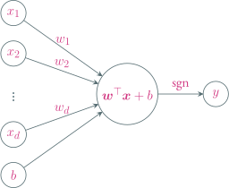
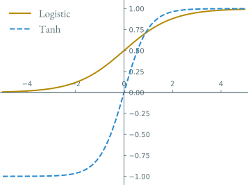
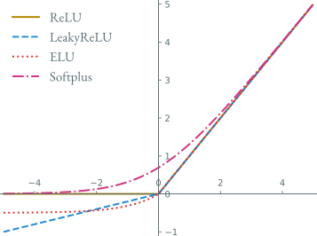
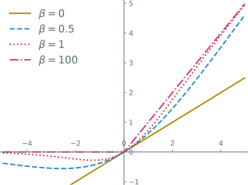

---
presentation:
  transition: "none"
  enableSpeakerNotes: true
  margin: 0
---

@import "../common/css/font-awesome-4.7.0/css/font-awesome.css"
@import "../common/css/zhangt-solarized.css"
@import "css/GNN.css"

<!-- slide data-notes="这一讲我们回顾一下传统处理图数据的方法 顺便把一些基本概念再温习一遍" -->

# 图神经网络导论

## 神经网络

### 计算机科学与技术学院 &nbsp; &nbsp; 张腾

 

#### tengzhang@hust.edu.cn

<!-- slide vertical=true data-notes="" -->

GNN-HEADER 发展史

@import "../mermaid/nn.mermaid"

GNN-FOOTER 图神经网络导论 神经网络 tengzhang@hust.edu.cn

<!-- slide data-notes="" -->

GNN-HEADER 神经元

神经网络的基本结构称为神经元

 

单个神经元对应的数学运算是$h(\wv^\top \xv + b)$，其中$h$是非线性激活函数

GNN-FOOTER 图神经网络导论 神经网络 tengzhang@hust.edu.cn

<!-- slide vertical=true data-notes="" -->

GNN-HEADER 神经网络

将神经元广泛并行互连就构成了神经网络

@import "../dot/nn.dot" {.center}

只要存在隐藏层，模型就拥有了非线性预测能力

GNN-FOOTER 图神经网络导论 神经网络 tengzhang@hust.edu.cn

<!-- slide vertical=true data-notes="" -->

GNN-HEADER 形式化

$L$：神经网络的层数

$n_l$：第$l$层神经元的个数

$h_l(\cdot)$：第$l$层的激活函数

$\Wv_l \in \Rbb^{n_l \times n_{l-1}}$：第$l-1$层到第$l$层的权重矩阵

$\bv_l \in \Rbb^{n_l}$：第$l$层的截距

$\zv_l \in \Rbb^{n_l}$：第$l$层神经元的输入

$\av_l \in \Rbb^{n_l}$：第$l$层神经元的输出

 

第$l$层的计算过程：$\zv_l = \Wv_l ~ \av_{l-1} + \bv_l$，$\av_l = h_l (\zv_l)$

 

整个网络：$\xv = \av_0 \xrightarrow{\Wv_1,\bv_1} \zv_1 \xrightarrow{h_1} \av_1 \xrightarrow{\Wv_2,\bv_2} \cdots \xrightarrow{\Wv_L,\bv_L} \zv_L \xrightarrow{h_L} \av_L = \hat{\yv}$

GNN-FOOTER 图神经网络导论 神经网络 tengzhang@hust.edu.cn

<!-- slide data-notes="" -->

GNN-HEADER 激活函数

最早的 MP 模型采用阶跃函数$1_{z \geq 0}$作为激活函数

 

改进方向：

- 连续并几乎处处可导，可以高效计算
- 导数的值域在合适的范围内，否则影响用梯度下降进行训练

 

常见的有

- Sigmoid 型：Logistic 函数，Tanh 函数
- ReLU，带泄漏的 ReLU，带参数的 ReLU，ELU，Softplus
- Swish 函数
- Maxout 单元

GNN-FOOTER 图神经网络导论 神经网络 tengzhang@hust.edu.cn

<!-- slide vertical=true data-notes="" -->

GNN-HEADER Sigmoid 型

GNN-FOOTER 图神经网络导论 神经网络 tengzhang@hust.edu.cn

<!-- slide vertical=true data-notes="" -->

GNN-HEADER Logistic 函数

将$\Rbb$挤压到$[0,1]$，输出拥有概率意义：

$$
\begin{align*}
    \sigma(z) = \frac{1}{1 + \exp (-z)} = \begin{cases}
        1 & z \rightarrow \infty \\
        0 & z \rightarrow -\infty
    \end{cases}
\end{align*}
$$

 

Logistic 函数连续可导，在零处导数最大

$$
\begin{align*}
    \sigma'(z) & = - \frac{- \exp (-z)}{(1 + \exp (-z))^2} = \frac{1}{1 + \exp (-z)} \frac{\exp (-z)}{1 + \exp (-z)} \\
    & = \sigma(z) (1 - \sigma(z)) \leq \left( \frac{\sigma(z) + 1 - \sigma(z)}{2} \right)^2 \\
    & = \frac{1}{4}
\end{align*}
$$

均值不等式等号成立的条件是$\sigma(z) = 1 - \sigma(z)$，即$z = 0$

GNN-FOOTER 图神经网络导论 神经网络 tengzhang@hust.edu.cn

<!-- slide vertical=true data-notes="" -->

GNN-HEADER Tanh 函数

将$\Rbb$挤压到$[-1,1]$，输出零中心化，Logistic 函数的放大平移

$$
\begin{align*}
    \tanh(z) & = \frac{\exp(z) - \exp(-z)}{\exp(z) + \exp(-z)} = \frac{1 - \exp(-2z)}{1 + \exp(-2z)} \\
    & = 2 \sigma(2z) - 1 \\
    & = \begin{cases}
        1 & z \rightarrow \infty \\
        -1 & z \rightarrow -\infty
    \end{cases}
\end{align*}
$$

 

性质：

- 连续可导$\tanh'(z) = 2 (\sigma(2z))' = 4 \sigma(2z) (1 - \sigma(2z))$，在$z = 0$处导数最大
- 输出零中心化使得后一层的输入$\wv^\top \av + \bv$也在零附近，而 Tanh 函数在零处导数最大，梯度下降更新效率较高，Logistic 函数输出恒为正，会进一步减慢梯度下降的收敛速度

GNN-FOOTER 图神经网络导论 神经网络 tengzhang@hust.edu.cn

<!-- slide data-notes="" -->

GNN-HEADER ReLU

ReLU 全称叫修正线性单元 (Rectified Linear Unit)，定义为

$$
\begin{align*}
    \relu(z) = \max \{ 0, z \} = \begin{cases}
        z & z \geq 0 \\ 0 & z < 0
    \end{cases}
\end{align*}
$$

 

优点

- 计算只涉及加法、乘法和比较操作，非常高效
- 生物学解释：单侧抑制，宽兴奋边界，稀疏兴奋
- 在$z > 0$时导数恒为$1$，缓解了梯度消失问题

 

缺点

- 输出非零中心化
- 死亡 ReLU 问题：对异常值特别敏感

GNN-FOOTER 图神经网络导论 神经网络 tengzhang@hust.edu.cn

<!-- slide vertical=true data-notes="" -->

GNN-HEADER 死亡 ReLU 问题

由链式法则有

$$
\begin{align*}
    \frac{\partial \relu(\wv^\top \xv + b)}{\partial \wv} & = \frac{\partial \relu(\wv^\top \xv + b)}{\partial (\wv^\top \xv + b)} \frac{\partial (\wv^\top \xv + b)}{\partial \wv} \\
    & = \frac{\partial \max \{ 0, \wv^\top \xv + b \}}{\partial (\wv^\top \xv + b)} \xv^\top \\
    & = 1_{\wv^\top \xv + b \geq 0} \xv^\top
\end{align*}
$$

如果第一个隐藏层中的某个神经元的权重向量$\wv$初始化不当，使得对任意$\xv$有$\wv^\top \xv + b < 0$，那么其关于$\wv$的梯度将为零，在以后的训练过程中$\wv$永远不会被更新

 

方案：带泄漏的 ReLU，带参数的 ReLU，ELU，Softplus

GNN-FOOTER 图神经网络导论 神经网络 tengzhang@hust.edu.cn

<!-- slide vertical=true data-notes="" -->

GNN-HEADER ReLU 变体

带泄漏的 ReLU：当$\wv^\top \xv + b < 0$时也有非零梯度

$$
\begin{align*}
    \lrelu(z) & = \begin{cases}
        z & z \geq 0 \\ \gamma z & z < 0
    \end{cases} \\
    & = \max \{ 0, z \} + \gamma \min \{ 0, z \} \overset{\gamma < 1}{=} \max \{ z, \gamma z \}
\end{align*}
$$

其中斜率$\gamma$是一个很小的常数，比如$0.01$

 

带参数的 ReLU：斜率$\gamma_i$可学习

$$
\begin{align*}
    \prelu(z) & = \begin{cases}
        z & z \geq 0 \\ \gamma_i z & z < 0
    \end{cases} \\
    & = \max \{ 0, z \} + \gamma_i \min \{ 0, z \}
\end{align*}
$$

可以不同神经元具有不同的参数，也可以一组神经元共享一个参数

GNN-FOOTER 图神经网络导论 神经网络 tengzhang@hust.edu.cn

<!-- slide vertical=true data-notes="" -->

GNN-HEADER ReLU 变体

ELU 全称叫指数线性单元 (Exponential Linear Unit)

$$
\begin{align*}
    \elu(z) & = \begin{cases}
        z & z \geq 0 \\ \gamma (\exp(z) - 1) & z < 0
    \end{cases} \\
    & = \max \{ 0, z \} + \min \{ 0, \gamma (\exp(z) - 1) \}
\end{align*}
$$

Softplus 函数可以看作 ReLU 的平滑版本：

$$
\begin{align*}
    \softplus(z) = \log (1 + \exp(z))
\end{align*}
$$

其导数为 Logistic 函数

$$
\begin{align*}
    \softplus'(z) = \frac{\exp(z)}{1 + \exp(z)} = \frac{1}{1 + \exp(-z)}
\end{align*}
$$

GNN-FOOTER 图神经网络导论 神经网络 tengzhang@hust.edu.cn

<!-- slide vertical=true data-notes="" -->

GNN-HEADER ReLU 族

GNN-FOOTER 图神经网络导论 神经网络 tengzhang@hust.edu.cn

<!-- slide data-notes="" -->

GNN-HEADER Swish 函数

Swish 函数是一种自门控激活函数：

$$
\begin{align*}
    \swish(z) = z \cdot \sigma (\beta z) = \frac{z}{1 + \exp(-\beta z)}
\end{align*}
$$

其中$\beta$是可学习的参数或一个固定超参数

- 当$\sigma (\beta z)$接近于$1$时，门处于“开”状态，激活函数的输出近似于$z$本身
- 当$\sigma (\beta z)$接近于$0$时，门处于“关”状态，激活函数的输出近似于$0$

GNN-FOOTER 图神经网络导论 神经网络 tengzhang@hust.edu.cn

<!-- slide vertical=true data-notes="" -->

GNN-HEADER Swish 函数

GNN-FOOTER 图神经网络导论 神经网络 tengzhang@hust.edu.cn

<!-- slide vertical=true data-notes="" -->

GNN-HEADER Maxout 单元

考虑神经网络的第$l$层：

$$
\begin{align*}
    \zv_l & = \Wv_l ~ \av_{l-1} + \bv_l \\
    \av_l & = h_l (\zv_l)
\end{align*}
$$

前面提到的激活函数都是$\Rbb \mapsto \Rbb$的，即$[\av_l]_i = h_l ([\zv_l]_i), ~ i \in [n_l]$

 

Maxout 单元是$\Rbb^{n_l} \mapsto \Rbb$的，输入就是$\zv_l$，其定义为

$$
\begin{align*}
    \maxout (\zv) = \max_{k \in [K]} \{ \wv_k^\top \zv + b_k \}
\end{align*}
$$

- 整体学习输入到输出间的非线性关系
- $\relu(z) = \max \{ 0, z \}$与$\lrelu(z) \overset{\gamma < 1}{=} \max \{ z, \gamma z \}$都是 Maxout 单元的特例

GNN-FOOTER 图神经网络导论 神经网络 tengzhang@hust.edu.cn

<!-- slide vertical=true data-notes="" -->

GNN-HEADER 应用到机器学习

前$L-1$层是复合函数$\psi: \Rbb^d \mapsto \Rbb^{n_{L-1}}$，可以看作一种特征转换方法

 

最后一层是一个学习器$\hat{\yv} = g(\psi(\xv); \Wv_L, \bv_L)$，对输入$\psi(\xv)$进行预测

- 若$y \in \{ 1, -1\}$，最后一层只需$1$个神经元，并采用 Logistic 激活函数
- 若$y \in [C]$，最后一层需$C$个神经元，并采用 Softmax 激活函数

 

因此对数几率回归也可看作只有一层(没有隐藏层)的神经网络

GNN-FOOTER 图神经网络导论 神经网络 tengzhang@hust.edu.cn
