---
presentation:
  transition: "none"
  enableSpeakerNotes: true
  margin: 0
---

@import "../common/css/font-awesome-4.7.0/css/font-awesome.css"
@import "../common/css/zhangt-solarized.css"
@import "css/GNN.css"

<!-- slide data-notes="" -->

# 图神经网络导论

## 机器学习 下

### 计算机科学与技术学院 &nbsp; &nbsp; 张腾

 

#### tengzhang@hust.edu.cn

<!-- slide data-notes="" -->

GNN-HEADER 大纲

@import "../dot/outline-supervised.dot"

GNN-FOOTER 图神经网络导论 机器学习 tengzhang@hust.edu.cn

<!-- slide vertical=true data-notes="" -->

GNN-HEADER 监督学习

所有样本都有类别标记

| 原始数据 |      样本      |   属性特征   | 类别标记 |
| :------: | :------------: | :----------: | :------: |
|  $o_1$   | $(\xv_1, y_1)$ | $\xv_1[1:d]$ |  $y_1$   |
|  $o_2$   | $(\xv_2, y_2)$ | $\xv_2[1:d]$ |  $y_2$   |
| $\vdots$ |    $\vdots$    |   $\vdots$   | $\vdots$ |
|  $o_m$   | $(\xv_m, y_m)$ | $\xv_m[1:d]$ |  $y_m$   |

任务类型：

- 二分类：$y \in \{ 1, -1 \}$或者$y \in \{ 0,1 \}$
- 多分类：$y \in [C] \triangleq \{ 1, 2, \ldots, C \}$
- 回归：$y \in \Rbb$
- 结构预测：$y$可以是向量、序列、语法树、……

GNN-FOOTER 图神经网络导论 机器学习 tengzhang@hust.edu.cn

<!-- slide vertical=true data-notes="第一列是三个人工数据集，第一个呈半月形，第二个呈圆环型，第三个线性可分，两种颜色深色的为训练样本，稍浅些的为测试样本，每个数据集各有20%的噪声    右边三列为线性核支持向量机、高斯核支持向量机、神经网络在这些数据集上的分类结果，右下角是预测精度    前两个数据集非线性可分，后两个分类器非线性分类器，注意对比观察它们的效果" -->

GNN-HEADER 监督学习 二分类示例

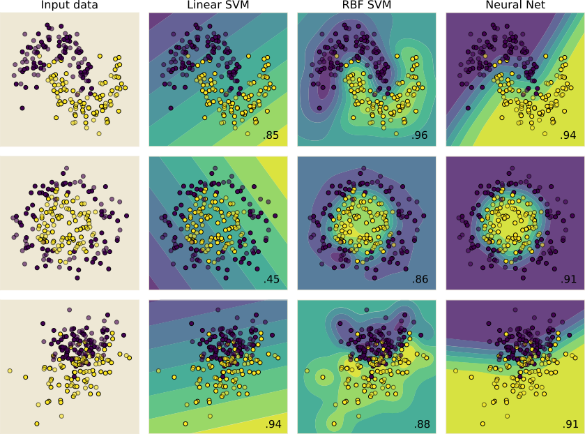

GNN-FOOTER 图神经网络导论 机器学习 tengzhang@hust.edu.cn

<!-- slide vertical=true data-notes="多分类就不止2类了 比如数字识别 就是10类了" -->

GNN-HEADER 监督学习 多分类示例

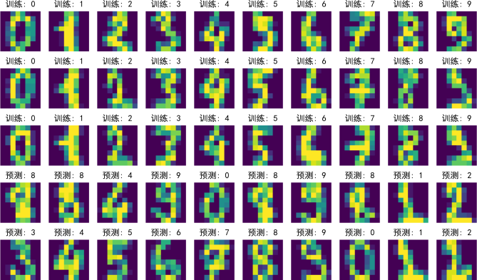

GNN-FOOTER 图神经网络导论 机器学习 tengzhang@hust.edu.cn

<!-- slide vertical=true data-notes="" -->

GNN-HEADER 监督学习 混淆矩阵

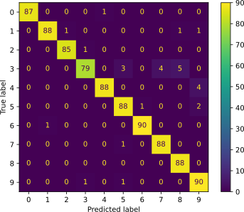

GNN-FOOTER 图神经网络导论 机器学习 tengzhang@hust.edu.cn

<!-- slide vertical=true data-notes="" -->

GNN-HEADER 监督学习 回归

线性回归：用最小二乘求解超定方程组 (方程个数比未知数多)

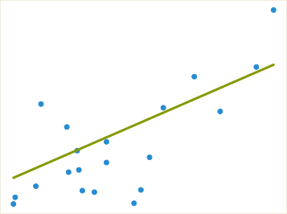

GNN-FOOTER 图神经网络导论 机器学习 tengzhang@hust.edu.cn

<!-- slide data-notes="现实中很多任务，获取类别标记代价很大，比如病人的X光图片，需要高水平的专家医生来看才能给出标记，所以不能指望所有样本都有类别标记" -->

GNN-HEADER 半监督学习

只有部分样本有类别标记，如何利用其它未标记样本？

| 原始数据  |         样本         |     属性特征     | 类别标记 |
| :-------: | :------------------: | :--------------: | :------: |
|   $o_1$   |    $(\xv_1, y_1)$    |   $\xv_1[1:d]$   |  $y_1$   |
| $\vdots$  |       $\vdots$       |     $\vdots$     | $\vdots$ |
|   $o_l$   |    $(\xv_l, y_l)$    |   $\xv_m[1:d]$   |  $y_l$   |
| $o_{l+1}$ | $(\xv_{l+1}, \NULL)$ | $\xv_{l+1}[1:d]$ | $\NULL$  |
| $\vdots$  |       $\vdots$       |     $\vdots$     | $\vdots$ |
| $o_{l+u}$ | $(\xv_{l+u}, \NULL)$ | $\xv_{l+u}[1:d]$ | $\NULL$  |

任务类型：

- 直推式 (transductive) 学习：预测$\xv_{l+1}, \ldots, \xv_{l+u}$的类别标记，可以没有显式模型
- 归纳 (inductive) 学习：必须有显式模型，能对未知样本进行预测，包含前者

GNN-FOOTER 图神经网络导论 机器学习 tengzhang@hust.edu.cn

<!-- slide vertical=true data-notes="" -->

GNN-HEADER 无监督学习

所有样本都没有类别标记

| 原始数据 |       样本       |   属性特征   | 类别标记 |
| :------: | :--------------: | :----------: | :------: |
|  $o_1$   | $(\xv_1, \NULL)$ | $\xv_1[1:d]$ | $\NULL$  |
|  $o_2$   | $(\xv_2, \NULL)$ | $\xv_2[1:d]$ | $\NULL$  |
| $\vdots$ |     $\vdots$     |   $\vdots$   | $\vdots$ |
|  $o_m$   | $(\xv_m, \NULL)$ | $\xv_m[1:d]$ | $\NULL$  |

任务类型：

- 聚类：$\xv_i \mapsto c_i \in [K]$，根据一定的准则将样本划分成$K$个簇 (cluster)
- 降维或嵌入：$\xv_i \mapsto \zv_i \in \Rbb^l$，为样本学习新的特征，自编码 (autoencoder)
- 密度估计：估计样本空间的概率密度$P(\xv)$，寻找数据的生成机制

GNN-FOOTER 图神经网络导论 机器学习 tengzhang@hust.edu.cn

<!-- slide vertical=true data-notes="" -->

GNN-HEADER 无监督学习 聚类

- 原始数据由 6 个簇组成
- K 均值算法指定聚成 4 个簇，每种颜色对应一个簇，菱形为簇中心
- 红色和蓝色各由 2 个簇组成

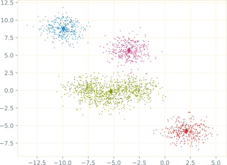

GNN-FOOTER 图神经网络导论 机器学习 tengzhang@hust.edu.cn

<!-- slide vertical=true data-notes="" -->

GNN-HEADER 无监督学习 密度估计

- 直方图是最简单的密度估计方法，数数即可，对间隔的选择极其敏感
- 核密度估计：$\rho(\zv) = \sum_{i \in [m]} \kappa ((\zv-\xv_i)/h)$

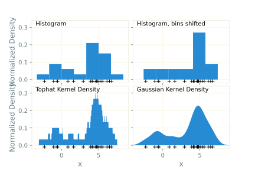

GNN-FOOTER 图神经网络导论 机器学习 tengzhang@hust.edu.cn

<!-- slide vertical=true data-notes="" -->

GNN-HEADER 无监督学习 密度估计

- 直方图是最简单的密度估计方法，数数即可，对间隔的选择极其敏感
- 核密度估计：$\rho(\zv) = \sum_{i \in [m]} \kappa ((\zv-\xv_i)/h)$

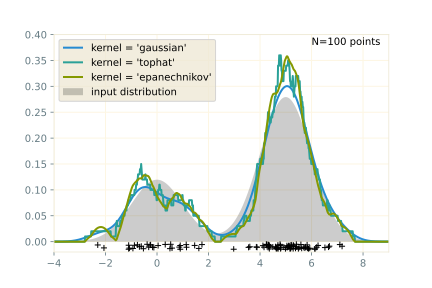

GNN-FOOTER 图神经网络导论 机器学习 tengzhang@hust.edu.cn

<!-- slide data-notes="给定数据后，就可以开始学习了，我们把这个过程用数学符号进行严格表示    X是特征空间    Y是类别标记集合    D是定义在X乘Y上的未知分布    数据集S独立同分布地采样于分布D    判别一个瓜是不是好瓜的函数称作分类器，H是所有候选分类器构成的集合，也称作假设空间，比如线性函数集合就是最常见的假设空间，可以提一下最小二乘    我们的目标是，寻找一个分类器，它在未知分布D上的错误率的期望尽可能的小，也叫泛化风险    问题难点在于D未知，泛化风险无法计算，我们目前已有的信息就是训练数据，可以计算的是分类器h在训练数据S上的错误率，也叫经验风险" -->

GNN-HEADER 形式化

常用概念及其符号：

- $\Xcal \subseteq \Rbb^d$为输入空间，$d$称为维度 (dimension)
- $\Ycal$为输出空间，对于分类问题$\Ycal = \{ 0,1 \} \mid \{ \pm 1 \} \mid [C]$，对于回归问题$\Ycal = \Rbb$
- $\Dcal$为定义在$\Xcal \times \Ycal$上的未知分布
- $\Scal = \{(\xv_1, y_1), \ldots, (\xv_m, y_m)\}$为独立同分布 (IID) 采样于$\Dcal$的训练数据集
- $\Hcal = \{ h: \Xcal \mapsto \Ycal \}$是候选分类器构成的假设空间，从中选择最优假设$h^\star$

 

如何评估假设$h$的好坏？$h$在整个分布$\Dcal$上的表现

 

目标：最小化期望风险，也称为泛化风险

$$
\begin{align*}
    \min_{h \in \Hcal} ~ \color{red}{R(h)} = \Ebb_{(\xv, y) \sim \Dcal}[1_{h(\xv) \neq y}]
\end{align*}
$$

难点：$\Dcal$未知，泛化风险无法计算，可以计算$h$在$\Scal$上的经验风险

GNN-FOOTER 图神经网络导论 机器学习 tengzhang@hust.edu.cn

<!-- slide vertical=true data-notes="考虑到训练集是D的一个缩影，因此以经验风险代替泛化风险似乎是合情合理的，这就是经验风险最小化原则    然而事与愿违的是如果对假设空间不做任何限制，可能会得到一个强行“记住”每个训练样本类别标记的分类器    显然它在训练数据集上经验风险为零，比任何一个分类器都要好，但是它对未知样本的预测可能非常糟糕，因为它把全部注意力都集中在训练数据集上了，忽略了对真实世界的认知，这种现象称为“过拟合”" -->

GNN-HEADER 经验风险最小化

以训练数据上的经验风险替代泛化风险

$$
\begin{align*}
    \class{red}{R(h)} = \Ebb_{(\xv, y) \sim \Dcal}[1_{h(\xv) \neq y}] ~ \longleftarrow ~ \class{blue}{R_\Scal (h)} = \frac{1}{m} \sum_{i \in [m]} 1_{h(\xv_i) \neq y_i}
\end{align*}
$$

根据大数定律，当样本数趋向于无穷时，经验风险趋向于泛化风险

 

如果对假设空间不做任何限制，可能会得到

$$
\begin{align*}
    h(\xv) = - \prod_{i \in [m]: y_i = 1} \| \xv -\xv_i \|^2
\end{align*}
$$

问题：

- 对正类输出零，对负类输出负数，经验风险为零
- 对未知样本的预测非常糟糕，因为它只是在强行记住见过的训练样本

GNN-FOOTER 图神经网络导论 机器学习 tengzhang@hust.edu.cn

<!-- slide vertical=true data-notes="过拟合可以通过这张图来表述，随着假设空间复杂度地不断增大，对训练数据拟合地越来越好，经验风险单调下降；但泛化风险却是先降后升    这启示我们应该在经验风险和假设空间复杂度之间取得平衡，那么问题来了，经验风险是好计算的，假设空间复杂度怎么算？有什么量是可以刻画假设空间复杂度的吗？" -->

GNN-HEADER 过拟合

启示：在经验风险和假设空间复杂度之间取得平衡

 

问题：假设空间复杂度怎么算？有什么量能够刻画它？

GNN-FOOTER 图神经网络导论 机器学习 tengzhang@hust.edu.cn

<!-- slide data-notes="迄今已经有很多刻画假设空间复杂度的量了，这里我们举其中一个叫VC维的量，而且只考虑二分类这个最简单的情形，多分类也有对应的VC维    VC是两个人的名字，V是Vapnik，支持向量机的发明人，直观上来说，这个量应该和假设空间对样本的拟合能力正相关    定义集合H_S，其中每个元素都是对S赋予类别标记的一个可能结果    如果H_S包含了全部可能的结果，则称假设空间H可以“打散”数据集，就是不管它的类别标记赋值是啥，假设空间都能拟合出来，都有个候选分类器与之对应    假设空间的VC维就定义成能被它打散的最大样本集合的大小" -->

GNN-HEADER VC 维

基本思想：假设空间复杂度应体现出对数据集的拟合能力

 

假设空间$\Hcal = \{ h: \Xcal \mapsto \{1,-1\} \}$，数据集$S = \{\xv_1, \ldots, \xv_m\}$，定义

$$
\begin{align*}
    H_\Scal = \{ (h(\xv_1), \ldots, h(\xv_m)) \mid h \in \Hcal \}
\end{align*}
$$

其中$H_\Scal$中每个元素都是对$S$赋予类别标记的可能结果，若$H_\Scal$包含了全部可能的结果，即$|H_\Scal| = 2^m$，则称假设空间$\Hcal$可以打散数据集$\Scal$

 

假设空间$\Hcal$的 <a target="_blank" href="https://en.wikipedia.org/wiki/Vapnik%E2%80%93Chervonenkis_dimension">VC 维</a>是能被$\Hcal$打散的最大集合的大小，即

$$
\begin{align*}
    \VC(\Hcal) = \max \{ m \mid \exists S:~|H_\Scal| = 2^m \}
\end{align*}
$$

GNN-FOOTER 图神经网络导论 机器学习 tengzhang@hust.edu.cn

<!-- slide vertical=true data-notes="举个简单的例子，设特征空间为二维欧氏平面，假设空间为二维平面上的直线构成的集合    从图中可以看出，存在3个样本构成的集合，无论类别标记是什么样的，都有个直线将两类样本分开    对于任意4个样本构成的集合，总有一种类似异或的赋值线性不可分    因此，在二维欧氏平面上，直线集合的VC维是3    可以证明更一般性的结论：n维欧式空间超平面集合的VC维是n+1" -->

GNN-HEADER VC 维

基本思想：假设空间复杂度应体现出对数据集的拟合能力

 

二维平面上的线性划分：$\Xcal = \Rbb^2$，$\Hcal$为二维平面上直线集合

- 存在 3 个样本构成的集合，8 种可能类别标记赋值均是线性可分的
- 对于任意 4 个样本构成的集合，总有一种类别标记赋值线性不可分
- $\Hcal$的 VC 维为 3
- $\Rbb^n$中超平面集合的 VC 维为$n+1$

GNN-FOOTER 图神经网络导论 机器学习 tengzhang@hust.edu.cn

<!-- slide vertical=true data-notes="有了VC维的定义，根据集中度不等式可以证明这样一个泛化界，这是VC维理论中最经典的结论，可以扯一下集中度不等式    右端第二项称为置信区间，它与VC维和样本数的比值有关，当样本数很大时，这个比值较小，此时第一项经验风险起主导作用，这也是经验风险最小化原则在大数据集上表现不错的原因    但反过来，当这个比值较大时，则必须考虑置信区间的影响，因为此时最小化经验风险并不能保证泛化风险也小" -->

GNN-HEADER VC 维

根据<a target="_blank" href="https://en.wikipedia.org/wiki/Concentration_inequality">集中度不等式</a>有如下泛化界

$$
\begin{align*}
    \class{red}{\underbrace{R(h)}_{泛化风险}} \leq \class{blue}{\underbrace{R_\Scal(h)}_{经验风险}} + \class{yellow}{\underbrace{\tilde{O} \left(\sqrt{\VC维/样本数~~~~~~~~~~}~ \right)}_{置信区间}}
\end{align*}
$$

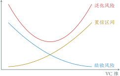

GNN-FOOTER 图神经网络导论 机器学习 tengzhang@hust.edu.cn

<!-- slide vertical=true data-notes="由此产生了结构风险最小化原则，考虑直接最小化这两项的和    一个初步的办法如图所示，给定训练数据，构造一个嵌套的假设空间序列，然后对于每个假设空间，求一个使得经验风险最小的分类器h_t，同时相应的计算一个置信区间的值，最后取使得经验风险与置信区间的和最小的下标t，并以h_t作为最终学习算法输出的分类器    注意到，经验风险和置信区间关于VC维的增加都是单调变化的，因此可以直接最小化两项的加权和    那么问题来了，如何计算一个假设空间的VC维？前面说了，超平面集合的VC维是n+1，如果空间是无穷维，比如高斯核诱导出的特征空间，那么VC维也是无穷，泛化界已经松到没有意义了，这时怎么办？" -->

GNN-HEADER 结构风险最小化

- 构造嵌套的假设空间序列 $\Hcal_1 \subseteq \cdots \subseteq \Hcal_t \subseteq \cdots$
- 在$\Hcal_t$上经验风险最小化，从而得到 $R_\Scal (h_1) \geq \cdots \geq R_\Scal (h_t) \geq \cdots$
- 嵌套假设空间序列的 VC 维序列 $\VC(\Hcal_1) \leq \cdots \leq \VC(\Hcal_t) \leq \cdots$
- $h^\star = \min_{h_t} \{ \class{blue}{经验风险} + \class{yellow}{置信区间} \}$

问题：

- 如何计算$\VC(\Hcal_t)$？
- 若假设空间$\Hcal_t$为超平面集合，当维度趋向于无穷时，VC 维也趋向于无穷

启示：VC 维分布无关、数据独立，导出的泛化界有点“松”

方案：引入数据相关的量加强泛化界，在无穷维空间也可以学习

GNN-FOOTER 图神经网络导论 机器学习 tengzhang@hust.edu.cn

<!-- slide data-notes="因为VC维分布无关、数据独立，导出的泛化界松是不可避免的，因此需要引入数据相关的量加强泛化界，在无穷维空间也可以学习    这个量就是间隔，对于任意分类器f，它在样本上的间隔定义为 预测函数值 与 类别标记 的乘积    如果存在分类器不仅能将两类样本分开，还存在正数γ，使得分类器在正类样本上的预测值都大于等于γ，在负类样本上的预测值都小于等于-γ，换言之，两类之间有一个宽度为2γ的gap，就说数据集S被F以γ打散，F的尺度为γ的宽打散维fatF(γ)是能被F以γ打散的最大集合的大小    特别的，如果假设空间为超平面集合，且能将数据集以γ打散，就称作γ间隔超平面" -->

GNN-HEADER 间隔和宽打散维

启示：VC 维分布无关、数据独立，导出的泛化界有点“松”

方案：引入数据相关的量加强泛化界，在无穷维空间也可以学习

 

设$\Hcal = \{ h: \Xcal \mapsto \Rbb \}$是定义在特征空间$\Xcal$上的实值函数集合，对于$\forall h \in \Hcal$，其关于样本$(\xv_i, y_i)$的<a target="_blank" href="https://en.wikipedia.org/wiki/Margin_(machine_learning)">间隔</a>定义为$\gamma_i = y_i f(\xv_i)$

 

若对数据集$\Scal$的任一类别标记赋值，均存在假设$h \in \Hcal$和$\gamma > 0$使得$y_i h(\xv_i) \ge \gamma$，则称$\Scal$被$\Hcal$以$\gamma$打散，$\Hcal$的宽打散维$\mathrm{fat}_\Fcal(\gamma)$是能被$\Hcal$以$\gamma$打散的最大集合的大小  特别的，取$\Hcal = \{ \xv \mapsto \wv^\top \xv \mid \|\wv\| = 1 \}$，则能将$\Scal$以$\gamma$打散的超平面称为$\gamma$-间隔超平面，即对$\forall i \in [m]$有$y_i \wv^\top \xv_i \ge \gamma$

GNN-FOOTER 图神经网络导论 机器学习 tengzhang@hust.edu.cn

<!-- slide vertical=true data-notes="从这张图不难看出，γ是所有间隔的最小值，也称为最小间隔    可以证明，如果数据集包含在半径为R的球里，γ间隔超平面的宽打散维有一个上界，分母上的γ是个正数，所以这个上界是个有限值    所以宽打散维是VC维的加强版，对假设空间的限制力度更强，对于前面所说的VC维无穷的情况，宽打散维也是有限的。而宽打散维与间隔有关，间隔越大，宽打散维越小，对假设空间限制越大" -->

GNN-HEADER $\gamma$-间隔超平面

记$\Hcal = \{ \xv \mapsto \wv^\top \xv \mid \|\wv\| = 1 \}$为$\gamma$-间隔超平面构成的假设空间，若数据集包含于一个半径为$R$的球，则$\Hcal$的宽打散维$\mathrm{fat}_\Hcal(\gamma) \leq R^2 / \gamma^2$

间隔$\gamma$越大，宽打散维越小

|  物理量  | 对假设空间的限制 | 泛化界的大小 |
| :------: | :--------------: | :----------: |
|  VC 维   |        弱        |     无穷     |
| 宽打散维 |        强        |     有限     |

GNN-FOOTER 图神经网络导论 机器学习 tengzhang@hust.edu.cn

<!-- slide vertical=true data-notes="因此结构风险最小化就转化成了最大间隔准则：就是 最小化经验风险 同时最大化间隔，这样就得到了大间隔方法的雏形，就是第一个式子，通过一些的代数变换，约束两边同乘以w的范数，可以得到第二个式子，由于γhat的取值不影响优化问题，因此可以简单地设为1，这样就得到了第三个式子，最后最大化1/w等价于最小化w，就是常见的第四个式子" -->

GNN-HEADER 最大间隔准则

间隔$\gamma$越大，宽打散维越小，泛化界越紧

 

最大间隔准则：最小化经验风险 $\wedge$ 最大化间隔

$$
\begin{align*}
    \max_{\wv} \quad - \lambda \cdot \class{blue}{0} + \class{green}{\gamma} \qquad & \st \quad y_i
    \wv^\top \xv_i /
    \|\wv\| \geq
    \gamma,~ \forall i
    \in [m] \\
    & \Updownarrow \notag \\
    \max_{\wv} \quad \hat{\gamma} / \|\wv\| \qquad & \st \quad y_i \wv^\top \xv_i \geq \hat{\gamma},~ \forall i
    \in [m] \\
    & \Updownarrow \notag \\
    \max_{\wv} \quad 1 / \|\wv\| \qquad & \st \quad y_i \wv^\top \xv_i \geq 1,~ \forall i
    \in [m] \\
    & \Updownarrow \notag \\
    \min_{\wv} \quad \|\wv\| \qquad & \st \quad y_i \wv^\top \xv_i \geq 1,~ \forall i
    \in [m]
\end{align*}
$$

即等价于在$1$-间隔超平面构成的假设空间中寻找最小范数假设

GNN-FOOTER 图神经网络导论 机器学习 tengzhang@hust.edu.cn

<!-- slide vertical=true data-notes="简单总结一下，为了避免过拟合，我们从限制假设空间开始，先引入VC维，然后加强成宽打散维，从而得到最大间隔准则，要最小化经验风险 同时 最大化间隔 最后转换成在$1$-间隔超平面构成的假设空间中寻找最小范数假设     范数有很多种，最小化不同的范数略有不同，例如最小化2范数 ... 可以得到很多经典的模型    接下来的问题就是假设不成立，特征空间不存在γ间隔超平面怎么办？此时约束根本无法全部满足，可行域为空，问题无解" -->

GNN-HEADER 正则化

@import "../dot/vc2margin.dot"

$$
\begin{align*}
    \min_\wv ~ \lambda \cdot \underbrace{\Omega(\wv)}_{正则化项} + \underbrace{R_\Scal (\wv)}_{经验风险}
\end{align*}
$$

- $\ell_2$正则：$\Omega(\wv) = \| \wv \|_2^2$，得到稠密的$\wv$
- $\ell_1$正则：$\Omega(\wv) = \| \wv \|_1$，得到稀疏的$\wv$，附带特征选择的作用
- $\ell_\infty$正则：$\Omega(\wv) = \| \wv \|_\infty$，得到所有分量值相同的$\wv$
- $\ell_{2,1}$正则：$\Omega(\wv) = \sum_j \| \wv_j \|_2$，特征分组，组内稠密，组间稀疏
- $\ell_{1,2}$正则：$\Omega(\wv) = (\sum_j \| \wv_j \|_1)^2$，特征分组，组内稀疏，组间稠密
- 弹性网：$\ell_1$正则和$\ell_2$正则的线性组合
- OSCAR：$\ell_1$正则和成对$\ell_\infty$正则的线性组合

 

假设不成立？特征空间不存在$\gamma$-间隔超平面

GNN-FOOTER 图神经网络导论 机器学习 tengzhang@hust.edu.cn

<!-- slide data-notes="" -->

GNN-HEADER 非线性映射

问题：输入空间若不存在$\gamma$-间隔超平面？

 

方案：将数据映射到新的特征空间使其尽量线性可分

$$
\begin{align*}
    f(\xv; \wv, b) = \wv^\top \xv + b ~ \longrightarrow ~ f(\xv; \wv, b) = \wv^\top [\phi_1(\xv); \ldots; \phi_K(\xv)] + b
\end{align*}
$$

- $\wv, b$是待学习的参数
- $\phi_k: \Rbb^d \mapsto \Hbb$是非线性映射

 

问题：

- 很难确定什么样的非线性映射能保证样本在新的特征空间线性可分
- 即便恰好找到了使得样本线性可分的映射，如何确定其没有引起过拟合

 

方案：允许约束$y_i \wv^{\top} \xv_i \geq 1$对少数样本不成立

GNN-FOOTER 图神经网络导论 机器学习 tengzhang@hust.edu.cn

<!-- slide vertical=true data-notes="既然无法确保样本以某个间隔分开，只好退而求其次，允许约束对少数样本不成立，其中第二项为破坏约束的样本个数，参数lambda用来调节两项的重要性    第二项指示函数非凸非连续，不太好优化，一个常用的办法是用数学性质较好的函数来替代示性函数，通常为凸连续函数且为指示函数的上界，这样问题就转化为一个凸优化问题并且有下面的泛化界 第一步放缩是因为是上界 第二步放缩就是应用集中度不等式 可以有vc维 rademacher covering number等等" -->

GNN-HEADER 替代损失

基本思想：允许约束$y_i \wv^{\top} \xv_i \geq 1$对少数样本不成立

$$
\begin{align*}
    \min_{\wv} ~ \lambda \cdot \underbrace{\Omega(\wv)}_{正则化项} + \frac{1}{m} \underbrace{\sum_{i \in [m]} 1_{y_i \wv^\top \xv_i < 1} }_{破坏约束样本数}
\end{align*}
$$

难点：指示函数$1_{\cdots}$非凸非连续，导致问题很难求解

方案：用另一个函数$l(y, f(\xv))$替代，称为<a target="_blank" href="https://en.wikipedia.org/wiki/Loss_functions_for_classification">替代损失</a>，一般需满足

- 数学性质好，问题容易求解，例如凸连续函数
- 是指示函数$1_{y \cdot h(\xv) < 0}$的上界，从而利用集中度不等式可得到泛化界：

$$
\begin{align*}
    & \class{red}{R (h)} = \Ebb_{(\xv, y) \sim \Dcal} [ 1_{y \cdot h(\xv) < 0} ] \leq \Ebb_{(\xv, y) \sim \Dcal} [ l(y, h(\xv)) ] \\
    & ~~ \leq \class{blue}{\frac{1}{m} \sum_{i \in [m]} l(y_i, f(\xv_i))} + [ ~ \class{yellow}{\text{VC}} \mid \class{yellow}{\text{Rademacher}} \mid \class{yellow}{\text{covering number}} \mid \ldots ~ ]
\end{align*}
$$

GNN-FOOTER 图神经网络导论 机器学习 tengzhang@hust.edu.cn

<!-- slide vertical=true data-notes="如果用平方损失，就得到了岭回归，如果用hinge损失，就是软间隔支持向量机 …… 这样就得到了一大类大间隔方法" -->

GNN-HEADER 替代损失

基本思想：允许约束$y_i \wv^{\top} \xv_i \geq 1$对少数样本不成立

$$
\begin{align*}
    \min_{\wv} ~ \lambda \cdot \underbrace{\Omega(\wv)}_{正则化项} + \frac{1}{m} \underbrace{\sum_{i \in [m]} l(y_i, f(\xv_i))}_{替代损失}
\end{align*}
$$

凸连续函数，指示函数$1_{y \cdot h(\xv) < 0}$的上界

常见<a target="_blank" href="https://en.wikipedia.org/wiki/Loss_functions_for_classification">替代损失</a>

- 平方损失：$l(y, f(\xv)) = (y - f(\xv))^2$，岭回归
- hinge 损失：$l(y, f(\xv)) = \max \{ 0, 1 - y f(\xv) \}$，软间隔支持向量机
- 平方 hinge 损失：$l(y, f(\xv)) = [\max \{ 0, 1 - y f(\xv) \}]^2$
- $\epsilon$-不敏感损失：$l(y, f(\xv)) = \max \{ 0, |y - f(\xv)| - \epsilon \}$，支持向量回归
- 指数损失：$l(y, f(\xv)) = \exp (- y f(\xv))$
- 对数几率损失：$l(y, f(\xv)) = \log (1 + \exp (- y f(\xv)))$，对数几率回归

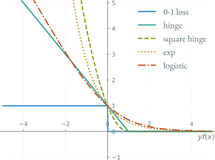

GNN-FOOTER 图神经网络导论 机器学习 tengzhang@hust.edu.cn

<!-- slide data-notes="" -->

GNN-HEADER 模型求解

即采用优化算法求出如下优化问题的最优解

$$
\begin{align*}
    \min_\wv ~ F(\wv) \triangleq \lambda \cdot \Omega(\wv) + \frac{1}{m} \sum_{i \in [m]} l(y_i, f(\xv_i))
\end{align*}
$$

梯度下降 (GD)：$\wv_{t+1} \leftarrow \wv_t - \eta_t \nabla F(\wv_t)$，其中$\eta_t$称为步长或学习率

 

问题：当样本数$m$很大时，梯度$\nabla F(\wv_t)$计算开销很大

方案：小批量梯度下降，随机采样一个下标子集$\Bcal_t \subseteq [m]$

$$
\begin{align*}
    \wv_{t+1} \leftarrow \wv_t - \eta_t \left( \frac{1}{|\Bcal_t|} \sum_{i \in \Bcal_t} \nabla l(y_i, f(\xv_i)) + \lambda \cdot \nabla \Omega(\wv) \right)
\end{align*}
$$

若$|\Bcal_t| = 1$，则为常说的随机梯度下降 (SGD)

GNN-FOOTER 图神经网络导论 机器学习 tengzhang@hust.edu.cn

<!-- slide vertical=true data-notes="" -->

GNN-HEADER 梯度下降解最小二乘

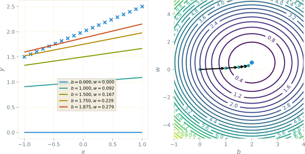

GNN-FOOTER 图神经网络导论 机器学习 tengzhang@hust.edu.cn

<!-- slide vertical=true data-notes="" -->

GNN-HEADER GD vs. SGD

更新公式：

$$
\begin{align*}
    & \wv_{t+1} \leftarrow \wv_t - \eta_t \left( \frac{1}{m} \sum_{i \in [m]} \nabla l(y_i, f(\xv_i)) + \lambda \cdot \nabla \Omega(\wv) \right) \\
    & \wv_{t+1} \leftarrow \wv_t - \eta_t \left( \frac{1}{|\Bcal_t|} \sum_{i \in \Bcal_t} \nabla l(y_i, f(\xv_i)) + \lambda \cdot \nabla \Omega(\wv) \right)
\end{align*}
$$

- 当数据集中有冗余样本时，SGD 可以减少重复计算
- 迭代前期，SGD 更新频率快，较 GD 优势明显
- 迭代后期，GD 会停止于最优解处，SGD 则只能在最优解附近震荡
- 越靠近最优解，梯度越接近零，因此 GD 可以用恒定步长
- 最优解处随机梯度不一定为零，故 SGD 必须用衰减步长，否则算法不会停止
- SGD 因随机采样带来的噪声若能随着迭代而受到抑制，则可进一步加速，机器学习顶会有大量相关工作，包括 SAG，SAGA，SVRG 等及其衍生变种

GNN-FOOTER 图神经网络导论 机器学习 tengzhang@hust.edu.cn

<!-- slide data-notes="" -->

GNN-HEADER 加速梯度下降

当目标函数的变量尺度不同时，梯度下降效率很低

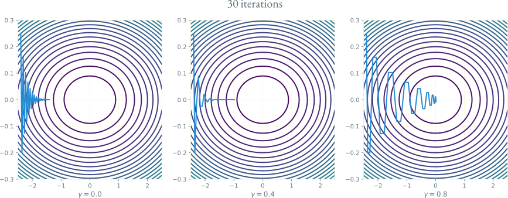

动量法 (momentum)：$\wv_{t+1} = \wv_t - \eta_t \nabla F(\wv_t) + \gamma (\wv_t - \wv_{t-1})$

- 相对于梯度下降，多了第三项，上一轮的更新方向
- 参数$\gamma < 1$，通常取$0.9$

GNN-FOOTER 图神经网络导论 机器学习 tengzhang@hust.edu.cn

<!-- slide vertical=true data-notes="" -->

GNN-HEADER 动量法

$$
\begin{align*}
    \wv_{t+1} - \wv_t & = - \eta_t \nabla F(\wv_t) + \gamma (\wv_t - \wv_{t-1}) \\
    \gamma (\wv_t - \wv_{t-1}) & = - \eta_{t-1} \gamma \nabla F(\wv_{t-1}) + \gamma^2 (\wv_{t-1} - \wv_{t-2}) \\
    & \vdots \\
    \gamma^{t-1} (\wv_2 - \wv_1) & = - \eta_1 \gamma^{t-1} \nabla F(\wv_1) + \mathtip{\gamma^t (\wv_1 - \wv_0)}{因为\wv_1 = \wv_0，故该项等于零} \\
    \Longrightarrow ~ \wv_{t+1} - \wv_t & = - \sum_{i \in [t]} \eta_i \gamma^{t-i} \nabla F(\wv_i)
\end{align*}
$$

动量法每步更新是历史梯度的加权平均

- 若近期梯度方向不太一致，则真实的更新幅度变小，减速，增加稳定性
- 若近期梯度方向较为一致，则真实的更新幅度变大，加速，加快收敛

Nesterov 加速梯度 (NAG)：改进动量法的第二步

$$
\begin{align*}
    \begin{cases} \widetilde{\wv} = \wv_t + \gamma (\wv_t - \wv_{t-1}) \\ \wv_{t+1} = \widetilde{\wv} - \eta_t \class{yellow}{\nabla F (\wv_t)} \end{cases} ~ \longrightarrow ~ \begin{cases} \widetilde{\wv} = \wv_t + \gamma (\wv_t - \wv_{t-1}) \\ \wv_{t+1} = \widetilde{\wv} - \eta_t \class{yellow}{\nabla F (\widetilde{\wv})} \end{cases}
\end{align*}
$$

GNN-FOOTER 图神经网络导论 机器学习 tengzhang@hust.edu.cn

<!-- slide vertical=true data-notes="" -->

GNN-HEADER 动量法 vs. NAG

第$t$轮迭代示意图：

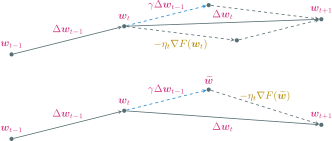

GNN-FOOTER 图神经网络导论 机器学习 tengzhang@hust.edu.cn

<!-- slide data-notes="" -->

GNN-HEADER 大纲

@import "../dot/outline-model.dot"

GNN-FOOTER 图神经网络导论 机器学习 tengzhang@hust.edu.cn

<!-- slide vertical=true data-notes="" -->

GNN-HEADER 线性回归

正则化项 + 损失函数：

$$
\begin{align*}
    \min_\wv ~ \lambda \cdot \Omega(\wv) + \frac{1}{m} \sum_{i \in [m]} l(y_i, f(\xv_i))
\end{align*}
$$

- 线性模型：$f(\xv) = \wv^\top \xv + b$
- 平方损失：$l(y, f(\xv)) = (y - f(\xv))^2$
- 正则化项：无，即采用经验风险最小化

$$
\begin{align*}
    \min_{\wv,b} ~ \frac{1}{2} \sum_{i \in [m]} (\wv^\top \xv_i + b - y_i)^2 = \frac{1}{2} \| \Xv^\top \uv - \yv \|_2^2
\end{align*}
$$

其中$\yv = [y_1; \cdots; y_m]$，$\uv \triangleq [\wv; b]$，$\Xv = \begin{bmatrix} \xv_1 & \xv_2 & \cdots & \xv_m \\ 1 & 1 & \cdots & 1 \end{bmatrix}$

GNN-FOOTER 图神经网络导论 机器学习 tengzhang@hust.edu.cn

<!-- slide vertical=true data-notes="" -->

GNN-HEADER 岭回归

$$
\begin{align*}
    \min_{\uv} ~ F(\uv) \triangleq \frac{1}{2} \| \Xv^\top \uv - \yv \|_2^2 = \frac{1}{2} \uv^\top \Xv \Xv^\top \uv - \uv^\top \Xv \yv + \frac{1}{2} \yv^\top \yv
\end{align*}
$$

易知$\nabla F(\uv) = \Xv \Xv^\top \uv - \Xv \yv$

- 若$\Xv \Xv^\top$可逆，可得最优解$\uv^\star = (\Xv \Xv^\top)^{-1} \Xv \yv$
- 若$\Xv \Xv^\top$不可逆，可采用梯度下降$\uv_{t+1} \leftarrow \uv_t - \eta_t \Xv (\Xv^\top \uv_t - \yv)$进行求解

当$\Xv \Xv^\top$近似不可逆时，其最小特征值接近零，模型会变得不稳定：

$$
\begin{align*}
    \uv^\star = (\Xv \Xv^\top)^{-1} \Xv \yv \longrightarrow \uv^\star = (\Xv \Xv^\top + \lambda \Iv)^{-1} \Xv \yv
\end{align*}
$$

修正后的解对应带$\ell_2$正则的线性回归，亦称为岭 (ridge) 回归：

$$
\begin{align*}
    \min_{\uv} ~ \frac{\lambda}{2} \|\uv\|_2^2 + \frac{1}{2} \| \Xv^\top \uv - \yv \|_2^2
\end{align*}
$$

GNN-FOOTER 图神经网络导论 机器学习 tengzhang@hust.edu.cn

<!-- slide vertical=true data-notes="" -->

GNN-HEADER LASSO

正则化项 + 损失函数：

$$
\begin{align*}
    \min_\wv ~ \lambda \cdot \Omega(\wv) + \frac{1}{m} \sum_{i \in [m]} l(y_i, f(\xv_i))
\end{align*}
$$

- 线性模型：$f(\xv) = \wv^\top \xv$
- 平方损失：$l(y, f(\xv)) = (y - f(\xv))^2$
- 正则化项：$\ell_1$正则

 

$$
\begin{align*}
    \min_\wv ~ \lambda \| \wv \|_1 + \frac{1}{2} \| \Xv^\top \wv - \yv \|_2^2
\end{align*}
$$

- 全称叫<a target="_blank" href="https://en.wikipedia.org/wiki/Lasso_(statistics)">最小绝对收缩选择算子</a> (Least Absolute Shrinkage and Selection Operator)
- 它求得的$\wv$只有极少数非零分量，因此附带特征选择的作用

GNN-FOOTER 图神经网络导论 机器学习 tengzhang@hust.edu.cn

<!-- slide data-notes="" -->

GNN-HEADER 感知机

正则化项 + 损失函数：

$$
\begin{align*}
    \min_\wv ~ \lambda \cdot \Omega(\wv) + \frac{1}{m} \sum_{i \in [m]} l(y_i, f(\xv_i))
\end{align*}
$$

- 线性模型：$f(\xv) = \wv^\top \xv$
- 损失函数：$l(y, f(\xv)) = \max \{ 0, - y \wv^\top \xv \}$，该损失不是指示函数的上界
- 正则化项：无，即采用经验风险最小化

$$
\begin{align*}
    \min_\wv ~ F(\wv) \triangleq \frac{1}{m} \sum_{i \in [m]} \max \{ 0, - y_i \wv^\top \xv_i \}
\end{align*}
$$

目标函数$F(\wv)$关于$(\xv_i, y_i)$的随机次梯度为$\frac{\partial F(\wv)}{\partial \wv} = - y_i \xv_i 1_{y_i \wv^\top \xv_i < 0}$

GNN-FOOTER 图神经网络导论 机器学习 tengzhang@hust.edu.cn

<!-- slide vertical=true data-notes="" -->

GNN-HEADER 感知机

算法即为采用随机次梯度下降进行求解的过程

输入：训练集$\{ (\xv_1, y_1), \ldots, (\xv_m, y_m) \}$，迭代次数$T$，$\wv_0 \leftarrow \zerov$，$k \leftarrow 0$

1. for $t = 1, \ldots, T$ do
2. &emsp;&emsp;随机对训练样本进行排序
3. &emsp;&emsp;for $i = 1, \ldots, m$ do
4. &emsp;&emsp;&emsp;&emsp;if $y_i \wv_k^\top \xv_i < 0$ then
5. &emsp;&emsp;&emsp;&emsp;&emsp;&emsp;$\wv_{k+1} \leftarrow \wv_k + y_i \xv_i$
6. &emsp;&emsp;&emsp;&emsp;&emsp;&emsp;$k \leftarrow k + 1$
7. &emsp;&emsp;&emsp;&emsp;end
8. &emsp;&emsp;end
9. end

输出：$\wv_k$

GNN-FOOTER 图神经网络导论 机器学习 tengzhang@hust.edu.cn

<!-- slide vertical=true data-notes="" -->

GNN-HEADER 感知机

在线性可分的数据上，感知机必然可以收敛：

给定训练集$\Scal = \{ (\xv_i, y_i) \}_{i \in [m]}$，如果$\Scal$线性可分，即存在$\gamma > 0$和$\wv$使得对$\forall i \in [m]$有$y_i \wv^\top \xv_i \geq \gamma$，设$r = \max_i \| \xv_i \|$，则感知机的权重更新次数不超过$r^2 / \gamma^2$

 

不足之处:

- 感知机虽然可以找到一个超平面把两类数据分开，但并不能保证泛化能力
- 感知机对接收的样本顺序敏感，当顺序发生变化时求得的分类超平面也会随之变化 改进方案：投票感知机，输出迭代过程中的所有$\wv_k$的线性组合，正确分类样本次数越多的$\wv_k$，系数越大
- 如果训练集不是线性可分的，感知机永远不会收敛

GNN-FOOTER 图神经网络导论 机器学习 tengzhang@hust.edu.cn

<!-- slide data-notes="" -->

GNN-HEADER 支持向量机

正则化项 + 损失函数：

$$
\begin{align*}
    \min_\wv ~ \lambda \cdot \Omega(\wv) + \frac{1}{m} \sum_{i \in [m]} l(y_i, f(\xv_i))
\end{align*}
$$

- 线性模型：$f(\xv) = \wv^\top \xv + b$
- Hinge 损失：$l(y, f(\xv)) = \max \{ 0, 1 - y f(\xv) \}$
- 正则化项：$\ell_2$正则

$$
\begin{align*}
    \min_{\wv,b} & ~ \frac{1}{2} \| \wv \|_2^2 + \frac{\lambda}{m} \sum_{i \in [m]} \max \{ 0, 1 - y_i (\wv^\top \xv_i + b) \} \\
    & \class{blue}{\bigg \Downarrow ~ \max \{ 0, 1 - y_i (\wv^\top \xv_i + b) \} = \epsilon_i} \\
    \min_{\wv,b} & ~ \frac{1}{2} \| \wv \|_2^2 + \frac{\lambda}{m} \sum_{i \in [m]} \epsilon_i, \quad \st ~ y_i (\wv^\top \xv_i + b) \geq 1 - \epsilon_i, ~ \epsilon_i \geq 0
\end{align*}
$$

GNN-FOOTER 图神经网络导论 机器学习 tengzhang@hust.edu.cn

<!-- slide vertical=true data-notes="" -->

GNN-HEADER 支持向量机

当$n \gg m$时，求解支持向量机对偶问题更为方便

$$
\begin{align*}
    \min_{\alphav} ~ \frac{1}{2} \alphav^\top \Yv \Xv \Xv^\top \Yv \alphav - \ev^\top \alphav \quad \st ~ \zerov \leq \alphav \leq \frac{\lambda}{m} \ev, ~ \yv^\top \alphav = 0
\end{align*}
$$

 

支持向量机的解法比较多

- 原问题：(随机) 次梯度下降，割平面法
- 对偶问题：SMO，坐标下降

 

支持向量机 vs. 感知机

- 共同点：解具有稀疏性，即$\wv$只与少数样本 (支持向量) 有关
- 支持向量机的泛化能力有严格理论保证，感知机没有
- 支持向量机的分类超平面是唯一且确定的，位于两类样本的正中间，对数据采样较为鲁棒，感知机求得的分类超平面不唯一，依赖样本顺序

GNN-FOOTER 图神经网络导论 机器学习 tengzhang@hust.edu.cn

<!-- slide vertical=true data-notes="" -->

GNN-HEADER 支持向量回归

正则化项 + 损失函数：

$$
\begin{align*}
    \min_\wv ~ \lambda \cdot \Omega(\wv) + \frac{1}{m} \sum_{i \in [m]} l(y_i, f(\xv_i))
\end{align*}
$$

- 线性模型：$f(\xv) = \wv^\top \xv + b$
- $\epsilon$-不敏感损失：$l(y, f(\xv)) = \max \{ 0, |y - f(\xv)| - \epsilon \}$
- 正则化项：$\ell_2$正则

$$
\begin{align*}
    \min_{\wv,b} ~ \frac{1}{2} \| \wv \|_2^2 + \frac{\lambda}{m} \sum_{i \in [m]} \max \{ 0, |\wv^\top \xv_i + b - y_i| - \epsilon \}
\end{align*}
$$

- Hinge 损失在部分区域可以取零值，这使得支持向量机的解具有稀疏性，只与产生损失的那些样本 (支持向量) 有关
- 推广到回归问题就是支持向量回归，故$\epsilon$-不敏感损失也要在部分区域取零值

GNN-FOOTER 图神经网络导论 机器学习 tengzhang@hust.edu.cn

<!-- slide data-notes="" -->

GNN-HEADER 对数几率回归

正则化项 + 损失函数：

$$
\begin{align*}
    \min_\wv ~ \lambda \cdot \Omega(\wv) + \frac{1}{m} \sum_{i \in [m]} l(y_i, f(\xv_i))
\end{align*}
$$

- 线性模型：$f(\xv) = \wv^\top \xv + b$
- 对数几率损失：$l(y, f(\xv)) = \log (1 + \exp (- y f(\xv)))$
- 正则化项：$\ell_2$正则

$$
\begin{align*}
    \min_{\wv,b} ~ \frac{1}{2} \| \wv \|_2^2 + \frac{\lambda}{m} \sum_{i \in [m]} \log (1 + \exp (- y_i (\wv^\top \xv_i + b)))
\end{align*}
$$

初衷：

- 让分类器的输出结果具有自然的概率意义
- 支持向量机的输出若想具有概率意义，还需进行额外的后处理

GNN-FOOTER 图神经网络导论 机器学习 tengzhang@hust.edu.cn

<!-- slide vertical=true data-notes="" -->

GNN-HEADER 对数几率回归

引入从预测值到概率的映射$\sigma: \Rbb \mapsto [0,1]$

$$
\begin{align*}
    \sigma(z) = \frac{1}{1 + \exp (-z)} = \begin{cases}
        1 & z \rightarrow \infty \\
        0 & z \rightarrow -\infty
    \end{cases}, ~ 1 - \sigma(z) = \frac{1}{1 + \exp (z)} = \sigma(-z)
\end{align*}
$$

- 设预测$\xv$为正类的概率$p(y=1|\xv) = \sigma(\wv^\top \xv + b)$
- 预测$\xv$为负类的概率$p(y=-1|\xv) = 1 - \sigma(\wv^\top \xv + b) = \sigma(-\wv^\top \xv-b)$
- 预测结果分布可记为$\pv = [\sigma(\wv^\top \xv + b); \sigma(-\wv^\top \xv-b)]$
- 由于$y \in \{ \pm 1 \}$，真实类别分布可记为$\qv = [\frac{1+y}{2}; \frac{1-y}{2}]$
- 分布$\pv$和$\qv$之间的差异可作为替代损失

 

问题：给定分布$\qv$，如何度量分布$\pv$与它之间的差异？

 

交叉熵$H_{\qv} (\pv) = - \sum_i q_i \log p_i = \sum_i q_i \log (1/p_i)$，当$\pv = \qv$时交叉熵最小

GNN-FOOTER 图神经网络导论 机器学习 tengzhang@hust.edu.cn

<!-- slide vertical=true data-notes="" -->

GNN-HEADER 对数几率回归

$$
\begin{align*}
    \min_{\pv} ~ H_{\qv} (\pv) = - \sum_i q_i \log p_i = \sum_i q_i \log (1/p_i), \quad \st ~ \sum_i p_i = 1
\end{align*}
$$

拉格朗日函数为$L = - \sum_i q_i \log p_i + \alpha (\sum_i p_i - 1)$，于是

$$
\begin{align*}
    \frac{\partial L}{\partial p_i} = - \frac{q_i}{p_i} + \alpha = 0 ~ \Longrightarrow ~ p_i = \frac{q_i}{\alpha} ~ \Longrightarrow ~ \alpha = 1 ~ \Longrightarrow ~ p_i = q_i
\end{align*}
$$

 

对数几率回归：$\qv = [\frac{1+y}{2}; \frac{1-y}{2}]$，$\pv = [\sigma(\wv^\top \xv + b); \sigma(-\wv^\top \xv-b)]$

$$
\begin{align*}
    H_{\qv} (\pv) & = \frac{1+y}{2} \log (1 + \exp (-\wv^\top \xv - b)) + \frac{1-y}{2} \log (1 + \exp (\wv^\top \xv + b)) \\
    & = \begin{cases}
        \log (1 + \exp (-\wv^\top \xv - b)) & y = 1 \\
        \log (1 + \exp (\wv^\top \xv + b)) & y = -1
    \end{cases} \\
    & = \log (1 + \exp (- y (\wv^\top \xv + b)))
\end{align*}
$$

GNN-FOOTER 图神经网络导论 机器学习 tengzhang@hust.edu.cn

<!-- slide vertical=true data-notes="" -->

GNN-HEADER 对数几率回归

$$
\begin{align*}
    H_{\qv} (\pv) = \log (1 + \exp (- y (\wv^\top \xv + b)))
\end{align*}
$$

 

交叉熵损失应用到二分类问题上就退化成了对数几率损失

记$p_+ = p(y=1|\xv)$，$p_- = p(y=-1|\xv) = 1 - p_+$，则

$$
\begin{align*}
    p_+ = \frac{1}{1 + \exp (-(\wv^\top \xv + b))} ~ \Longrightarrow ~ \wv^\top \xv + b = \ln \frac{p_+}{1-p_+} = \ln \frac{p_+}{p_-}
\end{align*}
$$

- $p_+$与$p_-$的比值反映了预测为正类的相对可能性，称为几率
- 用线性模型$\wv^\top \xv + b$拟合几率的对数$\ln (p_+/p_-)$，故称为对数几率回归
- 虽然名为回归，但本质上是一个分类模型
- 让预测结果具有概率意义的代价是牺牲了解的稀疏性，预测的计算开销更大
- 对数几率回归另一个优势是可以很自然地推广到多分类

GNN-FOOTER 图神经网络导论 机器学习 tengzhang@hust.edu.cn

<!-- slide data-notes="" -->

GNN-HEADER 多分类对数几率回归

设共有$C$个类，预测函数$f(\xv) = \argmax_{c \in [C]} (\wv_c^\top \xv + b_c)$

引入$\Rbb^C \mapsto \Delta^C$的 Softmax 映射：

$$
\begin{align*}
    p(y = c | \xv) & = \frac{\exp (\wv_c^\top \xv + b_c)}{\sum_{c' \in [C]} \exp (\wv_{c'}^\top \xv + b_{c'})} \\
    & = \frac{\exp ((\wv_c - \wv_C)^\top \xv + b_c - b_C)}{\sum_{c' \in [C-1]} \exp ((\wv_{c'} - \wv_C)^\top \xv + b_{c'} - b_C) + 1}
\end{align*}
$$

令$\wv_c \leftarrow \wv_c - \wv_C$，$b_c \leftarrow b_c - b_C$，记$p_c = p(y = c | \xv)$，于是

$$
\begin{align*}
    p_c = \frac{\exp (\wv_c^\top \xv + b_c)}{\sum_{c' \in [C-1]} \exp (\wv_{c'}^\top \xv + b_{c'}) + 1}, \quad p_C = 1 - \sum_{c' \in [C-1]} p_c
\end{align*}
$$

GNN-FOOTER 图神经网络导论 机器学习 tengzhang@hust.edu.cn

<!-- slide vertical=true data-notes="" -->

GNN-HEADER 多分类对数几率回归

$$
\begin{align*}
    p_c = \frac{\exp (\wv_c^\top \xv + b_c)}{\sum_{c' \in [C-1]} \exp (\wv_{c'}^\top \xv + b_{c'}) + 1}, \quad p_C = 1 - \sum_{c' \in [C-1]} p_c
\end{align*}
$$

对于样本$(\xv_i, y_i)$，$\qv_i = [1_{y_i=1}, 1_{y_i=2}, \ldots, 1_{y_i=C}]$为$y_i$的独热编码

$$
\begin{align*}
    \pv_i & = [p_1, \ldots, p_{C-1}, p_C] = \frac{[ \exp (\wv_1^\top \xv_i + b_1), \ldots, \exp (\wv_{C-1}^\top \xv_i + b_{C-1}), 1 ]}{\sum_{c' \in [C-1]} \exp (\wv_{c'}^\top \xv_i + b_{c'}) + 1}
\end{align*}
$$

采用交叉熵$H_{\qv_i} (\pv_i)$作为替代损失可得多分类对数几率回归

$$
\begin{align*}
    \min_{\wv_c, b_c} & ~ \frac{1}{2} \sum_{c \in [C-1]} \| \wv_c \|_2^2 + \frac{\lambda}{m} \sum_{i \in [m]} \sum_{c \in [C]} [\qv_i]_c \log \frac{1}{[\pv_i]_c}
\end{align*}
$$

GNN-FOOTER 图神经网络导论 机器学习 tengzhang@hust.edu.cn

<!-- slide vertical=true data-notes="" -->

GNN-HEADER 多分类对数几率回归

当$C = 2$时

$$
\begin{align*}
    H_{\qv} (\pv) & = - 1_{y=1} \log \frac{\exp (\wv_1^\top \xv + b_1)}{ \exp (\wv_1^\top \xv + b_1) + 1} - 1_{y=2} \log \frac{1}{ \exp (\wv_1^\top \xv + b_1) + 1} \\
    & = 1_{y=1} \log (1 + \exp (- \wv_1^\top \xv - b_1)) + 1_{y=2} \log (1 + \exp (\wv_1^\top \xv + b_1))
\end{align*}
$$

将第$2$类类别标记记为$-1$，则$H_{\qv} (\pv) = \log (1 + \exp (- y (\wv_1^\top \xv + b_1)))$

 

神经网络视角：

| 对数几率回归 | 层数 | 激活函数 | 输出层节点数 | 类别标记            |
| :----------: | :--: | :------: | :----------: | ------------------- |
|    二分类    | 1 层 | Logistic |     $1$      | $y \in \{ 1, -1 \}$ |
|    多分类    | 1 层 | Softmax  |     $C$      | $y \in [C]$         |

GNN-FOOTER 图神经网络导论 机器学习 tengzhang@hust.edu.cn

<!-- slide vertical=true data-notes="" -->

GNN-HEADER 小结

正则化项 + 损失函数：

$$
\begin{align*}
    \min_\wv ~ \lambda \cdot \Omega(\wv) + \frac{1}{m} \sum_{i \in [m]} l(y_i, f(\xv_i))
\end{align*}
$$

|     模型     |   正则化项    |                    损失函数                     |          预测函数          |
| :----------: | :-----------: | :---------------------------------------------: | :------------------------: |
|   线性回归   |       -       |           $(\wv^\top \xv + b - y)^2$            |     $\wv^\top \xv + b$     |
|    岭回归    | $\|\wv\|_2^2$ |           $(\wv^\top \xv + b - y)^2$            |     $\wv^\top \xv + b$     |
|    LASSO     |  $\|\wv\|_1$  |             $(\wv^\top \xv - y)^2$              |       $\wv^\top \xv$       |
|    感知机    |       -       |        $\max \{ 0, - y \wv^\top \xv \}$         |    $\sgn(\wv^\top \xv)$    |
|  支持向量机  | $\|\wv\|_2^2$ |    $\max \{ 0, 1 - y (\wv^\top \xv + b) \}$     |  $\sgn(\wv^\top \xv + b)$  |
| 支持向量回归 | $\|\wv\|_2^2$ | $\max \{ 0, \wv^\top \xv + b - y - \epsilon \}$ |     $\wv^\top \xv + b$     |
| 对数几率回归 | $\|\wv\|_2^2$ |   $\log (1 + \exp (- y (\wv^\top \xv + b)))$    | $\sigma(\wv^\top \xv + b)$ |

### 以上线性模型均可通过引入核映射实现非线性预测能力

GNN-FOOTER 图神经网络导论 机器学习 tengzhang@hust.edu.cn
