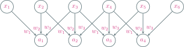
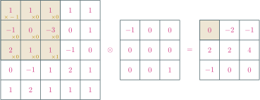
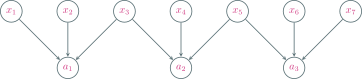
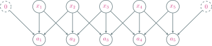
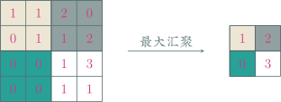
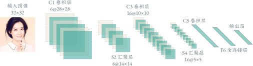
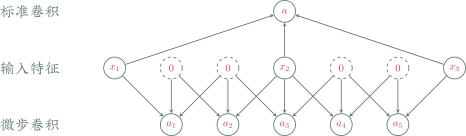
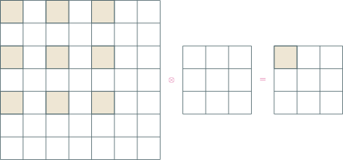

---
presentation:
  transition: "none"
  enableSpeakerNotes: true
  margin: 0
---

@import "../common/css/font-awesome-4.7.0/css/font-awesome.css"
@import "../common/css/zhangt-solarized.css"
@import "css/GNN.css"

<!-- slide data-notes="" -->
<div class="header"></div>

<div class="bottom15"></div>

# 图神经网络导论

<hr class="width50">

## 卷积神经网络

<div class="bottom5"></div>

### 计算机科学与技术学院 &nbsp; &nbsp; 张腾

<br>

#### tengzhang@hust.edu.cn

<!-- slide vertical=true data-notes="" -->

GNN-HEADER 大纲

@import "../dot/outline-cnn.dot"

GNN-FOOTER 图神经网络导论 卷积神经网络 tengzhang@hust.edu.cn

<!-- slide data-notes="" -->

GNN-HEADER 动机

图像数据集 [ImageNet](https://image-net.org/index.php)：

- 共有 14,197,122 训练图片、50,000 验证图片、100,000 测试图片
- 共有 1,000 个类别，通过众包进行标注
- 图片分辨率：256 × 256、224 × 224、299 × 299

<br>

用全连接网络进行训练 ImageNet

- 图片全部裁减到 224 × 224，输入层神经元个数为 50,176
- 共有 1,000 个类别，输出层神经元个数为 1,000
- 假设只有一个隐藏层，神经元个数取个折中 10,000

<br>

总参数量为 (50,176 + 1,000) × 10,000 = 511,760,000

- 训练效率非常低
- 很容易出现过拟合

GNN-FOOTER 图神经网络导论 卷积神经网络 tengzhang@hust.edu.cn

<!-- slide vertical=true data-notes="" -->

GNN-HEADER 局部连接 权值共享

@import "../dot/dense-vs-cnn.dot" {.center}

<div></div>

局部连接：

- 每个神经元只与前一层的$k$个神经元相连
- $k$远小于前一层的神经元总数

权值共享：每个神经元只与前一层的少数神经元相连

<br>

限制神经元的输入权重个数，降低参数规模和模型复杂度

GNN-FOOTER 图神经网络导论 卷积神经网络 tengzhang@hust.edu.cn

<!-- slide vertical=true data-notes="" -->

GNN-HEADER 权重共享



<div class="center">

$$
\begin{align*}
    a_1 & = x_1 \times w_1 + x_2 \times w_2 + x_3 \times w_3 \\
    a_2 & = x_2 \times w_1 + x_3 \times w_2 + x_4 \times w_3 \\
    a_3 & = x_3 \times w_1 + x_4 \times w_2 + x_5 \times w_3 \\
    a_4 & = x_4 \times w_1 + x_5 \times w_2 + x_6 \times w_3
\end{align*}
$$

</div>

<div class="bottom4"></div>

### 卷积神经网络：局部连接，权值共享

GNN-FOOTER 图神经网络导论 卷积神经网络 tengzhang@hust.edu.cn

<!-- slide data-notes="这页是在讲为啥叫卷积" -->

GNN-HEADER 一维卷积

$$
\begin{align*}
    (f \otimes g) [n] = \sum_{m = -\infty}^\infty f[m] \cdot g[n-m]
\end{align*}
$$


取$f[i] = x_i$，$g[-2] = w_3$，$g[-1] = w_2$，$g[0] = w_1$，其余为零，则有

$$
\begin{align*}
    a_n = x_n w_1 + x_{n+1} w_2 + x_{n+2} w_3 = \sum_{m = -\infty}^\infty f[m] \cdot g[n-m] = (f \otimes g) [n]
\end{align*}
$$

GNN-FOOTER 图神经网络导论 卷积神经网络 tengzhang@hust.edu.cn

<!-- slide vertical=true data-notes="" -->

GNN-HEADER 二维卷积

针对输入是矩阵的情形



参与卷积的深色区域称为对应输出神经元的<span class="blue">感受野</span> (receptive field)

GNN-FOOTER 图神经网络导论 卷积神经网络 tengzhang@hust.edu.cn

<!-- slide data-notes="" -->

GNN-HEADER 图像滤波

平滑去噪

<div class="multi_column top6 left6" style="height:280px">
    
    <div style="display:flex;align-items:center;height:100%">
        <p class="left2">
            $\otimes ~ \begin{bmatrix}
                \frac{1}{9} & \frac{1}{9} & \frac{1}{9} \\ \frac{1}{9} & \frac{1}{9} & \frac{1}{9} \\ \frac{1}{9} & \frac{1}{9} & \frac{1}{9}
            \end{bmatrix} ~ =$ 
        </p>
    </div>
    
</div>

GNN-FOOTER 图神经网络导论 卷积神经网络 tengzhang@hust.edu.cn

<!-- slide vertical=true data-notes="" -->

GNN-HEADER 图像卷积

边缘提取

<div class="multi_column top6 left6" style="height:280px">
    
    <div style="display:flex;align-items:center;height:100%">
        <p class="left2">
            $\otimes ~ \begin{bmatrix}
                0 & 1 & 1 \\ -1 & 0 & 1 \\ -1 & -1 & 0
            \end{bmatrix} ~ = $ 
        </p>
    </div>
    
</div>

GNN-FOOTER 图神经网络导论 卷积神经网络 tengzhang@hust.edu.cn

<!-- slide vertical=true data-notes="这页的卷积模板又叫拉普拉斯算子" -->

GNN-HEADER 图像卷积

边缘提取

<div class="multi_column top6 left6" style="height:280px">
    
    <div style="display:flex;align-items:center;height:100%">
        <p class="left2">
            $\otimes ~ \begin{bmatrix}
                0 & 1 & 0 \\ 1 & -4 & 1 \\ 0 & 1 & 0
            \end{bmatrix} ~ = $
        </p>
    </div>
    
</div>

GNN-FOOTER 图神经网络导论 卷积神经网络 tengzhang@hust.edu.cn

<!-- slide vertical=true data-notes="" -->

GNN-HEADER 拉普拉斯算子

偏导数

$$
\begin{align*}
    \frac{\partial f}{\partial x} = \lim_{u \rightarrow 0} \frac{f(x+u, y) - f(x-u, y)}{2 u} \overset{u \leftarrow 0.5}{\approx} f(x+\frac{1}{2}, y) - f(x-\frac{1}{2}, y)
\end{align*}
$$

于是

$$
\begin{align*}
    \Delta & f = \div (\grad f) = \left[ \frac{\partial}{\partial x}, \frac{\partial}{\partial y} \right] \cdot \left[ \frac{\partial f}{\partial x}; \frac{\partial f}{\partial y} \right] = \frac{\partial^2 f}{\partial x^2} + \frac{\partial^2 f}{\partial y^2} \\
    & = \frac{\partial f(x+\frac{1}{2}, y)}{\partial x} - \frac{\partial f(x-\frac{1}{2}, y)}{\partial x} + \frac{\partial f(x, y+\frac{1}{2})}{\partial y} - \frac{\partial f(x, y-\frac{1}{2})}{\partial y} \\
    & \approx (f(x+1, y) - f(x, y)) - (f(x, y) - f(x-1, y)) \\
    & \qquad \qquad \qquad + (f(x, y+1) - f(x, y)) - (f(x, y) - f(x, y-1)) \\
    & = f(x+1, y) + f(x-1, y) + f(x, y-1) + f(x, y+1) - 4 f(x, y)
\end{align*}
$$

GNN-FOOTER 图神经网络导论 卷积神经网络 tengzhang@hust.edu.cn

<!-- slide data-notes="" -->

GNN-HEADER 卷积超参数

引入参数可以更灵活地进行特征抽取

- 大小$c$：滤波器的长度
- 步长$s$：滤波器滑动的间隔
- 补零$p$：输入神经元两端各补零的个数

<br>

步长$s=2$：



若输入神经元个数为$n$，则卷积层神经元个数为$(n - c) / s + 1$

GNN-FOOTER 图神经网络导论 卷积神经网络 tengzhang@hust.edu.cn

<!-- slide vertical=true data-notes="" -->

GNN-HEADER 卷积超参数

引入参数可以更灵活地进行特征抽取

- 大小$c$：滤波器的长度
- 步长$s$：滤波器滑动的间隔
- 补零$p$：输入神经元两端各补零的个数

<br>

补零$p=1$：



若输入神经元个数为$n$，则卷积层神经元个数为$(n - c + 2p) / s + 1$

GNN-FOOTER 图神经网络导论 卷积神经网络 tengzhang@hust.edu.cn

<!-- slide vertical=true data-notes="" -->

GNN-HEADER 卷积超参数

引入参数可以更灵活地进行特征抽取

- 大小$c$：滤波器的长度
- 步长$s$：滤波器滑动的间隔
- 补零$p$：输入神经元两端各补零的个数

<br>

若输入神经元个数为$n$，则卷积层神经元个数为$(n - c + 2p) / s + 1$

<br>

常用的卷积有如下三类：

- 窄卷积：步长$s = 1$，两端不补零$p = 0$，卷积后输出长度为$n − c + 1$
- 宽卷积：步长$s = 1$，两端补零$p = c - 1$，卷积后输出长度为$n + c - 1$
- 等宽卷积：步长$s = 1$，两端补零$p = (c − 1) / 2$，卷积后输出长度$n$

GNN-FOOTER 图神经网络导论 卷积神经网络 tengzhang@hust.edu.cn

<!-- slide data-notes="" -->

GNN-HEADER 参数求导

设$\Zv = \Av \otimes \Wv + b$，$\Av \in \Rbb^{U \times V}$，$\Wv \in \Rbb^{u \times v}$，$\Zv \in \Rbb^{(U-u+1) \times (V-v+1)}$

$$
\begin{align*}
    z_{ij} = \sum_{u,v} w_{uv} a_{i+u-1, j+v-1} + b
\end{align*}
$$

记$\deltav^\top = \partial \Lcal(\yv, \hat{\yv}) / \partial \Zv$为误差项，由链式法则有

$$
\begin{align*}
    \frac{\partial \Lcal (\yv, \hat{\yv})}{\partial b} & = \sum_{i,j} \frac{\partial \Lcal (\yv, \hat{\yv})}{\partial z_{ij}} \frac{\partial z_{ij}}{\partial b} = \sum_{i,j} [\deltav]_{ij} \\
    \frac{\partial \Lcal (\yv, \hat{\yv})}{\partial w_{uv}} & = \sum_{i,j} \frac{\partial \Lcal (\yv, \hat{\yv})}{\partial z_{ij}} \frac{\partial z_{ij}}{\partial w_{uv}} = \sum_{i,j} a_{i+u-1, j+v-1} [\deltav]_{ij} = [\Av \otimes \deltav]_{uv} \\
    & \Longrightarrow \frac{\partial \Lcal (\yv, \hat{\yv})}{\partial \Wv} = (\Av \otimes \deltav)^\top
\end{align*}
$$

GNN-FOOTER 图神经网络导论 卷积神经网络 tengzhang@hust.edu.cn

<!-- slide vertical=true data-notes="" -->

GNN-HEADER 参数求导

设$\Zv = \Av \otimes \Wv + b$，$\Av \in \Rbb^{U \times V}$，$\Wv \in \Rbb^{u \times v}$，$\Zv \in \Rbb^{(U-u+1) \times (V-v+1)}$

$$
\begin{align*}
    z_{ij} = \sum_{u,v} w_{uv} a_{i+u-1, j+v-1} + b
\end{align*}
$$

记$\deltav^\top = \partial \Lcal(\yv, \hat{\yv}) / \partial \Zv$为误差项，由链式法则有

$$
\begin{align*}
    \frac{\partial \Lcal (\yv, \hat{\yv})}{\partial a_{st}} = \sum_{i,j} \frac{\partial \Lcal (\yv, \hat{\yv})}{\partial z_{ij}} \frac{\partial z_{ij}}{\partial a_{st}} = \sum_{i,j} w_{s-i+1,t-j+1} [\deltav]_{ij}
\end{align*}
$$

当$s-i+1 \not \in [u]$或者$t-j+1 \not \in [v]$时，令$w_{s-i+1,t-j+1} = 0$

相当于对$\Wv$进行了$p = (U - u, V - v)$的零填充，记$\widetilde{\otimes}$为<span class="blue">宽卷积</span>

$$
\begin{align*}
    \frac{\partial \Lcal (\yv, \hat{\yv})}{\partial \Av} = (\rot(\Wv) \widetilde{\otimes} \deltav)^\top
\end{align*}
$$

GNN-FOOTER 图神经网络导论 卷积神经网络 tengzhang@hust.edu.cn

<!-- slide data-notes="" -->

GNN-HEADER 汇聚

汇聚 (pooling) 层也叫子采样 (subsampling) 层

<br>

- 最大汇聚 (maximum pooling)：取区域内神经元最大值，<span class="blue">拥有一定的平移不变性</span>



- 平均汇聚 (mean pooling)：取区域内神经元平均值

<br>

我的批注 将区域下采样为一个值，进一步减少网络参数，降低模型复杂度

GNN-FOOTER 图神经网络导论 卷积神经网络 tengzhang@hust.edu.cn

<!-- slide data-notes="" -->

GNN-HEADER 卷积神经网络

卷积神经网络由卷积层、汇聚层、全连接层交叉堆叠而成

@import "../dot/cnn.dot"

<br>

趋势

- 更小的卷积核，比如 3 × 3
- 更深的结构，比如层数大于 50
- 汇聚层的作用可由卷积步长代替，使用比例逐渐降低，趋向于全卷积网络

GNN-FOOTER 图神经网络导论 卷积神经网络 tengzhang@hust.edu.cn

<!-- slide vertical=true data-notes="" -->

GNN-HEADER 反向传播

卷积神经网络也是通过误差反向传播算法进行参数学习

<br>

卷积神经网络的参数为<span class="blue">卷积核</span>和<span class="blue">偏置</span>

<br>

设第$l$层为卷积层：$\Zv_l = \Av_{l-1} \otimes \Wv_l + b_l$，$\partial \Lcal(\yv, \hat{\yv}) / \partial \Zv_l = \deltav_l^\top$为误差项

$$
\begin{align*}
    \frac{\partial \Lcal (\yv, \hat{\yv})}{\partial \Wv_l} & = (\Av_{l-1} \otimes \deltav_l)^\top \\
    \frac{\partial \Lcal (\yv, \hat{\yv})}{\partial b_l} & = \sum_{i,j} [\deltav_l]_{ij} \\
    \frac{\partial \Lcal (\yv, \hat{\yv})}{\partial \Av_{l-1}} & = (\rot(\Wv_l) \widetilde{\otimes} \deltav_l)^\top
\end{align*}
$$

剩下需计算$\deltav_l$

GNN-FOOTER 图神经网络导论 卷积神经网络 tengzhang@hust.edu.cn

<!-- slide vertical=true data-notes="" -->

GNN-HEADER 反向传播

若第$l+1$层为汇聚层：该层神经元均是第$l$层某个区域下采样得到的

$$
\begin{align*}
    \Zv_l \xrightarrow{~~激活\quad} \Av_l \xrightarrow{~~汇聚\quad} \Zv_{l+1}
\end{align*}
$$

<br>

反向传播时，需对第$l+1$层的误差项<span class="green">上采样</span>到和第$l$层一样大

$$
\begin{align*}
    \deltav_l^\top = \frac{\partial \Lcal(\yv, \hat{\yv})}{\partial \Zv_l} & = \class{red}{\frac{\partial \Lcal(\yv, \hat{\yv})}{\partial \Zv_{l+1}}} \class{green}{\frac{\partial \Zv_{l+1}}{\partial \Av_l}} \class{blue}{\frac{\partial \Av_l}{\partial \Zv_l}} \\
    & = \class{green}{\up}(\class{red}{\deltav_{l+1}^\top}) \odot \class{blue}{h'_l (\Zv_l)}
\end{align*}
$$

- 最大汇聚：误差项$\deltav_{l+1}$中的每个值会直接传递到第$l$层对应区域中的最大值所对应的神经元，该区域中其它神经元的误差项的都设为$0$
- 平均汇聚：误差项$\deltav_{l+1}$中每个值会被平均分配到第$l$层对应区域中的所有神经元上

GNN-FOOTER 图神经网络导论 卷积神经网络 tengzhang@hust.edu.cn

<!-- slide vertical=true data-notes="" -->

GNN-HEADER 反向传播

若第$l+1$层为卷积层：该层神经元均是第$l$层神经元经过卷积得到的

$$
\begin{align*}
    \Zv_l \xrightarrow{~~激活\quad} \Av_l \xrightarrow{~~卷积\quad} \Zv_{l+1}
\end{align*}
$$

<br>

反向传播

$$
\begin{align*}
    \deltav_l^\top = \frac{\partial \Lcal(\yv, \hat{\yv})}{\partial \Zv_l} = \frac{\partial \Lcal(\yv, \hat{\yv})}{\partial \Av_l} \frac{\partial \Av_l}{\partial \Zv_l} = (\rot(\Wv_{l+1}) \widetilde{\otimes} \deltav_{l+1})^\top h'_l (\Zv_l)
\end{align*}
$$

其中$\widetilde{\otimes}$为宽卷积

GNN-FOOTER 图神经网络导论 卷积神经网络 tengzhang@hust.edu.cn

<!-- slide data-notes="第一个现代卷积网络模型" -->

GNN-HEADER 经典网络 LeNet-5



```python {.line-numbers}
Model: "sequential"
_________________________________________________________________
Layer (type)                 Output Shape              Param #
=================================================================
conv2d (Conv2D)              (None, 28, 28, 6)         156
_________________________________________________________________
average_pooling2d (AveragePo (None, 14, 14, 6)         0
_________________________________________________________________
conv2d_1 (Conv2D)            (None, 10, 10, 16)        2416
_________________________________________________________________
average_pooling2d_1 (Average (None, 5, 5, 16)          0
_________________________________________________________________
conv2d_2 (Conv2D)            (None, 1, 1, 120)         48120
_________________________________________________________________
flatten (Flatten)            (None, 120)               0
_________________________________________________________________
dense (Dense)                (None, 84)                10164
_________________________________________________________________
dense_1 (Dense)              (None, 10)                850
=================================================================
Total params: 61,706
Trainable params: 61,706
Non-trainable params: 0
```

GNN-FOOTER 图神经网络导论 卷积神经网络 tengzhang@hust.edu.cn

<!-- slide vertical=true data-notes="" -->

GNN-HEADER 经典网络 LeNet-5

```python {.line-numbers}
import numpy as np
import tensorflow as tf
from tensorflow.keras import Sequential
from tensorflow.keras.datasets.mnist import load_data
from tensorflow.keras.layers import (Conv2D, Dense, Dropout,
                                     Flatten, AveragePooling2D)
from tensorflow.keras.optimizers import Adam

(x_train, y_train), (x_test, y_test) = load_data()
x_train, x_test = x_train / 255.0, x_test / 255.0
x_train = np.expand_dims(x_train, -1)
x_test = np.expand_dims(x_test, -1)

model = Sequential()
model.add(Conv2D(6, (5, 5), activation="relu",
                 padding="same", input_shape=(28, 28, 1)))
model.add(AveragePooling2D(pool_size=(2, 2)))
model.add(Conv2D(16, (5, 5), activation="relu"))
model.add(AveragePooling2D(pool_size=(2, 2)))
model.add(Conv2D(120, (5, 5), activation="relu"))
model.add(Flatten())
model.add(Dense(84, activation="relu"))
model.add(Dense(10, activation="softmax"))
model.compile(
    optimizer=Adam(0.001),
    loss="sparse_categorical_crossentropy",
    metrics=["accuracy"]
)

model.fit(x_train, y_train, epochs=5)
model.evaluate(x_test, y_test, verbose=2)

Epoch 1/5
1875/1875 [=============] - 5s 2ms/step - loss: 0.2169 - accuracy: 0.9316
Epoch 2/5
1875/1875 [=============] - 3s 1ms/step - loss: 0.0733 - accuracy: 0.9773
Epoch 3/5
1875/1875 [=============] - 3s 1ms/step - loss: 0.0525 - accuracy: 0.9833
Epoch 4/5
1875/1875 [=============] - 3s 1ms/step - loss: 0.0417 - accuracy: 0.9869
Epoch 5/5
1875/1875 [=============] - 3s 1ms/step - loss: 0.0330 - accuracy: 0.9898

313/313 - 0s - loss: 0.0322 - accuracy: 0.9905
```

GNN-FOOTER 图神经网络导论 卷积神经网络 tengzhang@hust.edu.cn

<!-- slide vertical=true data-notes="" -->

GNN-HEADER 经典网络 AlexNet

2012 年 ImageNet 图像分类竞赛冠军

1. 输入层，输入图像大小为 224 × 224 × 3
2. 卷积层，使用两个 11 × 11 × 3 × 48 的卷积核，步长 s = 4，零填充 p = 3
3. 汇聚层，采样窗口为 3 × 3，使用最大汇聚，步长 s = 2
4. 卷积层，共使用两个 5 × 5 × 48 × 128 的卷积核，步长 s = 1，零填充 p = 2
5. 汇聚层，采样窗口为 3 × 3，使用最大汇聚，步长 s = 2
6. 卷积层，使用一个 3 × 3 × 256 × 384 的卷积核，步长 s = 1，零填充 p = 1
7. 卷积层，使用两个 3 × 3 × 192 × 192 的卷积核，步长 s = 1，零填充 p = 1
8. 卷积层，使用两个 3 × 3 × 192 × 128 的卷积核，步长 s = 1，零填充 p = 1
9. 汇聚层，采样窗口为 3 × 3，使用最大汇聚，步长 s = 2
10. 三个全连接层
11. 输出层

GNN-FOOTER 图神经网络导论 卷积神经网络 tengzhang@hust.edu.cn

<!-- slide vertical=true data-notes="" -->

GNN-HEADER 经典网络 Inception

一个卷积层包含多个不同大小的卷积操作

@import "../dot/inception.dot"

<br>

我的批注 1 × 1 卷积就是将所有通道的特征直接相加

GNN-FOOTER 图神经网络导论 卷积神经网络 tengzhang@hust.edu.cn

<!-- slide vertical=true data-notes="" -->

GNN-HEADER 经典网络 GoogLeNet

{--Google--}， GoogLe ✓，致敬 ‪Yann LeCun

<br>

2014 年 ImageNet 图像分类竞赛的冠军

<br>

由 9 个 Inception v1 模块和 5 个汇聚层以及其它一些卷积层和全连接层构成，总共为 22 层网络

<br>

Inception 网络有多个改进版本

- v3 网络用多层的小卷积核来替换大的卷积核，以减少计算量和参数量
- v4 网络结合了残差网络的设计，带有直连边

GNN-FOOTER 图神经网络导论 卷积神经网络 tengzhang@hust.edu.cn

<!-- slide data-notes="宽卷积亦可" -->

GNN-HEADER 微步卷积

(窄) 卷积可视为高维特征到低维的降维变换，如果想升维怎么办？

<br>

令卷积核的步长 s < 1 也可以实现升维

<br>

实现：在输入特征之间插入 0 间接使得步长变小

<br>

一维微步卷积的例子：



GNN-FOOTER 图神经网络导论 卷积神经网络 tengzhang@hust.edu.cn

<!-- slide vertical=true data-notes="" -->

GNN-HEADER 空洞卷积

对于一个卷积层，如果想增加输出单元的感受野

- 增加卷积核的大小，增加参数数量
- 增加层数，增加参数数量
- 在卷积之前进行汇聚操作，丢失信息

<br>

给卷积核插入“空洞”变相地增加其大小，也称为膨胀卷积



GNN-FOOTER 图神经网络导论 卷积神经网络 tengzhang@hust.edu.cn
