---
presentation:
  transition: "none"
  enableSpeakerNotes: true
  margin: 0
---

@import "../common/css/font-awesome-4.7.0/css/font-awesome.css"
@import "../common/css/zhangt-solarized.css"
@import "css/GNN.css"

<!-- slide data-notes="" -->
<div class="header"></div>

<div class="bottom15"></div>

# 图神经网络导论

<hr class="width50">

## 循环神经网络

<div class="bottom5"></div>

### 计算机科学与技术学院 &nbsp; &nbsp; 张腾

<br>

#### tengzhang@hust.edu.cn

<!-- slide vertical=true data-notes="" -->

GNN-HEADER 大纲

@import "../dot/outline-rnn.dot"

GNN-FOOTER 图神经网络导论 循环神经网络 tengzhang@hust.edu.cn

<!-- slide data-notes="" -->

GNN-HEADER 语言模型

语言模型：对于给定序列$\xv_1, \ldots, \xv_T$，计算联合概率$p(\xv_T, \ldots, \xv_1)$

用途：

- 判别给定序列人言否$p(\text{make America great again}) > p(\text{great America make again})$
- 根据现有序列，预测下一个词：hello [ world | China | Hubei | Wuhan | HUST ]？

<br>

前面的词很重要：

As the debugger reports no error, the screen prints hello <span class="blue">world</span>

<div class="bottom4"></div>

根据条件概率公式

$$
\begin{align*}
    p(\xv_T, \ldots, \xv_1) = p(\xv_T | \xv_{T-1}, \ldots, \xv_1) \cdots p(\xv_3 | \xv_2, \xv_1) ~ p(\xv_2 | \xv_1) ~ p(\xv_1)
\end{align*}
$$

引入马尔可夫假设，假设当前词出现的概率只依赖于前 n - 1 个词

GNN-FOOTER 图神经网络导论 循环神经网络 tengzhang@hust.edu.cn

<!-- slide vertical=true data-notes="" -->

GNN-HEADER n-gram 统计语言模型

当前词出现的概率只依赖于前 n - 1 个词

- n = 1：$p(\xv_i | \xv_{i-1}, \ldots, \xv_1) = p(\xv_i), ~ p(\xv_1, \ldots, \xv_T) = \prod_{i \in [T]} p(\xv_i)$
- n = 2：$p(\xv_i | \xv_{i-1}, \ldots, \xv_1) = p(\xv_i | \xv_{i-1}), ~ p(\xv_1, \ldots, \xv_T) = \prod_{i \in [T]} p(\xv_i | \xv_{i-1})$
- n = 3：$p(\xv_i | \xv_{i-1}, \ldots, \xv_1) = p(\xv_i | \xv_{i-1}, \xv_{i-2}), ~ p(\xv_1, \ldots, \xv_T) = \prod_{i \in [T]} p(\xv_i | \xv_{i-1}, \xv_{i-2})$

优点：

- 采用极大似然估计，参数易训练 (数数)
- 完全包含了前 n - 1 个词的全部信息
- 可解释性强，直观易理解

缺点：

- 不够灵活，只能固定地看前 n - 1 个词
- 随着 n 的增大，参数空间呈指数增长
- 单纯的基于统计频次，泛化能力差

GNN-FOOTER 图神经网络导论 循环神经网络 tengzhang@hust.edu.cn

<!-- slide vertical=true data-notes="" -->

GNN-HEADER 神经语言模型

设词典里共有 N 个词，每个词独热编码成 N 维 01 向量

设嵌入层 (embedding layer) 得到每个词的$d$维词向量，即$\{ 0,1 \}^N \rightarrow \Rbb^d$

设嵌入层 (embedding layer) 得到每个词的$d$维词向量，即$\{ 0,1 \}^N \rightarrow \Rbb^d$

设嵌入层 (embedding layer) 得到每个词的$d$维词向量，即$\{ 0,1 \}^N \rightarrow \Rbb^d$

设嵌入层 (embedding layer) 得到每个词的$d$维词向量，即$\{ 0,1 \}^N \rightarrow \Rbb^d$

<div class="threelines width60 lefta right3 top-50per">

| index |   word   | one-hot encoding |   embedding   |
| :---: | :------: | :--------------: | :-----------: |
|   1   |    as    |   00…00000001    | [1.2, 3.1, …] |
|   2   |   the    |   00…00000010    | [0.1, 4.2, …] |
|   3   | debugger |   00…00000100    | [1.0, 3.1, …] |
|   4   |  report  |   00…00001000    | [0.3, 2.1, …] |
|   5   |    no    |   00…00010000    | [2.2, 1.4, …] |
|   6   |  error   |   00…00100000    | [0.7, 1.7, …] |
|   7   |  screen  |   00…01000000    | [4.1, 2.0, …] |
|   8   |  print   |   00…10000000    | [3.4, 0.8, …] |
|   ⋮   |    ⋮     |        ⋮         |       ⋮       |

</div>

GNN-FOOTER 图神经网络导论 循环神经网络 tengzhang@hust.edu.cn

<!-- slide vertical=true data-notes="" -->

GNN-HEADER 神经语言模型

采用 1 维卷积核长度为 n 的 CNN 拟合 n 个词的联合概率

考虑连续 n = 4 个词的联合概率， 词向量维度 = 5，隐藏层神经元 = 7

@import "../dot/nn4langmodel.dot"

<div></div>

我的批注 神经网络的结构必须先固定，因此 n 就得先固定，灵活性不够

GNN-FOOTER 图神经网络导论 循环神经网络 tengzhang@hust.edu.cn

<!-- slide data-notes="之前讲的FC net和CNN都是前馈nn" -->

GNN-HEADER 简单循环网络

处理任意长序列，记住之前得到的所有信息

<br>

给定序列$\xv_1, \ldots, \xv_T$，简单循环网络的更新为

$$
\begin{align*}
    \av_t = h(\class{yellow}{\Uv \av_{t-1}} + \Wv \xv_t + \bv), ~ \av_0 = \zerov
\end{align*}
$$

其中$h$是一个非线性函数 (前向神经网络)

<br>

我的批注 循环网络隐藏层神经元自指，时间维度上权值共享

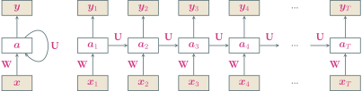

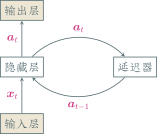

GNN-FOOTER 图神经网络导论 循环神经网络 tengzhang@hust.edu.cn

<!-- slide vertical=true data-notes="" -->

GNN-HEADER 动力系统观点

$$
\begin{align*}
    \zv_t & = \class{yellow}{\Uv \av_{t-1}} + \Wv \xv_t + \bv \\
    \av_t & = h(\zv_t)
\end{align*}
$$

循环神经网络的更新可以看成一个<span class="blue">动力系统</span> (dynamical system)，因此隐藏层的输出$\av_t$在很多文献上也称为<span class="blue">状态</span> (state)

<br>

动力系统：使用一个 (微分) 方程来描述给定空间中所有点随时间变化情况的系统

$$
\begin{align*}
    \wv_{t+1} = \wv_t - \eta f'(\wv_t) \Longrightarrow \frac{\wv_{t+1} - \wv_t}{\eta} = - f'(\wv_t) \Longrightarrow \dot{\wv} = - f'(\wv)
\end{align*}
$$

<br>

梯度下降就是在用 (前向) 欧拉法离散地求解动力系统

<br>

Nesterov 加速梯度的微分方程表示：$\ddot{\wv} + (3/t) \dot{\wv} = - f'(\wv)$

GNN-FOOTER 图神经网络导论 循环神经网络 tengzhang@hust.edu.cn

<!-- slide vertical=true data-notes="" -->

GNN-HEADER 动力系统观点

梯度下降的微分方程表示：$\dot{\wv} = - f'(\wv)$

引入函数

$$
\begin{align*}
    \Ecal(t) = t (f(\wv) - f^\star) + \frac{1}{2} \| \wv - \wv^\star \|_2^2
\end{align*}
$$

易知

$$
\begin{align*}
    \Ecal'(t) & = f(\wv) - f^\star + t \dot{\wv}^\top f'(\wv) + \dot{\wv}^\top (\wv - \wv^\star) \\
    & = - \|f'(\wv)\|_2^2 + f(\wv) - f^\star - f'(\wv)^\top (\wv - \wv^\star) \\
    & = - \|f'(\wv)\|_2^2 + f(\wv) + f'(\wv)^\top (\wv^\star - \wv) - f^\star \leq 0
\end{align*}
$$

即$\Ecal$的单调下降

$$
\begin{align*}
    f(\wv) - f^\star \leq \frac{\Ecal(t)}{t} \leq \frac{\Ecal(0)}{t} = \frac{\| \wv_0 - \wv^\star \|_2^2}{2t} = O(1/t)
\end{align*}
$$

GNN-FOOTER 图神经网络导论 循环神经网络 tengzhang@hust.edu.cn

<!-- slide data-notes="" -->

GNN-HEADER 应用到机器学习

<span class="blue">序列到类的模式</span>

<br>

输入$\xv_1, \ldots, \xv_T$，输出类别标记$\yhat \in [C]$，例如文本分类

<br>

两种模式：

- 序列的最终表示$\av_T$输入给分类器$g$进行分类：$\hat{y} = g(\av_T)$
- 将整个序列的平均状态$\av$输入给分类器$g$进行分类：$\hat{y} = g(\av)$

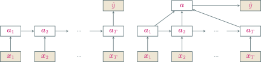

GNN-FOOTER 图神经网络导论 循环神经网络 tengzhang@hust.edu.cn

<!-- slide vertical=true data-notes="2x32x32 + 32 = 2080" -->

GNN-HEADER IMDB 情感分析

```python {.line-numbers}
from keras.datasets import imdb
from keras.layers import Dense, Embedding, SimpleRNN
from keras.models import Sequential
from keras.preprocessing import sequence

vocabulary = 10000 # 只用词典使用频率前10000的单词
(X_train, y_train), (X_test, y_test) = imdb.load_data(num_words=vocabulary)

# 构建字典 key为id value为单词 +3是因为0、1、2是保留的
id_to_word = {id_ + 3: word for word, id_ in imdb.get_word_index().items()}

# 0表示填充令牌"<pad>" 1表示序列开始"<sos>" 2表示未知单词"<unk>"
for id_, token in enumerate(("<pad>", "<sos>", "<unk>")):
    id_to_word[id_] = token

# 显示前5条评论的前10个单词的id表示和原文
for i in range(5):
    print(X_train[i][:10])
    print(" ".join([id_to_word[id_] for id_ in X_train[i][:10]]))
-----------------------------------------------------------------
[1, 14, 22, 16, 43, 530, 973, 1622, 1385, 65]
<sos> this film was just brilliant casting location scenery story
[1, 194, 1153, 194, 8255, 78, 228, 5, 6, 1463]
<sos> big hair big boobs bad music and a giant
[1, 14, 47, 8, 30, 31, 7, 4, 249, 108]
<sos> this has to be one of the worst films
[1, 4, 2, 2, 33, 2804, 4, 2040, 432, 111]
<sos> the <unk> <unk> at storytelling the traditional sort many
[1, 249, 1323, 7, 61, 113, 10, 10, 13, 1637]
<sos> worst mistake of my life br br i picked

# 每条评论截断或补齐为相同长度
X_train = sequence.pad_sequences(X_train, maxlen=500)
X_test = sequence.pad_sequences(X_test, maxlen=500)

model = Sequential()
model.add(Embedding(vocabulary, 32))
model.add(SimpleRNN(32))
model.add(Dense(1, activation='sigmoid'))
model.compile(optimizer='adam', loss='binary_crossentropy', metrics='acc')
model.summary()

Model: "sequential"
_________________________________________________________________
Layer (type)                 Output Shape              Param #
=================================================================
embedding (Embedding)        (None, None, 32)          320000
_________________________________________________________________
simple_rnn (SimpleRNN)       (None, 32)                2080
_________________________________________________________________
dense (Dense)                (None, 1)                 33
=================================================================
Total params: 322,113
Trainable params: 322,113
Non-trainable params: 0

model.fit(X_train, y_train, epochs=5, batch_size=128)
model.evaluate(X_test, y_test, verbose=2)
_________________________________________________________________
Epoch 1/5
196/196 [=========] - 33s 163ms/step - loss: 0.5899 - acc: 0.6736
Epoch 2/5
196/196 [=========] - 34s 174ms/step - loss: 0.3708 - acc: 0.8447
Epoch 3/5
196/196 [=========] - 41s 207ms/step - loss: 0.2868 - acc: 0.8848
Epoch 4/5
196/196 [=========] - 40s 205ms/step - loss: 0.1785 - acc: 0.9348
Epoch 5/5
196/196 [=========] - 44s 226ms/step - loss: 0.1232 - acc: 0.9579

782/782 - 32s - loss: 0.4597 - acc: 0.8338
```

GNN-FOOTER 图神经网络导论 循环神经网络 tengzhang@hust.edu.cn

<!-- slide vertical=true data-notes="" -->

GNN-HEADER 应用到机器学习

<span class="blue">同步的序列到序列模式</span>

<br>

输入$\xv_1, \ldots, \xv_T$，同步输出$\yhat_1, \ldots, \yhat_T$，例如词性标注、股市预测

$$
\begin{align*}
    \hat{y}_t = g(\av_t), ~ \forall t \in [T]
\end{align*}
$$

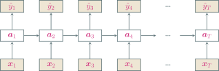

GNN-FOOTER 图神经网络导论 循环神经网络 tengzhang@hust.edu.cn

<!-- slide vertical=true data-notes="" -->

GNN-HEADER 应用到机器学习

<span class="blue">异步的序列到序列模式</span>，也称为<span class="blue">编码器-解码器</span> (encoder-decoder) 模型

<br>

输入$\xv_1, \ldots, \xv_T$，输出$\yvhat_1, \ldots, \yvhat_S$，无需同步输出和保持相同长度

例如机器翻译、问答系统、图像描述

$$
\begin{align*}
    \av_t & = h_1 (\av_{t-1}, \xv_t), ~ \forall t \in [T] \\
    \av_{T+t} & = h_2 (\av_{T+t-1}, \yvhat_{t-1}), ~ \forall t \in [S] \\
    \yvhat_t & = g(\av_{T+t}), ~ \forall t \in [S]
\end{align*}
$$

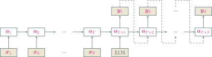

GNN-FOOTER 图神经网络导论 循环神经网络 tengzhang@hust.edu.cn

<!-- slide data-notes="" -->

GNN-HEADER 随时间反向传播

对$\zv = \Wv \av + \bv$有

$$
\begin{align*}
    \frac{\partial z_j}{\partial \Wv} = \av \ev_j^\top, \quad \frac{\partial \zv}{\partial \bv} = \Iv, \quad \frac{\partial \zv}{\partial \av} = \Wv
\end{align*}
$$

<br>

同理对$\zv_k = \Uv \av_{k-1} + \Wv \xv_k + \bv$有

$$
\begin{align*}
    \frac{\partial [\zv_k]_j}{\partial \Uv} = \av_{k-1} \ev_j^\top, \quad \frac{\partial [\zv_k]_j}{\partial \Wv} = \xv_k \ev_j^\top, \quad \frac{\partial \zv_k}{\partial \bv} = \Iv, \quad \frac{\partial \zv_k}{\partial \av_{k-1}} = \Uv
\end{align*}
$$

<br>

随时间反向传播 (**b**ack**p**ropagation **t**hrough **t**ime, BPTT)：

- 循环神经网络可以看作一个展开的多层前馈网络，“每层”对应“每个时刻”
- 所有层参数共享，因此参数的真实梯度是所有“展开层”的梯度之和

GNN-FOOTER 图神经网络导论 循环神经网络 tengzhang@hust.edu.cn

<!-- slide vertical=true data-notes="" -->

GNN-HEADER 随时间反向传播

对$\zv_k = \Uv \av_{k-1} + \Wv \xv_k + \bv$有

$$
\begin{align*}
    \frac{\partial [\zv_k]_j}{\partial \Uv} = \av_{k-1} \ev_j^\top, \quad \frac{\partial [\zv_k]_j}{\partial \Wv} = \xv_k \ev_j^\top, \quad \frac{\partial \zv_k}{\partial \bv} = \Iv, \quad \frac{\partial \zv_k}{\partial \av_{k-1}} = \Uv
\end{align*}
$$

记时刻$t$的损失为$\Lcal_t$，则总损失为$\Lcal = \sum_{t \in [T]} \Lcal_t$，记$\deltav_{t,k}^\top = \partial \Lcal_t / \partial \zv_k$为时刻$t$的损失对时刻$k$隐藏层输入的导数

注意$\av_k = h(\zv_k)$，由链式法则

$$
\begin{align*}
    \deltav_{t,k}^\top = \frac{\partial \Lcal_t}{\partial \zv_k} = \frac{\partial \Lcal_t}{\partial \zv_{k+1}} \frac{\partial \zv_{k+1}}{\partial \av_k} \frac{\partial \av_k}{\partial \zv_k} = \deltav_{t,k+1}^\top \Uv ~  \diag (h'(\zv_k))
\end{align*}
$$

依然有反向传播的结构

GNN-FOOTER 图神经网络导论 循环神经网络 tengzhang@hust.edu.cn

<!-- slide vertical=true data-notes="" -->

GNN-HEADER 随时间反向传播

对$\zv_k = \Uv \av_{k-1} + \Wv \xv_k + \bv$有

$$
\begin{align*}
    \frac{\partial [\zv_k]_j}{\partial \Uv} = \av_{k-1} \ev_j^\top, \quad \frac{\partial [\zv_k]_j}{\partial \Wv} = \xv_k \ev_j^\top, \quad \frac{\partial \zv_k}{\partial \bv} = \Iv, \quad \frac{\partial \zv_k}{\partial \av_{k-1}} = \Uv
\end{align*}
$$

记时刻$t$的损失为$\Lcal_t$，则总损失为$\Lcal = \sum_{t \in [T]} \Lcal_t$，记$\deltav_{t,k}^\top = \partial \Lcal_t / \partial \zv_k$为时刻$t$的损失对时刻$k$隐藏层输入的导数

$$
\begin{align*}
    \frac{\partial \Lcal}{\partial \Uv} & = \sum_{t \in [T]} \sum_{k \in [t]} \sum_j \frac{\partial \Lcal_t}{\partial [\zv_k]_j} \frac{\partial [\zv_k]_j}{\partial \Uv} = \sum_{t \in [T]} \sum_{k \in [t]} \av_{k-1} \deltav_{t,k}^\top \\
    \frac{\partial \Lcal}{\partial \Wv} & = \sum_{t \in [T]} \sum_{k \in [t]} \sum_j \frac{\partial \Lcal_t}{\partial [\zv_k]_j} \frac{\partial [\zv_k]_j}{\partial \Wv} = \sum_{t \in [T]} \sum_{k \in [t]} \xv_k \deltav_{t,k}^\top \\
    \frac{\partial \Lcal}{\partial \bv} & = \sum_{t \in [T]} \sum_{k \in [t]} \frac{\partial \Lcal_t}{\partial \zv_k} \frac{\partial \zv_k}{\partial \bv} = \deltav_{t,k}^\top
\end{align*}
$$

GNN-FOOTER 图神经网络导论 循环神经网络 tengzhang@hust.edu.cn

<!-- slide data-notes="" -->

GNN-HEADER 长程依赖问题

设$t > k$，反向传播公式经递推有

$$
\begin{align*}
    \deltav_{t,k}^\top = \deltav_{t,k+1}^\top \Uv ~  \diag (h'(\zv_k))  = \cdots = \deltav_{t,t} ~ \Pi_{\tau=k}^{t-1} \left( \Uv ~ \diag (h'(\zv_k)) \right)
\end{align*}
$$

定义$\gamma = \| \diag (h'(\zv_k)) \Uv^\top \|$

- 若$\gamma > 1$，当$t - k \rightarrow \infty$时，出现梯度爆炸
- 若$\gamma < 1$，当$t - k \rightarrow \infty$时，出现梯度消失

<br>

长程依赖问题：循环神经网络理论上可以建立长时间间隔状态间的依赖关系，但由于梯度爆炸/消失问题，实际上只能学习短期的依赖关系

- 精心挑选激活函数，尽量使得$\| \diag (h'(\zv_k)) \Uv^\top \| \approx 1$，需要足够的炼丹经验
- 梯度爆炸：权重衰减，梯度截断
- 梯度消失：引入残差结构$\av_t = \av_{t-1} + f(\xv_t, \av_{t-1})$，但随着时间$t$增长，$\av_t$会变得越来越大，从而导致隐状态变得饱和，但其存储信息的能力是有限的

GNN-FOOTER 图神经网络导论 循环神经网络 tengzhang@hust.edu.cn

<!-- slide vertical=true data-notes="" -->

GNN-HEADER 门控机制

有选择地加入新的信息，并有选择地遗忘之前累积的信息

- 长短期记忆 (<u>L</u>ong <u>S</u>hort-<u>T</u>erm <u>M</u>emory, LSTM) 网络
- 门控循环单元 (<u>G</u>ated <u>R</u>ecurrent <u>U</u>nit, GRU) 网络

GNN-FOOTER 图神经网络导论 循环神经网络 tengzhang@hust.edu.cn

<!-- slide data-notes="" -->

GNN-HEADER LSTM 网络

引入一个新的内部状态$\cv_t$专门进行线性的循环信息传递，同时输出信息给隐藏层的外部状态$\av_t$

$$
\begin{align*}
    \cv_t & = \fv_t \odot \cv_{t-1} + \iv_t \odot \widetilde{\cv}_t \\
    \av_t & = \ov_t \odot \tanh(\cv_t)
\end{align*}
$$

其中$\odot$为向量元素乘积

- $\widetilde{\cv}_t = \tanh(\Wv_c \xv_t + \Uv_c \av_{t−1} + \bv_c)$是通过非线性函数得到的候选状态
- 遗忘门$\fv_t = \sigma(\Wv_f \xv_t + \Uv_f \av_{t−1} + \bv_f) \in (0,1)$控制上一个时刻的内部状态$\cv_{t-1}$需要遗忘多少信息
- 输入门$\iv_t = \sigma(\Wv_i \xv_t + \Uv_i \av_{t−1} + \bv_i) \in (0,1)$控制当前时刻的候选状态$\widetilde{\cv}_t$需要保存多少信息
- 输出门$\ov_t = \sigma(\Wv_o \xv_t + \Uv_o \av_{t−1} + \bv_o) \in (0,1)$控制当前时刻的内部状态$\cv_t$需要输出多少信息给外部状态$\av_t$

GNN-FOOTER 图神经网络导论 循环神经网络 tengzhang@hust.edu.cn

<!-- slide vertical=true data-notes="" -->

GNN-HEADER LSTM 网络

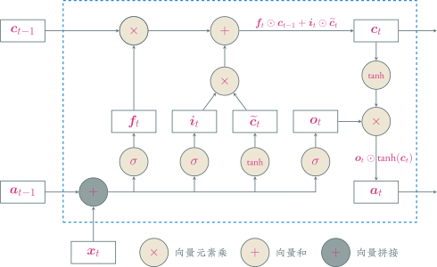

GNN-FOOTER 图神经网络导论 循环神经网络 tengzhang@hust.edu.cn

<!-- slide vertical=true data-notes="" -->

GNN-HEADER LSTM 网络

LSTM 网络的紧凑形式

$$
\begin{align*}
    \begin{bmatrix}
        \widetilde{\cv}_t \\ \ov_t \\ \iv_t \\ \fv_t
    \end{bmatrix} & = \begin{bmatrix}
        \tanh \\ \sigma \\ \sigma \\ \sigma
    \end{bmatrix} \left( \Wv \begin{bmatrix}
        \xv_t \\ \av_{t-1}
    \end{bmatrix} + \bv \right) \\
    \cv_t & = \fv_t \odot \cv_{t-1} + \iv_t \odot \widetilde{\cv}_t \\
    \av_t & = \ov_t \odot \tanh(\cv_t)
\end{align*}
$$

循环神经网络中的隐状态$\av$存储了历史信息，可以看作是一种记忆

<br>

简单循环网络的隐状态每个时刻都会被重写，只是一种短期记忆

<br>

LSTM 中的记忆单元$\cv$可以在某个时刻捕捉到关键信息将其保存，且生命周期要长于短期记忆$\av$，因此称为长的短期记忆

GNN-FOOTER 图神经网络导论 循环神经网络 tengzhang@hust.edu.cn

<!-- slide vertical=true data-notes="" -->

GNN-HEADER LSTM 网络变种

无遗忘门的 LSTM 网络：$\cv_t = \fv_t \odot \cv_{t-1} + \iv_t \odot \widetilde{\cv}_t$，记忆饱和

<div class="bottom4"></div>

peephole 连接：三个门不但依赖于输入$\xv_t$和上一时刻的隐状态$\av_{t−1}$，也依赖于上一个时刻的记忆单元$\cv_{t−1}$

$$
\begin{align*}
    \fv_t & = \sigma(\Wv_f \xv_t + \Uv_f \av_{t−1} + \Vv_f \cv_{t−1} + \bv_f) \\
    \iv_t & = \sigma(\Wv_i \xv_t + \Uv_i \av_{t−1} + \Vv_i \cv_{t−1} + \bv_i) \\
    \ov_t & = \sigma(\Wv_o \xv_t + \Uv_o \av_{t−1} + \Vv_o \cv_{t−1} + \bv_o)
\end{align*}
$$

<div class="bottom3"></div>

耦合输入门和遗忘门：LSTM 中的输入门和遗忘门有些互补关系，同时用两个门存在冗余

$$
\begin{align*}
    \cv_t = (\onev - \iv_t) \odot \cv_{t-1} + \iv_t \odot \widetilde{\cv}_t
\end{align*}
$$

GNN-FOOTER 图神经网络导论 循环神经网络 tengzhang@hust.edu.cn

<!-- slide data-notes="" -->

GNN-HEADER GRU 网络

不引入额外的记忆单元，更新方式为

$$
\begin{align*}
    \av_t = \zv_t \odot \av_{t−1} + (\onev − \zv_t) \odot \widetilde{\av}_t
\end{align*}
$$

其中

- $\zv_t = \sigma(\Wv_z \xv_t + \Uv_z \av_{t−1} + \bv_z) \in (0,1)$为更新门
- $\widetilde{\av}_t = \tanh(\Wv_a \xv_t + \Uv_a (\rv_t \odot \av_{t−1}) + \bv_a)$表示当前时刻的候选状态
- $\rv_t = \sigma(\Wv_r \xv_t + \Uv_r \av_{t−1} + \bv_r) \in (0,1)$为重置门，控制候选状态$\widetilde{\av}_t$的计算是否依赖上一时刻的状态$\av_{t−1}$

<br>

几个特例

- $\zv_t = \onev$，当前状态$\av_t$等于上一时刻状态$\av_{t−1}$，和当前输入$\xv_t$无关
- $\zv_t = \zerov$、$\rv = \onev$，GRU 网络退化为简单循环网络
- $\zv_t = \zerov$、$\rv = \zerov$，当前状态$\av_t$只和当前输入$\xv_t$相关，和上一时刻的状态$\av_{t−1}$无关

GNN-FOOTER 图神经网络导论 循环神经网络 tengzhang@hust.edu.cn

<!-- slide vertical=true data-notes="" -->

GNN-HEADER GRU 网络

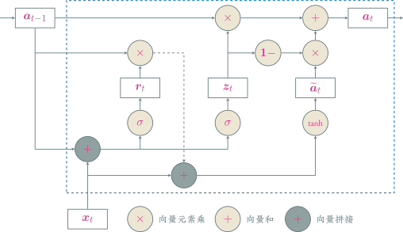

GNN-FOOTER 图神经网络导论 循环神经网络 tengzhang@hust.edu.cn

<!-- slide data-notes="" -->

GNN-HEADER 深层循环网络

增加同一时刻网络输入到输出之间的路径$\xv_t \rightarrow \hat{y}_t$，从而增强循环神经网络的能力

<br>

堆叠循环神经网络：将多个循环网络堆叠起来

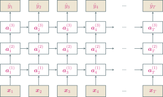

GNN-FOOTER 图神经网络导论 循环神经网络 tengzhang@hust.edu.cn

<!-- slide vertical=true data-notes="完形填空，做不了同步的seq到seq" -->

GNN-HEADER 深层循环网络

增加同一时刻网络输入到输出之间的路径$\xv_t \rightarrow \hat{y}_t$，从而增强循环神经网络的能力

<br>

双向循环神经网络：由两层循环神经网络组成，信息传递方向不同

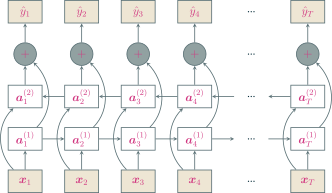

GNN-FOOTER 图神经网络导论 循环神经网络 tengzhang@hust.edu.cn

<!-- slide data-notes="" -->

GNN-HEADER 注意力机制

<span class="blue">编码器-解码器</span> (Encoder-Decoder) 模型

<div>
    $$
        \begin{align*}
            \av_{T+1} = f(\xv_1, \ldots, \xv_T), \quad \yv_s = g(\av_{T+1}, \yv_1, \ldots, \yv_{s-1}), ~ s \in [S]
        \end{align*}
    $$
</div>


问题：生成每个目标$\yv_s$时，使用的都是相同的语义编码$\av_{T+1}$

I love you, <span class="blue">China</span>! $~ \xrightarrow{翻译} ~$ 我爱你，<span class="blue">中国</span>！

GNN-FOOTER 图神经网络导论 循环神经网络 tengzhang@hust.edu.cn

<!-- slide vertical=true data-notes="" -->

GNN-HEADER 注意力机制

I love you, <span class="blue">China</span>! $~ \xrightarrow{翻译} ~$ 我爱你，<span class="blue">中国</span>！

<br>

每次输出，从输入序列中遴选信息，使用不同的语义编码

$$
\begin{align*}
    \cv_1 & = f_1(\xv_1, \ldots, \xv_T), \quad \yv_1 = g(\cv_1) \\
    \cv_2 & = f_2(\xv_1, \ldots, \xv_T), \quad \yv_2 = g(\cv_2, \yv_1) \\
    \cv_3 & = f_3(\xv_1, \ldots, \xv_T), \quad \yv_3 = g(\cv_3, \yv_1, \yv_2) \\
    & \qquad \vdots
\end{align*}
$$

<br>

引入一个和当前输出相关的查询$\qv$，通过打分函数$s(\cdot, \cdot)$计算每个输入与查询之间的相关性，即应赋予的注意力，据此计算语义编码$\cv$

- 打分函数的设计？
- 如何计算$\cv = \att(\Xv, \qv)$

GNN-FOOTER 图神经网络导论 循环神经网络 tengzhang@hust.edu.cn

<!-- slide vertical=true data-notes="" -->

GNN-HEADER 注意力机制

打分函数

- 加性模型：$s(\xv_i, \qv) = \vv^\top \tanh (\Wv \xv_i + \Uv \qv)$
- 点积模型：$s(\xv_i, \qv) = \xv_i^\top \qv$
- 缩放点积模型：$s(\xv_i, \qv) = \xv_i^\top \qv / \sqrt{d}$
- 双线性模型：$s(\xv_i, \qv) = \xv_i^\top \Wv \qv$

其中$\Wv, \Uv, \vv$为可学习的参数，$d$为输入向量的维度

<br>

计算$\att(\Xv, \qv)$：依据<span class="blue">注意力值</span>加权平均，例如

$$
\begin{align*}
    \att(\Xv, \qv) = \sum_{t \in [T]} \class{yellow}{\alpha_t} \xv_t, \quad \class{yellow}{\alpha_t} = \frac{\exp(s(\xv_t, \qv))}{\sum_{i \in [T]} \exp(s(\xv_i, \qv))}
\end{align*}
$$

GNN-FOOTER 图神经网络导论 循环神经网络 tengzhang@hust.edu.cn

<!-- slide vertical=true data-notes="" -->

GNN-HEADER (软性) 注意力机制

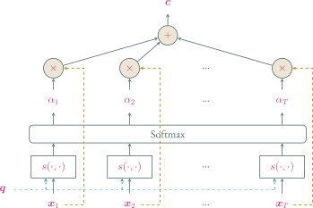

GNN-FOOTER 图神经网络导论 循环神经网络 tengzhang@hust.edu.cn

<!-- slide data-notes="" -->

GNN-HEADER 注意力机制变体

<span class="blue">硬性注意力</span>：只注意一个输入

- 选取注意力值最高的：$j = \argmax_{t \in [T]} \alpha_t$，$\att(\Xv, \qv) = \xv_j$
- 根据注意力分布随机采样

<br>

损失函数与注意力值的函数关系不可导，无法使用反向传播进行训练

<div class="bottom4"></div>

<span class="blue">键值对注意力</span>：输入$(\Kv, \Vv) = [(\kv_1, \vv_1), \ldots, (\kv_T, \vv_T)]$

- 键用来计算注意力，值用来计算输出
- 当$\Kv = \Vv$时，键值对注意力就退化成普通的注意力

$$
\begin{align*}
    \att((\Kv, \Vv), \qv) = \sum_{t \in [T]} \class{yellow}{\alpha_t} \vv_t, \quad \class{yellow}{\alpha_t} = \frac{\exp(s(\kv_t, \qv))}{\sum_{i \in [T]} \exp(s(\kv_i, \qv))}
\end{align*}
$$

GNN-FOOTER 图神经网络导论 循环神经网络 tengzhang@hust.edu.cn

<!-- slide vertical=true data-notes="" -->

GNN-HEADER 键值对注意力

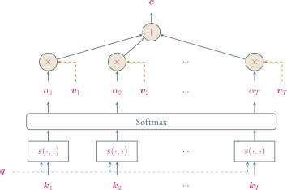

GNN-FOOTER 图神经网络导论 循环神经网络 tengzhang@hust.edu.cn

<!-- slide vertical=true data-notes="" -->

GNN-HEADER 注意力机制变体

<span class="blue">多头注意力</span>：多个查询并行$\Qv = [\qv_1, \ldots, \qv_M]$，选取多组信息

$$
\begin{align*}
    \att((\Kv, \Vv), \Qv) = \att((\Kv, \Vv), \qv_1) \oplus \cdots \oplus \att((\Kv, \Vv), \qv_M)
\end{align*}
$$

其中$\oplus$表示向量拼接

<br>

结构化注意力：

- 之前介绍的注意力机制都假设所有的输入信息是同等重要的，是一种扁平结构
- 如果输入信息本身具有层次结构，比如文本可以分为词、句子、段落、篇章等不同粒度的层次，可以使用层次化注意力进行更好的信息选择

GNN-FOOTER 图神经网络导论 循环神经网络 tengzhang@hust.edu.cn

<!-- slide data-notes="" -->

GNN-HEADER 注意力机制应用

注意力机制一般作为神经网络的一个组件，用来做信息遴选

- 查询通常采用解码器的隐藏状态
- 键、值通常采用编码器的隐藏状态

<br>

指针网络：将注意力分布作为一个软性的指针，指出相关信息的位置


GNN-FOOTER 图神经网络导论 循环神经网络 tengzhang@hust.edu.cn

<!-- slide vertical=true data-notes="" -->

GNN-HEADER 注意力机制应用

建立输入序列间的长距离依赖关系

- 卷积或循环神经网络都是局部编码，只有增加层数才能获取远距离的信息交互
- 全连接神经网络可直接获取远距离的信息交互，但无法处理变长的序列

<br>

自注意力模型

- 每个输入同时充当查询、键、值三个角色
- 输入之间相互计算注意力
- 忽略了输入信息的位置信息，单独使用时需加入位置编码信息来进行修正

$$
\begin{align*}
    \Xv & = [\xv_1, \ldots, \xv_T] \in \Rbb^{d \times T} \\
    \Qv & = \Wv_Q \Xv, \quad \Kv = \Wv_K \Xv, \quad \Vv = \Wv_V \Xv \\
    \cv_i & = \att((\Kv, \Vv), \qv_i) = \sum_{t \in [T]} \alpha_{it} \vv_t = \sum_{t \in [T]} \softmax(s(\qv_i, \kv_t)) \vv_t
\end{align*}
$$

GNN-FOOTER 图神经网络导论 循环神经网络 tengzhang@hust.edu.cn
