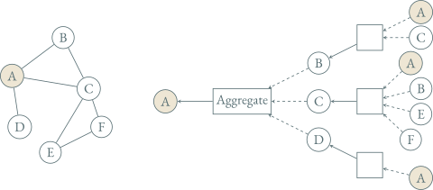

---
presentation:
  transition: "none"
  enableSpeakerNotes: true
  margin: 0
---

@import "../common/css/font-awesome-4.7.0/css/font-awesome.css"
@import "../common/css/zhangt-solarized.css"
@import "css/GNN.css"

<!-- slide data-notes="这一讲我们回顾一下传统处理图数据的方法 顺便把一些基本概念再温习一遍" -->

# 图神经网络导论

## 图神经网络

### 计算机科学与技术学院 &nbsp; &nbsp; 张腾

 

#### tengzhang@hust.edu.cn

<!-- slide data-notes="" -->

GNN-HEADER 编码器 - 解码器模型

编码器：表示学习

- 网格型数据，可采用卷积神经网络
- 序列型数据，可采用循环神经网络

 

对于一般的图数据，编码器该如何设计？

GNN-FOOTER 图神经网络导论 图神经网络 tengzhang@hust.edu.cn

<!-- slide vertical=true data-notes="" -->

GNN-HEADER 编码器设计

一个 naive 的做法是将邻接矩阵直接拉直成向量，后接一个全连接网络

$$
\begin{align*}
    \zv_\Gcal = \mlp ([\Av]_{:,1} \oplus [\Av]_{:,2} \oplus \cdots \oplus [\Av]_{:,|\Vcal|})
\end{align*}
$$

 

问题：图由点集、边集构成，集合中的元素是没有顺序的，但邻接矩阵人为给点定了顺序，这会对最终泛化性能产生不利影响

 

引入置换矩阵$\Pv$，定义

- 平移不变性：$f(\Pv \Av \Pv^\top) = f(\Av)$，标量值函数对于点的标号顺序不敏感
- 平移等价性：$\fv (\Pv \Av \Pv^\top) = \Pv \fv (\Av)$，向量值函数与点的标号顺序始终一致

GNN-FOOTER 图神经网络导论 图神经网络 tengzhang@hust.edu.cn

<!-- slide vertical=true data-notes="" -->

GNN-HEADER 编码器设计

图神经网络 (GNN)

- 输入：$\Gcal = (\Vcal, \Ecal)$，$\Xv = [\xv_1, \ldots, \xv_{|\Vcal|}] \in \Rbb^{d \times |\Vcal|}$，边和整图的特征
- 输出：每个点的嵌入表示$\zv_u$，边和整图的嵌入表示

 
    
GNN 的设计动机

- 非欧氏数据的卷积：源自信号处理
- 可微信念传播：源自概率图模型
- 经典图同构测试：源自经典图论

 

神经消息传递 (neural message passing)框架：一种统一表示

- 点之间不断进行信息交互
- 信息通过神经网络进行更新

GNN-FOOTER 图神经网络导论 图神经网络 tengzhang@hust.edu.cn

<!-- slide data-notes="" -->

GNN-HEADER 消息传递框架

记第$k$轮点$u$的隐藏状态(嵌入表示)为$\hv_u^\sup{k}$，GNN 的消息传递形式化为

$$
\begin{align*}
    \hv_u^\sup{0}   & = \xv_u, ~ \forall u \in \Vcal                                                                                         \\
    \hv_u^\sup{k+1} & = \update^\sup{k} \left( \hv_u^\sup{k}, \aggregate^\sup{k} ( \{ \hv_v^\sup{k} \mid \forall v \in \Ncal(u) \} ) \right) \\
                    & = \update^\sup{k} \left( \hv_u^\sup{k}, \mv_{\Ncal(u)}^\sup{k} \right)                                                 \\
    \zv_u           & = \hv_u^\sup{K}, ~ \forall u \in \Vcal
\end{align*}
$$

- $\update (\cdot)$：用来更新当前点隐藏状态的可微函数
- $\aggregate (\cdot)$：用来聚合邻居信息的可微函数，其输入是一个集合 (平移等价性)
- $\mv_{\Ncal(u)}^\sup{k}$：点$u$的所有邻居的信息聚合结果
- 如果点本身没有特征，可以用之前介绍的点层面的统计量作为特征
- GNN 一层可视为一轮消息传递，$K$层即编码了所有$K$阶邻居的信息

GNN-FOOTER 图神经网络导论 图神经网络 tengzhang@hust.edu.cn

<!-- slide vertical=true data-notes="" -->

GNN-HEADER 消息传递框架

GNN-FOOTER 图神经网络导论 图神经网络 tengzhang@hust.edu.cn

<!-- slide data-notes="" -->

GNN-HEADER GNN 的基本形式

最早版本的 GNN：

$$
\begin{align*}
    \hv_u^\sup{k} = \sigma \left( \Wv_\self^\sup{k} ~ \hv_u^\sup{k-1} + \Wv_\neigh^\sup{k} \sum_{v \in \Ncal(u)} \hv_v^\sup{k-1} + \bv^\sup{k} \right)
\end{align*}
$$

- $\Wv_\self^\sup{k}$、$\Wv_\neigh^\sup{k}$、$\bv^\sup{k}$是可训练的参数，偏倚$\bv^\sup{k}$通常可以省略
- $\sigma$是逐元素的非线性变换，例如以前介绍过的各种激活函数

 

用消息传递框架表示：

- $\aggregate ( \{ \hv_v \mid \forall v \in \Ncal(u) \} ) = \mv_{\Ncal(u)} = \class{blue}{\sum_{v \in \Ncal(u)} \hv_v}$，注意求和是点序无关的
- $\update ( \hv_u, \mv_{\Ncal(u)} ) = \sigma ( \Wv_\self ~ \hv_u + \Wv_\neigh ~ \mv_{\Ncal(u)} )$

GNN-FOOTER 图神经网络导论 图神经网络 tengzhang@hust.edu.cn

<!-- slide vertical=true data-notes="" -->

GNN-HEADER GNN 的基本形式

记$\Hv^\sup{k} = [\hv_1^\sup{k}, \ldots, \hv_{|\Vcal|}^\sup{k}]$

GNN 的基本形式的矩阵表示：

$$
\begin{align*}
    \Hv^\sup{k} = \sigma ( \Wv_\self^\sup{k} ~ \Hv^\sup{k-1} + \Wv_\neigh^\sup{k} \Hv^\sup{k-1} \Av )
\end{align*}
$$

 
    
添加自指向环，将显式的$\update(\cdot)$隐藏于$\aggregate(\cdot)$之中

$$
\begin{align*}
    \hv_u^\sup{k} & = \aggregate^\sup{k} ( \{ \hv_v^\sup{k} \mid \forall v \in \Ncal(u) \class{blue}{\cup \{u\}} \} ) \\
    \Hv^\sup{k} & = \sigma (\Wv^\sup{k} \Hv^\sup{k-1} (\Av \class{blue}{+ \Iv}))
\end{align*}
$$

- 优点：共享$\Wv_\self$和$\Wv_\neigh$，可以避免过拟合
- 缺点：$\aggregate(\cdot)$要求平移等价性，这样无法区分自身的信息和邻居的信息

GNN-FOOTER 图神经网络导论 图神经网络 tengzhang@hust.edu.cn

<!-- slide data-notes="" -->

GNN-HEADER GNN 的各种魔改

GNN-FOOTER 图神经网络导论 图神经网络 tengzhang@hust.edu.cn

<!-- slide data-notes="" -->

GNN-HEADER 归一化

GNN 基本形式采用直接加和聚合邻居的信息

 

问题：对度数敏感，若$d_u \gg d_v$，则$\| \sum_{w \in \Ncal(u)} \hv_w \| \gg \| \sum_{w \in \Ncal(v)} \hv_w \|$，$u$的信息可以“淹没”其它点的信息

 

方案：归一化

$$
\begin{align*}
    \mv_{\Ncal(u)} = \frac{\sum_{v \in \Ncal(u)} \hv_v}{|\Ncal(u)|}, \quad \mv_{\Ncal(u)} = \sum_{v \in \Ncal(u)} \frac{\hv_v}{\sqrt{|\Ncal(u)||\Ncal(v)|}}
\end{align*}
$$

后者与自指向环结合：图卷积网络

$$
\begin{align*}
    \hv_u^\sup{k} = \sigma \left( \Wv^\sup{k} \sum_{ v \in \Ncal(u) \cup \{u\} } \frac{\hv_v}{\sqrt{|\Ncal(u)||\Ncal(v)|}} \right)
\end{align*}
$$

GNN-FOOTER 图神经网络导论 图神经网络 tengzhang@hust.edu.cn
