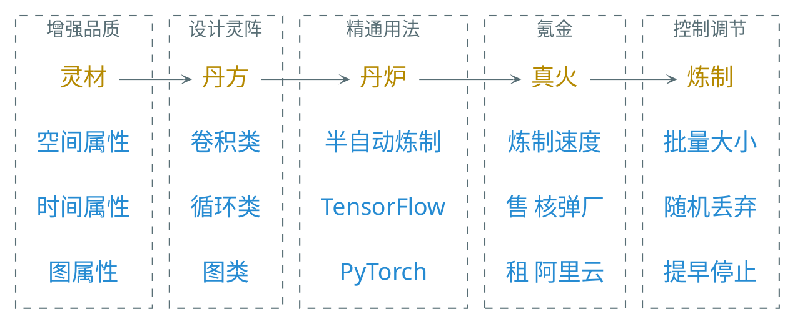

---
presentation:
  transition: "none"
  enableSpeakerNotes: true
  margin: 0
---

@import "../common/css/font-awesome-4.7.0/css/font-awesome.css"
@import "../common/css/zhangt-solarized.css"
@import "css/GNN.css"

<!-- slide data-notes="灵材：可免费获取的 MNIST 有 10 类，ImageNet 则有上千类，丹师是从药童做起，多模态：混合灵草和妖兽    丹方里最重要的是灵阵，控制如何抽取和凝结灵材中的灵性。灵阵中有若干节点，然后通过回路连接这些节点。灵材沿着回路游走经过每个节点处进行一步一步的提纯    半自动 不用你手动求导 做反向传播 更高端的可以使用多个丹炉同时开火炼制一枚灵丹 tf boy pt boy    手中富裕的买 囊中羞涩的租" -->

GNN-HEADER 总结 当代炼丹术

一个优秀丹师的自我修养：

- 灵材品质差要会手动增强，旋转、翻转、缩放、平移、加噪声、标记平滑
- 因材制宜设计灵阵，空间属性灵材用卷积类灵阵，时间属性灵材用循环类...
- 仔细观察丹炉状态，防止爆炉，若最终仙丹成色不好则改进配置重新来过

GNN-FOOTER 图神经网络导论 神经网络 tengzhang@hust.edu.cn
