```dot
digraph {
  tee [shape=none margin=0 label=
    <<table border="0" cellspacing="0" cellborder="1">
     <tr>
      <td sides="tl">1</td>
      <td sides="t">2</td>
      <td sides="tr">3</td>
     </tr>
     <tr>
      <td sides="lb">4</td>
      <td sides="b">5</td>
      <td sides="br">6</td>
     </tr>
    </table>>]
}
```

---
presentation:
  transition: "none"
  enableSpeakerNotes: true
  margin: 0
---

@import "../common/css/font-awesome-4.7.0/css/font-awesome.css"
@import "../common/css/zhangt-solarized.css"
@import "css/GNN.css"

<!-- slide vertical=true data-notes="" -->

GNN-HEADER 循环神经网络

GNN-FOOTER 图神经网络导论 卷积神经网络 tengzhang@hust.edu.cn

<!-- slide vertical=true data-notes="" -->

GNN-HEADER 循环神经网络

前向神经网络

- 信息单向传递
- 输出只依赖于当前输入
- 难以处理变长的时序数据 (视频、语音、文本)

 

In line with the conviction that I will do whatever it takes to serve my country
even at the cost of my own life,regardless of fortune or misfortune to myself.

GNN-FOOTER 图神经网络导论 卷积神经网络 tengzhang@hust.edu.cn
