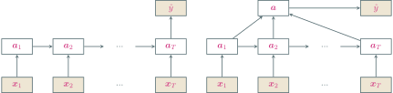

---
presentation:
  transition: "none"
  enableSpeakerNotes: true
  margin: 0
---

@import "../common/css/font-awesome-4.7.0/css/font-awesome.css"
@import "../common/css/zhangt-solarized.css"
@import "css/GNN.css"

<!-- slide data-notes="" -->

# 图神经网络导论

## 循环神经网络

### 计算机科学与技术学院 &nbsp; &nbsp; 张腾

 

#### tengzhang@hust.edu.cn

<!-- slide vertical=true data-notes="" -->

GNN-HEADER 大纲

@import "../dot/outline-rnn.dot"

GNN-FOOTER 图神经网络导论 卷积神经网络 tengzhang@hust.edu.cn

<!-- slide data-notes="" -->

GNN-HEADER 循环神经网络

前向神经网络

- 信息单向传递
- 输出只依赖于当前输入
- 难以处理变长的时序数据 (视频、语音、文本)

 

循环神经网络：

- 带有环路，神经元既可以接收其它神经元的信息，也可以接收自身的信息
- 目的是让网络具有短期记忆能力，能处理时序数据

GNN-FOOTER 图神经网络导论 卷积神经网络 tengzhang@hust.edu.cn

<!-- slide vertical=true data-notes="" -->

GNN-HEADER 短期记忆

延时神经网络：在前向网络的非输出层都添加一个延时器，记录最近几次的输出，在第$t$个时刻，第$l + 1$层神经元和第$l$层神经元的最近$p$次输出相关

$$
\begin{align*}
    \av^{(l+1)}_t = h(\av^{(l)}_t, \av^{(l)}_{t-1}, \ldots, \av^{(l)}_{t-p})
\end{align*}
$$

延时神经网络在时间维度上共享权值，对序列输入来讲延时神经网络就相当于卷积神经网络

 

有外部输入的非线性自回归模型：在每个时刻$t$都有一个外部输入$\xv_t$，产生一个输出$\yv_t$，延时器记录最近几次的外部输入和输出

$$
\begin{align*}
    \yv_t = h(\xv_t, \xv_{t-1}, \ldots, \xv_{t-p}, \yv_{t-1}, \ldots, \yv_{t-p})
\end{align*}
$$

其中$h$是一个非线性函数，可以是一个前向神经网络

GNN-FOOTER 图神经网络导论 卷积神经网络 tengzhang@hust.edu.cn

<!-- slide vertical=true data-notes="" -->

GNN-HEADER 循环神经网络

给定输入序列$\xv_1, \xv_2, \ldots, \xv_t, \ldots, \xv_T$，循环神经网络的更新：

$$
\begin{align*}
    \av_t = h(\av_{t-1}, \xv_t)
\end{align*}
$$

其中$\av_0 = \zerov$，$h$是一个非线性函数，可以是一个前向神经网络

GNN-FOOTER 图神经网络导论 卷积神经网络 tengzhang@hust.edu.cn

<!-- slide vertical=true data-notes="" -->

GNN-HEADER 简单循环网络

只有一个隐藏层的循环神经网络，存在隐藏层到隐藏层的连边

$$
\begin{align*}
    \zv_t & = \class{yellow}{\Uv \av_{t-1}} + \Wv \xv_t + \bv \\
    \av_t & = h(\zv_t)
\end{align*}
$$

 

我的批注 循环神经网络可以看作是在时间维度上权值共享的神经网络

GNN-FOOTER 图神经网络导论 卷积神经网络 tengzhang@hust.edu.cn

<!-- slide vertical=true data-notes="" -->

GNN-HEADER 动力系统观点

$$
\begin{align*}
    \zv_t & = \class{yellow}{\Uv \av_{t-1}} + \Wv \xv_t + \bv \\
    \av_t & = h(\zv_t)
\end{align*}
$$

循环神经网络的更新可以看成一个动力系统 (dynamical system)，因此隐藏层的输出$\av_t$在很多文献上也称为状态 (state)

 

动力系统：使用一个 (微分) 方程来描述给定空间中所有点随时间变化情况的系统

$$
\begin{align*}
    \wv_{t+1} = \wv_t - \eta f'(\wv_t) \Longrightarrow \frac{\wv_{t+1} - \wv_t}{\eta} = - f'(\wv_t) \Longrightarrow \dot{\wv} = - f'(\wv)
\end{align*}
$$

 

梯度下降就是在用 (前向) 欧拉法离散地求解动力系统

 

Nesterov 加速梯度的微分方程表示：$\ddot{\wv} + (3/t) \dot{\wv} = - f'(\wv)$

GNN-FOOTER 图神经网络导论 卷积神经网络 tengzhang@hust.edu.cn

<!-- slide vertical=true data-notes="" -->

GNN-HEADER 动力系统观点

梯度下降的微分方程表示：$\dot{\wv} = - f'(\wv)$

引入函数

$$
\begin{align*}
    \Ecal(t) = t (f(\wv) - f^\star) + \frac{1}{2} \| \wv - \wv^\star \|_2^2
\end{align*}
$$

易知

$$
\begin{align*}
    \Ecal'(t) & = f(\wv) - f^\star + t \dot{\wv}^\top f'(\wv) + \dot{\wv}^\top (\wv - \wv^\star) \\
    & = - \|f'(\wv)\|_2^2 + f(\wv) - f^\star - f'(\wv)^\top (\wv - \wv^\star) \\
    & = - \|f'(\wv)\|_2^2 + f(\wv) + f'(\wv)^\top (\wv^\star - \wv) - f^\star \leq 0
\end{align*}
$$

即$\Ecal$的单调下降

$$
\begin{align*}
    f(\wv) - f^\star \leq \frac{\Ecal(t)}{t} \leq \frac{\Ecal(0)}{t} = \frac{\| \wv_0 - \wv^\star \|_2^2}{2t} = O(1/t)
\end{align*}
$$

GNN-FOOTER 图神经网络导论 卷积神经网络 tengzhang@hust.edu.cn

<!-- slide vertical=true data-notes="" -->

GNN-HEADER 动力系统观点

序列到类的模式

 

输入序列$\xv_1, \ldots, \xv_T$，输出类别标记$y \in [C]$，例如文本分类

 

两种模式：

- 序列的最终表示$\av_T$输入给分类器$g$进行分类：$\hat{y} = g(\av_T)$
- 将整个序列的平均状态$\av$输入给分类器$g$进行分类：$\hat{y} = g(\av)$

GNN-FOOTER 图神经网络导论 卷积神经网络 tengzhang@hust.edu.cn
