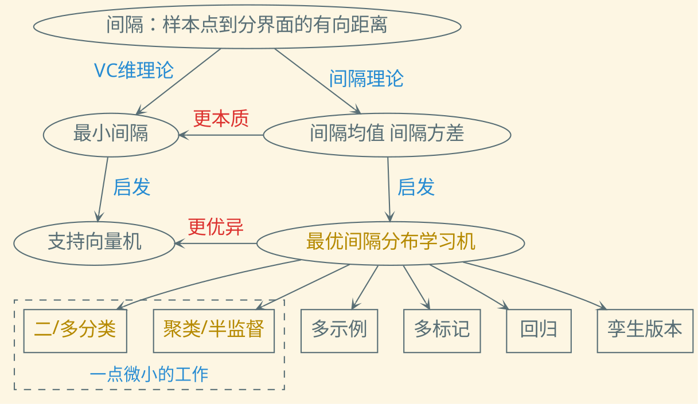

---
presentation:
  transition: "none"
  enableSpeakerNotes: true
  margin: 0
---

@import "../common/css/font-awesome-4.7.0/css/font-awesome.css"
@import "../common/css/zhangt-solarized.css"
@import "css/210915-odm-intro.css"

<!-- slide data-notes="优化子问题如(13)式所示，其中ABDEF都是已知参数，刚说了这是一个含有k+1个变量的凸二次优化，用的凸二次优化算法的时间开销是O(k3)，我们提出一种基于排序的算法，时间开销是O(k logk)，进一步加速算法"-->

<h5>优化子问题</h5>

以$\alpha_i^1, \ldots, \alpha_i^k, \beta_i$为优化变量

$$
\begin{align*}
    \min_{\alpha_i^l, \alpha_i^{y_i}, \beta_i} & \quad \sum_{l \neq y_i} \frac{A}{2} (\alpha_i^l)^2 + \sum_{l \neq y_i} B_l \alpha_i^l + \frac{D}{2} (\alpha_i^{y_i})^2 - A \alpha_i^{y_i} \beta_i \\
    & \quad + B_{y_i} \alpha_i^{y_i} + \frac{E}{2} \beta_i^2 + F \beta_i \\
    \st & \quad \sum_{l=1}^k \alpha_i^l = 0, ~ \alpha_i^l \leq 0, ~ \forall l \neq y_i,~\beta_i \geq 0
\end{align*}
$$

- 含有$k+1$个优化变量的凸二次优化
- 通用的凸二次优化算法的时间开销是$O(k^3)$
- 基于排序的算法的时间开销是$O(k \log k)$

<h6 class="bottom_left">华中科技大学计算机学院</h6><h6 class="bottom_center">最优间隔分布学习机 简介</h6><h6 class="bottom_right">tengzhang@hust.edu.cn</h6>

<!-- slide vertical=true data-notes="求解该问题只需求解KKT条件导出的方程组，通过一些代数运算和分类讨论，最终突破口在ν这个变量上"-->

<h5>KKT条件</h5>

存在标量$\nu$、$\rho_l$、$\eta$满足

$$
\begin{align*}
    \begin{cases}
    \sum_{l=1}^k \alpha_i^l = 0 \\
    \alpha_i^l \leq 0 \\
    \beta_i \geq 0 \\
    \rho_l \alpha_i^l = 0, \ \rho_l \geq 0 \\
    A \alpha_i^l + B_l - \nu + \rho_l = 0 \\
    \eta \beta_i =0, \ \eta \geq 0 \\
    - A \alpha_i^{y_i} + E \beta_i + F - \eta = 0 \\
    D \alpha_i^{y_i} - A \beta_i + B_{y_i} - \nu = 0
    \end{cases} & \longrightarrow
    \begin{cases}
    \sum_{l=1}^k \alpha_i^l = 0 \\
    \alpha_i^l = \min ( 0, (\nu - B_l)/A ) \\
    \beta_i = \max ( 0, (A \alpha_i^{y_i} - F) / E ) \\
    D \alpha_i^{y_i} + B_{y_i} - \nu \\
    \quad = \max ( 0, A(A \alpha_i^{y_i} - F) / E )
    \end{cases}
\end{align*}
$$

- $A \alpha_i^{y_i} \leq F \longrightarrow \beta_i = 0$，$\alpha_i^{y_i} = (\nu - B_{y_i})/D$，$\nu \leq B_{y_i} + DF/A$
- $A \alpha_i^{y_i} > F \longrightarrow \beta_i = (A \alpha_i^{y_i} - F)/E$，$\alpha_i^{y_i} = (E \nu - AF - E B_{y_i})/(DE - A^2)$，$\nu > B_{y_i} + DF/A$

<h6 class="bottom_left">华中科技大学计算机学院</h6><h6 class="bottom_center">最优间隔分布学习机 简介</h6><h6 class="bottom_right">tengzhang@hust.edu.cn</h6>

<!-- slide vertical=true data-notes="可以证明，不论哪种情形，ν最终呈型如(14)式    这可以通过对数组B降序排列，然后将其顺次添加到空集中直至(15)式成立得到"-->

<h5>KKT条件</h5>

无论那种情形

$$
\begin{align*}
    \nu^\star = \frac{ P + \sum_{l: \alpha_i^l <0} B_l }{ Q + |\{l | \alpha_i^l <0 \}| } 
\end{align*}
$$

 

对$\{ B_l \mid l \neq y_i \}$降序排列，将其顺次添加到空集$\Phi$中直至下式成立

$$
\begin{align*}
    \nu^\star= \frac{P + \sum_{l \in \Phi} \hat{B}_l}{Q + |\Phi|} & \geq \max_{l \not \in \Phi} \hat{B}_l
\end{align*}
$$

<h6 class="bottom_left">华中科技大学计算机学院</h6><h6 class="bottom_center">最优间隔分布学习机 简介</h6><h6 class="bottom_right">tengzhang@hust.edu.cn</h6>

<!-- slide vertical=true data-notes="接着是理论分析 泛化界由三项组成，其中第一项跟训练数据集上的经验损失相关，最后一项是集中度不等式必带的副产品，因此只需主要关注第二项    分子是间隔的上界，这表明间隔的上界不能太大。另一方面，1-θ是无损失的间隔带的下界，它类似于SVM的软间隔，是某个第p小的间隔，这表明第p小的间隔要尽可能的大    两相结合表明，在固定间隔均值为1的情况下，间隔方差越小泛化界越紧，这与Gao和Zhou的结论也是一致的"-->

<h5>理论分析</h5>

设假设空间为$\Hcal = \{ (\xv, y) \in \Xcal \times [k] \mapsto \wv_y^\top \phi(\xv) \mid \sum_{l=1}^k \|\wv_l\|^2 \leq \Lambda^2 \}$，其中$\phi: \Xcal \mapsto \Hbb$是某个正定核函数$\kappa(\cdot, \cdot)$诱导的特征映射，设数据集$\Scal \subseteq \{ \xv: \kappa(\xv, \xv) \leq r^2 \}$，则对于任意$\delta > 0$，以及任意$h \in \Hcal$，
$$
\begin{align*}
R(h) \leq \underbrace{\frac{1}{m} \sum_{i=1}^m \Phi(\gamma (\xv_i, y_i))}_{经验风险相关} + \frac{16 r \Lambda}{1 -
\theta} \sqrt{\frac{2 \pi k}{m}} + \underbrace{3 \sqrt{\frac{\ln (2 /
\delta)}{2m}}}_{集中度不等式相关}
\end{align*}
$$
至少以$1 - \delta$的概率成立

 

- $\gamma \leq \| \wv^\top \phi(\xv) \| \leq \| \wv \| \| \phi(\xv) \| \leq r \Lambda$，上界要尽可能的小
- $1 - \theta$是无损失的间隔带的下界，第$p$小的间隔要尽可能的大
- 固定间隔均值为$1$的情况下，间隔方差越小泛化界越紧

<h6 class="bottom_left">华中科技大学计算机学院</h6><h6 class="bottom_center">最优间隔分布学习机 简介</h6><h6 class="bottom_right">tengzhang@hust.edu.cn</h6>

<!-- slide data-notes="接下来是面向弱监督学习的最优间隔分布学习机"-->

<h5>大纲</h5>

 

背景介绍

 

全监督信息的最优间隔分布学习机

- 二分类
- 多分类

 

弱监督信息的最优间隔分布学习机

- 聚类
- 弱监督

 

总结展望

<h6 class="bottom_left">华中科技大学计算机学院</h6><h6 class="bottom_center">最优间隔分布学习机 简介</h6><h6 class="bottom_right">tengzhang@hust.edu.cn</h6>

<!-- slide vertical=true data-notes="依然还是从二分类的ODM的形式出发，由于聚类属于无监督学习，没有类别标记信息 因此ODMC的形式可以写成(19)式，同时优化间隔分布和簇标记，即将类别标记赋予给每个簇时，在此“有监督数据”上可以训练得到一个有好的间隔分布的划分超平面，其中B是候选类别标记集合，根据用户的领域知识来设置，可以是类别的平衡度，或者必连、勿连之类的样本对"-->

<h5>问题形式化</h5>

类别标记$\yv$也作为优化变量：

$$
\begin{align*}
    \class{blue}{\min_{\yvhat \in \Bcal}} \min_{\wv, \xi_i, \epsilon_i} & ~ \frac{1}{2} \|\wv\|^2 + \frac{1}{2m} \sum_{i=1}^m \lambda_i (\xi_i^2 + \nu \epsilon_i^2) \\
    \st & ~ \class{blue}{\yhat_i} \wv^\top \phi(\xv_i) \geq 1 - \theta - \xi_i \\
    & ~ \class{blue}{\yhat_i} \wv^\top \phi(\xv_i) \leq 1 + \theta + \epsilon_i, ~ \forall i \in [m]
\end{align*}
$$

聚类：所有样本的类别标记均缺失

- 样本权重$\lambda_i$相等，即$\lambda_1 = \lambda_2 = \cdots = \lambda_m$
- 平衡性约束：$\Bcal = \{ \hat{\yv} \mid - \beta \leq \ev^\top \hat{\yv} \leq \beta \}$
- 必连约束：$\Bcal = \{ \hat{\yv} \mid \hat{y}_i = \hat{y}_j, \forall (\xv_i, \xv_j) \in M\}$
- 勿连约束：$\Bcal = \{ \hat{\yv} \mid \hat{y}_j \neq \hat{y}_k, \forall (\xv_j, \xv_k) \in C\}$

<h6 class="bottom_left">华中科技大学计算机学院</h6><h6 class="bottom_center">最优间隔分布学习机 简介</h6><h6 class="bottom_right">tengzhang@hust.edu.cn</h6>

<!-- slide vertical=true data-notes="因此ssODM可以形式化成(21)式，其中第二项是有标记数据上的损失，第三项是无标记数据上的损失，B是平衡性约束，要求无标记数据上的类别比例和有标记数据相同"-->

<h5>问题形式化</h5>

半监督：$\Scal = \Scal_l \cup \Scal_u = \{ (\xv_1, y_1), \ldots, (\xv_l,y_l) \} \cup \{ \xv_{l+1}, \ldots, \xv_{l+u} \}$

$$
\begin{align*}
    \class{blue}{\min_{\yvhat \in \Bcal}} \min_{\wv, \xi_i, \epsilon_i} & ~ \frac{1}{2} \|\wv\|^2 + \underbrace{\frac{\lambda_1}{l} \sum_{i=1}^l (\xi_i^2 + \nu \epsilon_i^2)}_{有标记数据} + \underbrace{\frac{\lambda_2}{u} \sum_{i=l+1}^{l+u} (\xi_i^2 + \nu \epsilon_i^2)}_{无标记数据} \\
    \st & ~ \class{blue}{\yhat_i} \wv^\top \phi(\xv_i) \geq 1 - \theta - \xi_i \\
    & ~ \class{blue}{\yhat_i} \wv^\top \phi(\xv_i) \leq 1 + \theta + \epsilon_i, ~ \forall i \in [m]
\end{align*}
$$

 

- 有标记样本权重为$\lambda_1$，无标记样本权重为$\lambda_2$
- 平衡性约束：$\Bcal = \left\{ \hat{\yv} ~ \bigg| ~ \frac{\ev^\top \hat{\yv}_U}{m-l} = \frac{\ev^\top \yv_L}{l} \right\}$

<h6 class="bottom_left">华中科技大学计算机学院</h6><h6 class="bottom_center">最优间隔分布学习机 简介</h6><h6 class="bottom_right">tengzhang@hust.edu.cn</h6>

<!-- slide data-notes="由于核映射的存在，内层问题一般转化为对偶问题"-->

<h5>问题形式化 变形</h5>

当前问题

$$
    \begin{align*}
        \class{blue}{\min_{\yvhat \in \Bcal}} \min_{\wv, \xi_i, \epsilon_i} & ~ \frac{1}{2} \|\wv\|^2 + \frac{1}{2m} \sum_{i \in [m]} \lambda_i (\xi_i^2 + \nu \epsilon_i^2), \\
        \st & ~ \class{blue}{\yhat_i} \langle \wv, \phi(\xv_i) \rangle \geq 1 - \theta - \xi_i, ~ \class{blue}{\yhat_i} \langle \wv, \phi(\xv_i) \rangle \leq 1 + \theta + \epsilon_i, ~ \forall i \in [m]
    \end{align*}
$$

由于核映射$\phi$的存在，内层问题一般转化为对偶问题，引入拉格朗日乘子$\alphav = [\alpha_1; \ldots; \alpha_m]$、$\betav = [\beta_1; \ldots; \beta_m]$、$\deltav = \alphav - \betav$，根据 KKT 条件

$$
    \begin{align*}
        \wv = \sum_{i \in [m]} (\alpha_i - \beta_i) \yhat_i \phi(\xv_i), \quad \lambda_i \xi_i = m \alpha_i, \quad \lambda_i \nu \epsilon_i = m \beta_i
    \end{align*}
$$

对偶问题为$\class{blue}{\min_{\yvhat \in \Bcal}} \max_{\alphav, \betav \succeq \zerov} - \frac{1}{2} \deltav^\top (\Kv \odot \class{blue}{\yvhat} \class{blue}{\yvhat}^\top) \deltav - A(\alphav, \betav)$，其中

$$
    \begin{align*}
        A(\alphav, \betav) = \frac{m}{2} \begin{bmatrix}
            \alphav \\ \betav
        \end{bmatrix}^\top
        \begin{bmatrix}
            \Iv /  \lambdav         \\
            & \Iv / \nu \lambdav
        \end{bmatrix}
        \begin{bmatrix}
            \alphav \\ \betav
        \end{bmatrix} - \begin{bmatrix} (\theta - 1) \ev \\ (\theta + 1) \ev \end{bmatrix}^\top \begin{bmatrix}
            \alphav \\ \betav
        \end{bmatrix}
    \end{align*}
$$

<h6 class="bottom_left">华中科技大学计算机学院</h6><h6 class="bottom_center">最优间隔分布学习机 简介</h6><h6 class="bottom_right">tengzhang@hust.edu.cn</h6>

<!-- slide vertical=true data-notes="外层问题是整数规划，直接求解是NP难的，所以交换……，将它挪到内层，方便进一步处理，这步交换实际是做了一个凸放松  挪到内层之后，将内层的从有限集合B中选取是目标函数值最小的\yhat，转化为连续优化问题，只需引入变量\mu即可  最后再次交换min和max顺序，这个交换是等价交换，得到要求解的对偶问题"-->

<h5>问题形式化 变形</h5>

$$
    \begin{align*}
        \class{blue}{\min_{\yvhat \in \Bcal}} \max_{\alphav, \betav \succeq \zerov} - \frac{1}{2} \deltav^\top (\Kv \odot \class{blue}{\yvhat} \class{blue}{\yvhat}^\top) \deltav - A(\alphav, \betav)
    \end{align*}
$$

外层问题是整数规划，交换$\min_{\yvhat \in \Bcal}$和$\max_{\alphav, \betav \succeq \zerov}$[Li et al., AISTATS'09]

$$
    \begin{align*}
        \max_{\alphav, \betav \succeq \zerov} \class{blue}{\min_{\yvhat \in \Bcal}} - \frac{1}{2} \deltav^\top (\Kv \odot \class{blue}{\yvhat} \class{blue}{\yvhat}^\top) \deltav - A(\alphav, \betav)
    \end{align*}
$$

引入$|\Bcal|$维单纯形$\Delta^{|\Bcal|} = \{ \muv \mid \ev^\top \muv = 1, ~ \muv \succeq \zerov \}$可得连续优化：

$$
    \begin{align*}
        \max_{\alphav, \betav \succeq \zerov} \class{blue}{\min_{\muv \in \Delta^{|\Bcal|}}} - \frac{1}{2} \deltav^\top \left( \sum_{t:\yvhat_t \in \Bcal} \mu_t \Kv \odot \yvhat_t \yvhat_t^\top \right) \deltav - A(\alphav, \betav)
    \end{align*}
$$

根据鞍点定理[Kim & Boyd, CDC'07]，再次(等价)交换

$$
    \begin{align*}
        \text{ODMSSC-D}: ~ \min_{\muv \in \Delta^{|\Bcal|}} \max_{\alphav, \betav \succeq \zerov} - \frac{1}{2} \deltav^\top \left( \sum_{t: \yvhat_t \in \Bcal} \mu_t \Kv \odot \yvhat_t \yvhat_t^\top \right) \deltav - A(\alphav, \betav)
    \end{align*}
$$

<h6 class="bottom_left">华中科技大学计算机学院</h6><h6 class="bottom_center">最优间隔分布学习机 简介</h6><h6 class="bottom_right">tengzhang@hust.edu.cn</h6>

<!-- slide vertical=true data-notes="有了对偶问题，下面再推导下原问题，引入辅助样本和辅助核矩阵，可以将对偶问题第一项中的求和写成紧凑的形式，对比没放松前的对偶问题，就是K变成了\tilde{K}，\yhat变成了\ev，因此立刻可以得到原问题"-->

<h5>问题形式化 变形</h5>

对偶问题

$$
    \begin{align*}
        \text{D}: ~ \min_{\muv \in \Delta^{|\Bcal|}} \max_{\alphav, \betav \succeq \zerov} - \frac{1}{2} \deltav^\top \left( \sum_{t: \yvhat_t \in \Bcal} \mu_t \Kv \odot \yvhat_t \yvhat_t^\top \right) \deltav - A(\alphav, \betav)
    \end{align*}
$$

- 辅助样本$\xvt_i = [\sqrt{\mu_1} [\yvhat_1]_i \phi(\xv_i); \ldots; \sqrt{\mu_{|\Bcal|}} [\yvhat_{|\Bcal|}]_i \phi(\xv_i)]$
- 辅助核矩阵$\Kvt$满足$[\Kvt]_{ij} = \langle \xvt_i, \xvt_j \rangle$

$$
    \begin{align*}
        \text{D}: ~ \min_{\muv \in \Delta^{|\Bcal|}} \max_{\alphav, \betav \succeq \zerov} & - \frac{1}{2} \deltav^\top (\class{blue}{\Kvt \odot \ev \ev^\top}) \deltav - A(\alphav, \betav). \\
        & ~ \class{red}{\big \Downarrow ~ \Kv \rightarrow \Kvt, ~ \yvhat \rightarrow \ev} \\
        \text{P}: ~ \min_{\muv \in \Delta^{|\Bcal|}} \min_{\wvt, \xi_i, \epsilon_i} & ~ \frac{1}{2} \|\wvt\|^2 + \frac{1}{2m} \sum_{i \in [m]} \lambda_i (\xi_i^2 + \nu \epsilon_i^2), \\
        \st & ~ \langle \wvt, \xvt_i \rangle \geq 1 - \theta - \xi_i, ~ \langle \wvt, \xvt_i \rangle \leq 1 + \theta + \epsilon_i, ~ \forall i \in [m].
    \end{align*}
$$

KKT 条件为$\wvt = \sum_{i \in [m]} (\alpha_i - \beta_i) \xvt_i$、$\lambda_i \xi_i = m \alpha_i$、$\lambda_i \nu \epsilon_i = m \beta_i$

<h6 class="bottom_left">华中科技大学计算机学院</h6><h6 class="bottom_center">最优间隔分布学习机 简介</h6><h6 class="bottom_right">tengzhang@hust.edu.cn</h6>

<!-- slide vertical=true data-notes="最后通过引入\wv_1, \ldots, \wv_B，将隐藏在\xvt_i中外层优化变量\muv给显式地弄出来，就得到了最终要求解地原问题"-->

<h5>问题形式化 变形</h5>

原问题

$$
    \begin{align*}
        \text{P}: ~ \min_{\muv \in \Delta^{|\Bcal|}} \min_{\wvt, \xi_i, \epsilon_i} & ~ \frac{1}{2} \|\wvt\|^2 + \frac{\lambda}{2m} \sum_{i \in [m]} (\xi_i^2 + \nu \epsilon_i^2), \\
        \st & ~ \langle \wvt, \xvt_i \rangle \geq 1 - \theta - \xi_i, ~ \langle \wvt, \xvt_i \rangle \leq 1 + \theta + \epsilon_i, ~ \forall i \in [m]
    \end{align*}
$$

外层优化变量$\muv$隐藏在$\xvt_i$中，设$\wvt = [\wv_1 / \sqrt{\mu_1}; \ldots; \wv_{|\Bcal|} / \sqrt{\mu_{|\Bcal|}}]$

$$
    \begin{align*}
        \text{P}: ~ \min_{\muv \in \Delta^{|\Bcal|}} \min_{\wv_t, \xi_i, \epsilon_i} & ~ \frac{1}{2} \sum_{t: \yvhat_t \in \Bcal} \frac{\|\wv_t\|^2}{\mu_t} + \frac{\lambda}{2m} \sum_{i \in [m]} (\xi_i^2 + \nu \epsilon_i^2), \\
        \st & ~ \sum_{t: \yvhat_t \in \Bcal} [\yvhat_t]_i \langle \wv_t, \phi(\xv_i) \rangle \geq 1 - \theta - \xi_i \\ 
        & ~ \sum_{t: \yvhat_t \in \Bcal} [\yvhat_t]_i \langle \wv_t, \phi(\xv_i) \rangle \leq 1 + \theta + \epsilon_i, ~ \forall i \in [m]
    \end{align*}
$$

<h6 class="bottom_left">华中科技大学计算机学院</h6><h6 class="bottom_center">最优间隔分布学习机 简介</h6><h6 class="bottom_right">tengzhang@hust.edu.cn</h6>

<!-- slide vertical=true data-notes="这就是最终要求解的原问题和对偶问题"-->

<h5>问题形式化 变形</h5>

原问题

$$
    \begin{align*}
        \min_{\muv \in \Delta^{|\Bcal|}} \min_{\wv_t, \xi_i, \epsilon_i} & ~ \frac{1}{2} \sum_{t: \yvhat_t \in \Bcal} \frac{\|\wv_t\|^2}{\mu_t} + \frac{1}{2m} \sum_{i \in [m]} \lambda_i (\xi_i^2 + \nu \epsilon_i^2), \\
        \st & ~ \sum_{t: \yvhat_t \in \Bcal} [\yvhat_t]_i \langle \wv_t, \phi(\xv_i) \rangle \geq 1 - \theta - \xi_i \\ 
        & ~ \sum_{t: \yvhat_t \in \Bcal} [\yvhat_t]_i \langle \wv_t, \phi(\xv_i) \rangle \leq 1 + \theta + \epsilon_i, ~ \forall i \in [m]
    \end{align*}
$$

对偶问题

$$
    \begin{align*}
        \min_{\muv \in \Delta^{|\Bcal|}} \max_{\alphav, \betav \succeq \zerov} & - \frac{1}{2} \begin{bmatrix}
        \alphav \\ \betav
    \end{bmatrix}^\top \begin{bmatrix}
        \Iv \\ -\Iv
    \end{bmatrix} \Kvt \begin{bmatrix}
        \Iv \\ -\Iv
    \end{bmatrix}^\top \begin{bmatrix}
        \alphav \\ \betav
    \end{bmatrix} \\
    & \qquad - \frac{m}{2} \begin{bmatrix}
        \alphav \\ \betav
    \end{bmatrix}^\top
    \begin{bmatrix}
        \Iv / \lambdav &           \\
            & \Iv / \nu \lambdav
    \end{bmatrix}
    \begin{bmatrix}
        \alphav \\ \betav
    \end{bmatrix} - \begin{bmatrix} (\theta - 1) \ev \\ (\theta + 1) \ev \end{bmatrix}^\top \begin{bmatrix}
        \alphav \\ \betav
    \end{bmatrix}
    \end{align*}
$$

<h6 class="bottom_left">华中科技大学计算机学院</h6><h6 class="bottom_center">最优间隔分布学习机 简介</h6><h6 class="bottom_right">tengzhang@hust.edu.cn</h6>

<!-- slide data-notes="由于有两层优化，我们采用交替优化，当\muv固定时，通过对偶问题可以得到\alphav、\betav优化子问题，这是非负象限上的凸二次规划，……"-->

<h5>交替优化</h5>

当$\muv$固定时，$\Kvt$亦固定，优化$\alphav, \betav$为非负象限上的凸二次规划

$$
    \begin{align*}
        \max_{\alphav, \betav \succeq \zerov} - \frac{1}{2} \begin{bmatrix}
            \alphav \\ \betav
        \end{bmatrix}^\top \begin{bmatrix}
            \Kvt + m \Iv / \lambdav & -\Kvt \\ -\Kvt & \Kvt + m \Iv / \nu \lambdav 
        \end{bmatrix} \begin{bmatrix}
            \alphav \\ \betav
        \end{bmatrix} - \begin{bmatrix} (\theta - 1) \ev \\ (\theta + 1) \ev \end{bmatrix}^\top \begin{bmatrix}
            \alphav \\ \betav
        \end{bmatrix}
    \end{align*}
$$

采用投影梯度法或坐标下降法

$$
    \begin{align*}
        \begin{bmatrix}
            \alphav \\ \betav
        \end{bmatrix} \leftarrow \left[ \begin{bmatrix}
            \alphav \\ \betav
        \end{bmatrix} - \eta \left( \begin{bmatrix}
            \Kvt + m \Iv / \lambdav & -\Kvt \\ -\Kvt & \Kvt + m \Iv / \nu \lambdav 
        \end{bmatrix} \begin{bmatrix}
            \alphav \\ \betav
        \end{bmatrix} + \begin{bmatrix} (\theta - 1) \ev \\ (\theta + 1) \ev \end{bmatrix} \right) \right]_+
    \end{align*}
$$

求得$\alphav, \betav$后，由$\lambda_i \xi_i = m \alpha_i, \lambda_i \nu \epsilon_i = m \beta_i$可得$\epsilon_i, \xi_i$，以及

$$
    \begin{align*}
        \begin{bmatrix}
            \wv_1 / \sqrt{\mu_1} \\ \vdots \\ \wv_{|\Bcal|} / \sqrt{\mu_{|\Bcal|}}
        \end{bmatrix} = \sum_{i \in [m]} (\alpha_i - \beta_i) \xvt_i = \sum_{i \in [m]} (\alpha_i - \beta_i) \begin{bmatrix}
            \sqrt{\mu_1} [\yvhat_1]_i \phi(\xv_i) \\ \vdots \\ \sqrt{\mu_{|\Bcal|}} [\yvhat_{|\Bcal|}]_i \phi(\xv_i)
        \end{bmatrix}
    \end{align*}
$$

<h6 class="bottom_left">华中科技大学计算机学院</h6><h6 class="bottom_center">最优间隔分布学习机 简介</h6><h6 class="bottom_right">tengzhang@hust.edu.cn</h6>

<!-- slide vertical=true data-notes="当\alphav、\betav固定时，\muv优化子问题较为简单，通过柯西不等式可以直接得到闭式解"-->

<h5>交替优化</h5>

当$\alphav, \betav$固定时，$\wv_t, \epsilon_i, \xi_i$亦固定，$\muv$优化子问题为

$$
    \begin{align*}
        \min_{\muv \in \Delta^{|\Bcal|}} ~ \sum_{t: \yvhat_t \in \Bcal} \frac{\|\wv_t\|^2}{\mu_t}
    \end{align*}
$$

由柯西-施瓦茨不等式知

$$
    \begin{align*}
        \sum_{t: \yvhat_t \in \Bcal} \frac{\|\wv_t\|^2}{\mu_t} = \left( \sum_{t: \yvhat_t \in \Bcal} \frac{\|\wv_t\|^2}{\mu_t} \right) \left( \sum_{t: \yvhat_t \in \Bcal} \mu_t \right) \ge \left( \sum_{t: \yvhat_t \in \Bcal} \|\wv_t\| \right)^2
    \end{align*}
$$

取等号的条件是$\|\wv_t\| / \mu_t$为常数，不妨设为$k$，于是有闭式解

$$
    \begin{align*}
        \mu_t = \frac{\|\wv_t\|}{k} = \frac{\|\wv_t\|}{k \sum_{i: \yvhat_i \in \Bcal} \mu_i} = \frac{\|\wv_t\|}{\sum_{i: \yvhat_i \in \Bcal} \|\wv_i\|}
    \end{align*}
$$

<h6 class="bottom_left">华中科技大学计算机学院</h6><h6 class="bottom_center">最优间隔分布学习机 简介</h6><h6 class="bottom_right">tengzhang@hust.edu.cn</h6>

<!-- slide data-notes="下面我们说一下具体的实现，回忆一下，优化变量\yvhat是整型变量，难以直接优化，我们引入\muv将问题连续化，但\muv的维度与样本数是呈指数关系的，所以我们其实是将混合整数规划转化为了指数维的连续优化  但好在一个稀疏的\muv就足以以很高的精度接近最优解，因此算法可设计为内外两层循环……"-->

<h5>算法实现</h5>

优化变量$\yvhat \in \Bcal$是整型变量

- 引入$|\Bcal|$维单纯形$\muv \in \Delta^{|\Bcal|}$将问题连续化
- $\muv$的维度$|\Bcal|$与样本数呈指数关系
- 混合整数规划$\longrightarrow$高维连续优化

稀疏的$\muv$足以以很高的精度接近最优解

算法总体结构可设计为内外两层循环

- 外层循环不断扩充$\muv$的非零维
- 内层循环对$\muv$的非零维做交替优化并输出最优目标函数值
- 当相邻两轮外层循环的最优目标函数值无显著变化时，停止对$\muv$的非零维的扩充，结束整个优化过程

<h6 class="bottom_left">华中科技大学计算机学院</h6><h6 class="bottom_center">最优间隔分布学习机 简介</h6><h6 class="bottom_right">tengzhang@hust.edu.cn</h6>

<!-- slide vertical=true data-notes="再回过头看一下，最初要求解的问题是第一个式子，它关于\yvhat的优化问题是凸函数求极大值，这很难求  设第T轮外层循环\muv的非零维下标集合为\Ical_T，显然随着不断迭代，\Ical_T逐渐扩充"-->

<h5>算法实现</h5>

最初的问题为

$$
    \begin{align*}
        \class{blue}{\min_{\yvhat \in \Bcal}} \max_{\alphav, \betav \succeq \zerov} - \frac{1}{2} \deltav^\top (\Kv \odot \class{blue}{\yvhat} \class{blue}{\yvhat}^\top) \deltav - A (\alphav, \betav)
    \end{align*}
$$

其关于$\yvhat$的优化问题为

$$
    \begin{align*}
        \max_{\yvhat \in \Bcal} ~ \deltav^\top \diag(\yvhat) \Kv \diag(\yvhat) \deltav = \max_{\yvhat \in \Bcal} ~ \yvhat^\top \underbrace{\diag(\deltav) \Kv \diag(\deltav)}_{= ~ \Hv} \yvhat = \max_{\yvhat \in \Bcal} ~ \yvhat^\top \Hv \yvhat
    \end{align*}
$$

设第$T$轮外层循环，$\muv$的非零维下标集合为$\Ical_T$

- 定义候选簇标记赋值集合$\Acal_T = \{ \yvhat_t \in \Bcal \mid t \in \Ical_T \}$
- 由于$\Ical_1 \subseteq \Ical_2 \subseteq \cdots \subseteq [|\Bcal|]$，因此$\Acal_1 \subseteq \Acal_2 \subseteq \cdots \subseteq \Bcal$，故

$$
    \begin{align*}
        \max_{\yvhat \in \Acal_1} ~ \yvhat^\top \Hv \yvhat ~ < ~ \max_{\yvhat \in \Acal_2} ~ < ~ \yvhat^\top \Hv \yvhat ~ < ~ \cdots ~ < ~ \max_{\yvhat \in \Bcal} ~ \yvhat^\top \Hv \yvhat
    \end{align*}
$$

<h6 class="bottom_left">华中科技大学计算机学院</h6><h6 class="bottom_center">最优间隔分布学习机 简介</h6><h6 class="bottom_right">tengzhang@hust.edu.cn</h6>

<!-- slide vertical=true data-notes="因此不断增加\muv的非零维可以看成构造了一个问题序列，逐步逼近原问题，由于单调有界序列必有极限，因此我们算法的收敛性也有了保障，此外扩充非零维时应选择尽可能使得目标函数值增大的\yhat，我们提出了一个简单的算法，先求\ybar，再求\tilde{y}，只要蓝色的式子满足，就有严格单调增成立  由于\Acal_T中只有有限个元素，因此遍历取令目标函数最大的\yvhat即可，最终只剩求解$\yvt$，这是一个整数线性规划"-->

<h5>算法实现</h5>

$$
    \begin{align*}
        \max_{\yvhat \in \Acal_1} ~ \yvhat^\top \Hv \yvhat ~ < ~ \max_{\yvhat \in \Acal_2} ~ < ~ \yvhat^\top \Hv \yvhat ~ < ~ \cdots ~ < ~ \max_{\yvhat \in \Bcal} ~ \yvhat^\top \Hv \yvhat
    \end{align*}
$$

- 扩充$\muv$的非零维的过程相当于构造问题序列逐渐逼近原问题的过程
- 扩充$\Acal_T$时应选择尽可能使得目标函数值增大的$\yvhat$
- 凸函数求极大值的问题，难以直接求解

定义$\yvbar = \argmax_{\yvhat \in \Acal_T} \yvhat^\top \Hv \yvhat$、$\yvt = \argmax_{\yvhat \in \Bcal} \yvhat^\top \Hv \yvbar$

只要$\class{blue}{\yvt^\top \Hv \yvbar \neq \yvbar^\top \Hv \yvbar}$，就有$\yvt^\top \Hv \yvt > \yvbar^\top \Hv \yvbar$。设$\yvt^\top \Hv \yvt \le \yvbar^\top \Hv \yvbar$，则有

$$
    \begin{align*}
        0 \le (\yvt - \yvbar)^\top \Hv (\yvt - \yvbar) \le 2 (\yvbar^\top \Hv \yvbar - \yvt^\top \Hv \yvbar) < 0
    \end{align*}
$$

- 由于$\Acal_T$中只有有限个元素，因此遍历取令目标函数最大的$\yvhat$即可
- 最终只剩求解$\yvt$，这是一个整数线性规划

<h6 class="bottom_left">华中科技大学计算机学院</h6><h6 class="bottom_center">最优间隔分布学习机 简介</h6><h6 class="bottom_right">tengzhang@hust.edu.cn</h6>

<!-- slide vertical=true data-notes=""-->

<h5>算法实现</h5>

整数线性规划

$$
    \begin{align*}
        \yvt = \argmax_{\yvhat \in \Bcal} \yvhat^\top \Hv \yvbar
    \end{align*}
$$

由于$\yvhat \in \{ 1, -1\}^m$，故若不考虑$\yvhat \in \Bcal$，有闭式解$\yvt = \sgn(\Hv \yvbar)$

 

若$\Bcal$是“必连”约束和“勿连”约束关系集合

- 当$\yvt$不满足某个约束时，不妨设为$(i, j)$，则需改变$[\yvt]_i$和$[\yvt]_j$之一的符号
- 设要改变的是$[\yvt]_i$，则同时改变与$\xv_i$有“必连”约束和“勿连”约束关系的所有样本的簇标记赋值，使得约束得以满足
- 比较改变$[\yvt]_i$、$[\yvt]_j$时目标函数值的变化，取其优者

<h6 class="bottom_left">华中科技大学计算机学院</h6><h6 class="bottom_center">最优间隔分布学习机 简介</h6><h6 class="bottom_right">tengzhang@hust.edu.cn</h6>

<h6 class="bottom_left">华中科技大学计算机学院</h6><h6 class="bottom_center">最优间隔分布学习机 简介</h6><h6 class="bottom_right">tengzhang@hust.edu.cn</h6>

<!-- slide data-notes="接下来是面向弱监督学习的最优间隔分布学习机"-->

<h5>大纲</h5>

 

背景介绍

 

全监督信息的最优间隔分布学习机

- 二分类
- 多分类

 

弱监督信息的最优间隔分布学习机

- 聚类
- 弱监督

 

总结展望

<h6 class="bottom_left">华中科技大学计算机学院</h6><h6 class="bottom_center">最优间隔分布学习机 简介</h6><h6 class="bottom_right">tengzhang@hust.edu.cn</h6>

<!-- slide data-notes=""-->

<h5>总结</h5>

<h6 class="bottom_left">华中科技大学计算机学院</h6><h6 class="bottom_center">最优间隔分布学习机 简介</h6><h6 class="bottom_right">tengzhang@hust.edu.cn</h6>

