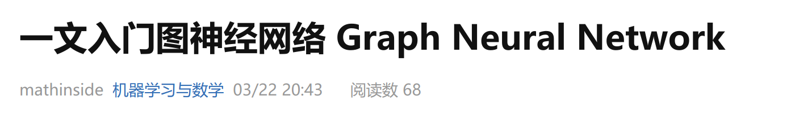

---
presentation:
    transition: "none"
    enableSpeakerNotes: true
    margin: 0
---

@import "../common/css/zhangt-style.css"
@import "../common/css/font-awesome-4.7.0/css/font-awesome.css"

<!-- slide data-notes="" -->

    

    <h1 class="front_page_title top_10">图神经网络导论</h1>
    
 
    <h4 class="front_page_subtitle top_2">人工智能简介</h4>
    <h4 class="author top_10">张腾</h4>
    <h4 class="mail">tengzhang@hust.edu.cn</h4>

<!-- slide vertical=true data-notes="" -->

    

        

        <h5 class="title">课程群</h5>
    

    

    
    
机器学习 Machine Learning   神经网络 Neural Network   谱图理论 Spectral Graph Theory

    

    

        <h6 class="bottom_left">图神经网络导论</h6>
        <h6 class="bottom_center">人工智能简介</h6>
        <h6 class="bottom_right">tengzhang@hust.edu.cn</h6>
    

<!-- slide vertical=true data-notes="" -->

    

        

        <h5 class="title">安排</h5>
    

    

 

授课：郑龙、张腾

 

时间：32学时
- 前24学时理论，周三上午3-4、周五下午7-8
- 后8学时实验，周三下午5-8

 

考核：待定

    

    

        <h6 class="bottom_left">图神经网络导论</h6>
        <h6 class="bottom_center">人工智能简介</h6>
        <h6 class="bottom_right">tengzhang@hust.edu.cn</h6>
    

<!-- slide data-notes="" -->

    

        

        <h5 class="title">难点</h5>
    

    

 

(个人)第一次讲课，经验不足，多给反馈

 

课程初开，没有其他老师的珠玉在前可供参考

 

多门课程的交叉，需要有大量前导课程的配合

 

内容本身过于细枝末节，没有太多内容可讲

    

    

        <h6 class="bottom_left">图神经网络导论</h6>
        <h6 class="bottom_center">人工智能简介</h6>
        <h6 class="bottom_right">tengzhang@hust.edu.cn</h6>
    

<!-- slide vertical=true data-notes="" -->

    

        

        <h5 class="title">大法</h5>
    

    

    
    
    
    
    

    

    

        <h6 class="bottom_left">图神经网络导论</h6>
        <h6 class="bottom_center">人工智能简介</h6>
        <h6 class="bottom_right">tengzhang@hust.edu.cn</h6>
    

<!-- slide vertical=true data-notes="" -->

    

        

        <h5 class="title">困惑</h5>
    

    

 

一文就能读懂，还特地开一门课干啥？

 

(图)神经网络的研究现状：

- 相关文献汗牛充栋，且持续井喷式增长
- 定论很少，朝令夕改
- 多为启发式方法，无甚道理可言，玄学
- 软件包众多，上手门槛低，容易变成不求甚解的炼丹师

    

    

        <h6 class="bottom_left">图神经网络导论</h6>
        <h6 class="bottom_center">人工智能简介</h6>
        <h6 class="bottom_right">tengzhang@hust.edu.cn</h6>
    

<!-- slide vertical=true data-notes="" -->

    

        

        <h5 class="title">当代炼丹术</h5>
    

    

一个优秀丹师的自我修养：
- 灵材品质不好要会手动增强，旋转、翻转、缩放、平移、加噪声、标记平滑
- 因材制宜设计灵阵，空间属性灵材用卷积类灵阵，时间属性灵材用循环类...
- 仔细观察丹炉状态，防止爆炉，若最终仙丹成色不好则改进配置重新来过

    

    

        <h6 class="bottom_left">图神经网络导论</h6>
        <h6 class="bottom_center">人工智能简介</h6>
        <h6 class="bottom_right">tengzhang@hust.edu.cn</h6>
    

<!-- slide vertical=true data-notes="" -->

    

        

        <h5 class="title">期望</h5>
    

    

<table style="font-size:70%">
    <tr>
        <td style="text-align:right;border:none">人工智能</td>
        <td style="border:none">$\Longleftrightarrow$</td>
        <td style="text-align:left;border:none">金庸武学</td>
    </tr>
    <tr>
        <td style="text-align:right;border:none">机器学习</td>
        <td style="border:none">$\Longleftrightarrow$</td>
        <td style="text-align:left;border:none">九阴真经</td>
    </tr>
    <tr>
        <td style="text-align:right;border:none">(图)神经网络</td>
        <td style="border:none">$\Longleftrightarrow$</td>
        <td style="text-align:left;border:none">九阴白骨爪</td>
    </tr>
</table>

> &emsp;&emsp;张无忌回过头去，只见那黄衫女子和周芷若斗得正紧。黄衫女子一双空手，周芷若右手鞭，左手刀，却兀自落于下风。黄衫女子的武功似乎与周芷若乃是一路，飘忽灵动，变幻无方，但举手抬足之间却是正而不邪，如说周芷若形似鬼魅，那黄衫女子便是态拟神仙。  &emsp;&emsp;&emsp;&emsp;&emsp;&emsp;&emsp;&emsp;&emsp;&emsp;&emsp;&emsp;&emsp;&emsp;&emsp;&emsp;——&emsp;《倚天屠龙记》第38章 君子可欺之以方

扎好根基、勿求速成，态拟神仙般地使用(图)神经网络

    

    

        <h6 class="bottom_left">图神经网络导论</h6>
        <h6 class="bottom_center">人工智能简介</h6>
        <h6 class="bottom_right">tengzhang@hust.edu.cn</h6>
    

<!-- slide data-notes="" -->

    

        

        <h5 class="title">纲</h5>
    

    

    

    

        <h6 class="bottom_left">图神经网络导论</h6>
        <h6 class="bottom_center">人工智能简介</h6>
        <h6 class="bottom_right">tengzhang@hust.edu.cn</h6>
    

<!-- slide vertical=true data-notes="" -->

    
 
        

        <h5 class="title">纲</h5>
    

    

    

    

        <h6 class="bottom_left">图神经网络导论</h6>
        <h6 class="bottom_center">人工智能简介</h6>
        <h6 class="bottom_right">tengzhang@hust.edu.cn</h6>
    

<!-- slide vertical=true data-notes="" -->

    

        

        <h5 class="title">背景</h5>
    

    

Wiener 《控制论》:

> 第一次工业革命：用机器来减轻甚至代替体力劳动

> 上世纪中叶：用新型机器来减轻甚至代替脑力劳动

 

关键：让机器具有人类的智能

问题：什么是“智能”？

    

    

        <h6 class="bottom_left">图神经网络导论</h6>
        <h6 class="bottom_center">人工智能简介</h6>
        <h6 class="bottom_right">tengzhang@hust.edu.cn</h6>
    

<!-- slide vertical=true data-notes="" -->

    

        

        <h5 class="title">起源</h5>
    

    

“智能”一词难以直接定义

Turing在1950年的论文《Computing Machinery and Intelligence》里提出

Turing测试：一个人在不接触对方的情况下，通过一种特殊的方式，和对方进行一系列的问答，如果在相当长时间内，他无法根据这些问题判断对方是人还是计算机，那么就可以认为这个计算机是智能的

 

要想通过Turing测试，机器得具备多种能力
- 学习：机器学习
- 感知：计算机视觉，语音识别
- 认知：自然语言处理，知识表示

    

    

        <h6 class="bottom_left">图神经网络导论</h6>
        <h6 class="bottom_center">人工智能简介</h6>
        <h6 class="bottom_right">tengzhang@hust.edu.cn</h6>
    

<!-- slide vertical=true data-notes="" -->

    

        

        <h5 class="title">元年</h5>
    

    

- 时间：1956年
- 地点：Dartmouth学院
- 人物：Shannon、McCarthy、Minsky、Simon、Newell
- 事件：讨论用机器模拟人的智能

    
    

    

    

        <h6 class="bottom_left">图神经网络导论</h6>
        <h6 class="bottom_center">人工智能简介</h6>
        <h6 class="bottom_right">tengzhang@hust.edu.cn</h6>
    

<!-- slide vertical=true data-notes="" -->

    

        

        <h5 class="title">发展</h5>
    

    

秽土转生
- 推理：反绎学习，图神经网络
- 知识：知识图谱，图神经网络

    

    

        <h6 class="bottom_left">图神经网络导论</h6>
        <h6 class="bottom_center">人工智能简介</h6>
        <h6 class="bottom_right">tengzhang@hust.edu.cn</h6>
    

<!-- slide data-notes="我个人猜测原因是数学原理讲的是公理集合论 当然是罗素的 不是zfc 天生符号化" -->

    

        

        <h5 class="title">推理期</h5>
    

    

机器：擅长固定套路的计算&emsp;vs.&emsp;人类：擅长妙手偶得的推理

符号主义：智能 = 逻辑推理

Simon 和 Newell 设计了“逻辑理论家”程序

- 1952年，“逻辑理论家”证明了《数学原理》中的38条定理
- 1963年，证明了全部52条定理，其中定理2.85的证明比原书作者更巧妙
- Simon 和 Newell 获得了75年的图灵奖

    

    

        <h6 class="bottom_left">图神经网络导论</h6>
        <h6 class="bottom_center">人工智能简介</h6>
        <h6 class="bottom_right">tengzhang@hust.edu.cn</h6>
    

<!-- slide vertical=true data-notes="" -->

    

        

        <h5 class="title">符号主义</h5>
    

    

- $A$：“$B$和$C$都是说谎者”
- $B$：“$A$和$C$都是说谎者”
- $C$：“$A$和$B$中至少有一个说谎者”

<table style="width:88%;margin-left:4%">
    <thead>
        <tr>
            <th style="border-right: 1px solid;border-top: 1px solid">公式</th>
            <th style="border-top: 1px solid">$p \rightarrow q$</th>
            <th style="border-top: 1px solid">$\Longleftrightarrow$</th>
            <th style="border-top: 1px solid">$\neg p \vee q$</th>
        </tr>
    </thead>
    <tbody>
        <tr>
            <td style="border-bottom:none;border-right: 1px solid"><b>条件</b></td>
            <td style="border-bottom:none">$A \rightarrow \neg B \wedge \neg C$</td>
            <td style="border-bottom:none">$\Longleftrightarrow$</td>
            <td style="border-bottom:none">$1.~\neg A \vee \neg B$</td>
        </tr>
        <tr>
            <td style="border-bottom:none;border-right: 1px solid"></td>
            <td style="border-bottom:none">&nbsp;</td>
            <td style="border-bottom:none">$\Longleftrightarrow$</td>
            <td style="border-bottom:none">$2.~\neg A \vee \neg C$</td>
        </tr>
        <tr>
            <td style="border-bottom:none;border-right: 1px solid"></td>
            <td style="border-bottom:none">$\neg A \rightarrow B \vee C$</td>
            <td style="border-bottom:none">$\Longleftrightarrow$</td>
            <td style="border-bottom:none">$3.~A \vee B \vee C$</td>
        </tr>
        <tr>
            <td style="border-bottom:none;border-right: 1px solid"></td>
            <td style="border-bottom:none">$B \rightarrow \neg A \wedge \neg C$</td>
            <td style="border-bottom:none">$\Longleftrightarrow$</td>
            <td style="border-bottom:none">$4.~\neg B \vee \neg C$</td>
        </tr>
        <tr>
            <td style="border-bottom:none;border-right: 1px solid"></td>
            <td style="border-bottom:none">$\neg B \rightarrow A \vee C$</td>
            <td style="border-bottom:none">$\Longleftrightarrow$</td>
            <td style="border-bottom:none">$3.~A \vee B \vee C$</td>
        </tr>
        <tr>
            <td style="border-bottom:none;border-right: 1px solid"></td>
            <td style="border-bottom:none">$C \rightarrow \neg A \vee \neg B$</td>
            <td style="border-bottom:none">$\Longleftrightarrow$</td>
            <td style="border-bottom:none">$5.~\neg A \vee \neg B \vee \neg C$</td>
        </tr>
        <tr>
            <td style="border-bottom:none;border-right: 1px solid"></td>
            <td style="border-bottom:none">$\neg C \rightarrow A \wedge B$</td>
            <td style="border-bottom:none">$\Longleftrightarrow$</td>
            <td style="border-bottom:none">$6.~A \vee C$</td>
        </tr>
        <tr>
            <td style="border-right: 1px solid"></td>
            <td style="border-bottom:none">&nbsp;</td>
            <td style="border-bottom:none">$\Longleftrightarrow$</td>
            <td style="border-bottom:none">$7.~B \vee C$</td>
        </tr>
        <tr>
            <td style="border: 1px solid;border-left: none"><b>归结</b></td>
            <td style="border-top: 1px solid;border-bottom: 1px solid">$1 + 7 \rightarrow 8.~\neg A \vee C$</td>
            <td style="border-top: 1px solid;border-bottom: 1px solid">$6 + 8 \rightarrow C$</td>
            <td style="border-top: 1px solid;border-bottom: 1px solid">$C$说了实话</td>
        </tr>
    </tbody>
</table>

    

    

        <h6 class="bottom_left">图神经网络导论</h6>
        <h6 class="bottom_center">人工智能简介</h6>
        <h6 class="bottom_right">tengzhang@hust.edu.cn</h6>
    

<!-- slide vertical=true data-notes="符号主义不能包治百病 面对更难的定理就无能为力了" -->

    

        

        <h5 class="title">推理期</h5>
    

    

机器：擅长固定套路的计算&emsp;vs.&emsp;人类：擅长妙手偶得的推理

符号主义：智能 = 逻辑推理

Simon 和 Newell 设计了“逻辑理论家”程序

- 1952年，“逻辑理论家”证明了《数学原理》中的38条定理
- 1963年，证明了全部52条定理，其中定理2.85的证明比原书作者更巧妙
- Simon 和 Newell 获得了75年的图灵奖

 

衰退：十万步无法证明“两个连续函数之和还是连续函数”

    

    

        <h6 class="bottom_left">图神经网络导论</h6>
        <h6 class="bottom_center">人工智能简介</h6>
        <h6 class="bottom_right">tengzhang@hust.edu.cn</h6>
    

<!-- slide data-notes="" -->

    

        

        <h5 class="title">知识期</h5>
    

    

教训：光有逻辑推理远远不够，机器得拥有知识

信仰：“知识就是力量”，智能 = 知识 + 逻辑推理

专家系统 = 知识库 + 推理机
- 在特定领域内具有专家水平解决问题能力的程序系统
- 第一个成功的专家系统 DENDRAL 于1968年问世
- 知识工程之父 Feigenbaum 获得了94年的图灵奖

    

    

        <h6 class="bottom_left">图神经网络导论</h6>
        <h6 class="bottom_center">人工智能简介</h6>
        <h6 class="bottom_right">tengzhang@hust.edu.cn</h6>
    

<!-- slide vertical=true data-notes="" -->

    

        

        <h5 class="title">动物识别专家系统</h5>
    

    

    

    

        <h6 class="bottom_left">图神经网络导论</h6>
        <h6 class="bottom_center">人工智能简介</h6>
        <h6 class="bottom_right">tengzhang@hust.edu.cn</h6>
    

<!-- slide vertical=true data-notes="" -->

    

        

        <h5 class="title">知识期</h5>
    

    

教训：光有逻辑推理远远不够，机器得拥有知识

信仰：“知识就是力量”，智能 = 知识 + 逻辑推理

专家系统 = 知识库 + 推理机
- 在特定领域内具有专家水平解决问题能力的程序系统
- 第一个成功的专家系统 DENDRAL 于1968年问世
- 知识工程之父 Feigenbaum 获得了94年的图灵奖

 

衰退：人工构建知识库成本太高，知识获取困难

    

    

        <h6 class="bottom_left">图神经网络导论</h6>
        <h6 class="bottom_center">人工智能简介</h6>
        <h6 class="bottom_right">tengzhang@hust.edu.cn</h6>
    

<!-- slide data-notes="对于人类的很多智能行为(比如语言理解、图像理解等),我们很难知道其中的原理,也无法描述出这些智能行为背后的“知识”。因此,我们也很难通过知识和推理的方式来实现这些行为的智能系统。为了解决这类问题,研究者开始将研究重点转向让计算机从数据中自己学习。" -->

    

        

        <h5 class="title">机器学习</h5>
    

    

基本想法：让机器从数据中自动学习得到某种知识(规律)

数据形式：图像、文本、语音、......

    

    

    

        <h6 class="bottom_left">图神经网络导论</h6>
        <h6 class="bottom_center">人工智能简介</h6>
        <h6 class="bottom_right">tengzhang@hust.edu.cn</h6>
    

<!-- slide vertical=true data-notes="对于人类的很多智能行为(比如语言理解、图像理解等),我们很难知道其中的原理,也无法描述出这些智能行为背后的“知识”。因此,我们也很难通过知识和推理的方式来实现这些行为的智能系统。为了解决这类问题,研究者开始将研究重点转向让计算机从数据中自己学习。" -->

    

        

        <h5 class="title">机器学习</h5>
    

    

基本想法：让机器从数据中自动学习得到某种知识(规律)

数据形式：图像、文本、语音、......

机器学习流程：

- 数据预处理：去除噪声，文本分类中去除停用词
- 特征提取：图像分类中提取边缘、SIFT特征
- 特征转换：降维、升维，特征抽取、特征选择，PCA、LDA
- 预测：机器学习最核心的部分，学习一个映射进行预测

    

    

        <h6 class="bottom_left">图神经网络导论</h6>
        <h6 class="bottom_center">人工智能简介</h6>
        <h6 class="bottom_right">tengzhang@hust.edu.cn</h6>
    

<!-- slide vertical=true data-notes="对于人类的很多智能行为(比如语言理解、图像理解等),我们很难知道其中的原理,也无法描述出这些智能行为背后的“知识”。因此,我们也很难通过知识和推理的方式来实现这些行为的智能系统。为了解决这类问题,研究者开始将研究重点转向让计算机从数据中自己学习。" -->

    

        

        <h5 class="title">机器学习</h5>
    

    

基本想法：让机器从数据中自动学习得到某种知识(规律)

数据形式：图像、文本、语音、......

特征处理：

<table style="width:70%;margin-left:15%">
    <thead>
        <tr>
            <th style="border-right: 1px solid;border-top: 1px solid;text-align:center">原始数据</th>
            <th style="border-top: 1px solid;border-right: 1px solid;text-align:center">样本</th>
            <th style="border-top: 1px solid;text-align:center">特征 属性</th>
            <th style="border-top: 1px solid;text-align:center">类别标记</th>
        </tr>
    </thead>
    <tbody>
        <tr>
            <td style="border-bottom:none;border-right: 1px solid;text-align:center">$o_1$</td>
            <td style="border-bottom:none;border-right: 1px solid;text-align:center">$(\xv_1, y_1)$</td>
            <td style="border-bottom:none;text-align:center">$\xv_1[1:d]$</td>
            <td style="border-bottom:none;text-align:center">$y_1$</td>
        </tr>
        <tr>
            <td style="border-bottom:none;border-right: 1px solid;text-align:center">$o_2$</td>
            <td style="border-bottom:none;border-right: 1px solid;text-align:center">$(\xv_2, y_2)$</td>
            <td style="border-bottom:none;text-align:center">$\xv_2[1:d]$</td>
            <td style="border-bottom:none;text-align:center">$y_2$</td>
        </tr>
        <tr>
            <td style="border-bottom:none;border-right: 1px solid;text-align:center">$\vdots$</td>
            <td style="border-bottom:none;border-right: 1px solid;text-align:center">$\vdots$</td>
            <td style="border-bottom:none;text-align:center">$\vdots$</td>
            <td style="border-bottom:none;text-align:center">$\vdots$</td>
        </tr>
        <tr>
            <td style="border-bottom: 1px solid;border-right: 1px solid;text-align:center">$o_m$</td>
            <td style="border-bottom: 1px solid;border-right: 1px solid;text-align:center">$(\xv_m, y_m)$</td>
            <td style="border-bottom: 1px solid;text-align:center">$\xv_m[1:d]$</td>
            <td style="border-bottom: 1px solid;text-align:center">$y_m$</td>
        </tr>
    </tbody>
</table>

预测：通过学习算法寻找假设$h(\xv) = \hat{y} \xrightarrow{接近} y$

    

    

        <h6 class="bottom_left">图神经网络导论</h6>
        <h6 class="bottom_center">人工智能简介</h6>
        <h6 class="bottom_right">tengzhang@hust.edu.cn</h6>
    

<!-- slide data-notes="" -->

    
 
        

        <h5 class="title">纲</h5>
    

    

    

    

        <h6 class="bottom_left">图神经网络导论</h6>
        <h6 class="bottom_center">人工智能简介</h6>
        <h6 class="bottom_right">tengzhang@hust.edu.cn</h6>
    

<!-- slide vertical=true data-notes="" -->

    

        

        <h5 class="title">监督学习</h5>
    

    

所有样本都有类别标记

<table style="width:70%;margin-left:15%">
    <thead>
        <tr>
            <th style="border-right: 1px solid;border-top: 1px solid;text-align:center">原始数据</th>
            <th style="border-top: 1px solid;border-right: 1px solid;text-align:center">样本</th>
            <th style="border-top: 1px solid;text-align:center">特征 属性</th>
            <th style="border-top: 1px solid;text-align:center">类别标记</th>
        </tr>
    </thead>
    <tbody>
        <tr>
            <td style="border-bottom:none;border-right: 1px solid;text-align:center">$o_1$</td>
            <td style="border-bottom:none;border-right: 1px solid;text-align:center">$(\xv_1, y_1)$</td>
            <td style="border-bottom:none;text-align:center">$\xv_1[1:d]$</td>
            <td style="border-bottom:none;text-align:center">$y_1$</td>
        </tr>
        <tr>
            <td style="border-bottom:none;border-right: 1px solid;text-align:center">$o_2$</td>
            <td style="border-bottom:none;border-right: 1px solid;text-align:center">$(\xv_2, y_2)$</td>
            <td style="border-bottom:none;text-align:center">$\xv_2[1:d]$</td>
            <td style="border-bottom:none;text-align:center">$y_2$</td>
        </tr>
        <tr>
            <td style="border-bottom:none;border-right: 1px solid;text-align:center">$\vdots$</td>
            <td style="border-bottom:none;border-right: 1px solid;text-align:center">$\vdots$</td>
            <td style="border-bottom:none;text-align:center">$\vdots$</td>
            <td style="border-bottom:none;text-align:center">$\vdots$</td>
        </tr>
        <tr>
            <td style="border-bottom: 1px solid;border-right: 1px solid;text-align:center">$o_m$</td>
            <td style="border-bottom: 1px solid;border-right: 1px solid;text-align:center">$(\xv_m, y_m)$</td>
            <td style="border-bottom: 1px solid;text-align:center">$\xv_m[1:d]$</td>
            <td style="border-bottom: 1px solid;text-align:center">$y_m$</td>
        </tr>
    </tbody>
</table>

任务类型：
- 二分类：$y \in \{ 1, -1 \}$
- 多分类：$y \in [C] \triangleq \{ 1, 2, \ldots, C \}$
- 回归：$y \in \Rbb$
- 结构预测：$y$可以是向量、序列、语法树、......

    

    

        <h6 class="bottom_left">图神经网络导论</h6>
        <h6 class="bottom_center">人工智能简介</h6>
        <h6 class="bottom_right">tengzhang@hust.edu.cn</h6>
    

<!-- slide vertical=true data-notes="" -->

    

        

        <h5 class="title">无监督学习</h5>
    

    

所有样本都没有类别标记

<table style="width:70%;margin-left:15%">
    <thead>
        <tr>
            <th style="border-right: 1px solid;border-top: 1px solid;text-align:center">原始数据</th>
            <th style="border-top: 1px solid;border-right: 1px solid;text-align:center">样本</th>
            <th style="border-top: 1px solid;text-align:center">特征 属性</th>
            <th style="border-top: 1px solid;text-align:center">类别标记</th>
        </tr>
    </thead>
    <tbody>
        <tr>
            <td style="border-bottom:none;border-right: 1px solid;text-align:center">$o_1$</td>
            <td style="border-bottom:none;border-right: 1px solid;text-align:center">$(\xv_1, y_1)$</td>
            <td style="border-bottom:none;text-align:center">$\xv_1[1:d]$</td>
            <td style="border-bottom:none;text-align:center">null</td>
        </tr>
        <tr>
            <td style="border-bottom:none;border-right: 1px solid;text-align:center">$o_2$</td>
            <td style="border-bottom:none;border-right: 1px solid;text-align:center">$(\xv_2, y_2)$</td>
            <td style="border-bottom:none;text-align:center">$\xv_2[1:d]$</td>
            <td style="border-bottom:none;text-align:center">null</td>
        </tr>
        <tr>
            <td style="border-bottom:none;border-right: 1px solid;text-align:center">$\vdots$</td>
            <td style="border-bottom:none;border-right: 1px solid;text-align:center">$\vdots$</td>
            <td style="border-bottom:none;text-align:center">$\vdots$</td>
            <td style="border-bottom:none;text-align:center">$\vdots$</td>
        </tr>
        <tr>
            <td style="border-bottom: 1px solid;border-right: 1px solid;text-align:center">$o_m$</td>
            <td style="border-bottom: 1px solid;border-right: 1px solid;text-align:center">$(\xv_m, y_m)$</td>
            <td style="border-bottom: 1px solid;text-align:center">$\xv_m[1:d]$</td>
            <td style="border-bottom: 1px solid;text-align:center">null</td>
        </tr>
    </tbody>
</table>

任务类型：

- 聚类：$\xv_i \mapsto c_i \in [K]$，根据一定的准则将样本划分成$K$个簇(cluster)
- 降维：$\xv_i \mapsto \zv_i \in \Rbb^l$，为样本学习新的特征表示，为后续分析提供帮助
- 密度估计：估计样本空间的概率密度$P(\xv)$，探索数据的生成机制

    

    

        <h6 class="bottom_left">图神经网络导论</h6>
        <h6 class="bottom_center">人工智能简介</h6>
        <h6 class="bottom_right">tengzhang@hust.edu.cn</h6>
    

<!-- slide vertical=true data-notes="如何利用大量的未标记数据帮助学习 未标记数据量大 可能有损害" -->

    

        

        <h5 class="title">半监督学习</h5>
    

    

只有少数样本有类别标记，如何利用大部分未标记样本？

<table style="width:70%;margin-left:15%">
    <thead>
        <tr>
            <th style="border-right: 1px solid;border-top: 1px solid;text-align:center">原始数据</th>
            <th style="border-top: 1px solid;border-right: 1px solid;text-align:center">样本</th>
            <th style="border-top: 1px solid;text-align:center">特征 属性</th>
            <th style="border-top: 1px solid;text-align:center">类别标记</th>
        </tr>
    </thead>
    <tbody>
        <tr>
            <td style="border-bottom:none;border-right: 1px solid;text-align:center">$o_1$</td>
            <td style="border-bottom:none;border-right: 1px solid;text-align:center">$(\xv_1, y_1)$</td>
            <td style="border-bottom:none;text-align:center">$\xv_1[1:d]$</td>
            <td style="border-bottom:none;text-align:center">$y_1$</td>
        </tr>
        <tr>
            <td style="border-bottom:none;border-right: 1px solid;text-align:center">$\vdots$</td>
            <td style="border-bottom:none;border-right: 1px solid;text-align:center">$\vdots$</td>
            <td style="border-bottom:none;text-align:center">$\vdots$</td>
            <td style="border-bottom:none;text-align:center">$\vdots$</td>
        </tr>
        <tr>
            <td style="border-bottom:none;border-right: 1px solid;text-align:center">$o_l$</td>
            <td style="border-bottom:none;border-right: 1px solid;text-align:center">$(\xv_l, y_l)$</td>
            <td style="border-bottom:none;text-align:center">$\xv_l[1:d]$</td>
            <td style="border-bottom:none;text-align:center">$y_l$</td>
        </tr>
        <tr>
            <td style="border-bottom:none;border-right: 1px solid;text-align:center">$o_{l+1}$</td>
            <td style="border-bottom:none;border-right: 1px solid;text-align:center">$(\xv_{l+1}, y_{l+1})$</td>
            <td style="border-bottom:none;text-align:center">$\xv_{l+1}[1:d]$</td>
            <td style="border-bottom:none;text-align:center">null</td>
        </tr>
        <tr>
            <td style="border-bottom:none;border-right: 1px solid;text-align:center">$\vdots$</td>
            <td style="border-bottom:none;border-right: 1px solid;text-align:center">$\vdots$</td>
            <td style="border-bottom:none;text-align:center">$\vdots$</td>
            <td style="border-bottom:none;text-align:center">$\vdots$</td>
        </tr>
        <tr>
            <td style="border-bottom: 1px solid;border-right: 1px solid;text-align:center">$o_{l+u}$</td>
            <td style="border-bottom: 1px solid;border-right: 1px solid;text-align:center">$(\xv_{l+u}, y_{l+u})$</td>
            <td style="border-bottom: 1px solid;text-align:center">$\xv_{l+u}[1:d]$</td>
            <td style="border-bottom: 1px solid;text-align:center">null</td>
        </tr>
    </tbody>
</table>

任务类型：

- 直推式(transductive)学习：预测$y_{l+1}, \ldots, y_{l+u}$，可以没有显式的模型
- 归纳(inductive)学习：能够对未知样本进行预测，需要有显式的模型，包含前者

    

    

        <h6 class="bottom_left">图神经网络导论</h6>
        <h6 class="bottom_center">人工智能简介</h6>
        <h6 class="bottom_right">tengzhang@hust.edu.cn</h6>
    

