---
presentation:
    transition: "none"
    enableSpeakerNotes: true
    margin: 0
---

@import "../common/css/zhangt-style.css"
@import "../common/css/font-awesome-4.7.0/css/font-awesome.css"

<!-- slide data-notes="" -->

    
    

    <h1 style="width: 50%">
        图神经网络导论  
        循环神经网络
    </h1>
    <h2>张腾</h2>
    <h3>tengzhang@hust.edu.cn</h3>

<!-- slide vertical=true data-notes="" -->

    
 
        

        <h5 class="title">纲</h5>
    

    

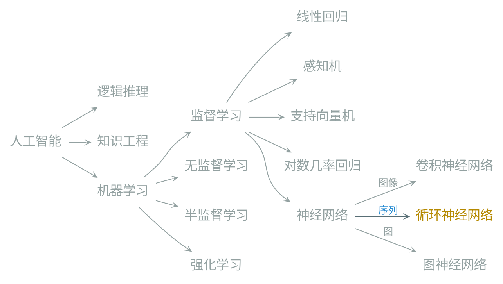

    

    

        <h6 class="bottom_left">图神经网络导论</h6>
        <h6 class="bottom_center">循环神经网络</h6>
        <h6 class="bottom_right">tengzhang@hust.edu.cn</h6>
    

<!-- slide data-notes="" -->

    
 
        

        <h5 class="title">循环神经网络</h5>
    

    

前向神经网络

-   信息单向传递
-   输出只依赖于当前输入
-   难以处理变长的时序数据(视频、语音、文本)

 

循环神经网络：

-   带有环路，神经元既可以接收其它神经元的信息，也可以接收自身的信息
-   目的是让网络具有短期记忆能力，能处理时序数据

    

    

        <h6 class="bottom_left">图神经网络导论</h6>
        <h6 class="bottom_center">循环神经网络</h6>
        <h6 class="bottom_right">tengzhang@hust.edu.cn</h6>
    

<!-- slide vertical=true data-notes="" -->

    
 
        

        <h5 class="title">短期记忆</h5>
    

    

延时神经网络：在前向网络的非输出层都添加一个延时器，记录最近几次的输出，在第$t$个时刻，第$l + 1$层神经元和第$l$层神经元的最近$p$次输出相关

$$
    \begin{align*}
        \av^{(l+1)}_t = h(\av^{(l)}_t, \av^{(l)}_{t-1}, \ldots, \av^{(l)}_{t-p})
    \end{align*}
$$

延时神经网络在时间维度上共享权值，对序列输入来讲延时神经网络就相当于卷积神经网络

 

有外部输入的非线性自回归模型：在每个时刻$t$都有一个外部输入$\xv_t$，产生一个输出$\yv_t$，延时器记录最近几次的外部输入和输出

$$
    \begin{align*}
        \yv_t = h(\xv_t, \xv_{t-1}, \ldots, \xv_{t-p}, \yv_{t-1}, \ldots, \yv_{t-p})
    \end{align*}
$$

其中$h$是一个非线性函数，可以是一个前向神经网络

    

    

        <h6 class="bottom_left">图神经网络导论</h6>
        <h6 class="bottom_center">循环神经网络</h6>
        <h6 class="bottom_right">tengzhang@hust.edu.cn</h6>
    

<!-- slide data-notes="" -->

    
 
        

        <h5 class="title">循环神经网络</h5>
    

    

给定输入序列$\xv_1, \xv_2, \ldots, \xv_t, \ldots, \xv_T$，循环神经网络的更新：

    $$
        \begin{align*}
            \av_t = h(\av_{t-1}, \xv_t)
        \end{align*}
    $$

其中$\av_0 = \zerov$，$h$是一个非线性函数，可以是一个前向神经网络

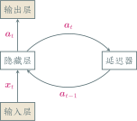

    

    

        <h6 class="bottom_left">图神经网络导论</h6>
        <h6 class="bottom_center">循环神经网络</h6>
        <h6 class="bottom_right">tengzhang@hust.edu.cn</h6>
    

<!-- slide vertical=true data-notes="" -->

    
 
        

        <h5 class="title">简单循环网络</h5>
    

    

只有一个隐藏层的循环神经网络，存在隐藏层到隐藏层的连边

    $$
        \begin{align*}
            \zv_t & = \class{yellow}{\Uv \av_{t-1}} + \Wv \xv_t + \bv \\
            \av_t & = h(\zv_t)
        \end{align*}
    $$

 

循环神经网络可以看作是在时间维度上权值共享的神经网络

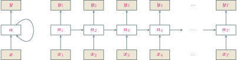

    

    

        <h6 class="bottom_left">图神经网络导论</h6>
        <h6 class="bottom_center">循环神经网络</h6>
        <h6 class="bottom_right">tengzhang@hust.edu.cn</h6>
    

<!-- slide vertical=true data-notes="" -->

    
 
        

        <h5 class="title">动力系统观点</h5>
    

    

    $$
        \begin{align*}
            \zv_t & = \class{yellow}{\Uv \av_{t-1}} + \Wv \xv_t + \bv \\
            \av_t & = h(\zv_t)
        \end{align*}
    $$

 

循环神经网络的更新可以看成一个动力系统(Dynamical System)，因此隐藏层的输出$\av_t$在很多文献上也称为状态(State)

 

动力系统：使用一个(微分)方程来描述给定空间中所有点随时间变化情况的系统

    $$
        \begin{align*}
            \wv_{t+1} = \wv_t - \eta f'(\wv_t) \Longrightarrow \frac{\wv_{t+1} - \wv_t}{\eta} = - f'(\wv_t) \Longrightarrow \dot{\wv} = - f'(\wv)
        \end{align*}
    $$

 

梯度下降就是在用(前向) Euler 法离散地求解动力系统

 

Nesterov 加速梯度的微分方程表示：$\ddot{\wv} + (3/t) \dot{\wv} = - f'(\wv)$

    

    

        <h6 class="bottom_left">图神经网络导论</h6>
        <h6 class="bottom_center">循环神经网络</h6>
        <h6 class="bottom_right">tengzhang@hust.edu.cn</h6>
    

<!-- slide vertical=true data-notes="" -->

    
 
        

        <h5 class="title">动力系统观点</h5>
    

    

梯度下降的微分方程表示：$\dot{\wv} = - f'(\wv)$

引入函数

    $$
        \begin{align*}
            \Ecal(t) = t (f(\wv) - f^\star) + \frac{1}{2} \| \wv - \wv^\star \|_2^2
        \end{align*}
    $$

易知

    $$
        \begin{align*}
            \Ecal'(t) & = f(\wv) - f^\star + t \dot{\wv}^\top f'(\wv) + \dot{\wv}^\top (\wv - \wv^\star) \\
            & = - \|f'(\wv)\|_2^2 + f(\wv) - f^\star - f'(\wv)^\top (\wv - \wv^\star) \\
            & = - \|f'(\wv)\|_2^2 + f(\wv) + f'(\wv)^\top (\wv^\star - \wv) - f^\star \leq 0
        \end{align*}
    $$

即$\Ecal$的单调下降

    $$
        \begin{align*}
            f(\wv) - f^\star \leq \frac{\Ecal(t)}{t} \leq \frac{\Ecal(0)}{t} = \frac{\| \wv_0 - \wv^\star \|_2^2}{2t} = O(1/t)
        \end{align*}
    $$

    

    

        <h6 class="bottom_left">图神经网络导论</h6>
        <h6 class="bottom_center">循环神经网络</h6>
        <h6 class="bottom_right">tengzhang@hust.edu.cn</h6>
    

<!-- slide data-notes="" -->

    
 
        

        <h5 class="title">应用到机器学习</h5>
    

    

序列到类的模式

 

输入长度为$T$的序列$\xv_1, \ldots, \xv_T$，输出类别标记$y \in [C]$，例如文本分类

 

两种模式：

-   序列的最终表示$\av_T$输入给分类器$g$进行分类：$\hat{y} = g(\av_T)$
-   将整个序列的平均状态$\av$输入给分类器$g$进行分类：$\hat{y} = g(\av)$

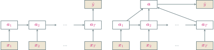

    

    

        <h6 class="bottom_left">图神经网络导论</h6>
        <h6 class="bottom_center">循环神经网络</h6>
        <h6 class="bottom_right">tengzhang@hust.edu.cn</h6>
    

<!-- slide vertical=true data-notes="" -->

    
 
        

        <h5 class="title">应用到机器学习</h5>
    

    

同步的序列到序列模式

 

输入序列$\xv_1, \ldots, \xv_T$，同步输出序列$y_1, \ldots, y_T$，例如词性标注

    $$
        \begin{align*}
            \hat{y}_t = g(\av_t), ~ \forall t \in [T]
        \end{align*}
    $$

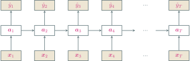

    

    

        <h6 class="bottom_left">图神经网络导论</h6>
        <h6 class="bottom_center">循环神经网络</h6>
        <h6 class="bottom_right">tengzhang@hust.edu.cn</h6>
    

<!-- slide vertical=true data-notes="" -->

    
 
        

        <h5 class="title">应用到机器学习</h5>
    

    

异步的序列到序列模式，也称为编码器-解码器(Encoder-Decoder)模型

 

输入序列$\xv_1, \ldots, \xv_T$，输出序列$\yv_1, \ldots, \yv_S$，不需要同步输出，也不需要保持相同的长度，例如机器翻译、问答系统、图像描述

    $$
        \begin{align*}
            \av_t & = h_1 (\av_{t-1}, \xv_t), ~ \forall t \in [T] \\
            \av_{T+t} & = h_2 (\av_{T+t-1}, \yv_{t-1}), ~ \forall t \in [S] \\
            \yv_t & = g(\av_{T+t}), ~ \forall t \in [S]
        \end{align*}
    $$

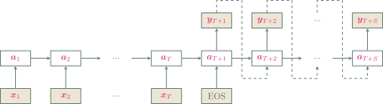

    

    

        <h6 class="bottom_left">图神经网络导论</h6>
        <h6 class="bottom_center">循环神经网络</h6>
        <h6 class="bottom_right">tengzhang@hust.edu.cn</h6>
    

<!-- slide data-notes="" -->

    
 
        

        <h5 class="title">随时间反向传播</h5>
    

    

对$\zv = \Wv \av + \bv$有

    $$
        \begin{align*}
            \frac{\partial z_j}{\partial \Wv} = [\zerov, \ldots, \av, \ldots, \zerov], \quad \frac{\partial \zv}{\partial \bv} = \Iv, \quad \frac{\partial \zv}{\partial \av} = \Wv
        \end{align*}
    $$

 

同理对$\zv_k = \Uv \av_{k-1} + \Wv \xv_k + \bv$有

    $$
        \begin{align*}
            & \frac{\partial [\zv_k]_j}{\partial \Uv} = [\zerov, \ldots, \av_{k-1}, \ldots, \zerov], \quad \frac{\partial [\zv_k]_j}{\partial \Wv} = [\zerov, \ldots, \xv_k, \ldots, \zerov] \\
            & \frac{\partial \zv_k}{\partial \bv} = \Iv, \quad \frac{\partial \zv_k}{\partial \av_{k-1}} = \Uv
        \end{align*}
    $$

 

随时间反向传播：

-   循环神经网络可以看作一个展开的多层前馈网络，“每层”对应“每个时刻”
-   所有层参数共享，因此参数的真实梯度是所有“展开层”的梯度之和

    

    

        <h6 class="bottom_left">图神经网络导论</h6>
        <h6 class="bottom_center">循环神经网络</h6>
        <h6 class="bottom_right">tengzhang@hust.edu.cn</h6>
    

<!-- slide vertical=true data-notes="" -->

    
 
        

        <h5 class="title">随时间反向传播</h5>
    

    

对$\zv_k = \Uv \av_{k-1} + \Wv \xv_k + \bv$有

    $$
        \begin{align*}
            & \frac{\partial [\zv_k]_j}{\partial \Uv} = [\zerov, \ldots, \av_{k-1}, \ldots, \zerov], \quad \frac{\partial [\zv_k]_j}{\partial \Wv} = [\zerov, \ldots, \xv_k, \ldots, \zerov] \\
            & \frac{\partial \zv_k}{\partial \bv} = \Iv, \quad \frac{\partial \zv_k}{\partial \av_{k-1}} = \Uv
        \end{align*}
    $$

记时刻$t$的损失为$\Lcal_t$，则总损失为$\Lcal = \sum_{t \in [T]} \Lcal_t$，记$\deltav_{t,k}^\top = \partial \Lcal_t / \partial \zv_k$为时刻$t$的损失对时刻$k$隐藏层输入的导数

注意$\av_k = h(\zv_k)$，由链式法则

    $$
        \begin{align*}
            \deltav_{t,k}^\top = \frac{\partial \Lcal_t}{\partial \zv_k} = \frac{\partial \Lcal_t}{\partial \zv_{k+1}} \frac{\partial \zv_{k+1}}{\partial \av_k} \frac{\partial \av_k}{\partial \zv_k} = \deltav_{t,k+1}^\top \Uv ~  \diag (h'(\zv_k)) 
        \end{align*}
    $$

依然有反向传播的结构

    

    

        <h6 class="bottom_left">图神经网络导论</h6>
        <h6 class="bottom_center">循环神经网络</h6>
        <h6 class="bottom_right">tengzhang@hust.edu.cn</h6>
    

<!-- slide vertical=true data-notes="" -->

    
 
        

        <h5 class="title">随时间反向传播</h5>
    

    

对$\zv_k = \Uv \av_{k-1} + \Wv \xv_k + \bv$有

    $$
        \begin{align*}
            & \frac{\partial [\zv_k]_j}{\partial \Uv} = [\zerov, \ldots, \av_{k-1}, \ldots, \zerov], \quad \frac{\partial [\zv_k]_j}{\partial \Wv} = [\zerov, \ldots, \xv_k, \ldots, \zerov] \\
            & \frac{\partial \zv_k}{\partial \bv} = \Iv, \quad \frac{\partial \zv_k}{\partial \av_{k-1}} = \Uv
        \end{align*}
    $$

记时刻$t$的损失为$\Lcal_t$，则总损失为$\Lcal = \sum_{t \in [T]} \Lcal_t$，记$\deltav_{t,k}^\top = \partial \Lcal_t / \partial \zv_k$为时刻$t$的损失对时刻$k$隐藏层输入的导数

    $$
        \begin{align*}
            \frac{\partial \Lcal}{\partial \Uv} & = \sum_{t \in [T]} \sum_{k \in [t]} \sum_j \frac{\partial \Lcal_t}{\partial [\zv_k]_j} \frac{\partial [\zv_k]_j}{\partial \Uv} = \sum_{t \in [T]} \sum_{k \in [t]} \av_{k-1} \deltav_{t,k}^\top \\
            \frac{\partial \Lcal}{\partial \Wv} & = \sum_{t \in [T]} \sum_{k \in [t]} \xv_k \deltav_{t,k}^\top, \quad \frac{\partial \Lcal}{\partial \bv} = \sum_{t \in [T]} \sum_{k \in [t]} \deltav_{t,k}^\top
        \end{align*}
    $$

    

    

        <h6 class="bottom_left">图神经网络导论</h6>
        <h6 class="bottom_center">循环神经网络</h6>
        <h6 class="bottom_right">tengzhang@hust.edu.cn</h6>
    

<!-- slide data-notes="" -->

    
 
        

        <h5 class="title">长程依赖问题</h5>
    

    

反向传播结构

$$
    \begin{align*}
        \deltav_{t,k}^\top = \deltav_{t,k+1}^\top \Uv ~  \diag (h'(\zv_k))  = \cdots = \deltav_{t,t} ~ \Pi_{\tau=k}^{t-1} \left( \Uv ~ \diag (h'(\zv_k)) \right)
    \end{align*}
$$

定义$\gamma = \| \diag (h'(\zv_k)) \Uv^\top \|$

-   若$\gamma > 1$，当$t - k \rightarrow \infty$时，出现梯度爆炸
-   若$\gamma < 1$，当$t - k \rightarrow \infty$时，出现梯度消失

 

长程依赖问题：循环神经网络理论上可以建立长时间间隔状态间的依赖关系，但由于梯度爆炸/消失问题，实际上只能学习短期的依赖关系

-   精心挑选激活函数，尽量使得$\| \diag (h'(\zv_k)) \Uv^\top \| \approx 1$，需要足够的炼丹经验
-   梯度爆炸：权重衰减，梯度截断
-   梯度消失：引入残差结构$\av_t = \av_{t-1} + f(\xv_t, \av_{t-1})$，但随着时间$t$增长，$\av_t$会变得越来越大，从而导致隐状态变得饱和，但其存储信息的能力是有限的

    

    

        <h6 class="bottom_left">图神经网络导论</h6>
        <h6 class="bottom_center">循环神经网络</h6>
        <h6 class="bottom_right">tengzhang@hust.edu.cn</h6>
    

<!-- slide vertical=true data-notes="" -->

    
 
        

        <h5 class="title">门控机制</h5>
    

    

有选择地加入新的信息，并有选择地遗忘之前累积的信息

-   长短期记忆(Long Short-Term Memory, LSTM)网络
-   门控循环单元(Gated Recurrent Unit, GRU)网络

    

    

        <h6 class="bottom_left">图神经网络导论</h6>
        <h6 class="bottom_center">循环神经网络</h6>
        <h6 class="bottom_right">tengzhang@hust.edu.cn</h6>
    

<!-- slide data-notes="" -->

    
 
        

        <h5 class="title">LSTM网络</h5>
    

    

引入一个新的内部状态$\cv_t$专门进行线性的循环信息传递，同时输出信息给隐藏层的外部状态$\av_t$

    $$
        \begin{align*}
            \cv_t & = \fv_t \odot \cv_{t-1} + \iv_t \odot \widetilde{\cv}_t \\
            \av_t & = \ov_t \odot \tanh(\cv_t)
        \end{align*}
    $$

其中$\odot$为向量元素乘积

-   $\widetilde{\cv}_t = \tanh(\Wv_c \xv_t + \Uv_c \av_{t−1} + \bv_c)$是通过非线性函数得到的候选状态
-   遗忘门$\fv_t = \sigma(\Wv_f \xv_t + \Uv_f \av_{t−1} + \bv_f) \in (0,1)$控制上一个时刻的内部状态$\cv_{t-1}$需要遗忘多少信息
-   输入门$\iv_t = \sigma(\Wv_i \xv_t + \Uv_i \av_{t−1} + \bv_i) \in (0,1)$控制当前时刻的候选状态$\widetilde{\cv}_t$需要保存多少信息
-   输出门$\ov_t = \sigma(\Wv_o \xv_t + \Uv_o \av_{t−1} + \bv_o) \in (0,1)$控制当前时刻的内部状态$\cv_t$需要输出多少信息给外部状态$\av_t$

    

    

        <h6 class="bottom_left">图神经网络导论</h6>
        <h6 class="bottom_center">循环神经网络</h6>
        <h6 class="bottom_right">tengzhang@hust.edu.cn</h6>
    

<!-- slide vertical=true data-notes="" -->

    
 
        

        <h5 class="title">LSTM网络</h5>
    

    

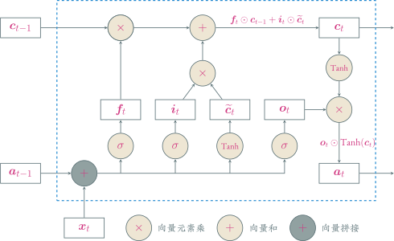

    

    

        <h6 class="bottom_left">图神经网络导论</h6>
        <h6 class="bottom_center">循环神经网络</h6>
        <h6 class="bottom_right">tengzhang@hust.edu.cn</h6>
    

<!-- slide vertical=true data-notes="" -->

    
 
        

        <h5 class="title">LSTM网络</h5>
    

    

紧凑形式

    $$
        \begin{align*}
            \begin{bmatrix}
                \widetilde{\cv}_t \\ \ov_t \\ \iv_t \\ \fv_t
            \end{bmatrix} & = \begin{bmatrix}
                \tanh \\ \sigma \\ \sigma \\ \sigma
            \end{bmatrix} \left( \Wv \begin{bmatrix}
                \xv_t \\ \av_{t-1}
            \end{bmatrix} + \bv \right) \\
            \cv_t & = \fv_t \odot \cv_{t-1} + \iv_t \odot \widetilde{\cv}_t \\
            \av_t & = \ov_t \odot \tanh(\cv_t)
        \end{align*}
    $$

循环神经网络中的隐状态$\av$存储了历史信息，可以看作是一种记忆

在简单循环网络中，隐状态每个时刻都会被重写，因此只是一种短期记忆

LSTM 中的记忆单元$\cv$可以在某个时刻捕捉到关键信息将其保存，且生命周期要长于短期记忆$\av$，因此称为长的短期记忆

    

    

        <h6 class="bottom_left">图神经网络导论</h6>
        <h6 class="bottom_center">循环神经网络</h6>
        <h6 class="bottom_right">tengzhang@hust.edu.cn</h6>
    

<!-- slide vertical=true data-notes="" -->

    
 
        

        <h5 class="title">LSTM网络变种</h5>
    

    

无遗忘门的 LSTM 网络：$\cv_t = \fv_t \odot \cv_{t-1} + \iv_t \odot \widetilde{\cv}_t$，记忆饱和

 

peephole 连接：三个门不但依赖于输入$\xv_t$和上一时刻的隐状态$\av_{t−1}$，也依赖于上一个时刻的记忆单元$\cv_{t−1}$

    $$
        \begin{align*}
            \fv_t & = \sigma(\Wv_f \xv_t + \Uv_f \av_{t−1} + \Vv_f \cv_{t−1} + \bv_f) \\
            \iv_t & = \sigma(\Wv_i \xv_t + \Uv_i \av_{t−1} + \Vv_i \cv_{t−1} + \bv_i) \\
            \ov_t & = \sigma(\Wv_o \xv_t + \Uv_o \av_{t−1} + \Vv_o \cv_{t−1} + \bv_o) \\
        \end{align*}
    $$

 

耦合输入门和遗忘门：LSTM 中的输入门和遗忘门有些互补关系，同时用两个门存在冗余：$\cv_t = (\onev - \iv_t) \odot \cv_{t-1} + \iv_t \odot \widetilde{\cv}_t$

    

    

        <h6 class="bottom_left">图神经网络导论</h6>
        <h6 class="bottom_center">循环神经网络</h6>
        <h6 class="bottom_right">tengzhang@hust.edu.cn</h6>
    

<!-- slide data-notes="" -->

    
 
        

        <h5 class="title">GRU网络</h5>
    

    

不引入额外的记忆单元，更新方式为

    $$
        \begin{align*}
            \av_t = \zv_t \odot \av_{t−1} + (\onev − \zv_t) \odot \widetilde{\av}_t
        \end{align*}
    $$

其中

-   $\zv_t = \sigma(\Wv_z \xv_t + \Uv_z \av_{t−1} + \bv_z) \in (0,1)$为更新门
-   $\widetilde{\av}_t = \tanh(\Wv_a \xv_t + \Uv_a (\rv_t \odot \av_{t−1}) + \bv_a)$表示当前时刻的候选状态
-   $\rv_t = \sigma(\Wv_r \xv_t + \Uv_r \av_{t−1} + \bv_r) \in (0,1)$为重置门，控制候选状态$\widetilde{\av}_t$的计算是否依赖上一时刻的状态$\av_{t−1}$

 

几个特例

-   $\zv_t = \onev$，当前状态$\av_t$等于上一时刻状态$\av_{t−1}$，和当前输入$\xv_t$无关
-   $\zv_t = \zerov$、$\rv = \onev$，GRU 网络退化为简单循环网络
-   $\zv_t = \zerov$、$\rv = \zerov$，当前状态$\av_t$只和当前输入$\xv_t$相关，和上一时刻状态$\av_{t−1}$无关

    

    

        <h6 class="bottom_left">图神经网络导论</h6>
        <h6 class="bottom_center">循环神经网络</h6>
        <h6 class="bottom_right">tengzhang@hust.edu.cn</h6>
    

<!-- slide vertical=true data-notes="" -->

    
 
        

        <h5 class="title">GRU网络</h5>
    

    

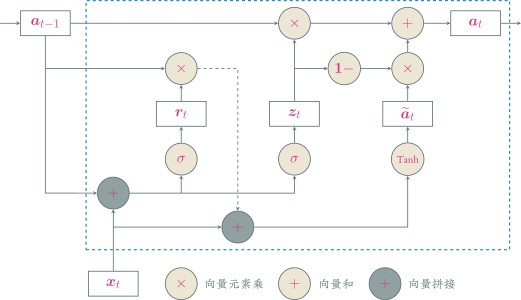

    

    

        <h6 class="bottom_left">图神经网络导论</h6>
        <h6 class="bottom_center">循环神经网络</h6>
        <h6 class="bottom_right">tengzhang@hust.edu.cn</h6>
    

<!-- slide data-notes="" -->

    
 
        

        <h5 class="title">深层循环网络</h5>
    

    

增加同一时刻网络输入到输出之间的路径$\xv_t \rightarrow \hat{y}_t$，从而增强循环神经网络的能力

 

堆叠循环神经网络：将多个循环网络堆叠起来

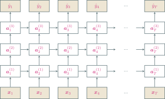

    

    

        <h6 class="bottom_left">图神经网络导论</h6>
        <h6 class="bottom_center">循环神经网络</h6>
        <h6 class="bottom_right">tengzhang@hust.edu.cn</h6>
    

<!-- slide vertical=true data-notes="" -->

    
 
        

        <h5 class="title">深层循环网络</h5>
    

    

增加同一时刻网络输入到输出之间的路径$\xv_t \rightarrow \hat{y}_t$，从而增强循环神经网络的能力

 

双向循环神经网络：由两层循环神经网络组成，信息传递方向不同

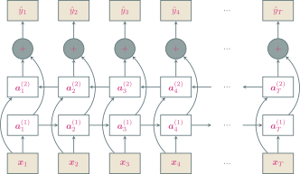

    

    

        <h6 class="bottom_left">图神经网络导论</h6>
        <h6 class="bottom_center">循环神经网络</h6>
        <h6 class="bottom_right">tengzhang@hust.edu.cn</h6>
    

<!-- slide data-notes="" -->

    
 
        

        <h5 class="title">注意力机制</h5>
    

    

编码器-解码器(Encoder-Decoder)模型

    $$
        \begin{align*}
            \av_{T+1} = f(\xv_1, \ldots, \xv_T), \quad \yv_s = g(\av_{T+1}, \yv_1, \ldots, \yv_{s-1}), ~ s \in [S]
        \end{align*}
    $$

问题：生成每个目标$\yv_s$时，使用的都是相同的语义编码$\av_{T+1}$

I love you, China! $~ \xrightarrow{翻译} ~$ 我爱你，中国！

    

    

        <h6 class="bottom_left">图神经网络导论</h6>
        <h6 class="bottom_center">循环神经网络</h6>
        <h6 class="bottom_right">tengzhang@hust.edu.cn</h6>
    

<!-- slide vertical=true data-notes="" -->

    
 
        

        <h5 class="title">注意力机制</h5>
    

    

I love you, China! $~ \xrightarrow{翻译} ~$ 我爱你，中国！

 

每次输出，从输入序列中遴选信息，使用不同的语义编码

    $$
        \begin{align*}
            \cv_1 & = f_1(\xv_1, \ldots, \xv_T), \quad \yv_1 = g(\cv_1) \\
            \cv_2 & = f_2(\xv_1, \ldots, \xv_T), \quad \yv_2 = g(\cv_2, \yv_1) \\
            \cv_3 & = f_3(\xv_1, \ldots, \xv_T), \quad \yv_3 = g(\cv_3, \yv_1, \yv_2) \\
            & \qquad \vdots
        \end{align*}
    $$

 

引入一个和当前输出相关的查询$\qv$，通过打分函数$s(\cdot, \cdot)$计算每个输入与查询之间的相关性，即应赋予的注意力，据此计算语义编码$\cv$

-   打分函数的设计？
-   如何计算$\cv = \att(\Xv, \qv)$

    

    

        <h6 class="bottom_left">图神经网络导论</h6>
        <h6 class="bottom_center">循环神经网络</h6>
        <h6 class="bottom_right">tengzhang@hust.edu.cn</h6>
    

<!-- slide vertical=true data-notes="" -->

    
 
        

        <h5 class="title">注意力机制</h5>
    

    

打分函数

-   加性模型：$s(\xv_i, \qv) = \vv^\top \tanh (\Wv \xv_i + \Uv \qv)$
-   点积模型：$s(\xv_i, \qv) = \xv_i^\top \qv$
-   缩放点积模型：$s(\xv_i, \qv) = \xv_i^\top \qv / \sqrt{d}$
-   双线性模型：$s(\xv_i, \qv) = \xv_i^\top \Wv \qv$

其中$\Wv, \Uv, \vv$为可学习的参数，$d$为输入向量的维度

 

计算$\att(\Xv, \qv)$：依据注意力值加权平均，例如

    $$
        \begin{align*}
            \att(\Xv, \qv) = \sum_{t \in [T]} \class{yellow}{\alpha_t} \xv_t, \quad \class{yellow}{\alpha_t} = \frac{\exp(s(\xv_t, \qv))}{\sum_{i \in [T]} \exp(s(\xv_i, \qv))}
        \end{align*}
    $$

    

    

        <h6 class="bottom_left">图神经网络导论</h6>
        <h6 class="bottom_center">循环神经网络</h6>
        <h6 class="bottom_right">tengzhang@hust.edu.cn</h6>
    

<!-- slide data-notes="" -->

    
 
        

        <h5 class="title">软性注意力机制</h5>
    

    

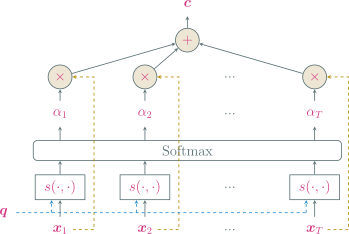

    

    

        <h6 class="bottom_left">图神经网络导论</h6>
        <h6 class="bottom_center">循环神经网络</h6>
        <h6 class="bottom_right">tengzhang@hust.edu.cn</h6>
    

<!-- slide vertical=true data-notes="" -->

    
 
        

        <h5 class="title">注意力机制变体</h5>
    

    

硬性注意力：只注意一个输入

-   选取注意力值最高的：$j = \argmax_{t \in [T]} \alpha_t$，$\att(\Xv, \qv) = \xv_j$
-   根据注意力分布随机采样

 

损失函数与注意力值的函数关系不可导，无法使用反向传播进行训练

 

键值对注意力：输入$(\Kv, \Vv) = [(\kv_1, \vv_1), \ldots, (\kv_T, \vv_T)]$

-   键用来计算注意力，值用来计算输出
-   当$\Kv = \Vv$时，键值对注意力就退化成普通的注意力

$$
    \begin{align*}
        \att((\Kv, \Vv), \qv) = \sum_{t \in [T]} \class{yellow}{\alpha_t} \vv_t, \quad \class{yellow}{\alpha_t} = \frac{\exp(s(\kv_t, \qv))}{\sum_{i \in [T]} \exp(s(\kv_i, \qv))}
    \end{align*}
$$

    

    

        <h6 class="bottom_left">图神经网络导论</h6>
        <h6 class="bottom_center">循环神经网络</h6>
        <h6 class="bottom_right">tengzhang@hust.edu.cn</h6>
    

<!-- slide vertical=true data-notes="" -->

    
 
        

        <h5 class="title">键值对注意力</h5>
    

    

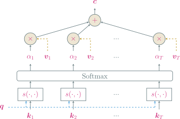

    

    

        <h6 class="bottom_left">图神经网络导论</h6>
        <h6 class="bottom_center">循环神经网络</h6>
        <h6 class="bottom_right">tengzhang@hust.edu.cn</h6>
    

<!-- slide vertical=true data-notes="" -->

    
 
        

        <h5 class="title">注意力机制变体</h5>
    

    

多头注意力：多个查询并行$\Qv = [\qv_1, \ldots, \qv_M]$，选取多组信息

    $$
        \begin{align*}
            \att((\Kv, \Vv), \Qv) = \att((\Kv, \Vv), \qv_1) \oplus \cdots \oplus \att((\Kv, \Vv), \qv_M)
        \end{align*}
    $$

其中$\oplus$表示向量拼接

 

结构化注意力：

-   之前介绍的注意力机制都假设所有的输入信息是同等重要的，是一种扁平结构
-   如果输入信息本身具有层次结构，比如文本可以分为词、句子、段落、篇章等不同粒度的层次，可以使用层次化注意力进行更好的信息选择

    

    

        <h6 class="bottom_left">图神经网络导论</h6>
        <h6 class="bottom_center">循环神经网络</h6>
        <h6 class="bottom_right">tengzhang@hust.edu.cn</h6>
    

<!-- slide data-notes="" -->

    
 
        

        <h5 class="title">注意力机制应用</h5>
    

    

注意力机制一般作为神经网络的一个组件，用来做信息遴选

-   查询通常采用解码器的隐藏状态
-   键、值通常采用编码器的隐藏状态

 

指针网络：将注意力分布作为一个软性的指针，指出相关信息的位置

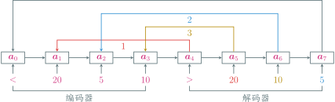

    

    

        <h6 class="bottom_left">图神经网络导论</h6>
        <h6 class="bottom_center">循环神经网络</h6>
        <h6 class="bottom_right">tengzhang@hust.edu.cn</h6>
    

<!-- slide vertical=true data-notes="" -->

    
 
        

        <h5 class="title">注意力机制应用</h5>
    

    

建立输入序列间的长距离依赖关系

-   卷积或循环神经网络都是局部编码，只有增加层数才能获取远距离的信息交互
-   全连接神经网络可直接获取远距离的信息交互，但无法处理变长的序列

 

自注意力模型

-   每个输入同时充当查询、键、值三个角色
-   输入之间相互计算注意力
-   忽略了输入信息的位置信息，单独使用时需加入位置编码信息来进行修正

$$
    \begin{align*}
        \Xv & = [\xv_1, \ldots, \xv_T] \in \Rbb^{d \times T} \\
        \Qv & = \Wv_Q \Xv, \quad \Kv = \Wv_K \Xv, \quad \Vv = \Wv_V \Xv \\
        \cv_i & = \att((\Kv, \Vv), \qv_i) = \sum_{t \in [T]} \alpha_{it} \vv_t = \sum_{t \in [T]} \softmax(s(\qv_i, \kv_t)) \vv_t
    \end{align*}
$$

    

    

        <h6 class="bottom_left">图神经网络导论</h6>
        <h6 class="bottom_center">循环神经网络</h6>
        <h6 class="bottom_right">tengzhang@hust.edu.cn</h6>
    

