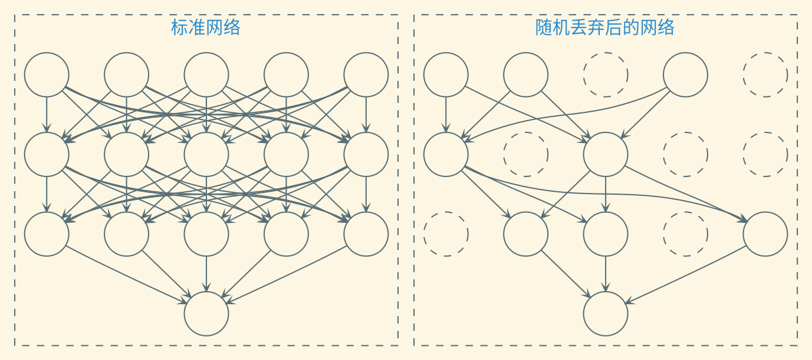

---
presentation:
    transition: "none"
    enableSpeakerNotes: true
    margin: 0
---

@import "../common/css/zhangt-style.css"
@import "../common/css/font-awesome-4.7.0/css/font-awesome.css"

<!-- slide data-notes="" -->

    

        

        <h5 class="title">贝叶斯优化</h5>
    

    

根据已经测试的超参数组合，挑选下一个可能带来最大收益的组合

超参数组合构成的空间为$\Xcal$，已知$\{ (\xv_1, y_1), \ldots, (\xv_m, y_m) \} \in (\Xcal \times \Rbb)^m$，对任一超参数组合$\xv$，求其对应的网络的性能$y$

- 这是一个回归问题，若采用参数回归，会引入更多的超超参数
- 采用无参的Gauss过程回归更为合适，此时$P(y|x)$为一个正态分布

$$
    \begin{align*}
        \Hcal = \{ \xv_i, y_i \}_{i \in [m]} \Longrightarrow P(y | \xv, \Hcal)
    \end{align*}
$$

第二个问题需引入一个收益函数，常见的是期望改善

$$
    \begin{align*}
        \int \max \{ y^\star - y, 0 \} P(y | \xv, \Hcal) \diff y
    \end{align*}
$$

其中$y^\star = \min \{ y_i, i \in [m] \}$是当前已有超参数组合中的最优值

    

    

        <h6 class="bottom_left">图神经网络导论</h6>
        <h6 class="bottom_center">神经网络简介</h6>
        <h6 class="bottom_right">tengzhang@hust.edu.cn</h6>
    

<!-- slide vertical=true data-notes="" -->

    

        

        <h5 class="title">贝叶斯公式</h5>
    

    

$$
    \begin{align*}
        P(x|y) = \frac{P(y|x) P(x)}{P(y)}
    \end{align*}
$$

两边同时对$x$积分可得全概率公式
$$
    \begin{align*}
        1 = \int \frac{P(y|x) P(x)}{P(y)} \diff x \Longrightarrow P(y) = \int P(y|x) P(x) \diff x
    \end{align*}
$$

 

从统计和机器学习的角度看
$$
    \begin{align*}
        \underbrace{P(\wv|\Dcal)}_{后验} = \frac{\overbrace{P(\Dcal|\wv)}^{似然} ~ \overbrace{P(\wv)}^{先验}}{\underbrace{P(\Dcal)}_{证据}}
    \end{align*}
$$

    

    

        <h6 class="bottom_left">图神经网络导论</h6>
        <h6 class="bottom_center">神经网络简介</h6>
        <h6 class="bottom_right">tengzhang@hust.edu.cn</h6>
    

<!-- slide vertical=true data-notes="" -->

    

        

        <h5 class="title">概率</h5>
    

    

$$
    \begin{align*}
        \underbrace{P(\wv|\Dcal)}_{后验} = \frac{\overbrace{P(\Dcal|\wv)}^{似然} ~ \overbrace{P(\wv)}^{先验}}{\underbrace{P(\Dcal)}_{证据}}
    \end{align*}
$$

频率学派
- 独立重复试验中发生的频率的极限
- 极大似然估计

贝叶斯学派
- 可信度
- 极大后验估计

    

    

        <h6 class="bottom_left">图神经网络导论</h6>
        <h6 class="bottom_center">神经网络简介</h6>
        <h6 class="bottom_right">tengzhang@hust.edu.cn</h6>
    

<!-- slide vertical=true data-notes="" -->

    

        

        <h5 class="title">贝叶斯线性回归</h5>
    

    

$$
    \begin{align*}
        线性回归 \quad \argmin_{\wv} & ~ \frac{1}{2} \| \Xv^\top \wv - \yv \|_2^2 = (\Xv \Xv^\top)^{-1} \Xv \yv \\
        岭回归 \quad \argmin_{\wv} & ~ \frac{1}{2} \| \Xv^\top \wv - \yv \|_2^2 + \frac{\lambda}{2} \|\wv\|_2^2 = (\Xv \Xv^\top + \lambda \Iv)^{-1} \Xv \yv
    \end{align*}
$$

贝叶斯线性回归：$f(\xv) = \wv^\top \xv$，$y = f(\xv) + \epsilon$，$\epsilon \sim \Ncal(0, \sigma^2)$

似然：
$$
    \begin{align*}
        P(\yv | \Xv, \wv) & = \Pi_{i \in [m]} P(y_i | \xv_i, \wv) = \Pi_{i \in [m]} \frac{1}{\sqrt{2\pi}\sigma} \exp \left( - \frac{(y_i - \wv^\top \xv_i)^2}{2 \sigma^2} \right) \\
        & = \frac{1}{(2\pi\sigma^2)^{D/2}} \exp \left( - \frac{\|\yv - \Xv^\top \wv\|^2}{2 \sigma^2} \right) = \Ncal(\Xv^\top \wv, \sigma^2 \Iv)
    \end{align*}
$$

极大似然$\Longleftrightarrow \min_{\wv} \|\yv - \Xv^\top \wv\|^2 \Longleftrightarrow$线性回归

    

    

        <h6 class="bottom_left">图神经网络导论</h6>
        <h6 class="bottom_center">神经网络简介</h6>
        <h6 class="bottom_right">tengzhang@hust.edu.cn</h6>
    

<!-- slide vertical=true data-notes="" -->

    

        

        <h5 class="title">贝叶斯线性回归</h5>
    

    

$$
    \begin{align*}
        (\Xv \Xv^\top)^{-1} \Xv \yv, \quad (\Xv \Xv^\top + \lambda \Iv)^{-1} \Xv \yv
    \end{align*}
$$

贝叶斯线性回归：$f(\xv) = \wv^\top \xv$，$y = f(\xv) + \epsilon$，$\epsilon \sim \Ncal(0, \sigma^2)$

似然：$P(\yv | \Xv, \wv) = \Ncal(\Xv^\top \wv, \sigma^2 \Iv)$，先验：$\wv \sim \Ncal(\zerov, \Sigmav)$

后验 $=$ 似然 $\times$ 先验 $/$ 证据：
$$
    \begin{align*}
        P(\wv | \Xv, \yv) & \propto \exp \left( - \frac{\|\yv - \Xv^\top \wv\|^2}{2 \sigma^2} \right) \exp \left( - \frac{1}{2} \wv^\top \Sigma^{-1} \wv \right) \\
        & \propto \exp \left( - \frac{1}{2} (\wv - \bar{\wv})^\top \left( \frac{1}{\sigma^2}\Xv \Xv^\top + \Sigma^{-1} \right) (\wv - \bar{\wv}) \right)
    \end{align*}
$$

其中$\bar{\wv} = (\Xv \Xv^\top + \sigma^2 \Sigma^{-1})^{-1} \Xv \yv$，取先验$\Sigmav = \lambda \Iv / \sigma^2$，极大后验$\Longleftrightarrow$岭回归

    

    

        <h6 class="bottom_left">图神经网络导论</h6>
        <h6 class="bottom_center">神经网络简介</h6>
        <h6 class="bottom_right">tengzhang@hust.edu.cn</h6>
    

<!-- slide vertical=true data-notes="" -->

    

        

        <h5 class="title">预测</h5>
    

    

后验
$$
    \begin{align*}
        P(\wv | \Xv, \yv) & \propto \exp \left( - \frac{\|\yv - \Xv^\top \wv\|^2}{2 \sigma^2} \right) \exp \left( - \frac{1}{2} \wv^\top \Sigma^{-1} \wv \right) \\
        & \propto \exp \left( - \frac{1}{2} (\wv - \bar{\wv})^\top \left( \frac{1}{\sigma^2}\Xv \Xv^\top + \Sigma^{-1} \right) (\wv - \bar{\wv}) \right) \\
        & \sim \Ncal (\bar{\wv}, \Av^{-1})
    \end{align*}
$$

其中$\bar{\wv} = \Av^{-1} \Xv \yv / \sigma^2$，$\Av = \Xv \Xv^\top / \sigma^2 + \Sigma^{-1}$

预测
$$
    \begin{align*}
        P(f_* | \xv_*, \Xv, \yv) & = \int P(f_*|\xv_*, \wv) P(\wv | \Xv, \yv) \diff \wv \\
        & = \Ncal(\xv_*^\top \Av^{-1} \Xv \yv, \xv_*^\top \Av^{-1} \xv_* + \sigma^2)
    \end{align*}
$$

    

    

        <h6 class="bottom_left">图神经网络导论</h6>
        <h6 class="bottom_center">神经网络简介</h6>
        <h6 class="bottom_right">tengzhang@hust.edu.cn</h6>
    

<!-- slide vertical=true data-notes="" -->

    

        

        <h5 class="title">核岭回归</h5>
    

    

引入非线性变换$\phi: \Xv = [\xv_1, \ldots, \xv_m] \mapsto \Phiv = [\phi(\xv_1), \ldots, \phi(\xv_m)]$
$$
    \begin{align*}
        \argmin_{\wv} & ~ \frac{1}{2} \| \Phiv^\top \wv - \yv \|_2^2 + \frac{\lambda}{2} \|\wv\|_2^2 = (\Phiv \Phiv^\top + \lambda \Iv)^{-1} \Phiv \yv
    \end{align*}
$$

利用Sherman-Morrison-Woodbury公式
$$
    \begin{align*}
        (\Av + \Uv \Vv^\top)^{-1} = \Av^{-1} - \Av^{-1} \Uv (\Iv + \Vv^\top \Av^{-1} \Uv)^{-1} \Vv^\top \Av^{-1}
    \end{align*}
$$

可得
$$
    \begin{align*}
        (\Phiv \Phiv^\top + \lambda \Iv)^{-1} \Phiv \yv & = \Phiv (\Phiv^\top \Phiv + \lambda \Iv)^{-1} \yv = \Phiv (\Kv + \lambda \Iv)^{-1} \yv \\
        & = \Phiv \alphav = \sum_{i \in [m]} \alpha_i \phi(\xv_i)
    \end{align*}
$$

    

    

        <h6 class="bottom_left">图神经网络导论</h6>
        <h6 class="bottom_center">神经网络简介</h6>
        <h6 class="bottom_right">tengzhang@hust.edu.cn</h6>
    

<!-- slide vertical=true data-notes="" -->

    

        

        <h5 class="title">贝叶斯线性回归</h5>
    

    

贝叶斯线性回归：$f(\xv) = \wv^\top \phi(\xv)$，$y = f(\xv) + \epsilon$，$\epsilon \sim \Ncal(0, \sigma^2)$

似然：$P(\yv | \Phiv, \wv) = \Ncal(\Phiv^\top \wv, \sigma^2 \Iv)$，先验：$\wv \sim \Ncal(\zerov, \Sigmav)$

后验：
$$
    \begin{align*}
        P(\wv | \Phiv, \yv) \propto \exp \left( - \frac{1}{2} (\wv - \bar{\wv})^\top \left( \frac{1}{\sigma^2} \Phiv \Phiv^\top + \Sigma^{-1} \right) (\wv - \bar{\wv}) \right)
    \end{align*}
$$

预测
$$
    \begin{align*}
        P(f_* | \xv_*, \Xv, \yv) & = \Ncal(\phiv_*^\top \Sigmav \Phiv (\Kv + \sigma^2 \Iv)^{-1} \yv, \\
        & \qquad \phiv_*^\top \Sigmav \phiv_* - \phiv_*^\top \Sigmav \Phiv (\Kv + \sigma^2 \Iv)^{-1} \Phiv (\Kv + \sigma^2)^{-1} \Phiv^\top \Sigmav \phiv_*)
    \end{align*}
$$

若$\phi$映射到无穷维？

    

    

        <h6 class="bottom_left">图神经网络导论</h6>
        <h6 class="bottom_center">神经网络简介</h6>
        <h6 class="bottom_right">tengzhang@hust.edu.cn</h6>
    

<!-- slide vertical=true data-notes="" -->

    

        

        <h5 class="title">动态资源分配</h5>
    

    

在超参数优化中，如果可以在较早的阶段就估计出一个组合的效果会比较差，那么可以提早停止对其的评估，将更多的计算资源留给其它组合

逐次减半法：

1. 将所有计算资源平均分给所有的超参数组合
2. 获取每个超参数组合的评估结果
3. 保留前一半好的组合，转第1步

利用-探索

- 如果超参数组合数越多，得到最佳组合的可能性也越大，但每个组合分到的计算资源就越少，早期的评估结果可能不准
- 如果超参数组合数越少，每个超参数组合的评估会越准确，但有可能无法得到最优组合

    

    

        <h6 class="bottom_left">图神经网络导论</h6>
        <h6 class="bottom_center">神经网络简介</h6>
        <h6 class="bottom_right">tengzhang@hust.edu.cn</h6>
    

<!-- slide vertical=true data-notes="" -->

    

        

        <h5 class="title">神经架构搜索</h5>
    

    

深度学习使得机器学习中的“特征工程”问题转变为“网络架构工程”问题

神经架构搜索(Neural Architecture Search, NAS)：用神经网络来自动实现网络架构的设计，目前最火热(内卷)的研究方向

- 神经网络的架构可以用一个变长的字符串来描述
- 用另一个循环神经网络来不断生成新的架构描述
- 循环神经网络的训练采用强化学习来完成，奖励信号可以为生成的网络在验证集上的性能

    

    

        <h6 class="bottom_left">图神经网络导论</h6>
        <h6 class="bottom_center">神经网络简介</h6>
        <h6 class="bottom_right">tengzhang@hust.edu.cn</h6>
    

<!-- slide data-notes="" -->

    

        

        <h5 class="title">网络正则化</h5>
    

    

权重衰减：每次更新时引入一个衰减系数

$$
    \begin{align*}
        \Wv_{t+1} & \leftarrow (1 - \beta) \Wv_t - \eta \gv_t = \Wv_t - \eta \left( \gv_t + \frac{\beta}{\eta} \Wv_t \right)
    \end{align*}
$$

- 在标准的随机梯度下降中，权重衰减等价于$\ell_2$正则
- 在较为复杂的优化方法，例如Adam中，两者并不等价

 

提前停止：

- 引入一个和训练集独立的样本集合，称为验证集(Validation Set)，验证集上的错误可视为期望错误
- 当验证集上的错误率不再下降，就停止训练

    

    

        <h6 class="bottom_left">图神经网络导论</h6>
        <h6 class="bottom_center">神经网络简介</h6>
        <h6 class="bottom_right">tengzhang@hust.edu.cn</h6>
    

<!-- slide vertical=true data-notes="" -->

    

        

        <h5 class="title">随机丢弃</h5>
    

    

对每一个神经元都以固定的概率$p$来判定要不要保留

    

    

        <h6 class="bottom_left">图神经网络导论</h6>
        <h6 class="bottom_center">神经网络简介</h6>
        <h6 class="bottom_right">tengzhang@hust.edu.cn</h6>
    

<!-- slide vertical=true data-notes="" -->

    

        

        <h5 class="title">数据增强</h5>
    

    

深层神经网络一般都需要大量的训练数据才能获得比较理想的效果

数据量有限的情况下，可以通过数据增强来增加数据量，避免过拟合

目前数据增强主要用于图像数据，文本等其它类型的数据还没有太好的方法

常见的增强方法：

- 旋转：将图像按顺时针或逆时针方向随机旋转一定角度
- 翻转：将图像沿水平或垂直方法随机翻转一定角度
- 缩放：将图像放大或缩小一定比例
- 平移：将图像沿水平或垂直方法平移一定步长
- 加噪声：加入随机噪声

    

    

        <h6 class="bottom_left">图神经网络导论</h6>
        <h6 class="bottom_center">神经网络简介</h6>
        <h6 class="bottom_right">tengzhang@hust.edu.cn</h6>
    

<!-- slide vertical=true data-notes="" -->

    

        

        <h5 class="title">Mixup</h5>
    

    

对训练集中的任意两个样本$(\xv_a, y_a)$、$(\xv_b, y_b)$，向训练集中加入新的样本

$$
    \begin{align*}
        (\beta \xv_a + (1 - \beta) \xv_b, \beta y_a + (1 - \beta) y_b)
    \end{align*}
$$

 

假设模型已经有能力预测$y_a = f(\xv_a)$、$y_b = f(\xv_b)$，那么此时还需满足

$$
    \begin{align*}
        f(\beta \xv_a + (1 - \beta) \xv_b) & = \beta y_a + (1 - \beta) y_b \\
        & = \beta f(\xv_a) + (1 - \beta) f(\xv_b)
    \end{align*}
$$

这个函数方程的解是“线性函数”，即mixup希望学到的$f$是一个线性函数

披着数据增强外衣的正则化方法

    

    

        <h6 class="bottom_left">图神经网络导论</h6>
        <h6 class="bottom_center">神经网络简介</h6>
        <h6 class="bottom_right">tengzhang@hust.edu.cn</h6>
    

